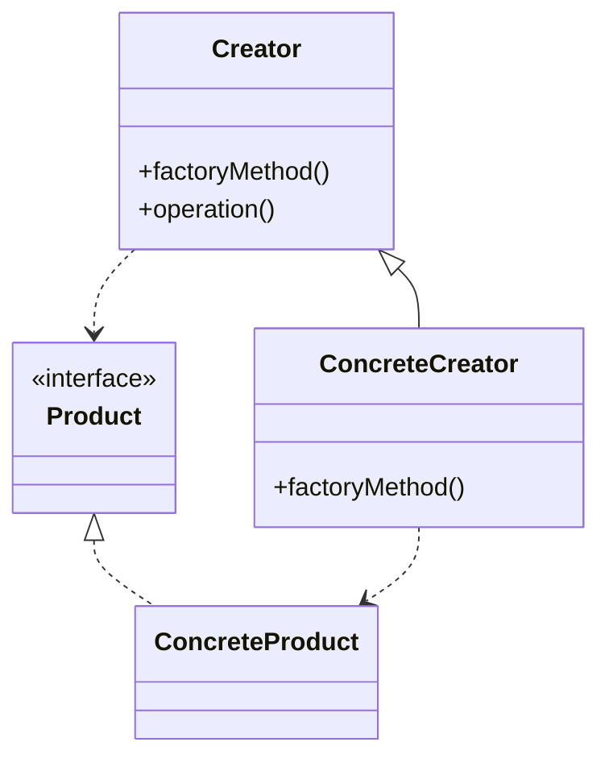
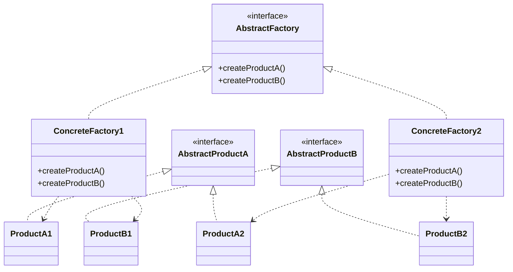
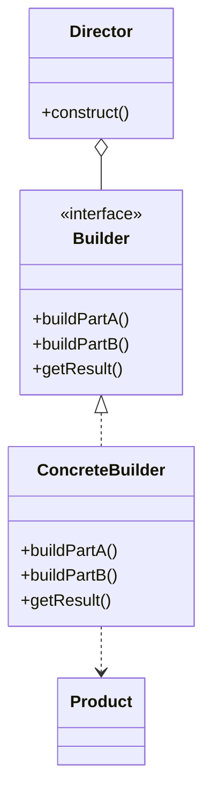
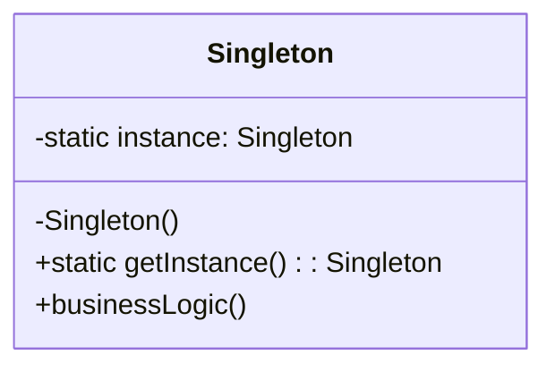
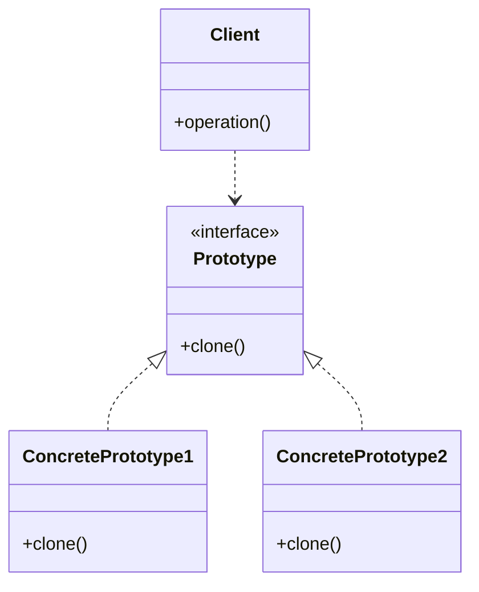

# Creational Patterns

## Introduction

Creational design patterns are a category of design patterns that focus on object creation mechanisms. They help make a system independent of how its objects are created, composed, and represented. These patterns become essential when systems evolve to depend more on object composition than class inheritance.

In this tutorial, we'll explore five fundamental creational patterns:

- Factory Method
- Abstract Factory
- Builder
- Singleton
- Prototype

Each pattern addresses specific problems related to object creation and provides flexible solutions that promote code reuse and maintainability.

## Why Learn Creational Patterns?

Before diving into specific patterns, let's understand why creational patterns are important:

- They encapsulate knowledge about which concrete classes the system uses
- They hide how instances of these classes are created and combined
- They provide flexibility in what gets created, who creates it, how it's created, and when
- They promote loose coupling between client code and the objects being created

## Factory Method Pattern

### What is the Factory Method Pattern?

The Factory Method pattern defines an interface for creating an object but lets subclasses decide which class to instantiate. It allows a class to defer instantiation to subclasses.

### Structure



### Example: Message Notification System

Let's create a notification system with different types of notifications:

```java
// Product interface
interface Notification {
    void notifyUser();
}

// Concrete Products
class EmailNotification implements Notification {
    @Override
    public void notifyUser() {
        System.out.println("Sending an email notification");
    }
}

class SMSNotification implements Notification {
    @Override
    public void notifyUser() {
        System.out.println("Sending an SMS notification");
    }
}

class PushNotification implements Notification {
    @Override
    public void notifyUser() {
        System.out.println("Sending a push notification");
    }
}

// Creator
class NotificationFactory {
    public Notification createNotification(String channel) {
        if (channel == null || channel.isEmpty()) {
            return null;
        }
        
        switch (channel.toLowerCase()) {
            case "sms":
                return new SMSNotification();
            case "email":
                return new EmailNotification();
            case "push":
                return new PushNotification();
            default:
                throw new IllegalArgumentException("Unknown channel " + channel);
        }
    }
}

// Client code
public class Main {
    public static void main(String[] args) {
        NotificationFactory notificationFactory = new NotificationFactory();
        
        Notification notification = notificationFactory.createNotification("email");
        notification.notifyUser();  // Output: Sending an email notification
        
        notification = notificationFactory.createNotification("sms");
        notification.notifyUser();  // Output: Sending an SMS notification
    }
}
```

### When to Use Factory Method Pattern

- When a class can't anticipate the type of objects it needs to create
- When a class wants its subclasses to specify the objects it creates
- When you want to localize the knowledge of which class gets created

## Abstract Factory Pattern

### What is the Abstract Factory Pattern?

The Abstract Factory pattern provides an interface for creating families of related or dependent objects without specifying their concrete classes. It's a higher-level version of the Factory Method pattern.

### Structure



### Example: Cross-Platform UI Components

Let's implement an Abstract Factory pattern for creating UI components for different operating systems:

```java
// Abstract Products
interface Button {
    void render();
    void onClick();
}

interface Checkbox {
    void render();
    void toggle();
}

// Concrete Products for Windows
class WindowsButton implements Button {
    @Override
    public void render() {
        System.out.println("Rendering a Windows-style button");
    }
    
    @Override
    public void onClick() {
        System.out.println("Windows button clicked");
    }
}

class WindowsCheckbox implements Checkbox {
    @Override
    public void render() {
        System.out.println("Rendering a Windows-style checkbox");
    }
    
    @Override
    public void toggle() {
        System.out.println("Windows checkbox toggled");
    }
}

// Concrete Products for MacOS
class MacOSButton implements Button {
    @Override
    public void render() {
        System.out.println("Rendering a MacOS-style button");
    }
    
    @Override
    public void onClick() {
        System.out.println("MacOS button clicked");
    }
}

class MacOSCheckbox implements Checkbox {
    @Override
    public void render() {
        System.out.println("Rendering a MacOS-style checkbox");
    }
    
    @Override
    public void toggle() {
        System.out.println("MacOS checkbox toggled");
    }
}

// Abstract Factory
interface GUIFactory {
    Button createButton();
    Checkbox createCheckbox();
}

// Concrete Factories
class WindowsFactory implements GUIFactory {
    @Override
    public Button createButton() {
        return new WindowsButton();
    }
    
    @Override
    public Checkbox createCheckbox() {
        return new WindowsCheckbox();
    }
}

class MacOSFactory implements GUIFactory {
    @Override
    public Button createButton() {
        return new MacOSButton();
    }
    
    @Override
    public Checkbox createCheckbox() {
        return new MacOSCheckbox();
    }
}

// Client Code
class Application {
    private Button button;
    private Checkbox checkbox;
    
    public Application(GUIFactory factory) {
        button = factory.createButton();
        checkbox = factory.createCheckbox();
    }
    
    public void render() {
        button.render();
        checkbox.render();
    }
    
    public void click() {
        button.onClick();
    }
    
    public void toggle() {
        checkbox.toggle();
    }
}

public class Main {
    public static void main(String[] args) {
        // Determine the current OS
        String osName = System.getProperty("os.name").toLowerCase();
        GUIFactory factory;
        
        if (osName.contains("windows")) {
            factory = new WindowsFactory();
        } else {
            factory = new MacOSFactory();
        }
        
        Application app = new Application(factory);
        app.render();  // Renders OS-specific UI components
        app.click();   // Handles clicks in OS-specific way
    }
}
```

### When to Use Abstract Factory Pattern

- When a system should be independent of how its products are created
- When a system needs to work with multiple families of products
- When you want to provide a library of products without exposing implementation details

## Builder Pattern

### What is the Builder Pattern?

The Builder pattern separates the construction of a complex object from its representation. It allows the same construction process to create different representations.

### Structure



### Example: Meal Builder

Let's implement a meal builder for a fast food restaurant:

```java
// Product
class Meal {
    private String mainCourse;
    private String side;
    private String drink;
    private String dessert;
    
    public void setMainCourse(String mainCourse) {
        this.mainCourse = mainCourse;
    }
    
    public void setSide(String side) {
        this.side = side;
    }
    
    public void setDrink(String drink) {
        this.drink = drink;
    }
    
    public void setDessert(String dessert) {
        this.dessert = dessert;
    }
    
    public void showItems() {
        System.out.println("Meal contains:");
        if (mainCourse != null) System.out.println("Main course: " + mainCourse);
        if (side != null) System.out.println("Side: " + side);
        if (drink != null) System.out.println("Drink: " + drink);
        if (dessert != null) System.out.println("Dessert: " + dessert);
    }
}

// Builder interface
interface MealBuilder {
    MealBuilder buildMainCourse();
    MealBuilder buildSide();
    MealBuilder buildDrink();
    MealBuilder buildDessert();
    Meal getMeal();
}

// Concrete Builder
class VegMealBuilder implements MealBuilder {
    private Meal meal = new Meal();
    
    @Override
    public MealBuilder buildMainCourse() {
        meal.setMainCourse("Veggie Burger");
        return this;
    }
    
    @Override
    public MealBuilder buildSide() {
        meal.setSide("Salad");
        return this;
    }
    
    @Override
    public MealBuilder buildDrink() {
        meal.setDrink("Water");
        return this;
    }
    
    @Override
    public MealBuilder buildDessert() {
        meal.setDessert("Fruit Salad");
        return this;
    }
    
    @Override
    public Meal getMeal() {
        return meal;
    }
}

class NonVegMealBuilder implements MealBuilder {
    private Meal meal = new Meal();
    
    @Override
    public MealBuilder buildMainCourse() {
        meal.setMainCourse("Chicken Burger");
        return this;
    }
    
    @Override
    public MealBuilder buildSide() {
        meal.setSide("French Fries");
        return this;
    }
    
    @Override
    public MealBuilder buildDrink() {
        meal.setDrink("Coke");
        return this;
    }
    
    @Override
    public MealBuilder buildDessert() {
        meal.setDessert("Ice Cream");
        return this;
    }
    
    @Override
    public Meal getMeal() {
        return meal;
    }
}

// Director
class MealDirector {
    public Meal prepareMeal(MealBuilder builder) {
        return builder
            .buildMainCourse()
            .buildSide()
            .buildDrink()
            .buildDessert()
            .getMeal();
    }
    
    public Meal prepareJustMainCourseAndDrink(MealBuilder builder) {
        return builder
            .buildMainCourse()
            .buildDrink()
            .getMeal();
    }
}

// Client code
public class Main {
    public static void main(String[] args) {
        MealDirector director = new MealDirector();
        
        // Prepare a complete vegetarian meal
        MealBuilder vegMealBuilder = new VegMealBuilder();
        Meal vegMeal = director.prepareMeal(vegMealBuilder);
        System.out.println("Vegetarian Meal:");
        vegMeal.showItems();
        
        System.out.println("
");
        
        // Prepare just main course and drink for non-vegetarian
        MealBuilder nonVegMealBuilder = new NonVegMealBuilder();
        Meal partialNonVegMeal = director.prepareJustMainCourseAndDrink(nonVegMealBuilder);
        System.out.println("Partial Non-Vegetarian Meal:");
        partialNonVegMeal.showItems();
        
        // Using the builder pattern with method chaining (without Director)
        System.out.println("
");
        Meal customMeal = new NonVegMealBuilder()
            .buildMainCourse()
            .buildDrink()
            .buildDessert()
            .getMeal();
        System.out.println("Custom Meal:");
        customMeal.showItems();
    }
}
```

### When to Use Builder Pattern

- When the algorithm for creating a complex object should be independent of the parts that make up the object
- When the construction process must allow different representations for the object that's constructed
- When you need to build complex objects step by step

## Singleton Pattern

### What is the Singleton Pattern?

The Singleton pattern ensures a class has only one instance and provides a global point of access to it.

### Structure



### Example: Database Connection Manager

```java
public class DatabaseConnection {
    // Private static variable to hold the single instance
    private static DatabaseConnection instance;
    
    // Connection properties
    private String url;
    private String username;
    private String password;
    private boolean isConnected;
    
    // Private constructor to prevent instantiation from outside
    private DatabaseConnection() {
        // Default connection values
        this.url = "jdbc:mysql://localhost:3306/mydb";
        this.username = "admin";
        this.password = "password";
        this.isConnected = false;
    }
    
    // Public static method to get the singleton instance
    public static synchronized DatabaseConnection getInstance() {
        if (instance == null) {
            instance = new DatabaseConnection();
        }
        return instance;
    }
    
    // Business logic methods
    public void connect() {
        if (!isConnected) {
            System.out.println("Connecting to database at " + url);
            // Here would be actual connection code
            isConnected = true;
            System.out.println("Connected successfully!");
        } else {
            System.out.println("Already connected to database!");
        }
    }
    
    public void disconnect() {
        if (isConnected) {
            System.out.println("Disconnecting from database...");
            // Here would be actual disconnection code
            isConnected = false;
            System.out.println("Disconnected successfully!");
        } else {
            System.out.println("Not connected to any database!");
        }
    }
    
    public void executeQuery(String query) {
        if (isConnected) {
            System.out.println("Executing query: " + query);
            // Here would be actual query execution code
        } else {
            System.out.println("Cannot execute query. Not connected to database!");
        }
    }
    
    // Getters and setters for connection properties
    public String getUrl() { return url; }
    public void setUrl(String url) { this.url = url; }
    
    public String getUsername() { return username; }
    public void setUsername(String username) { this.username = username; }
    
    public void setPassword(String password) { this.password = password; }
}

// Client code
public class Main {
    public static void main(String[] args) {
        // Get the singleton instance
        DatabaseConnection dbConnection1 = DatabaseConnection.getInstance();
        dbConnection1.connect();
        
        // Try to get another instance - will return the same instance
        DatabaseConnection dbConnection2 = DatabaseConnection.getInstance();
        
        // Both variables point to the same instance
        System.out.println("Are both instances the same? " + (dbConnection1 == dbConnection2));
        
        // Using the connection
        dbConnection1.executeQuery("SELECT * FROM users");
        
        // Changes made through one reference affect the other
        dbConnection2.disconnect();
        
        // This will print "Not connected" because dbConnection2 disconnected the shared instance
        dbConnection1.executeQuery("SELECT * FROM products");
    }
}
```

### Thread-Safe Singleton Using Double-Checked Locking

For better performance in multi-threaded environments:

```java
public class ThreadSafeSingleton {
    private static volatile ThreadSafeSingleton instance;
    
    private ThreadSafeSingleton() {}
    
    public static ThreadSafeSingleton getInstance() {
        if (instance == null) {
            synchronized (ThreadSafeSingleton.class) {
                if (instance == null) {
                    instance = new ThreadSafeSingleton();
                }
            }
        }
        return instance;
    }
}
```

### When to Use Singleton Pattern

- When exactly one instance of a class is needed
- When the sole instance should be extensible by subclassing
- When you want to control when and how clients access the instance

## Prototype Pattern

### What is the Prototype Pattern?

The Prototype pattern creates new objects by copying an existing object, known as the prototype. This is useful when the cost of creating a new object is more expensive than copying an existing one.

### Structure



### Example: Document Prototype

```java
// Prototype interface
interface Cloneable {
    Object clone();
}

// Concrete prototype
class Document implements Cloneable {
    private String content;
    private String formatting;
    private String metadata;
    
    public Document(String content, String formatting, String metadata) {
        this.content = content;
        this.formatting = formatting;
        this.metadata = metadata;
    }
    
    // Copy constructor
    public Document(Document source) {
        this.content = source.content;
        this.formatting = source.formatting;
        this.metadata = source.metadata;
    }
    
    @Override
    public Document clone() {
        return new Document(this);
    }
    
    // Getters and setters
    public String getContent() { return content; }
    public void setContent(String content) { this.content = content; }
    
    public String getFormatting() { return formatting; }
    public void setFormatting(String formatting) { this.formatting = formatting; }
    
    public String getMetadata() { return metadata; }
    public void setMetadata(String metadata) { this.metadata = metadata; }
    
    @Override
    public String toString() {
        return "Document[content=" + content + ", formatting=" + formatting + ", metadata=" + metadata + "]";
    }
}

// Specialized document types
class TextDocument extends Document {
    private boolean isReadOnly;
    
    public TextDocument(String content, String formatting, String metadata, boolean isReadOnly) {
        super(content, formatting, metadata);
        this.isReadOnly = isReadOnly;
    }
    
    // Copy constructor
    public TextDocument(TextDocument source) {
        super(source);
        this.isReadOnly = source.isReadOnly;
    }
    
    @Override
    public TextDocument clone() {
        return new TextDocument(this);
    }
    
    public boolean isReadOnly() { return isReadOnly; }
    public void setReadOnly(boolean readOnly) { isReadOnly = readOnly; }
    
    @Override
    public String toString() {
        return "TextDocument[" + super.toString() + ", readOnly=" + isReadOnly + "]";
    }
}

// Document registry/cache
class DocumentManager {
    private static final Map<String, Document> documentRegistry = new HashMap<>();
    
    // Initialize with some standard templates
    static {
        documentRegistry.put("blank", new Document("", "default", "created: " + new Date()));
        documentRegistry.put("report", new Document("Report Content", "business", "created: " + new Date() + ", type: report"));
        documentRegistry.put("letter", new TextDocument("Dear Sir/Madam,

Sincerely,", "formal", "created: " + new Date(), false));
    }
    
    // Get a document by template name
    public static Document getDocument(String key) {
        return documentRegistry.get(key).clone();
    }
    
    // Add a new template
    public static void addTemplate(String key, Document doc) {
        documentRegistry.put(key, doc);
    }
}

// Client code
public class Main {
    public static void main(String[] args) {
        // Get a document from the registry and customize it
        Document report = DocumentManager.getDocument("report");
        report.setContent("Sales have increased by 15% this quarter...");
        System.out.println(report);
        
        // Get another document of the same type
        Document anotherReport = DocumentManager.getDocument("report");
        System.out.println("Are the documents the same instance? " + (report == anotherReport));
        System.out.println("Original template unchanged: " + anotherReport);
        
        // Use a text document template
        TextDocument letter = (TextDocument) DocumentManager.getDocument("letter");
        letter.setContent("Dear Mr. Smith,

I am writing regarding...

Sincerely,
John Doe");
        letter.setReadOnly(true);
        System.out.println(letter);
        
        // Add a new template
        DocumentManager.addTemplate("memo", 
            new TextDocument("MEMO", "internal", "urgent: true", false));
    }
}
```

### When to Use Prototype Pattern

- When a system should be independent of how its products are created and represented
- When classes to instantiate are specified at runtime
- When you want to avoid building a hierarchy of factories that parallels the hierarchy of products
- When instances of a class can have only a few different combinations of state

## Common Use Cases for Creational Patterns

| Pattern | Use Cases |
|---------|-----------|
| Factory Method | When you need to create objects without knowing exact class in advance |
| Abstract Factory | When your system needs to work with multiple families of related products |
| Builder | When you need to create complex objects with many optional parts/configurations |
| Singleton | When you need exactly one instance of a class available globally |
| Prototype | When creating new objects by copying existing ones is more efficient |

## Summary

Creational patterns help us deal with object creation in a way that increases flexibility and reuse of existing code. They encourage loose coupling by removing the need for application code to bind to specific classes.

Here's what we've learned:

- **Factory Method** lets a class defer instantiation to subclasses
- **Abstract Factory** provides an interface for creating families of related objects
- **Builder** separates the construction of complex objects from their representation
- **Singleton** ensures a class has only one instance and provides global access to it
- **Prototype** creates new objects by copying existing ones

These patterns can be used in combination to address complex design challenges in object-oriented systems.

## Exercises

1. Implement a Logger class using the Singleton pattern
2. Create a GUI component library using the Abstract Factory pattern
3. Design a pizza ordering system using the Builder pattern
4. Implement a document generation system using the Prototype pattern
5. Design a game character creation system using the Factory Method pattern

## Additional Resources

- "Design Patterns: Elements of Reusable Object-Oriented Software" by Gang of Four
- "Head First Design Patterns" by Eric Freeman and Elisabeth Robson
- [Refactoring Guru's Design Patterns](https://refactoring.guru/design-patterns)
- [Source Making's Design Patterns](https://sourcemaking.com/design_patterns)