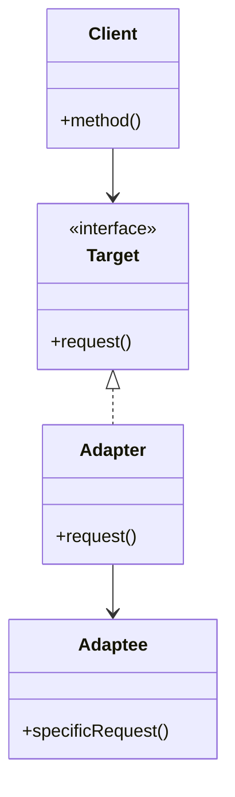
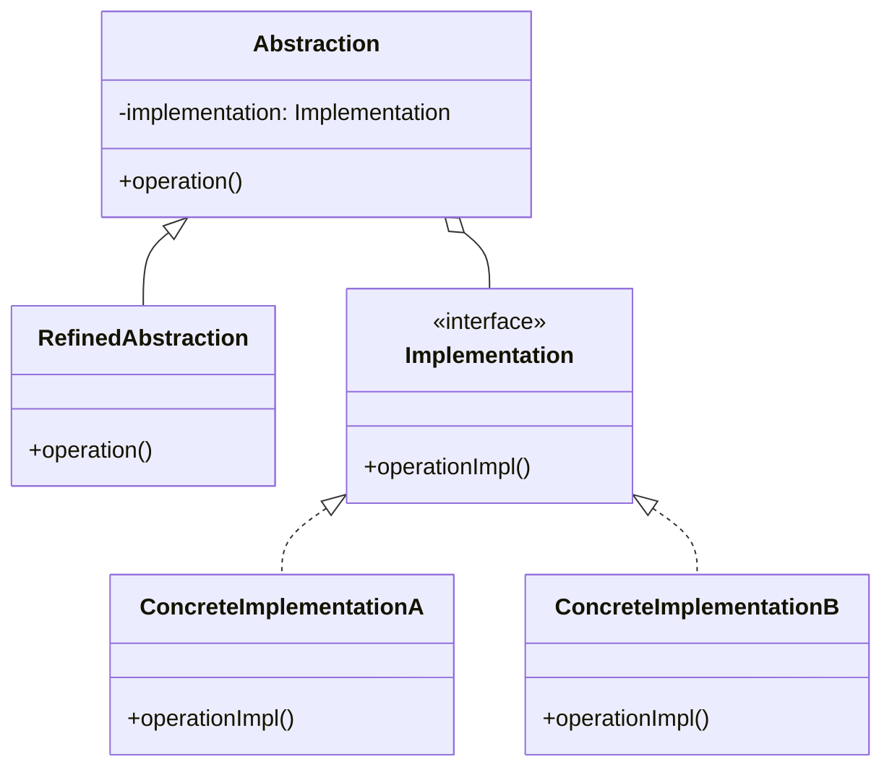
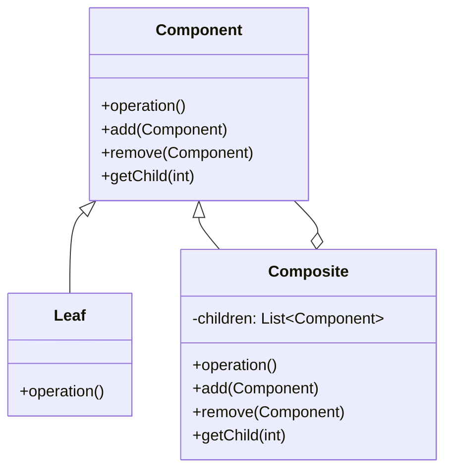
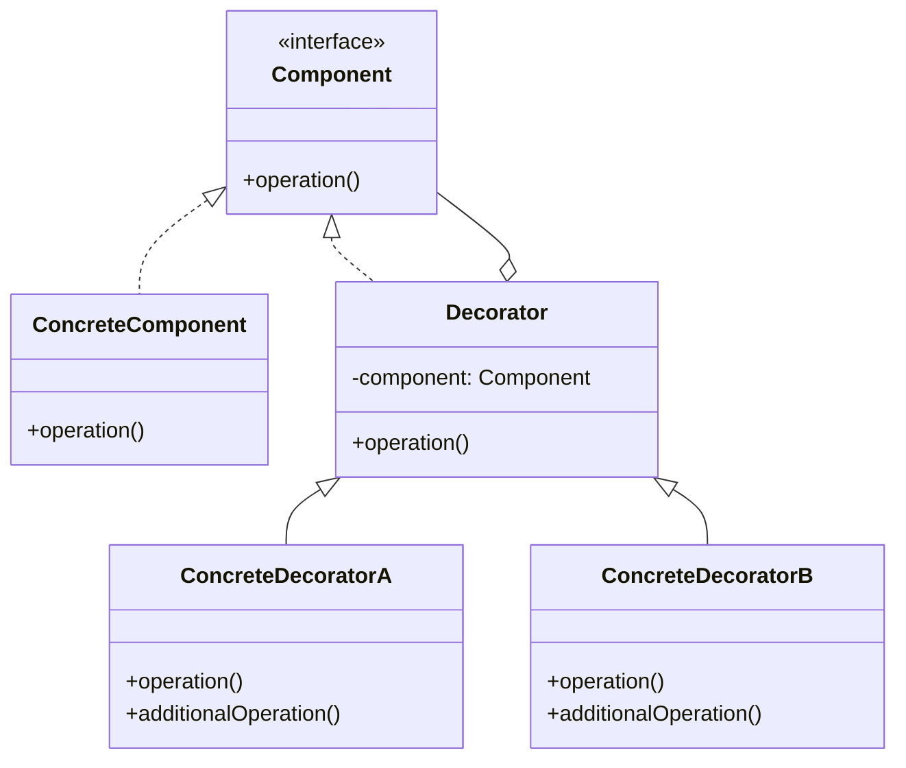
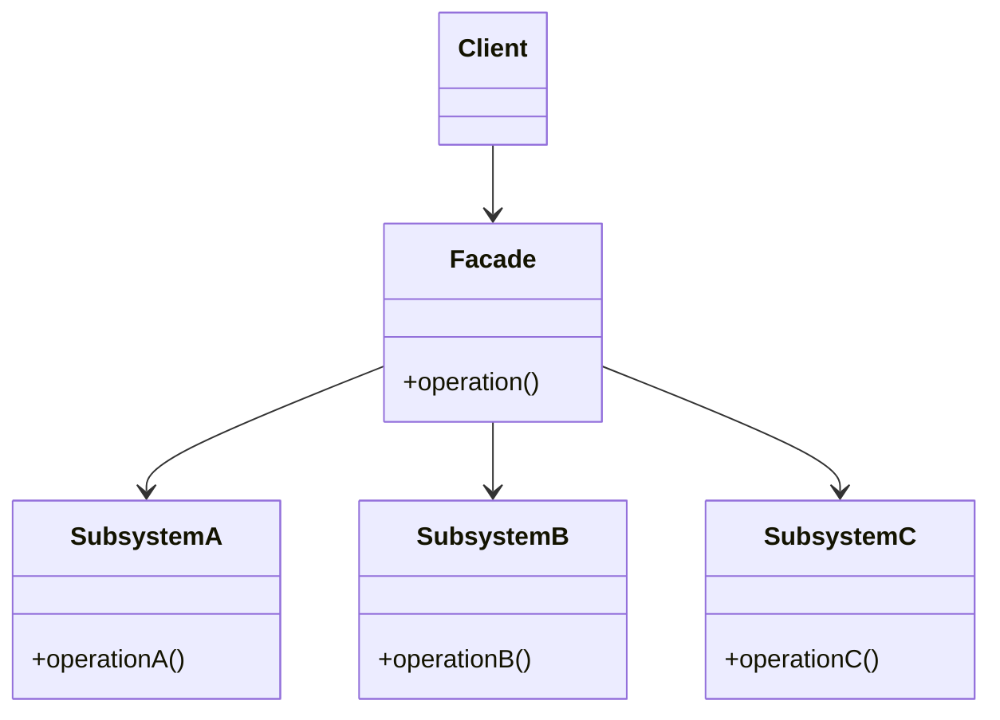
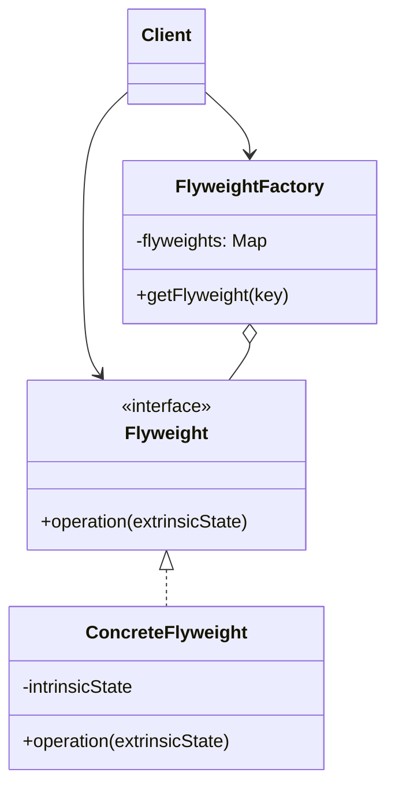
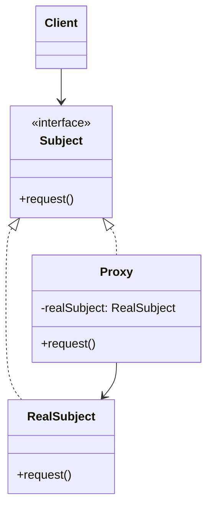

# Structural Patterns

## Introduction

Structural patterns are a category of design patterns that focus on how classes and objects are composed to form larger structures. These patterns help ensure that when parts of a system change, the entire system doesn't need to change with them. Structural patterns simplify the relationships between different components by identifying simple ways to realize these relationships.

In this guide, we'll explore the seven key structural patterns identified in the "Gang of Four" book on design patterns. Each pattern solves a specific problem related to object composition and structure.

## Adapter Pattern

### What is the Adapter Pattern?

The Adapter pattern allows objects with incompatible interfaces to collaborate. Think of it like a power adapter that lets you plug a US device into a European outlet - it doesn't change how either works, but creates a bridge between them.

### When to Use It

- When you need to use an existing class but its interface isn't compatible with your code
- When you want to reuse a class but don't want to modify its source code
- When you need to integrate classes that couldn't otherwise work together

### How It Works



### Code Example

```java
// The Target interface that the client expects to use
interface MediaPlayer {
    void play(String audioType, String fileName);
}

// The Adaptee: existing class with incompatible interface
class AdvancedMediaPlayer {
    public void playVlc(String fileName) {
        System.out.println("Playing vlc file: " + fileName);
    }
    
    public void playMp4(String fileName) {
        System.out.println("Playing mp4 file: " + fileName);
    }
}

// The Adapter: makes the Adaptee's interface compatible with the Target interface
class MediaAdapter implements MediaPlayer {
    private AdvancedMediaPlayer advancedMusicPlayer;
    
    public MediaAdapter(String audioType) {
        advancedMusicPlayer = new AdvancedMediaPlayer();
    }
    
    @Override
    public void play(String audioType, String fileName) {
        if(audioType.equalsIgnoreCase("vlc")) {
            advancedMusicPlayer.playVlc(fileName);
        } else if(audioType.equalsIgnoreCase("mp4")) {
            advancedMusicPlayer.playMp4(fileName);
        }
    }
}

// The Client: uses the Target interface
class AudioPlayer implements MediaPlayer {
    private MediaAdapter mediaAdapter;
    
    @Override
    public void play(String audioType, String fileName) {
        // Built-in support for mp3
        if(audioType.equalsIgnoreCase("mp3")) {
            System.out.println("Playing mp3 file: " + fileName);
        } 
        // Support for other formats via adapter
        else if(audioType.equalsIgnoreCase("vlc") || audioType.equalsIgnoreCase("mp4")) {
            mediaAdapter = new MediaAdapter(audioType);
            mediaAdapter.play(audioType, fileName);
        } else {
            System.out.println("Invalid media type: " + audioType);
        }
    }
}
```

**Usage:**

```java
public class Main {
    public static void main(String[] args) {
        AudioPlayer audioPlayer = new AudioPlayer();
        
        audioPlayer.play("mp3", "song.mp3");
        audioPlayer.play("vlc", "movie.vlc");
        audioPlayer.play("mp4", "video.mp4");
        audioPlayer.play("avi", "video.avi");
    }
}
```

**Output:**
```
Playing mp3 file: song.mp3
Playing vlc file: movie.vlc
Playing mp4 file: video.mp4
Invalid media type: avi
```

### Real-World Application

In a real-world scenario, you might use the Adapter pattern when integrating with third-party libraries or legacy code. For example, if your application uses a specific data format, but you need to integrate with an API that requires a different format, you'd create an adapter to convert between the two.

## Bridge Pattern

### What is the Bridge Pattern?

The Bridge pattern separates an abstraction from its implementation so that both can vary independently. It involves an interface acting as a bridge between the abstract class and implementor classes.

### When to Use It

- When you want to avoid a permanent binding between an abstraction and its implementation
- When both the abstraction and its implementation should be extensible independently
- When changes in the implementation shouldn't impact the client code

### How It Works



### Code Example

```java
// Implementor interface
interface DrawAPI {
    void drawCircle(int radius, int x, int y);
}

// Concrete Implementors
class RedCircle implements DrawAPI {
    @Override
    public void drawCircle(int radius, int x, int y) {
        System.out.println("Drawing Circle[ color: red, radius: " + radius + ", x: " + x + ", y: " + y + "]");
    }
}

class GreenCircle implements DrawAPI {
    @Override
    public void drawCircle(int radius, int x, int y) {
        System.out.println("Drawing Circle[ color: green, radius: " + radius + ", x: " + x + ", y: " + y + "]");
    }
}

// Abstraction
abstract class Shape {
    protected DrawAPI drawAPI;
    
    protected Shape(DrawAPI drawAPI){
        this.drawAPI = drawAPI;
    }
    
    public abstract void draw();
}

// Refined Abstraction
class Circle extends Shape {
    private int x, y, radius;
    
    public Circle(int x, int y, int radius, DrawAPI drawAPI) {
        super(drawAPI);
        this.x = x;
        this.y = y;
        this.radius = radius;
    }
    
    @Override
    public void draw() {
        drawAPI.drawCircle(radius, x, y);
    }
}
```

**Usage:**

```java
public class Main {
    public static void main(String[] args) {
        Shape redCircle = new Circle(100, 100, 10, new RedCircle());
        Shape greenCircle = new Circle(200, 200, 15, new GreenCircle());
        
        redCircle.draw();
        greenCircle.draw();
    }
}
```

**Output:**
```
Drawing Circle[ color: red, radius: 10, x: 100, y: 100]
Drawing Circle[ color: green, radius: 15, x: 200, y: 200]
```

### Real-World Application

The Bridge pattern is commonly used in graphical user interfaces (GUIs). For example, different window systems (Windows, macOS, Linux) have different implementations of GUI components, but the abstract behavior remains similar. The Bridge pattern lets you create a stable interface for your application while supporting multiple platform-specific implementations.

## Composite Pattern

### What is the Composite Pattern?

The Composite pattern allows you to compose objects into tree structures to represent part-whole hierarchies. It lets clients treat individual objects and compositions of objects uniformly.

### When to Use It

- When you want to represent part-whole hierarchies of objects
- When clients should be able to ignore the difference between compositions of objects and individual objects
- When the structure can have any level of complexity and is dynamic

### How It Works



### Code Example

```java
// Component
interface Employee {
    void showDetails();
    double getSalary();
}

// Leaf
class Developer implements Employee {
    private String name;
    private double salary;
    
    public Developer(String name, double salary) {
        this.name = name;
        this.salary = salary;
    }
    
    @Override
    public void showDetails() {
        System.out.println("Developer: " + name + ", Salary: $" + salary);
    }
    
    @Override
    public double getSalary() {
        return salary;
    }
}

// Leaf
class Designer implements Employee {
    private String name;
    private double salary;
    
    public Designer(String name, double salary) {
        this.name = name;
        this.salary = salary;
    }
    
    @Override
    public void showDetails() {
        System.out.println("Designer: " + name + ", Salary: $" + salary);
    }
    
    @Override
    public double getSalary() {
        return salary;
    }
}

// Composite
class Department implements Employee {
    private String name;
    private List<Employee> employees = new ArrayList<>();
    
    public Department(String name) {
        this.name = name;
    }
    
    public void addEmployee(Employee employee) {
        employees.add(employee);
    }
    
    public void removeEmployee(Employee employee) {
        employees.remove(employee);
    }
    
    @Override
    public void showDetails() {
        System.out.println("Department: " + name);
        System.out.println("Employees:");
        for (Employee employee : employees) {
            employee.showDetails();
        }
    }
    
    @Override
    public double getSalary() {
        double totalSalary = 0;
        for (Employee employee : employees) {
            totalSalary += employee.getSalary();
        }
        return totalSalary;
    }
}
```

**Usage:**

```java
public class Main {
    public static void main(String[] args) {
        // Create individual employees
        Employee dev1 = new Developer("Alice", 100000);
        Employee dev2 = new Developer("Bob", 90000);
        Employee designer = new Designer("Charlie", 85000);
        
        // Create engineering department and add employees
        Department engineering = new Department("Engineering");
        engineering.addEmployee(dev1);
        engineering.addEmployee(dev2);
        
        // Create design department and add employees
        Department design = new Department("Design");
        design.addEmployee(designer);
        
        // Create company department that contains other departments
        Department company = new Department("Company");
        company.addEmployee(engineering);
        company.addEmployee(design);
        
        // Display company structure
        company.showDetails();
        
        // Calculate and display total salary
        System.out.println("Total Salary: $" + company.getSalary());
    }
}
```

**Output:**
```
Department: Company
Employees:
Department: Engineering
Employees:
Developer: Alice, Salary: $100000.0
Developer: Bob, Salary: $90000.0
Department: Design
Employees:
Designer: Charlie, Salary: $85000.0
Total Salary: $275000.0
```

### Real-World Application

The Composite pattern is frequently used in file system structures where files and directories share common operations. Another example is in graphics applications, where simple shapes and complex groups of shapes can be treated uniformly, allowing operations like drawing, scaling, or moving to be applied consistently across all elements.

## Decorator Pattern

### What is the Decorator Pattern?

The Decorator pattern allows behavior to be added to individual objects, either statically or dynamically, without affecting the behavior of other objects from the same class.

### When to Use It

- When you need to add responsibilities to objects dynamically and transparently
- When extension by subclassing is impractical
- When you want to add functionality to an object without modifying its structure

### How It Works



### Code Example

```java
// Component interface
interface Coffee {
    String getDescription();
    double getCost();
}

// Concrete Component
class SimpleCoffee implements Coffee {
    @Override
    public String getDescription() {
        return "Simple Coffee";
    }
    
    @Override
    public double getCost() {
        return 1.0;
    }
}

// Decorator
abstract class CoffeeDecorator implements Coffee {
    protected Coffee decoratedCoffee;
    
    public CoffeeDecorator(Coffee coffee) {
        this.decoratedCoffee = coffee;
    }
    
    @Override
    public String getDescription() {
        return decoratedCoffee.getDescription();
    }
    
    @Override
    public double getCost() {
        return decoratedCoffee.getCost();
    }
}

// Concrete Decorator
class MilkDecorator extends CoffeeDecorator {
    public MilkDecorator(Coffee coffee) {
        super(coffee);
    }
    
    @Override
    public String getDescription() {
        return decoratedCoffee.getDescription() + ", Milk";
    }
    
    @Override
    public double getCost() {
        return decoratedCoffee.getCost() + 0.5;
    }
}

// Concrete Decorator
class SugarDecorator extends CoffeeDecorator {
    public SugarDecorator(Coffee coffee) {
        super(coffee);
    }
    
    @Override
    public String getDescription() {
        return decoratedCoffee.getDescription() + ", Sugar";
    }
    
    @Override
    public double getCost() {
        return decoratedCoffee.getCost() + 0.2;
    }
}

// Concrete Decorator
class WhippedCreamDecorator extends CoffeeDecorator {
    public WhippedCreamDecorator(Coffee coffee) {
        super(coffee);
    }
    
    @Override
    public String getDescription() {
        return decoratedCoffee.getDescription() + ", Whipped Cream";
    }
    
    @Override
    public double getCost() {
        return decoratedCoffee.getCost() + 0.7;
    }
}
```

**Usage:**

```java
public class Main {
    public static void main(String[] args) {
        // Create a simple coffee
        Coffee coffee = new SimpleCoffee();
        System.out.println(coffee.getDescription() + " $" + coffee.getCost());
        
        // Decorate it with milk
        Coffee milkCoffee = new MilkDecorator(coffee);
        System.out.println(milkCoffee.getDescription() + " $" + milkCoffee.getCost());
        
        // Decorate it with sugar
        Coffee sweetMilkCoffee = new SugarDecorator(milkCoffee);
        System.out.println(sweetMilkCoffee.getDescription() + " $" + sweetMilkCoffee.getCost());
        
        // Create a fancy coffee with all decorators
        Coffee fancyCoffee = new WhippedCreamDecorator(
                              new SugarDecorator(
                                new MilkDecorator(
                                  new SimpleCoffee())));
        System.out.println(fancyCoffee.getDescription() + " $" + fancyCoffee.getCost());
    }
}
```

**Output:**
```
Simple Coffee $1.0
Simple Coffee, Milk $1.5
Simple Coffee, Milk, Sugar $1.7
Simple Coffee, Milk, Sugar, Whipped Cream $2.4
```

### Real-World Application

The Decorator pattern is extensively used in Java I/O classes. For example, you can create a `FileInputStream` and decorate it with a `BufferedInputStream` for performance and a `DataInputStream` for reading primitive data types. In web development, you might use decorators to add authentication, logging, or caching capabilities to existing services.

## Facade Pattern

### What is the Facade Pattern?

The Facade pattern provides a simplified interface to a complex subsystem of classes, making it easier to use. It doesn't encapsulate the subsystem but provides a higher-level interface that makes the subsystem easier to use.

### When to Use It

- When you need to provide a simple interface to a complex subsystem
- When there are many dependencies between clients and implementation classes
- When you want to layer your subsystems

### How It Works



### Code Example

```java
// Subsystem Classes
class CPU {
    public void freeze() {
        System.out.println("CPU: Freezing...");
    }
    
    public void jump(long position) {
        System.out.println("CPU: Jumping to position " + position);
    }
    
    public void execute() {
        System.out.println("CPU: Executing instructions");
    }
}

class Memory {
    public void load(long position, String data) {
        System.out.println("Memory: Loading data \"" + data + "\" at position " + position);
    }
}

class HardDrive {
    public String read(long lba, int size) {
        System.out.println("HardDrive: Reading data from sector " + lba + " with size " + size);
        return "Data from hard drive";
    }
}

// Facade
class ComputerFacade {
    private CPU cpu;
    private Memory memory;
    private HardDrive hardDrive;
    
    public ComputerFacade() {
        this.cpu = new CPU();
        this.memory = new Memory();
        this.hardDrive = new HardDrive();
    }
    
    public void start() {
        System.out.println("Computer is starting...");
        cpu.freeze();
        memory.load(0, hardDrive.read(0, 1024));
        cpu.jump(0);
        cpu.execute();
        System.out.println("Computer started successfully!");
    }
    
    public void shutdown() {
        System.out.println("Computer is shutting down...");
        // Shutdown operations would go here
        System.out.println("Computer shut down successfully!");
    }
}
```

**Usage:**

```java
public class Main {
    public static void main(String[] args) {
        // Create a computer facade
        ComputerFacade computer = new ComputerFacade();
        
        // Use the simplified interface
        computer.start();
        System.out.println("Computer is running...");
        computer.shutdown();
    }
}
```

**Output:**
```
Computer is starting...
CPU: Freezing...
HardDrive: Reading data from sector 0 with size 1024
Memory: Loading data "Data from hard drive" at position 0
CPU: Jumping to position 0
CPU: Executing instructions
Computer started successfully!
Computer is running...
Computer is shutting down...
Computer shut down successfully!
```

### Real-World Application

The Facade pattern is commonly used in libraries and frameworks that provide a simplified API to complex underlying functionality. For example, many ORMs (Object-Relational Mappers) like Hibernate use a facade to hide the complexity of database operations. Similarly, game engines often provide a simple facade for complex rendering, physics, and audio subsystems.

## Flyweight Pattern

### What is the Flyweight Pattern?

The Flyweight pattern minimizes memory usage by sharing as much data as possible with similar objects. It's used when you need a large number of similar objects that would otherwise consume a lot of memory.

### When to Use It

- When an application uses a large number of objects that have some shared state
- When object creation is expensive in terms of memory or performance
- When the majority of each object's state can be made extrinsic (stored outside the object)

### How It Works



### Code Example

```java
// Flyweight Interface
interface Shape {
    void draw(int x, int y, String color);
}

// Concrete Flyweight
class Circle implements Shape {
    private String type; // intrinsic state
    
    public Circle(String type) {
        this.type = type;
        // Simulate expensive resource creation
        System.out.println("Creating circle of type: " + type);
        try {
            Thread.sleep(100); // Simulating a delay in creation
        } catch (InterruptedException e) {
            e.printStackTrace();
        }
    }
    
    @Override
    public void draw(int x, int y, String color) {
        System.out.println("Drawing a " + color + " " + type + " circle at (" + x + ", " + y + ")");
    }
}

// Flyweight Factory
class ShapeFactory {
    private static final Map<String, Shape> circleMap = new HashMap<>();
    
    public static Shape getCircle(String type) {
        Shape circle = circleMap.get(type);
        
        if(circle == null) {
            circle = new Circle(type);
            circleMap.put(type, circle);
        }
        
        return circle;
    }
    
    public static int getObjectCount() {
        return circleMap.size();
    }
}
```

**Usage:**

```java
public class Main {
    private static final String[] colors = {"Red", "Green", "Blue", "Yellow", "Black"};
    private static final String[] types = {"Small", "Medium", "Large"};
    
    public static void main(String[] args) {
        // Create 30 circles with different extrinsic states but shared flyweights
        for(int i = 0; i < 30; i++) {
            String color = colors[getRandomNumber(0, colors.length)];
            String type = types[getRandomNumber(0, types.length)];
            
            Circle circle = (Circle) ShapeFactory.getCircle(type);
            circle.draw(getRandomNumber(0, 100), getRandomNumber(0, 100), color);
        }
        
        System.out.println("Total Circle objects created: " + ShapeFactory.getObjectCount());
    }
    
    private static int getRandomNumber(int min, int max) {
        return (int) (Math.random() * (max - min)) + min;
    }
}
```

**Output:**
```
Creating circle of type: Medium
Drawing a Green Medium circle at (73, 12)
Creating circle of type: Small
Drawing a Red Small circle at (47, 65)
Creating circle of type: Large
Drawing a Blue Large circle at (21, 89)
...
Drawing a Yellow Medium circle at (44, 72)
Drawing a Red Large circle at (5, 8)
Drawing a Green Small circle at (67, 31)
Total Circle objects created: 3
```

### Real-World Application

The Flyweight pattern is often used in text editors and word processors, where character objects share common formatting attributes. Similarly, in game development, a game might have thousands of similar objects (like trees, bullets, or particles) that can share textures, meshes, and other common data to save memory.

## Proxy Pattern

### What is the Proxy Pattern?

The Proxy pattern provides a surrogate or placeholder for another object to control access to it. It can be used to add a level of indirection when accessing an object, which can be used for lazy loading, access control, logging, etc.

### When to Use It

- When you need a more versatile or sophisticated reference to an object than a simple pointer
- When you want to add lazy initialization, access control, logging, or any additional behavior when accessing an object
- When the object being accessed is in a different address space (remote proxy) or expensive to create (virtual proxy)

### How It Works



### Types of Proxies

1. **Virtual Proxy**: Creates expensive objects on demand
2. **Protection Proxy**: Controls access to the original object
3. **Remote Proxy**: Represents an object that is in a different address space
4. **Smart Proxy**: Performs additional actions when an object is accessed

### Code Example

```java
// Subject Interface
interface Image {
    void display();
}

// Real Subject
class RealImage implements Image {
    private String filename;
    
    public RealImage(String filename) {
        this.filename = filename;
        loadFromDisk();
    }
    
    private void loadFromDisk() {
        System.out.println("Loading image: " + filename);
        // Simulate expensive loading operation
        try {
            Thread.sleep(1000);
        } catch (InterruptedException e) {
            e.printStackTrace();
        }
    }
    
    @Override
    public void display() {
        System.out.println("Displaying image: " + filename);
    }
}

// Proxy
class ProxyImage implements Image {
    private String filename;
    private RealImage realImage;
    
    public ProxyImage(String filename) {
        this.filename = filename;
    }
    
    @Override
    public void display() {
        // Lazy initialization: only create the real object when needed
        if(realImage == null) {
            realImage = new RealImage(filename);
        }
        realImage.display();
    }
}
```

**Usage:**

```java
public class Main {
    public static void main(String[] args) {
        long startTime = System.currentTimeMillis();
        
        // Create proxy images
        Image image1 = new ProxyImage("sample1.jpg");
        Image image2 = new ProxyImage("sample2.jpg");
        
        // Note that real images aren't loaded yet - proxy creation is cheap
        System.out.println("Images created in " + (System.currentTimeMillis() - startTime) + "ms");
        System.out.println("--------------------");
        
        // First-time display will load the image
        System.out.println("First display of image1:");
        image1.display();
        
        System.out.println("
Second display of image1 (already loaded):");
        image1.display(); // No loading happens here
        
        System.out.println("
First display of image2:");
        image2.display();
    }
}
```

**Output:**
```
Images created in 2ms
--------------------
First display of image1:
Loading image: sample1.jpg
Displaying image: sample1.jpg

Second display of image1 (already loaded):
Displaying image: sample1.jpg

First display of image2:
Loading image: sample2.jpg
Displaying image: sample2.jpg
```

### Protection Proxy Example

```java
// Subject Interface
interface Internet {
    void connectTo(String host) throws Exception;
}

// Real Subject
class RealInternet implements Internet {
    @Override
    public void connectTo(String host) {
        System.out.println("Connected to " + host);
    }
}

// Protection Proxy
class RestrictedInternet implements Internet {
    private Internet internet = new RealInternet();
    private List<String> blockedSites;
    
    public RestrictedInternet() {
        blockedSites = new ArrayList<>();
        blockedSites.add("blocked-site1.com");
        blockedSites.add("blocked-site2.com");
        blockedSites.add("banned.com");
    }
    
    @Override
    public void connectTo(String host) throws Exception {
        if(blockedSites.contains(host)) {
            throw new Exception("Access Denied: Cannot connect to " + host);
        }
        internet.connectTo(host);
    }
}
```

**Usage:**

```java
public class Main {
    public static void main(String[] args) {
        Internet internet = new RestrictedInternet();
        
        try {
            internet.connectTo("allowed-site.com");
            internet.connectTo("blocked-site1.com");
        } catch (Exception e) {
            System.out.println(e.getMessage());
        }
    }
}
```

**Output:**
```
Connected to allowed-site.com
Access Denied: Cannot connect to blocked-site1.com
```

### Real-World Application

The Proxy pattern is widely used in frameworks and APIs:

1. **Java RMI (Remote Method Invocation)** uses remote proxies to make remote objects appear as if they were local.
2. **Hibernate** uses proxies for lazy loading of related objects from the database.
3. **Spring Framework** uses proxies for implementing aspects (AOP) and for transaction management.
4. **Modern web browsers** use virtual proxies to display placeholder images while the actual images are being loaded.

## Summary

Structural patterns are essential tools for organizing classes and objects into larger structures. They help you build flexible, extensible, and maintainable code. Here's a quick overview of what we've covered:

- **Adapter Pattern**: Makes incompatible interfaces work together
- **Bridge Pattern**: Separates abstraction from implementation
- **Composite Pattern**: Represents part-whole hierarchies as tree structures
- **Decorator Pattern**: Adds responsibilities to objects dynamically
- **Facade Pattern**: Provides a simplified interface to a complex subsystem
- **Flyweight Pattern**: Shares common state between multiple objects to save memory
- **Proxy Pattern**: Controls access to another object

Each pattern solves a specific structural problem and can be combined with other patterns to create elegant, flexible solutions. Understanding when and how to apply these patterns will significantly improve your object-oriented design skills.

## Exercises

1. **Basic Implementation**: Create an adapter that allows a `Square` class to work with an interface that expects a `Circle`.

2. **Pattern Recognition**: Examine a codebase (or a library you use) and identify at least one structural pattern that has been implemented.

3. **Refactoring Practice**: Take a piece of code with tightly coupled components and refactor it using the Bridge pattern.

4. **Combined Patterns**: Design a system that uses both the Composite and Decorator patterns to manage and render UI components.

5. **Real-World Application**: Implement a Proxy pattern that adds logging to database operations in an application.

## Additional Resources

- **Books**:
  - "Design Patterns: Elements of Reusable Object-Oriented Software" by Gamma, Helm, Johnson, and Vlissides
  - "Head First Design Patterns" by Freeman &