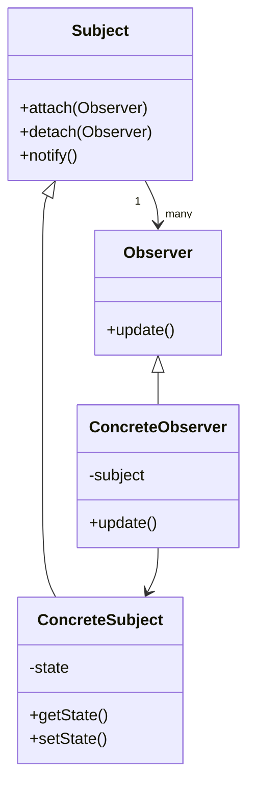
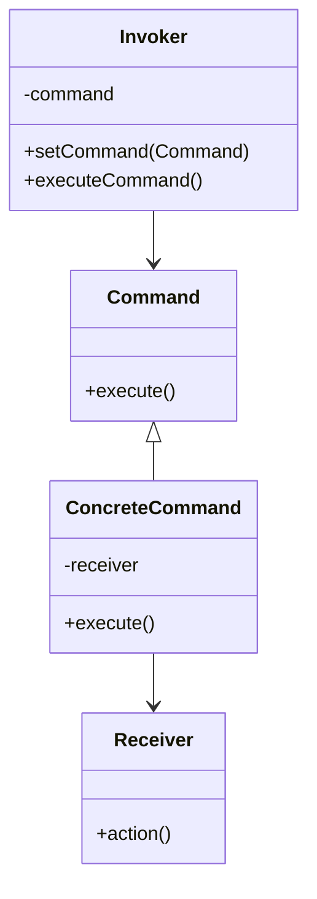

# Behavioral Patterns

## Introduction

Behavioral patterns are a category of design patterns that focus on how objects interact and communicate with each other. While creational patterns deal with object creation and structural patterns deal with object composition, behavioral patterns are concerned with algorithms and the assignment of responsibilities between objects.

These patterns characterize complex control flow that is difficult to follow at run-time. They shift your focus away from the flow of control to let you concentrate on the way objects are interconnected.

## Why Behavioral Patterns Matter

Behavioral patterns address several challenges in software design:

- They help define clear communication channels between objects
- They reduce coupling between objects that need to interact
- They make it easier to change behavior at runtime
- They improve code organization when dealing with complex interactions

## Common Behavioral Patterns

Let's explore some of the most widely used behavioral patterns.

### 1. Strategy Pattern

The Strategy pattern defines a family of algorithms, encapsulates each one, and makes them interchangeable. This pattern lets the algorithm vary independently from clients that use it.

#### How It Works

1. Define a strategy interface common to all supported algorithms
2. Implement the interface for each concrete strategy
3. Use composition to let the context object reference a strategy
4. The context delegates the algorithm execution to the strategy object

#### Example: Payment Processing

```java
// Strategy interface
interface PaymentStrategy {
    void pay(int amount);
}

// Concrete strategies
class CreditCardPayment implements PaymentStrategy {
    private String cardNumber;
    private String name;
    
    public CreditCardPayment(String cardNumber, String name) {
        this.cardNumber = cardNumber;
        this.name = name;
    }
    
    @Override
    public void pay(int amount) {
        System.out.println(amount + " paid with credit card " + cardNumber);
    }
}

class PayPalPayment implements PaymentStrategy {
    private String email;
    
    public PayPalPayment(String email) {
        this.email = email;
    }
    
    @Override
    public void pay(int amount) {
        System.out.println(amount + " paid using PayPal account " + email);
    }
}

// Context
class ShoppingCart {
    private PaymentStrategy paymentStrategy;
    
    public void setPaymentStrategy(PaymentStrategy paymentStrategy) {
        this.paymentStrategy = paymentStrategy;
    }
    
    public void checkout(int amount) {
        paymentStrategy.pay(amount);
    }
}
```

#### Usage Example

```java
// Client code
public class Client {
    public static void main(String[] args) {
        ShoppingCart cart = new ShoppingCart();
        
        // Pay with credit card
        cart.setPaymentStrategy(new CreditCardPayment("1234-5678-9101-1121", "John Smith"));
        cart.checkout(100);
        
        // Pay with PayPal
        cart.setPaymentStrategy(new PayPalPayment("john.smith@example.com"));
        cart.checkout(200);
    }
}
```

#### Output

```
100 paid with credit card 1234-5678-9101-1121
200 paid using PayPal account john.smith@example.com
```

### 2. Observer Pattern

The Observer pattern defines a one-to-many dependency between objects so that when one object changes state, all its dependents are notified and updated automatically.

#### How It Works

1. Define a subject interface that allows attaching, detaching, and notifying observers
2. Implement the subject interface in a concrete subject class
3. Define an observer interface with an update method
4. Implement the observer interface in concrete observer classes

#### Class Diagram



#### Example: Weather Station

```java
import java.util.ArrayList;
import java.util.List;

// Subject interface
interface Subject {
    void attach(Observer observer);
    void detach(Observer observer);
    void notifyObservers();
}

// Observer interface
interface Observer {
    void update();
}

// Concrete Subject
class WeatherStation implements Subject {
    private List<Observer> observers = new ArrayList<>();
    private float temperature;
    
    @Override
    public void attach(Observer observer) {
        observers.add(observer);
    }
    
    @Override
    public void detach(Observer observer) {
        observers.remove(observer);
    }
    
    @Override
    public void notifyObservers() {
        for (Observer observer : observers) {
            observer.update();
        }
    }
    
    public void setTemperature(float temperature) {
        this.temperature = temperature;
        notifyObservers();
    }
    
    public float getTemperature() {
        return temperature;
    }
}

// Concrete Observer
class PhoneDisplay implements Observer {
    private WeatherStation weatherStation;
    
    public PhoneDisplay(WeatherStation weatherStation) {
        this.weatherStation = weatherStation;
    }
    
    @Override
    public void update() {
        System.out.println("Phone Display: Temperature updated to " + 
                           weatherStation.getTemperature() + "°C");
    }
}

// Another Concrete Observer
class WebsiteDisplay implements Observer {
    private WeatherStation weatherStation;
    
    public WebsiteDisplay(WeatherStation weatherStation) {
        this.weatherStation = weatherStation;
    }
    
    @Override
    public void update() {
        System.out.println("Website Display: Current temperature is " + 
                           weatherStation.getTemperature() + "°C");
    }
}
```

#### Usage Example

```java
public class WeatherApp {
    public static void main(String[] args) {
        WeatherStation weatherStation = new WeatherStation();
        
        PhoneDisplay phoneDisplay = new PhoneDisplay(weatherStation);
        WebsiteDisplay websiteDisplay = new WebsiteDisplay(weatherStation);
        
        weatherStation.attach(phoneDisplay);
        weatherStation.attach(websiteDisplay);
        
        System.out.println("Setting temperature to 25°C");
        weatherStation.setTemperature(25);
        
        System.out.println("
Setting temperature to 30°C");
        weatherStation.setTemperature(30);
        
        System.out.println("
Detaching phone display");
        weatherStation.detach(phoneDisplay);
        
        System.out.println("
Setting temperature to 22°C");
        weatherStation.setTemperature(22);
    }
}
```

#### Output

```
Setting temperature to 25°C
Phone Display: Temperature updated to 25.0°C
Website Display: Current temperature is 25.0°C

Setting temperature to 30°C
Phone Display: Temperature updated to 30.0°C
Website Display: Current temperature is 30.0°C

Detaching phone display

Setting temperature to 22°C
Website Display: Current temperature is 22.0°C
```

### 3. Command Pattern

The Command pattern encapsulates a request as an object, allowing you to parameterize clients with different requests, queue or log requests, and support undoable operations.

#### How It Works

1. Define a command interface with an execute method
2. Create concrete command classes that implement the interface
3. Each command works with a receiver that performs the actual action
4. An invoker asks the command to carry out the request

#### Class Diagram



#### Example: Remote Control System

```java
// Command interface
interface Command {
    void execute();
}

// Receiver
class Light {
    private String location;
    
    public Light(String location) {
        this.location = location;
    }
    
    public void turnOn() {
        System.out.println(location + " light is ON");
    }
    
    public void turnOff() {
        System.out.println(location + " light is OFF");
    }
}

// Concrete Commands
class LightOnCommand implements Command {
    private Light light;
    
    public LightOnCommand(Light light) {
        this.light = light;
    }
    
    @Override
    public void execute() {
        light.turnOn();
    }
}

class LightOffCommand implements Command {
    private Light light;
    
    public LightOffCommand(Light light) {
        this.light = light;
    }
    
    @Override
    public void execute() {
        light.turnOff();
    }
}

// Invoker
class RemoteControl {
    private Command command;
    
    public void setCommand(Command command) {
        this.command = command;
    }
    
    public void pressButton() {
        command.execute();
    }
}
```

#### Usage Example

```java
public class HomeAutomation {
    public static void main(String[] args) {
        // Create receivers
        Light livingRoomLight = new Light("Living Room");
        Light kitchenLight = new Light("Kitchen");
        
        // Create commands
        LightOnCommand livingRoomLightOn = new LightOnCommand(livingRoomLight);
        LightOffCommand livingRoomLightOff = new LightOffCommand(livingRoomLight);
        LightOnCommand kitchenLightOn = new LightOnCommand(kitchenLight);
        LightOffCommand kitchenLightOff = new LightOffCommand(kitchenLight);
        
        // Create invoker
        RemoteControl remote = new RemoteControl();
        
        // Execute commands
        System.out.println("Pressing buttons on remote control:");
        remote.setCommand(livingRoomLightOn);
        remote.pressButton();
        
        remote.setCommand(kitchenLightOn);
        remote.pressButton();
        
        remote.setCommand(livingRoomLightOff);
        remote.pressButton();
        
        remote.setCommand(kitchenLightOff);
        remote.pressButton();
    }
}
```

#### Output

```
Pressing buttons on remote control:
Living Room light is ON
Kitchen light is ON
Living Room light is OFF
Kitchen light is OFF
```

### 4. Iterator Pattern

The Iterator pattern provides a way to access the elements of an aggregate object sequentially without exposing its underlying representation.

#### How It Works

1. Define an iterator interface with methods like `hasNext()` and `next()`
2. Create concrete iterator classes that implement the interface
3. Define a collection interface with a method to create an iterator
4. Implement the collection interface in concrete collection classes

#### Example: Custom Collection Iterator

```java
import java.util.ArrayList;
import java.util.List;

// Iterator interface
interface Iterator<T> {
    boolean hasNext();
    T next();
}

// Collection interface
interface Collection<T> {
    Iterator<T> createIterator();
}

// Concrete Collection
class BookCollection implements Collection<String> {
    private List<String> books = new ArrayList<>();
    
    public void addBook(String book) {
        books.add(book);
    }
    
    @Override
    public Iterator<String> createIterator() {
        return new BookIterator();
    }
    
    // Concrete Iterator as inner class
    private class BookIterator implements Iterator<String> {
        private int position = 0;
        
        @Override
        public boolean hasNext() {
            return position < books.size();
        }
        
        @Override
        public String next() {
            if (!hasNext()) {
                return null;
            }
            return books.get(position++);
        }
    }
}
```

#### Usage Example

```java
public class Library {
    public static void main(String[] args) {
        BookCollection bookCollection = new BookCollection();
        
        bookCollection.addBook("Design Patterns");
        bookCollection.addBook("Clean Code");
        bookCollection.addBook("Refactoring");
        bookCollection.addBook("Effective Java");
        
        Iterator<String> iterator = bookCollection.createIterator();
        
        System.out.println("Books in collection:");
        while (iterator.hasNext()) {
            System.out.println("- " + iterator.next());
        }
    }
}
```

#### Output

```
Books in collection:
- Design Patterns
- Clean Code
- Refactoring
- Effective Java
```

### 5. Template Method Pattern

The Template Method pattern defines the skeleton of an algorithm in a method, deferring some steps to subclasses. It lets subclasses redefine certain steps of an algorithm without changing the algorithm's structure.

#### How It Works

1. Create an abstract class with a template method
2. The template method defines the algorithm steps
3. Some steps are implemented by the abstract class
4. Abstract methods in the class must be implemented by subclasses

#### Example: Document Processing

```java
// Abstract class with template method
abstract class DocumentProcessor {
    // Template method
    public final void processDocument(String document) {
        openDocument(document);
        extractContent();
        parseContent();
        analyzeData();
        sendReport();
        closeDocument();
    }
    
    // Common implementation for all subclasses
    private void openDocument(String document) {
        System.out.println("Opening document: " + document);
    }
    
    // Steps to be implemented by subclasses
    protected abstract void extractContent();
    protected abstract void parseContent();
    
    // Common implementation with hook for customization
    protected void analyzeData() {
        System.out.println("Analyzing data in standard format");
    }
    
    // Common implementation for all subclasses
    private void sendReport() {
        System.out.println("Sending processing report");
    }
    
    // Common implementation for all subclasses
    private void closeDocument() {
        System.out.println("Closing document");
    }
}

// Concrete implementation
class PDFProcessor extends DocumentProcessor {
    @Override
    protected void extractContent() {
        System.out.println("Extracting text from PDF");
    }
    
    @Override
    protected void parseContent() {
        System.out.println("Parsing PDF content");
    }
    
    @Override
    protected void analyzeData() {
        System.out.println("Performing PDF-specific data analysis");
    }
}

// Another concrete implementation
class WordProcessor extends DocumentProcessor {
    @Override
    protected void extractContent() {
        System.out.println("Extracting text from Word document");
    }
    
    @Override
    protected void parseContent() {
        System.out.println("Parsing Word document content");
    }
}
```

#### Usage Example

```java
public class DocumentProcessingApp {
    public static void main(String[] args) {
        System.out.println("Processing PDF document:");
        DocumentProcessor pdfProcessor = new PDFProcessor();
        pdfProcessor.processDocument("document.pdf");
        
        System.out.println("
Processing Word document:");
        DocumentProcessor wordProcessor = new WordProcessor();
        wordProcessor.processDocument("document.docx");
    }
}
```

#### Output

```
Processing PDF document:
Opening document: document.pdf
Extracting text from PDF
Parsing PDF content
Performing PDF-specific data analysis
Sending processing report
Closing document

Processing Word document:
Opening document: document.docx
Extracting text from Word document
Parsing Word document content
Analyzing data in standard format
Sending processing report
Closing document
```

## Real-World Applications

Behavioral patterns are widely used in many software systems. Here are some real-world examples:

1. **Strategy Pattern**:
   - Sorting algorithms in collections (e.g., Java's `Collections.sort()` with `Comparator`)
   - Payment processing systems that handle multiple payment methods
   - Compression algorithms that can be switched at runtime

2. **Observer Pattern**:
   - GUI frameworks (e.g., button click events in JavaScript)
   - Model-View-Controller (MVC) architecture for updating views
   - Event management systems in distributed applications

3. **Command Pattern**:
   - Transaction processing in financial systems
   - Undo/redo functionality in text editors and graphics applications
   - Remote procedure call (RPC) systems

4. **Iterator Pattern**:
   - Java Collections Framework (`Iterator` and `Iterable` interfaces)
   - Database result set iterations
   - Custom data structure traversal

5. **Template Method Pattern**:
   - Frameworks that provide hook methods for customization
   - Batch processing systems with standardized workflows
   - Testing frameworks with setup/teardown methods

## Benefits of Using Behavioral Patterns

- **Flexibility**: Change object behavior at runtime
- **Loose Coupling**: Reduce dependencies between classes
- **Reusability**: Encapsulate behaviors that can be reused
- **Maintainability**: Separate concerns and follow single responsibility principle
- **Testability**: Easier to write unit tests for well-defined behaviors

## Choosing the Right Behavioral Pattern

When deciding which behavioral pattern to use, consider these questions:

1. Does your problem involve a complex algorithm with variations? **→ Strategy Pattern**
2. Do multiple objects need to be notified when another object changes? **→ Observer Pattern**
3. Do you need to encapsulate operations as objects? **→ Command Pattern**
4. Do you need to access elements sequentially without exposing internal structure? **→ Iterator Pattern**
5. Do you have an algorithm with a fixed structure but variable steps? **→ Template Method Pattern**

## Summary

Behavioral patterns address how objects communicate and interact with each other. They help manage complex behaviors in your application by defining clear communication protocols between objects.

The key behavioral patterns we explored include:

- **Strategy Pattern**: Defines a family of interchangeable algorithms
- **Observer Pattern**: Creates a one-to-many dependency for automatic notifications
- **Command Pattern**: Encapsulates requests as objects
- **Iterator Pattern**: Provides sequential access to collection elements
- **Template Method Pattern**: Defines the skeleton of an algorithm with customizable steps

Understanding these patterns will help you design more flexible, maintainable, and robust object-oriented systems.

## Exercises

1. Implement the State pattern for a vending machine with states: ReadyState, HasCoinState, SoldState, and SoldOutState.

2. Create a Chain of Responsibility pattern for processing different levels of support tickets (basic support, technical support, manager).

3. Implement the Mediator pattern for a chat room where users can send messages to each other without direct references.

4. Design a system using the Visitor pattern to perform different operations on elements in a document structure (paragraphs, tables, images).

5. Use the Memento pattern to implement an undo system for a simple text editor.

## Additional Resources

- **Books**:
  - "Design Patterns: Elements of Reusable Object-Oriented Software" by Gang of Four
  - "Head First Design Patterns" by Eric Freeman and Elisabeth Robson

- **Online Resources**:
  - [Refactoring Guru - Behavioral Patterns](https://refactoring.guru/design-patterns/behavioral-patterns)
  - [Source Making - Behavioral Patterns](https://sourcemaking.com/design_patterns/behavioral_patterns)