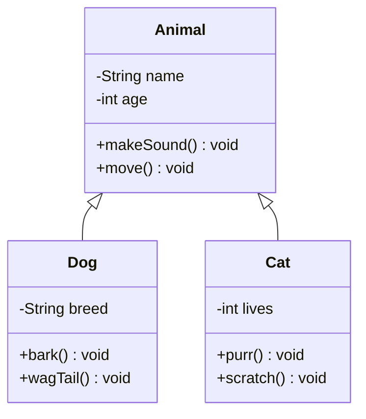
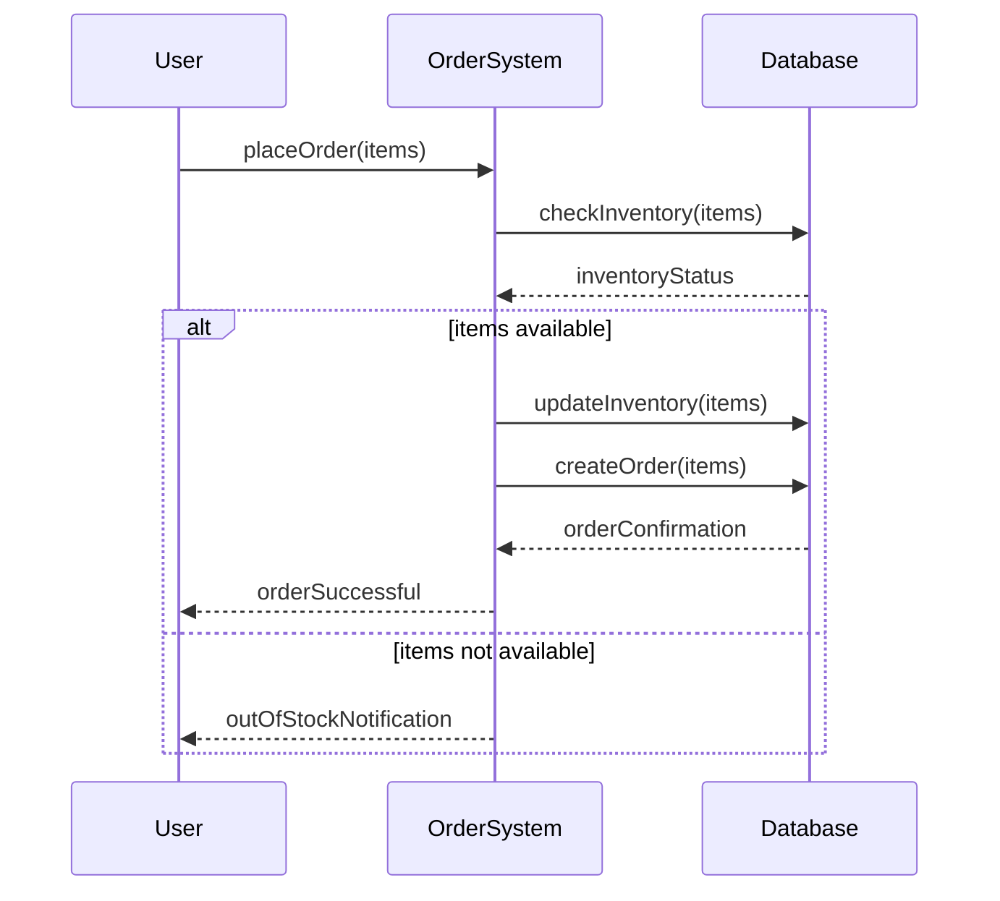
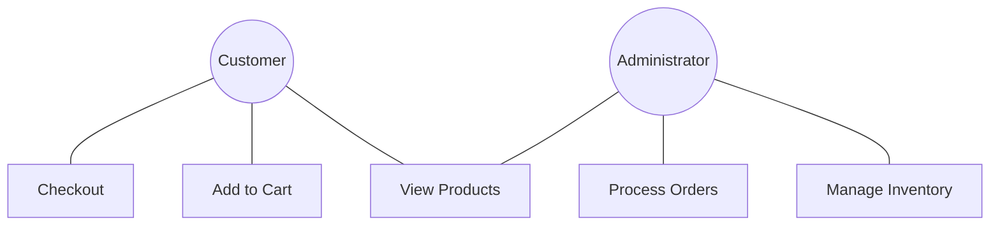
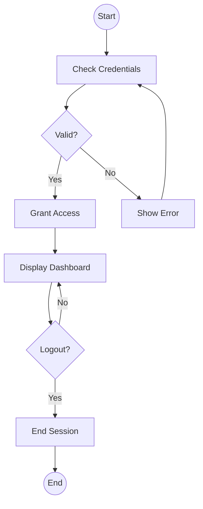
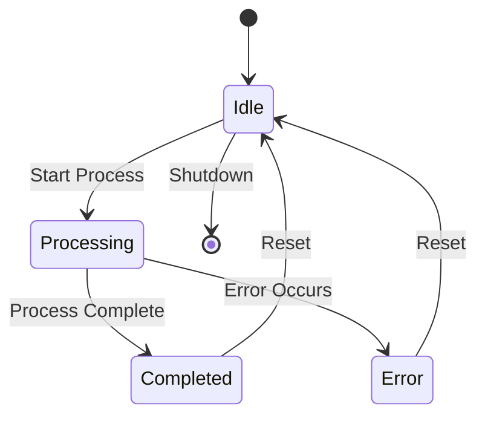
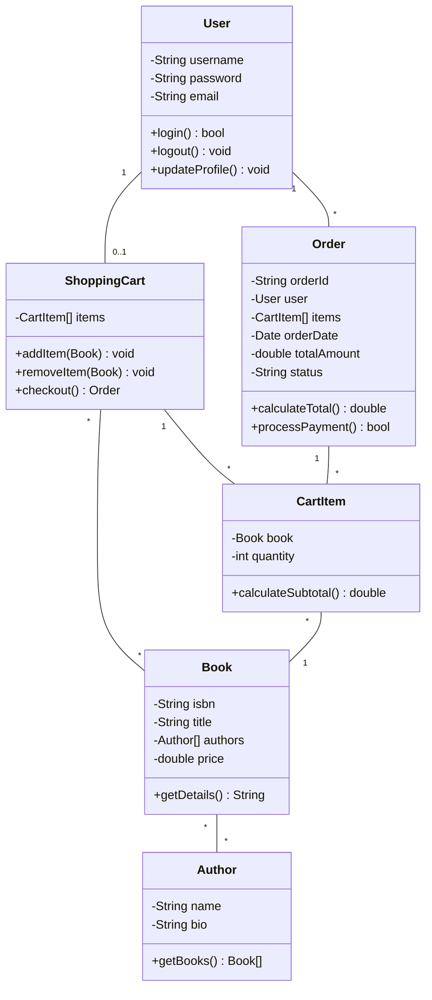
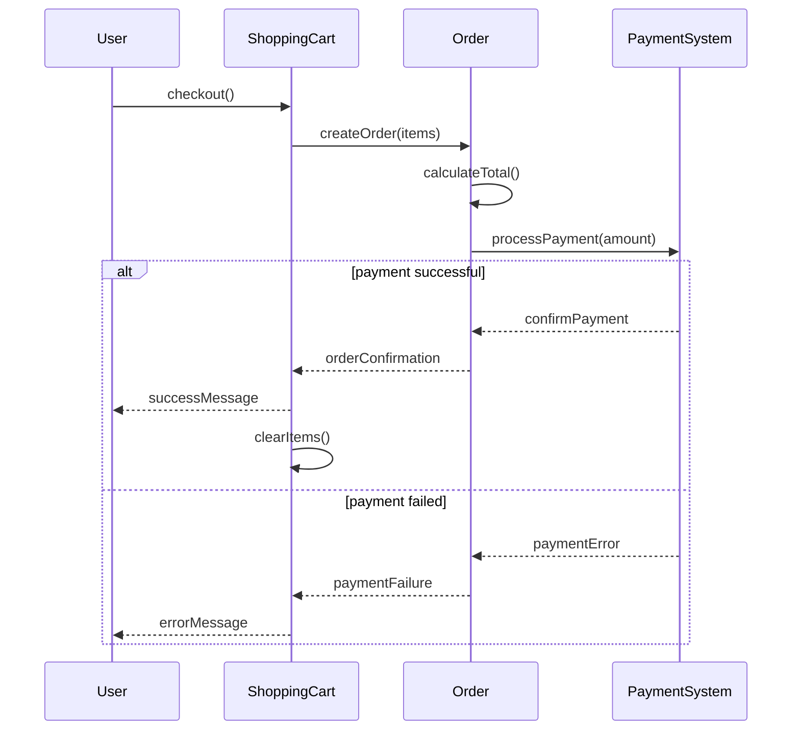

# UML Diagrams

## Introduction

The Unified Modeling Language (UML) is a standardized visual modeling language used in software engineering to provide a way to visualize a system's architectural blueprints. Think of UML as a set of graphical notation techniques that help you create visual models of object-oriented software systems.

UML diagrams are like the blueprints architects use when designing buildings. Just as architects need plans before construction begins, software developers use UML diagrams to plan and visualize software systems before writing code. This planning stage is crucial for building robust, maintainable software.

## Why Use UML Diagrams?

UML diagrams offer several benefits:

- **Communication**: They provide a standard way for developers to visualize and communicate system designs.
- **Documentation**: They serve as visual documentation of the system architecture.
- **Planning**: They help in planning the system structure before implementation.
- **Problem-solving**: They help identify design issues early in the development process.
- **Maintenance**: They make it easier to understand and maintain existing systems.

## Types of UML Diagrams

UML includes several types of diagrams, each serving a specific purpose. Let's explore the most commonly used ones:

### 1. Class Diagrams

Class diagrams are the backbone of object-oriented modeling. They show the classes in a system, their attributes, operations, and the relationships among objects.

#### Example:



In this diagram:
- `Animal` is a base class with attributes (`name`, `age`) and methods (`makeSound()`, `move()`).
- `Dog` and `Cat` are subclasses that inherit from `Animal`.
- The arrow notation `<|--` indicates inheritance.

#### Code Implementation:

```java
// Base class
public abstract class Animal {
    private String name;
    private int age;
    
    public Animal(String name, int age) {
        this.name = name;
        this.age = age;
    }
    
    public abstract void makeSound();
    
    public void move() {
        System.out.println(name + " is moving");
    }
}

// Derived class
public class Dog extends Animal {
    private String breed;
    
    public Dog(String name, int age, String breed) {
        super(name, age);
        this.breed = breed;
    }
    
    @Override
    public void makeSound() {
        System.out.println("Woof!");
    }
    
    public void wagTail() {
        System.out.println("Tail wagging happily");
    }
}

// Another derived class
public class Cat extends Animal {
    private int lives = 9;
    
    public Cat(String name, int age) {
        super(name, age);
    }
    
    @Override
    public void makeSound() {
        System.out.println("Meow!");
    }
    
    public void purr() {
        System.out.println("Purring...");
    }
}
```

### 2. Sequence Diagrams

Sequence diagrams show how objects interact with each other and the order of those interactions. They're particularly useful for modeling use case scenarios and understanding the flow of messages between objects.

#### Example:



This sequence diagram shows:
1. A user placing an order
2. The order system checking inventory
3. Different paths depending on whether items are available
4. The order confirmation process

### 3. Use Case Diagrams

Use case diagrams represent the functionality of a system from a user's perspective. They show what the system does rather than how it does it.

#### Example:



This use case diagram shows:
- Two actors: Customer and Administrator
- Five use cases (functionalities)
- Which actors can perform which functions

### 4. Activity Diagrams

Activity diagrams illustrate the dynamic aspects of a system. They represent workflows, business processes, and the flow of activities through a system.

#### Example:



This activity diagram shows a login process with:
- Start and end points
- Decision points (diamonds)
- Activities (rectangles)
- Flow directions (arrows)

### 5. State Diagrams

State diagrams describe the behavior of objects that behave differently according to their current state.

#### Example:



This state diagram shows:
- Different states a system can be in (Idle, Processing, Completed, Error)
- Events that trigger state transitions
- Initial and final states

## Common UML Relationship Types

UML uses various types of relationships between classes:

1. **Association** — Represents a relationship between classes where one class uses or interacts with another.
   
   ```mermaid
   classDiagram
       Student "1" -- "1..*" Course: takes
   ```

2. **Inheritance** — Represents an "is-a" relationship where one class inherits from another.
   
   ```mermaid
   classDiagram
       Vehicle <|-- Car
       Vehicle <|-- Motorcycle
   ```

3. **Aggregation** — Represents a "has-a" relationship where one class is a collection or container of another class, but the contained class can exist independently.
   
   ```mermaid
   classDiagram
       Department o-- Employee
   ```

4. **Composition** — Represents a strong "has-a" relationship where one class owns another, and the owned class cannot exist independently.
   
   ```mermaid
   classDiagram
       Car *-- Engine
   ```

5. **Dependency** — Represents a "uses" relationship where one class depends on another.
   
   ```mermaid
   classDiagram
       Driver ..> Car: drives
   ```

## Creating UML Diagrams

There are several tools you can use to create UML diagrams:

1. **Dedicated UML Tools**:
   - Enterprise Architect
   - Visual Paradigm
   - StarUML
   - Lucidchart

2. **Integrated Development Environments (IDEs)**:
   - IntelliJ IDEA with UML plugins
   - Eclipse with ObjectAid UML Explorer
   - Visual Studio with UML modeling tools

3. **Online Tools**:
   - draw.io
   - mermaid.js (as used in these examples)
   - PlantUML

## Practical Example: Online Bookstore

Let's model a simple online bookstore system using UML diagrams:

### Class Diagram



This class diagram shows the core classes of our online bookstore system and their relationships.

### Sequence Diagram for Checkout Process



This sequence diagram shows the interaction between objects during the checkout process.

## Best Practices for UML Diagrams

1. **Keep it simple**: Include only what's necessary to communicate your design.
2. **Be consistent**: Use the same notation and level of detail throughout your diagrams.
3. **Use appropriate diagram types**: Choose the right diagram type for what you're trying to model.
4. **Update diagrams as your design evolves**: Keep your UML diagrams in sync with your code.
5. **Add notes where needed**: Use comments to explain complex parts of the diagram.
6. **Focus on readability**: Arrange elements in a way that's easy to follow.

## Common Mistakes to Avoid

1. **Too much detail**: Overwhelming diagrams with unnecessary details.
2. **Inconsistent notation**: Using different styles or conventions across diagrams.
3. **Outdated diagrams**: Not updating diagrams as the code changes.
4. **Ignoring standards**: Not following UML standards and conventions.
5. **Missing relationships**: Failing to show important connections between elements.

## Summary

UML diagrams are powerful tools for visualizing, specifying, constructing, and documenting software systems. They provide a standard language for software architects and developers to communicate and plan their designs before implementation. 

The main types of UML diagrams include:
- Class diagrams (for structure)
- Sequence diagrams (for interaction)
- Use case diagrams (for functionality)
- Activity diagrams (for processes)
- State diagrams (for object behavior)

Mastering UML helps you become a better object-oriented designer and programmer, enabling you to create more robust, maintainable software systems.

## Exercises

1. Draw a class diagram for a simple library management system with classes for Book, Member, and Loan.
2. Create a sequence diagram for a user logging into a system and viewing their profile.
3. Design a use case diagram for an ATM system.
4. Model the states of an order in an e-commerce system using a state diagram.
5. Create an activity diagram for the process of registering a new user in a web application.

## Additional Resources

- **Books**:
  - "UML Distilled" by Martin Fowler
  - "Applying UML and Patterns" by Craig Larman
  
- **Online Tutorials**:
  - The official UML website: [uml.org](https://www.uml.org/)
  - UML tutorials on tutorial sites like GeeksforGeeks, Tutorialspoint
  
- **Practice**:
  - Try to model existing systems you're familiar with
  - Reverse-engineer UML diagrams from existing codebases