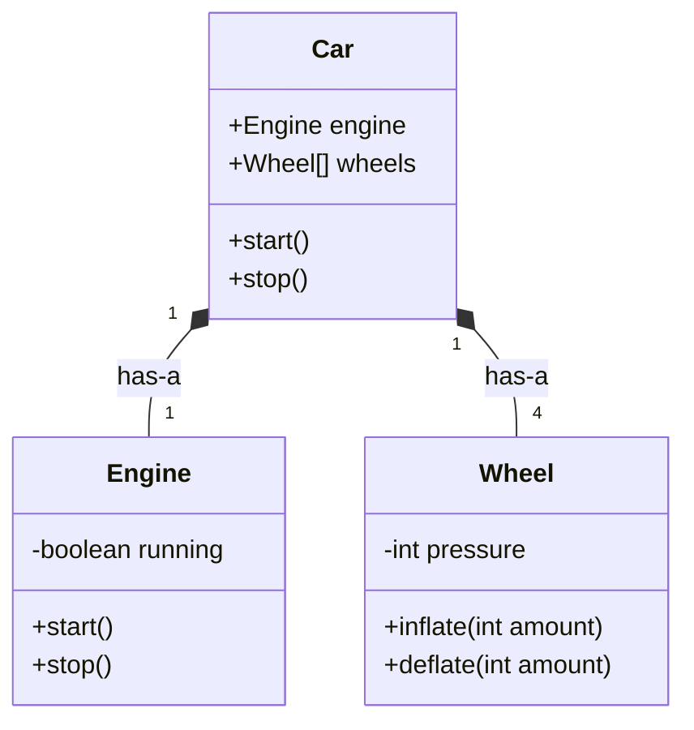
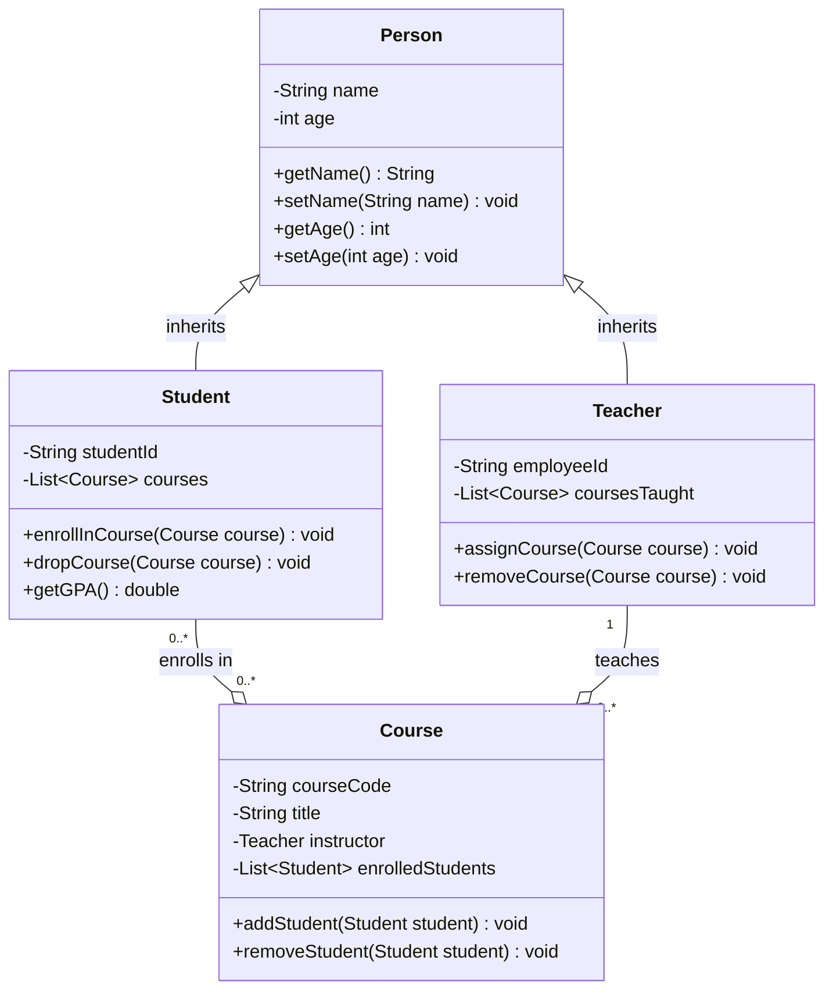

# Class Design

## Introduction

Class design is one of the most fundamental aspects of object-oriented programming (OOP). It's the process of planning and structuring classes to create reusable, maintainable, and well-organized code. Think of classes as blueprints that define the properties (attributes) and behaviors (methods) that objects of that class will have.

Good class design is crucial because it directly impacts how easy your code will be to understand, extend, and maintain. In this tutorial, we'll explore the principles and practices of effective class design for beginners.

## Basic Components of a Class

A well-designed class typically consists of:

1. **Name** - Clear and descriptive
2. **Attributes** - Data the class contains
3. **Methods** - Functions that operate on the data
4. **Constructors** - Special methods for initializing objects
5. **Access modifiers** - Control visibility of members

Let's look at a simple example of a class in Python:

```python
class Book:
    # Constructor
    def __init__(self, title, author, pages):
        # Attributes
        self.title = title
        self.author = author
        self.pages = pages
        self.is_open = False
    
    # Methods
    def open_book(self):
        self.is_open = True
        print(f"The book '{self.title}' is now open.")
    
    def close_book(self):
        self.is_open = False
        print(f"The book '{self.title}' is now closed.")
    
    def get_info(self):
        return f"'{self.title}' by {self.author}, {self.pages} pages"


# Creating an instance of the Book class
my_book = Book("The Hobbit", "J.R.R. Tolkien", 295)
print(my_book.get_info())  # Output: 'The Hobbit' by J.R.R. Tolkien, 295 pages
my_book.open_book()        # Output: The book 'The Hobbit' is now open.
```

## Principles of Good Class Design

### 1. Single Responsibility Principle

A class should have only one reason to change, meaning it should have only one job or responsibility.

**Bad Design:**
```java
class FileManager {
    void readFile(String path) { /* ... */ }
    void writeFile(String path, String content) { /* ... */ }
    void connectToDatabase() { /* ... */ }
    void executeQuery(String sql) { /* ... */ }
}
```

**Better Design:**
```java
class FileManager {
    void readFile(String path) { /* ... */ }
    void writeFile(String path, String content) { /* ... */ }
}

class DatabaseManager {
    void connectToDatabase() { /* ... */ }
    void executeQuery(String sql) { /* ... */ }
}
```

### 2. Encapsulation

Hide internal state and require all interaction to be performed through an object's methods.

```java
// Poor encapsulation
class BankAccount {
    public double balance;  // Direct access to internal state
}

// Good encapsulation
class BankAccount {
    private double balance;  // Private attribute
    
    public double getBalance() {
        return balance;
    }
    
    public void deposit(double amount) {
        if (amount > 0) {
            balance += amount;
        }
    }
    
    public boolean withdraw(double amount) {
        if (amount > 0 && balance >= amount) {
            balance -= amount;
            return true;
        }
        return false;
    }
}
```

### 3. Meaningful Names

Class and member names should clearly communicate their purpose:

```csharp
// Poor naming
class X {
    void doStuff() { /* ... */ }
}

// Good naming
class ShoppingCart {
    void addItem(Product product) { /* ... */ }
    void removeItem(Product product) { /* ... */ }
    double calculateTotal() { /* ... */ }
}
```

### 4. Cohesion and Coupling

**Cohesion** refers to how related the members of a class are to one another. High cohesion (members are strongly related) is desirable.

**Coupling** refers to how dependent classes are on each other. Loose coupling (minimal dependencies) is desirable.

## Designing Class Relationships

Classes rarely exist in isolation. Understanding how to model relationships between classes is crucial for effective class design.

### Types of Relationships



1. **Association** - A basic relationship between classes (uses-a)
2. **Aggregation** - A specialized association where one class "has" another class (has-a)
3. **Composition** - A stronger form of aggregation where the child cannot exist without the parent
4. **Inheritance** - A relationship where one class is a specialized form of another (is-a)

Let's see an example of inheritance:

```python
class Animal:
    def __init__(self, name):
        self.name = name
    
    def make_sound(self):
        pass  # Abstract method to be overridden

class Dog(Animal):
    def __init__(self, name, breed):
        super().__init__(name)
        self.breed = breed
    
    def make_sound(self):
        return "Woof!"

class Cat(Animal):
    def make_sound(self):
        return "Meow!"

# Creating instances
my_dog = Dog("Buddy", "Golden Retriever")
my_cat = Cat("Whiskers")

print(f"{my_dog.name} says: {my_dog.make_sound()}")  # Output: Buddy says: Woof!
print(f"{my_cat.name} says: {my_cat.make_sound()}")  # Output: Whiskers says: Meow!
```

## Practical Example: Building a Library System

Let's design a simple library system to see these principles in action:

```java
// The main Book class
class Book {
    private String title;
    private String author;
    private String isbn;
    private boolean checkedOut;
    
    public Book(String title, String author, String isbn) {
        this.title = title;
        this.author = author;
        this.isbn = isbn;
        this.checkedOut = false;
    }
    
    // Getters
    public String getTitle() { return title; }
    public String getAuthor() { return author; }
    public String getIsbn() { return isbn; }
    public boolean isCheckedOut() { return checkedOut; }
    
    // Methods
    public void checkOut() {
        if (!checkedOut) {
            checkedOut = true;
            System.out.println(title + " has been checked out.");
        } else {
            System.out.println(title + " is already checked out.");
        }
    }
    
    public void returnBook() {
        if (checkedOut) {
            checkedOut = false;
            System.out.println(title + " has been returned.");
        } else {
            System.out.println(title + " was not checked out.");
        }
    }
}

// Library member class
class Member {
    private String name;
    private String id;
    private List<Book> checkedOutBooks;
    
    public Member(String name, String id) {
        this.name = name;
        this.id = id;
        this.checkedOutBooks = new ArrayList<>();
    }
    
    public String getName() { return name; }
    public String getId() { return id; }
    
    public void checkOutBook(Book book) {
        if (!book.isCheckedOut()) {
            book.checkOut();
            checkedOutBooks.add(book);
        }
    }
    
    public void returnBook(Book book) {
        if (checkedOutBooks.contains(book)) {
            book.returnBook();
            checkedOutBooks.remove(book);
        } else {
            System.out.println("This book was not checked out by " + name);
        }
    }
    
    public List<Book> getCheckedOutBooks() {
        return new ArrayList<>(checkedOutBooks);  // Return a copy to preserve encapsulation
    }
}

// Library class to manage everything
class Library {
    private List<Book> books;
    private List<Member> members;
    
    public Library() {
        books = new ArrayList<>();
        members = new ArrayList<>();
    }
    
    public void addBook(Book book) {
        books.add(book);
    }
    
    public void registerMember(Member member) {
        members.add(member);
    }
    
    public Book findBookByTitle(String title) {
        for (Book book : books) {
            if (book.getTitle().equalsIgnoreCase(title)) {
                return book;
            }
        }
        return null;
    }
    
    public Member findMemberById(String id) {
        for (Member member : members) {
            if (member.getId().equals(id)) {
                return member;
            }
        }
        return null;
    }
}

// Usage example
public class LibrarySystem {
    public static void main(String[] args) {
        Library library = new Library();
        
        // Add books
        Book book1 = new Book("The Great Gatsby", "F. Scott Fitzgerald", "123456");
        Book book2 = new Book("To Kill a Mockingbird", "Harper Lee", "789012");
        
        library.addBook(book1);
        library.addBook(book2);
        
        // Register members
        Member john = new Member("John Smith", "M001");
        library.registerMember(john);
        
        // Check out a book
        john.checkOutBook(book1);
        
        // Try to check out again
        john.checkOutBook(book1);  // Should show it's already checked out
        
        // Return the book
        john.returnBook(book1);
    }
}
```

## Class Design Best Practices

1. **Keep classes focused** - If a class is trying to do too many things, split it into smaller, more focused classes.

2. **Design for extension** - Make your classes easy to extend but hard to modify.

3. **Favor composition over inheritance** - Inheritance creates tight coupling. Composition is often more flexible.

4. **Program to interfaces, not implementations** - This makes your code more flexible and testable.

5. **Follow the SOLID principles**:
   - **S**ingle Responsibility Principle
   - **O**pen/Closed Principle
   - **L**iskov Substitution Principle
   - **I**nterface Segregation Principle
   - **D**ependency Inversion Principle

## Common Class Design Patterns

Design patterns are proven solutions to common problems in software design. Here are a few patterns related to class design:

1. **Singleton** - Ensures a class has only one instance.
2. **Factory** - Creates objects without specifying the exact class.
3. **Observer** - Defines a one-to-many dependency between objects.
4. **Decorator** - Adds responsibilities to objects dynamically.

Here's an example of the Singleton pattern:

```java
public class DatabaseConnection {
    // Private static instance
    private static DatabaseConnection instance = null;
    
    // Private constructor prevents instantiation from outside
    private DatabaseConnection() {
        // Initialize connection
    }
    
    // Public static method to get the instance
    public static DatabaseConnection getInstance() {
        if (instance == null) {
            instance = new DatabaseConnection();
        }
        return instance;
    }
    
    public void query(String sql) {
        // Execute query
    }
}

// Usage
DatabaseConnection db = DatabaseConnection.getInstance();
db.query("SELECT * FROM users");
```

## UML Class Diagrams

UML (Unified Modeling Language) class diagrams are a powerful tool for visualizing class design:



## Summary

Effective class design is a crucial skill for object-oriented programming. It involves creating classes that:

- Have a single, clear purpose
- Encapsulate their internal workings
- Have clear and meaningful names
- Establish appropriate relationships with other classes
- Follow established design principles and patterns

By following good class design practices, you'll create code that's more maintainable, reusable, and understandable.

## Exercises

1. Design a `BankAccount` class with appropriate attributes and methods. Then extend it to create `SavingsAccount` and `CheckingAccount` classes.

2. Create a `Shape` hierarchy with an abstract `Shape` class and concrete implementations like `Circle`, `Rectangle`, and `Triangle`.

3. Design a class structure for a simple e-commerce system with classes like `Product`, `Customer`, `Order`, and `ShoppingCart`.

4. Refactor a poorly designed class to follow the Single Responsibility Principle.

5. Create a UML diagram for a school management system with classes for students, teachers, courses, and grades.

## Additional Resources

- "Clean Code" by Robert C. Martin
- "Head First Design Patterns" by Eric Freeman and Elisabeth Robson
- "Effective Java" by Joshua Bloch
- "Design Patterns: Elements of Reusable Object-Oriented Software" by the Gang of Four