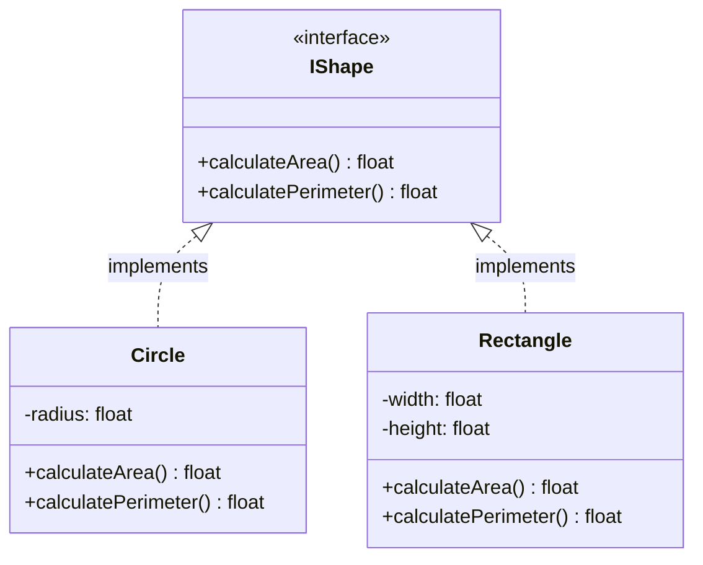

# Interface Design

## Introduction

In object-oriented programming, an interface defines a contract that classes must fulfill. Think of an interface as a blueprint that specifies what methods a class must implement, without dictating how those methods should be implemented. Interfaces are a powerful tool for achieving abstraction, polymorphism, and loose coupling in your code.

Unlike abstract classes, interfaces typically don't contain implementation details (though some modern languages now allow default implementations). They define **what** a class can do, not **how** it does it.

## What is an Interface?

An interface is a collection of abstract methods and constants that define a set of capabilities. When a class implements an interface, it promises to provide implementations for all the methods declared in that interface.

Here's a simple visualization of how interfaces work:



## Interface Syntax in Different Languages

Let's look at how interfaces are defined in different programming languages:

### Java

```java
public interface Drawable {
    void draw();
    int getX();
    int getY();
    // Since Java 8, we can have default methods
    default void printLocation() {
        System.out.println("X: " + getX() + ", Y: " + getY());
    }
}

// Implementation
public class Circle implements Drawable {
    private int x, y, radius;
    
    public Circle(int x, int y, int radius) {
        this.x = x;
        this.y = y;
        this.radius = radius;
    }
    
    @Override
    public void draw() {
        System.out.println("Drawing a circle at (" + x + "," + y + ") with radius " + radius);
    }
    
    @Override
    public int getX() {
        return x;
    }
    
    @Override
    public int getY() {
        return y;
    }
}
```

### Python (using Abstract Base Classes)

```python
from abc import ABC, abstractmethod

class Playable(ABC):
    @abstractmethod
    def play(self):
        pass
        
    @abstractmethod
    def pause(self):
        pass
        
    @abstractmethod
    def stop(self):
        pass

# Implementation
class MusicPlayer(Playable):
    def play(self):
        print("Playing music")
        
    def pause(self):
        print("Music paused")
        
    def stop(self):
        print("Music stopped")
```

### TypeScript

```typescript
interface Sortable {
    compare(other: Sortable): number;
}

// Implementation
class Person implements Sortable {
    constructor(public name: string, public age: number) {}
    
    compare(other: Person): number {
        // Sort by age
        return this.age - other.age;
    }
}

// Usage example
const alice = new Person("Alice", 30);
const bob = new Person("Bob", 25);
console.log(alice.compare(bob)); // Output: 5
```

## Benefits of Using Interfaces

### 1. Decoupling and Flexibility

Interfaces allow you to decouple what a class does from how it does it. This makes your code more flexible and easier to maintain.

**Example:**

```java
// Without interfaces (tightly coupled)
public class PaymentProcessor {
    public void processPayment(CreditCard card, double amount) {
        // Credit card specific processing
    }
}

// With interfaces (loosely coupled)
public interface PaymentMethod {
    boolean processPayment(double amount);
}

public class CreditCard implements PaymentMethod {
    public boolean processPayment(double amount) {
        // Credit card specific logic
        return true;
    }
}

public class PayPal implements PaymentMethod {
    public boolean processPayment(double amount) {
        // PayPal specific logic
        return true;
    }
}

public class PaymentProcessor {
    public void processPayment(PaymentMethod method, double amount) {
        if (method.processPayment(amount)) {
            System.out.println("Payment successful");
        } else {
            System.out.println("Payment failed");
        }
    }
}
```

Now our `PaymentProcessor` can work with any payment method, not just credit cards!

### 2. Polymorphism

Interfaces enable polymorphism - the ability to treat objects of different classes in a uniform way as long as they implement the same interface.

```java
List<Drawable> shapes = new ArrayList<>();
shapes.add(new Circle(10, 10, 5));
shapes.add(new Rectangle(20, 20, 15, 10));

// We can treat all shapes uniformly, regardless of their specific type
for (Drawable shape : shapes) {
    shape.draw();
}
```

### 3. Multiple Inheritance

Many languages that don't support multiple inheritance of classes (like Java) do support implementing multiple interfaces.

```java
public interface Flyable {
    void fly();
}

public interface Swimmable {
    void swim();
}

// Duck can both fly and swim
public class Duck implements Flyable, Swimmable {
    @Override
    public void fly() {
        System.out.println("Duck is flying");
    }
    
    @Override
    public void swim() {
        System.out.println("Duck is swimming");
    }
}
```

## Interface Design Principles

### 1. Interface Segregation Principle (ISP)

This principle, part of the SOLID principles, states that no client should be forced to depend on methods it does not use. In other words, keep interfaces focused and cohesive.

**Bad design:**

```java
public interface Worker {
    void work();
    void eat();
    void sleep();
}
```

**Better design:**

```java
public interface Workable {
    void work();
}

public interface Eatable {
    void eat();
}

public interface Sleepable {
    void sleep();
}

// Human does all three
public class Human implements Workable, Eatable, Sleepable {
    // implementations
}

// Robot only works, doesn't eat or sleep
public class Robot implements Workable {
    // implementations
}
```

### 2. Dependency Inversion Principle (DIP)

High-level modules should not depend on low-level modules; both should depend on abstractions (interfaces).

**Example:**

```java
// Bad: High-level module depends on low-level module
public class NotificationService {
    private EmailSender emailSender = new EmailSender();
    
    public void sendNotification(String email, String message) {
        emailSender.sendEmail(email, message);
    }
}

// Better: Both depend on abstraction
public interface MessageSender {
    void sendMessage(String recipient, String message);
}

public class EmailSender implements MessageSender {
    public void sendMessage(String email, String message) {
        // Send email
    }
}

public class SMSSender implements MessageSender {
    public void sendMessage(String phone, String message) {
        // Send SMS
    }
}

public class NotificationService {
    private MessageSender sender;
    
    public NotificationService(MessageSender sender) {
        this.sender = sender;
    }
    
    public void sendNotification(String recipient, String message) {
        sender.sendMessage(recipient, message);
    }
}
```

## Real-World Example: Building a Game Character System

Let's see how interfaces can be used in a practical scenario - designing game characters with different abilities:

```java
// Base interface for all characters
public interface GameCharacter {
    String getName();
    int getHealth();
    void takeDamage(int amount);
}

// Combat-related abilities
public interface Fighter {
    void attack(GameCharacter target);
    int getDamage();
}

// Magic-related abilities
public interface Spellcaster {
    void castSpell(String spellName, GameCharacter target);
    int getMana();
}

// Healing abilities
public interface Healer {
    void heal(GameCharacter target, int amount);
}

// Implementation: Warrior class
public class Warrior implements GameCharacter, Fighter {
    private String name;
    private int health;
    private int strength;
    
    public Warrior(String name, int health, int strength) {
        this.name = name;
        this.health = health;
        this.strength = strength;
    }
    
    @Override
    public String getName() {
        return name;
    }
    
    @Override
    public int getHealth() {
        return health;
    }
    
    @Override
    public void takeDamage(int amount) {
        health = Math.max(0, health - amount);
        System.out.println(name + " takes " + amount + " damage. Health: " + health);
    }
    
    @Override
    public void attack(GameCharacter target) {
        System.out.println(name + " attacks " + target.getName() + " for " + getDamage() + " damage!");
        target.takeDamage(getDamage());
    }
    
    @Override
    public int getDamage() {
        return strength * 2;
    }
}

// Implementation: Mage class
public class Mage implements GameCharacter, Spellcaster {
    private String name;
    private int health;
    private int mana;
    private int intelligence;
    
    public Mage(String name, int health, int mana, int intelligence) {
        this.name = name;
        this.health = health;
        this.mana = mana;
        this.intelligence = intelligence;
    }
    
    // GameCharacter implementations
    @Override
    public String getName() {
        return name;
    }
    
    @Override
    public int getHealth() {
        return health;
    }
    
    @Override
    public void takeDamage(int amount) {
        health = Math.max(0, health - amount);
        System.out.println(name + " takes " + amount + " damage. Health: " + health);
    }
    
    // Spellcaster implementations
    @Override
    public void castSpell(String spellName, GameCharacter target) {
        if (mana >= 10) {
            mana -= 10;
            System.out.println(name + " casts " + spellName + " at " + target.getName() + "!");
            target.takeDamage(intelligence * 3);
            System.out.println(name + " has " + mana + " mana left.");
        } else {
            System.out.println("Not enough mana to cast " + spellName + "!");
        }
    }
    
    @Override
    public int getMana() {
        return mana;
    }
}

// Implementation: Cleric class (can both fight and heal)
public class Cleric implements GameCharacter, Fighter, Healer {
    private String name;
    private int health;
    private int strength;
    private int wisdom;
    
    // Implementations for all required methods...
    // (omitted for brevity)
}
```

### Usage Example

```java
public class GameDemo {
    public static void main(String[] args) {
        // Create characters
        Warrior conan = new Warrior("Conan", 100, 15);
        Mage gandalf = new Mage("Gandalf", 70, 100, 20);
        
        // Game simulation
        conan.attack(gandalf);
        gandalf.castSpell("Fireball", conan);
        
        // We can make a list of GameCharacters regardless of specific type
        List<GameCharacter> party = new ArrayList<>();
        party.add(conan);
        party.add(gandalf);
        
        // Print party status
        System.out.println("
Party status:");
        for (GameCharacter character : party) {
            System.out.println(character.getName() + " - Health: " + character.getHealth());
        }
    }
}
```

**Output:**
```
Conan attacks Gandalf for 30 damage!
Gandalf takes 30 damage. Health: 40
Gandalf casts Fireball at Conan!
Conan takes 60 damage. Health: 40
Gandalf has 90 mana left.

Party status:
Conan - Health: 40
Gandalf - Health: 40
```

## Common Interface Design Mistakes

1. **Making interfaces too large**: Remember the Interface Segregation Principle - keep interfaces focused and cohesive.
   
2. **Not documenting the contract**: Always clearly document what an interface is expected to do and any constraints on implementations.
   
3. **Changing interfaces frequently**: Once published, interfaces form a contract. Changing them can break all implementing classes.
   
4. **Creating interfaces just for one implementation**: Interfaces are most useful when they have multiple implementations.

## Summary

Interfaces are a powerful tool in object-oriented design that allow you to:

- Define contracts that classes must fulfill
- Achieve loose coupling between components
- Enable polymorphic behavior
- Support multiple inheritance of behavior
- Organize your code into cohesive units

By following principles like Interface Segregation and Dependency Inversion, you can create robust, flexible, and maintainable code.

## Exercises

1. Design an interface hierarchy for a media player application that can play different types of media (audio, video, streaming content).

2. Implement a simple `Comparable` interface in your preferred language and use it to sort a collection of custom objects.

3. Refactor a piece of existing code to use interfaces instead of concrete class dependencies.

4. Create a simulation of a smart home system with different devices (lights, thermostat, security system) that all implement a common `SmartDevice` interface.

## Additional Resources

- Design Patterns: Elements of Reusable Object-Oriented Software (GoF book)
- Clean Code by Robert C. Martin
- Effective Java by Joshua Bloch (specifically the chapters on interfaces)
- SOLID principles of object-oriented design