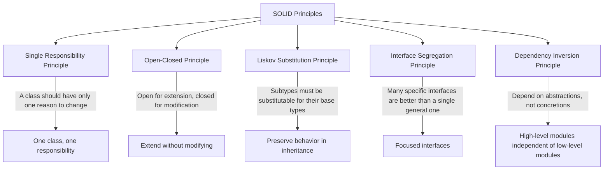

# SOLID Principles

## Introduction

Have you ever returned to code you wrote months ago, only to find it difficult to understand and modify? Or inherited someone else's code that seemed impenetrable? The SOLID principles were developed to address these common challenges in software development.

SOLID is an acronym that represents five fundamental principles of object-oriented programming and design. These principles, introduced by Robert C. Martin (also known as "Uncle Bob"), help developers create software that is:

- Easy to maintain and extend
- Robust and resilient to changes
- Reusable and modular
- Testable and debuggable

Whether you're just starting your programming journey or looking to level up your skills, understanding the SOLID principles will dramatically improve your ability to write high-quality, sustainable code.

Let's explore each principle in detail.

## The Five SOLID Principles



## 1. Single Responsibility Principle (SRP)

### What It Means

The Single Responsibility Principle states that:

> A class should have only one reason to change.

In simpler terms, a class should have only one job or responsibility. When a class has multiple responsibilities, changes to one aspect might affect the others, leading to unexpected bugs and increased maintenance difficulty.

### Example: Violating SRP

Let's look at a class that violates the Single Responsibility Principle:

```java
public class User {
    private String name;
    private String email;
    
    // User attributes and behavior
    public User(String name, String email) {
        this.name = name;
        this.email = email;
    }
    
    public String getName() { return name; }
    public String getEmail() { return email; }
    
    // Database operations
    public void saveToDatabase() {
        // Database connection logic
        System.out.println("Saving user to database: " + name);
        // SQL operations to save user
    }
    
    // Report generation
    public void generateReport() {
        System.out.println("Generating report for user: " + name);
        // Logic to create user activity report
    }
}
```

In this example, the `User` class has three distinct responsibilities:
1. Managing user data (name, email)
2. Handling database operations
3. Generating reports

This violates SRP because changes to any of these areas will require modifying the same class.

### Example: Following SRP

Let's refactor to follow the Single Responsibility Principle:

```java
// User class - responsible only for user data
public class User {
    private String name;
    private String email;
    
    public User(String name, String email) {
        this.name = name;
        this.email = email;
    }
    
    public String getName() { return name; }
    public String getEmail() { return email; }
}

// UserRepository class - responsible for database operations
public class UserRepository {
    public void save(User user) {
        // Database connection logic
        System.out.println("Saving user to database: " + user.getName());
        // SQL operations to save user
    }
    
    public User findByEmail(String email) {
        // Logic to find user in the database
        return new User("Found User", email);
    }
}

// UserReportGenerator class - responsible for report generation
public class UserReportGenerator {
    public void generateReport(User user) {
        System.out.println("Generating report for user: " + user.getName());
        // Logic to create user activity report
    }
}
```

Now each class has a single responsibility, making the code:
- More maintainable (changes in database operations won't affect user data logic)
- More testable (you can test each component in isolation)
- More reusable (you can reuse the UserRepository with other entities)

## 2. Open-Closed Principle (OCP)

### What It Means

The Open-Closed Principle states that:

> Software entities (classes, modules, functions) should be open for extension but closed for modification.

This means you should be able to extend a class's behavior without modifying its source code. This is typically achieved through abstraction and polymorphism.

### Example: Violating OCP

Consider a payment processing system that needs to handle different payment methods:

```java
public class PaymentProcessor {
    public void processPayment(String paymentType, double amount) {
        if (paymentType.equals("creditCard")) {
            // Process credit card payment
            System.out.println("Processing credit card payment of $" + amount);
        } 
        else if (paymentType.equals("paypal")) {
            // Process PayPal payment
            System.out.println("Processing PayPal payment of $" + amount);
        }
        // If we want to add a new payment method (e.g., Bitcoin)
        // we need to modify this class
    }
}
```

The problem here is that every time we need to add a new payment method, we must modify the `PaymentProcessor` class, risking introduction of bugs in existing functionality.

### Example: Following OCP

Let's refactor using interfaces and polymorphism:

```java
// Payment method interface
public interface PaymentMethod {
    void processPayment(double amount);
}

// Credit card payment implementation
public class CreditCardPayment implements PaymentMethod {
    @Override
    public void processPayment(double amount) {
        System.out.println("Processing credit card payment of $" + amount);
    }
}

// PayPal payment implementation
public class PayPalPayment implements PaymentMethod {
    @Override
    public void processPayment(double amount) {
        System.out.println("Processing PayPal payment of $" + amount);
    }
}

// Payment processor that uses the abstraction
public class PaymentProcessor {
    public void processPayment(PaymentMethod paymentMethod, double amount) {
        paymentMethod.processPayment(amount);
    }
}
```

Now if we need to add a new payment method, we simply create a new class implementing the `PaymentMethod` interface:

```java
// Bitcoin payment implementation
public class BitcoinPayment implements PaymentMethod {
    @Override
    public void processPayment(double amount) {
        System.out.println("Processing Bitcoin payment of $" + amount);
    }
}
```

Usage would look like:

```java
PaymentProcessor processor = new PaymentProcessor();
PaymentMethod creditCard = new CreditCardPayment();
PaymentMethod paypal = new PayPalPayment();
PaymentMethod bitcoin = new BitcoinPayment();

processor.processPayment(creditCard, 100.0);
processor.processPayment(paypal, 50.0);
processor.processPayment(bitcoin, 75.0);
```

The `PaymentProcessor` class is now closed for modification but open for extension through the creation of new payment method implementations.

## 3. Liskov Substitution Principle (LSP)

### What It Means

The Liskov Substitution Principle states that:

> Objects of a superclass should be replaceable with objects of its subclasses without affecting the correctness of the program.

In other words, if S is a subtype of T, then objects of type T can be replaced with objects of type S without altering any of the desirable properties of the program.

### Example: Violating LSP

Let's consider a classic example with rectangles and squares:

```java
public class Rectangle {
    protected int width;
    protected int height;
    
    public void setWidth(int width) {
        this.width = width;
    }
    
    public void setHeight(int height) {
        this.height = height;
    }
    
    public int getArea() {
        return width * height;
    }
}

public class Square extends Rectangle {
    // A square's width and height must be equal, so override setters
    @Override
    public void setWidth(int width) {
        this.width = width;
        this.height = width;  // Set both width and height
    }
    
    @Override
    public void setHeight(int height) {
        this.width = height;  // Set both width and height
        this.height = height;
    }
}
```

While mathematically a square is a rectangle, this inheritance hierarchy violates LSP:

```java
void testRectangle(Rectangle r) {
    r.setWidth(5);
    r.setHeight(4);
    // For a rectangle, we expect area to be 5*4 = 20
    assert r.getArea() == 20;  // This will fail for a Square!
}

// Usage
Rectangle rectangle = new Rectangle();
testRectangle(rectangle);  // Passes

Square square = new Square();
testRectangle(square);  // Fails! For a Square, after these operations, area = 16
```

This violates LSP because we can't substitute a `Square` for a `Rectangle` without breaking the expected behavior.

### Example: Following LSP

A better design would use a common interface without inheritance:

```java
public interface Shape {
    int getArea();
}

public class Rectangle implements Shape {
    private int width;
    private int height;
    
    public Rectangle(int width, int height) {
        this.width = width;
        this.height = height;
    }
    
    public void setWidth(int width) {
        this.width = width;
    }
    
    public void setHeight(int height) {
        this.height = height;
    }
    
    @Override
    public int getArea() {
        return width * height;
    }
}

public class Square implements Shape {
    private int side;
    
    public Square(int side) {
        this.side = side;
    }
    
    public void setSide(int side) {
        this.side = side;
    }
    
    @Override
    public int getArea() {
        return side * side;
    }
}
```

Now both `Rectangle` and `Square` implement the `Shape` interface, but neither is a subtype of the other, avoiding the LSP violation.

## 4. Interface Segregation Principle (ISP)

### What It Means

The Interface Segregation Principle states that:

> No client should be forced to depend on methods it does not use.

This principle suggests creating specific interfaces rather than one general-purpose interface. Clients should only need to know about the methods that are of interest to them.

### Example: Violating ISP

Consider a printer interface with multiple functionalities:

```java
public interface MultiFunctionPrinter {
    void print(Document d);
    void scan(Document d);
    void fax(Document d);
    void copy(Document d);
}

// All-in-one printer implements everything
public class AllInOnePrinter implements MultiFunctionPrinter {
    @Override
    public void print(Document d) {
        System.out.println("Printing document");
    }
    
    @Override
    public void scan(Document d) {
        System.out.println("Scanning document");
    }
    
    @Override
    public void fax(Document d) {
        System.out.println("Faxing document");
    }
    
    @Override
    public void copy(Document d) {
        System.out.println("Copying document");
    }
}

// Basic printer forced to implement unneeded methods
public class BasicPrinter implements MultiFunctionPrinter {
    @Override
    public void print(Document d) {
        System.out.println("Printing document");
    }
    
    @Override
    public void scan(Document d) {
        throw new UnsupportedOperationException("Basic printer cannot scan");
    }
    
    @Override
    public void fax(Document d) {
        throw new UnsupportedOperationException("Basic printer cannot fax");
    }
    
    @Override
    public void copy(Document d) {
        throw new UnsupportedOperationException("Basic printer cannot copy");
    }
}
```

The `BasicPrinter` is forced to implement methods it doesn't support, which violates ISP.

### Example: Following ISP

Let's refactor with specific interfaces:

```java
public interface Printer {
    void print(Document d);
}

public interface Scanner {
    void scan(Document d);
}

public interface Fax {
    void fax(Document d);
}

public interface Copier {
    void copy(Document d);
}

// All-in-one printer implements all interfaces
public class AllInOnePrinter implements Printer, Scanner, Fax, Copier {
    @Override
    public void print(Document d) {
        System.out.println("Printing document");
    }
    
    @Override
    public void scan(Document d) {
        System.out.println("Scanning document");
    }
    
    @Override
    public void fax(Document d) {
        System.out.println("Faxing document");
    }
    
    @Override
    public void copy(Document d) {
        System.out.println("Copying document");
    }
}

// Basic printer only implements what it can do
public class BasicPrinter implements Printer {
    @Override
    public void print(Document d) {
        System.out.println("Printing document");
    }
}
```

Now clients can depend only on the interfaces they need, and each printer type implements only the interfaces it can support.

## 5. Dependency Inversion Principle (DIP)

### What It Means

The Dependency Inversion Principle consists of two parts:

1. High-level modules should not depend on low-level modules. Both should depend on abstractions.
2. Abstractions should not depend on details. Details should depend on abstractions.

This principle helps decouple high-level components from low-level ones, making the system more modular and easier to change.

### Example: Violating DIP

Consider a notification system that directly depends on specific notification methods:

```java
public class EmailSender {
    public void sendEmail(String to, String subject, String body) {
        System.out.println("Sending email to " + to + " with subject: " + subject);
    }
}

public class SMSSender {
    public void sendSMS(String phoneNumber, String message) {
        System.out.println("Sending SMS to " + phoneNumber + ": " + message);
    }
}

public class NotificationService {
    private EmailSender emailSender;
    private SMSSender smsSender;
    
    public NotificationService() {
        this.emailSender = new EmailSender();
        this.smsSender = new SMSSender();
    }
    
    public void sendEmailNotification(String to, String subject, String body) {
        emailSender.sendEmail(to, subject, body);
    }
    
    public void sendSMSNotification(String phoneNumber, String message) {
        smsSender.sendSMS(phoneNumber, message);
    }
}
```

The `NotificationService` (high-level module) directly depends on the concrete implementations of `EmailSender` and `SMSSender` (low-level modules).

### Example: Following DIP

Let's refactor using abstractions:

```java
// Notification abstraction
public interface NotificationChannel {
    void send(String recipient, String subject, String content);
}

// Email implementation
public class EmailChannel implements NotificationChannel {
    @Override
    public void send(String recipient, String subject, String content) {
        System.out.println("Sending email to " + recipient + " with subject: " + subject);
    }
}

// SMS implementation
public class SMSChannel implements NotificationChannel {
    @Override
    public void send(String recipient, String subject, String content) {
        // For SMS, subject is ignored
        System.out.println("Sending SMS to " + recipient + ": " + content);
    }
}

// High-level notification service
public class NotificationService {
    private List<NotificationChannel> channels;
    
    // Dependency injection through constructor
    public NotificationService(List<NotificationChannel> channels) {
        this.channels = channels;
    }
    
    public void notify(String recipient, String subject, String content) {
        for (NotificationChannel channel : channels) {
            channel.send(recipient, subject, content);
        }
    }
}
```

Usage would look like:

```java
// Create notification channels
List<NotificationChannel> channels = new ArrayList<>();
channels.add(new EmailChannel());
channels.add(new SMSChannel());

// Create notification service with injected dependencies
NotificationService notificationService = new NotificationService(channels);

// Send notification through all channels
notificationService.notify("user@example.com", "Important Notice", "Your account has been updated");
```

Now both high-level modules (`NotificationService`) and low-level modules (`EmailChannel`, `SMSChannel`) depend on abstractions (`NotificationChannel`), not on each other directly. This makes it easy to add new notification channels without modifying the service.

## Real-World Applications of SOLID Principles

Understanding the theory behind SOLID principles is important, but seeing how they apply in real-world scenarios can help solidify your understanding.

### E-commerce Application Example

Let's consider how SOLID principles might be applied in a simple e-commerce system:

1. **Single Responsibility Principle**:
   - `Product` class: Manages product data
   - `InventoryService`: Handles inventory checks and updates
   - `PricingService`: Manages pricing rules and calculations
   - `ProductRepository`: Handles database operations for products

2. **Open-Closed Principle**:
   - `DiscountStrategy` interface with implementations like `PercentageDiscount`, `FixedAmountDiscount`, and `BuyOneGetOneFreeDiscount`
   - New discount types can be added without changing the checkout code

3. **Liskov Substitution Principle**:
   - `Payment` abstract class with various implementations like `CreditCardPayment`, `PayPalPayment`, etc.
   - All payment methods can be used interchangeably within the payment processing system

4. **Interface Segregation Principle**:
   - Separate interfaces for different product functionalities:
     - `Downloadable` for digital products
     - `Shippable` for physical products
     - `Subscribable` for subscription products

5. **Dependency Inversion Principle**:
   - `OrderService` depends on `PaymentProcessor` and `ShippingService` interfaces
   - Concrete implementations can be swapped without affecting the OrderService

### Example Implementation of Cart and Order Processing

Here's a simplified example showing how these principles might work together in an order processing system:

```java
// Single Responsibility Principle: Each class has one responsibility
public class Product {
    private String id;
    private String name;
    private double price;
    
    // Constructor and getters/setters
}

public class CartItem {
    private Product product;
    private int quantity;
    
    // Constructor and getters/setters
}

public class ShoppingCart {
    private List<CartItem> items = new ArrayList<>();
    
    public void addItem(Product product, int quantity) {
        items.add(new CartItem(product, quantity));
    }
    
    public List<CartItem> getItems() {
        return new ArrayList<>(items);
    }
    
    public double calculateTotal() {
        return items.stream()
            .mapToDouble(item -> item.getProduct().getPrice() * item.getQuantity())
            .sum();
    }
}

// Open-Closed Principle: Payment processing is open for extension
public interface PaymentProcessor {
    boolean processPayment(double amount);
}

public class CreditCardProcessor implements PaymentProcessor {
    @Override
    public boolean processPayment(double amount) {
        // Credit card processing logic
        System.out.println("Processing credit card payment of $" + amount);
        return true;
    }
}

public class PayPalProcessor implements PaymentProcessor {
    @Override
    public boolean processPayment(double amount) {
        // PayPal processing logic
        System.out.println("Processing PayPal payment of $" + amount);
        return true;
    }
}

// Dependency Inversion Principle: OrderService depends on abstractions
public class OrderService {
    private PaymentProcessor paymentProcessor;
    
    // Constructor injection
    public OrderService(PaymentProcessor paymentProcessor) {
        this.paymentProcessor = paymentProcessor;
    }
    
    public boolean placeOrder(ShoppingCart cart) {
        double total = cart.calculateTotal();
        // Process payment
        boolean paymentSuccess = paymentProcessor.processPayment(total);
        
        if (paymentSuccess) {
            // Create and save order
            System.out.println("Order placed successfully!");
            return true;
        } else {
            System.out.println("Payment failed, order not placed.");
            return false;
        }
    }
}
```

Usage would look like:

```java
// Create products
Product laptop = new Product("P1", "Laptop", 1200.0);
Product headphones = new Product("P2", "Headphones", 100.0);

// Create shopping cart
ShoppingCart cart = new ShoppingCart();
cart.addItem(laptop, 1);
cart.addItem(headphones, 2);

// Total: $1400.0
System.out.println("Cart total: $" + cart.calculateTotal());

// Choose payment processor (could be selected by user)
PaymentProcessor paymentProcessor = new CreditCardProcessor();

// Create order service with selected payment processor
OrderService orderService = new OrderService(paymentProcessor);

// Place order
orderService.placeOrder(cart);
```

This system demonstrates how SOLID principles work together to create a flexible, maintainable e-commerce solution.

## Benefits of Following SOLID Principles

Applying SOLID principles to your code provides numerous advantages:

1. **Improved Maintainability**: Code becomes easier to understand, maintain, and modify.
2. **Enhanced Scalability**: New features can be added with minimal changes to existing code.
3. **Greater Reusability**: Components are more modular and can be reused across different parts of the application.
4. **Better Testability**: Code is more easily unit-tested because components are decoupled.
5. **Reduced Technical Debt**: Following SOLID principles helps avoid accumulated complexity over time.
6. **Increased Agility**: Teams can respond more quickly to changing requirements or business needs.
7. **Improved Collaboration**: Code is more readable and follows consistent patterns, making it easier for teams to work together.

## Common Misconceptions and Challenges

While learning and applying SOLID principles, be aware of these common pitfalls:

1. **Over-engineering**: Sometimes developers apply principles too rigidly, leading to unnecessary complexity. Remember that SOLID principles are guidelines, not strict rules.

2. **Premature Abstraction**: Creating abstractions before they're needed can lead to unnecessary complexity. Start simple and refactor toward SOLID as complexity grows.

3. **All or Nothing Approach**: You don't need to apply all principles at once. Even partial application can improve your code significantly.

4. **Considering Only the Code**: SOLID principles should be applied in the context of your specific problem domain and business requirements.

5. **Forgetting the Trade-offs**: Every design decision involves trade-offs. SOLID principles generally favor flexibility and maintainability over performance and simplicity.

## Summary

SOLID principles provide a robust foundation for writing maintainable, flexible, and scalable object-oriented code:

- **S**ingle Responsibility Principle: A class should have only one reason to change.
- **O**pen-Closed Principle: Software entities should be open for extension but closed for modification.
- **L**iskov Substitution Principle: Subtypes must be substitutable for their base types.
- **I**nterface Segregation Principle: Many client-specific interfaces are better than one general-purpose interface.
- **D**ependency Inversion Principle: Depend on abstractions, not on concretions.

These principles are not just academic concepts—they represent hard-earned wisdom from decades of software development experience. By understanding and applying SOLID principles, you'll write better code that's easier to maintain, extend, and test.

## Exercises

To help reinforce your understanding of SOLID principles, try these exercises:

1. **Code Review**: Take an existing project or class and analyze it for SOLID violations. How could you refactor it to better follow these principles?

2. **Refactoring Challenge**: Find a "code smell" in your codebase (like a massive class or a method with too many responsibilities) and refactor it to follow SOLID principles.

3. **Design Exercise**: Design a simple library management system using SOLID principles. Consider entities like Books, Members, Loans, and operations like checking out and returning books.

## Additional Resources

To deepen your understanding of SOLID principles and object-oriented design:

- "Clean Code" by Robert C. Martin
- "Design Patterns: Elements of Reusable Object-Oriented Software" by Gamma, Helm, Johnson, and Vlissides
- "Head First Design Patterns" by Freeman and Robson
- "Refactoring: Improving the Design of Existing Code" by Martin Fowler

Remember that mastering SOLID principles is a journey. Even experienced developers continuously learn and improve their application of these principles over time.