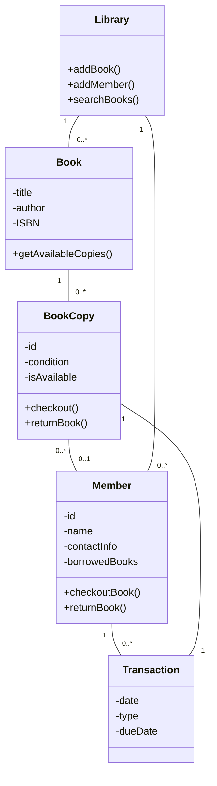
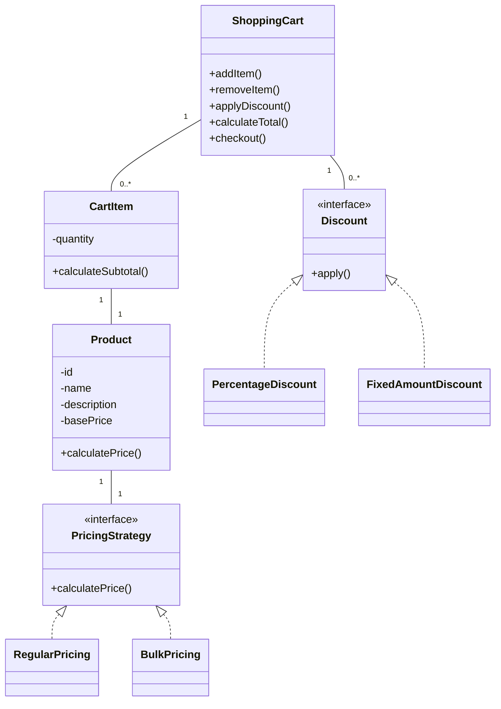
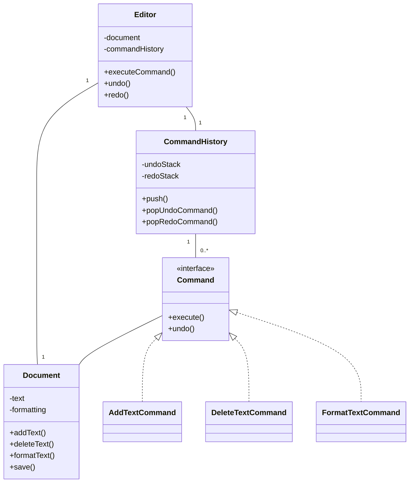

# Design Case Studies

## Introduction

Design case studies are an invaluable way to strengthen your understanding of object-oriented design principles. While learning theory is important, seeing how these concepts apply to real-world problems provides deeper insights and practical experience. In this tutorial, we'll walk through several case studies that demonstrate effective object-oriented design in action.

Each case study will follow a structured approach:
1. Problem definition
2. Analysis of requirements
3. Design exploration and decisions
4. Implementation walkthrough
5. Evaluation and lessons learned

By the end of this tutorial, you'll have a better understanding of how to approach complex design problems using object-oriented principles.

## Case Study 1: Library Management System

### Problem Definition

Let's design a simplified library management system that allows:
- Tracking books and their availability
- Managing member accounts
- Handling book checkouts and returns
- Maintaining a catalog system

### Requirements Analysis

Before diving into code, we need to identify the key objects and their relationships:



### Design Decisions

1. **Separation of Book and BookCopy**: A book represents the abstract concept (title, author), while a BookCopy represents a physical instance of that book.
2. **Transaction class**: To track checkout history and due dates.
3. **Library as a Facade**: Provides a simplified interface to the complex system.

### Implementation

Let's implement the core classes:

```java
// Book.java
public class Book {
    private String title;
    private String author;
    private String isbn;
    private List<BookCopy> copies = new ArrayList<>();
    
    public Book(String title, String author, String isbn) {
        this.title = title;
        this.author = author;
        this.isbn = isbn;
    }
    
    public void addCopy(BookCopy copy) {
        copies.add(copy);
    }
    
    public List<BookCopy> getAvailableCopies() {
        return copies.stream()
            .filter(BookCopy::isAvailable)
            .collect(Collectors.toList());
    }
    
    // Getters and setters
    public String getTitle() { return title; }
    public String getAuthor() { return author; }
    public String getIsbn() { return isbn; }
}

// BookCopy.java
public class BookCopy {
    private String id;
    private Book book;
    private boolean isAvailable = true;
    private String condition;
    
    public BookCopy(String id, Book book, String condition) {
        this.id = id;
        this.book = book;
        this.condition = condition;
        book.addCopy(this);
    }
    
    public boolean checkout() {
        if (isAvailable) {
            isAvailable = false;
            return true;
        }
        return false;
    }
    
    public void returnBook() {
        isAvailable = true;
    }
    
    // Getters
    public String getId() { return id; }
    public Book getBook() { return book; }
    public boolean isAvailable() { return isAvailable; }
    public String getCondition() { return condition; }
}

// Member.java
public class Member {
    private String id;
    private String name;
    private String contactInfo;
    private List<BookCopy> borrowedBooks = new ArrayList<>();
    private List<Transaction> transactions = new ArrayList<>();
    
    public Member(String id, String name, String contactInfo) {
        this.id = id;
        this.name = name;
        this.contactInfo = contactInfo;
    }
    
    public boolean checkoutBook(BookCopy copy) {
        if (copy.checkout()) {
            borrowedBooks.add(copy);
            
            // Create a transaction
            Transaction transaction = new Transaction(
                LocalDate.now(),
                "CHECKOUT",
                LocalDate.now().plusDays(14),
                copy
            );
            transactions.add(transaction);
            
            return true;
        }
        return false;
    }
    
    public boolean returnBook(BookCopy copy) {
        if (borrowedBooks.contains(copy)) {
            copy.returnBook();
            borrowedBooks.remove(copy);
            
            // Create a transaction
            Transaction transaction = new Transaction(
                LocalDate.now(),
                "RETURN",
                null,
                copy
            );
            transactions.add(transaction);
            
            return true;
        }
        return false;
    }
    
    // Getters
    public String getId() { return id; }
    public String getName() { return name; }
    public List<BookCopy> getBorrowedBooks() { return new ArrayList<>(borrowedBooks); }
}

// Transaction.java
public class Transaction {
    private LocalDate date;
    private String type; // CHECKOUT or RETURN
    private LocalDate dueDate;
    private BookCopy bookCopy;
    
    public Transaction(LocalDate date, String type, LocalDate dueDate, BookCopy bookCopy) {
        this.date = date;
        this.type = type;
        this.dueDate = dueDate;
        this.bookCopy = bookCopy;
    }
    
    // Getters
    public LocalDate getDate() { return date; }
    public String getType() { return type; }
    public LocalDate getDueDate() { return dueDate; }
    public BookCopy getBookCopy() { return bookCopy; }
}

// Library.java - Facade
public class Library {
    private List<Book> books = new ArrayList<>();
    private List<Member> members = new ArrayList<>();
    
    public void addBook(Book book) {
        books.add(book);
    }
    
    public void addMember(Member member) {
        members.add(member);
    }
    
    public List<Book> searchByTitle(String titleQuery) {
        return books.stream()
            .filter(book -> book.getTitle().toLowerCase().contains(titleQuery.toLowerCase()))
            .collect(Collectors.toList());
    }
    
    public List<Book> searchByAuthor(String authorQuery) {
        return books.stream()
            .filter(book -> book.getAuthor().toLowerCase().contains(authorQuery.toLowerCase()))
            .collect(Collectors.toList());
    }
    
    public Member findMemberById(String id) {
        return members.stream()
            .filter(member -> member.getId().equals(id))
            .findFirst()
            .orElse(null);
    }
    
    public Book findBookByIsbn(String isbn) {
        return books.stream()
            .filter(book -> book.getIsbn().equals(isbn))
            .findFirst()
            .orElse(null);
    }
}
```

### Example Usage

Here's how our library system could be used:

```java
// Creating a library
Library library = new Library();

// Adding books to the library
Book book1 = new Book("Clean Code", "Robert C. Martin", "9780132350884");
Book book2 = new Book("Design Patterns", "Erich Gamma et al.", "9780201633610");
library.addBook(book1);
library.addBook(book2);

// Adding book copies
BookCopy cleanCode1 = new BookCopy("CC001", book1, "Good");
BookCopy cleanCode2 = new BookCopy("CC002", book1, "Excellent");
BookCopy designPatterns1 = new BookCopy("DP001", book2, "Fair");

// Adding members
Member alice = new Member("M001", "Alice Smith", "alice@example.com");
Member bob = new Member("M002", "Bob Johnson", "bob@example.com");
library.addMember(alice);
library.addMember(bob);

// Checking out books
alice.checkoutBook(cleanCode1);
bob.checkoutBook(designPatterns1);

// Searching for books
List<Book> cleanCodeBooks = library.searchByTitle("Clean Code");
System.out.println("Found " + cleanCodeBooks.size() + " book(s) with title 'Clean Code'");
System.out.println("Available copies: " + cleanCodeBooks.get(0).getAvailableCopies().size());

// Output:
// Found 1 book(s) with title 'Clean Code'
// Available copies: 1
```

### Evaluation

This design demonstrates several OO principles:

1. **Encapsulation**: Each class manages its own data and provides methods to interact with it.
2. **Single Responsibility**: Each class has a clear, focused purpose.
3. **Open/Closed Principle**: We can add new book types or member types without modifying existing code.
4. **Dependency Management**: Objects interact through well-defined interfaces.

## Case Study 2: Online Shopping Cart

### Problem Definition

Design a shopping cart system that allows:
- Adding and removing products
- Calculating totals with different pricing rules
- Applying various discounts
- Processing checkout

### Requirements Analysis

Let's identify the key objects:



### Design Decisions

1. **Strategy Pattern**: Using different pricing strategies (regular, bulk)
2. **Composite Pattern**: Cart contains items, each with its own product
3. **Open for Extension**: Different discount types implemented through an interface

### Implementation

```java
// Product.java
public class Product {
    private String id;
    private String name;
    private String description;
    private double basePrice;
    private PricingStrategy pricingStrategy;
    
    public Product(String id, String name, String description, double basePrice) {
        this.id = id;
        this.name = name;
        this.description = description;
        this.basePrice = basePrice;
        this.pricingStrategy = new RegularPricing(); // Default
    }
    
    public void setPricingStrategy(PricingStrategy strategy) {
        this.pricingStrategy = strategy;
    }
    
    public double calculatePrice(int quantity) {
        return pricingStrategy.calculatePrice(this, quantity);
    }
    
    // Getters
    public String getId() { return id; }
    public String getName() { return name; }
    public String getDescription() { return description; }
    public double getBasePrice() { return basePrice; }
}

// Pricing Strategies
public interface PricingStrategy {
    double calculatePrice(Product product, int quantity);
}

public class RegularPricing implements PricingStrategy {
    @Override
    public double calculatePrice(Product product, int quantity) {
        return product.getBasePrice() * quantity;
    }
}

public class BulkPricing implements PricingStrategy {
    private int minimumQuantity;
    private double discountPercent;
    
    public BulkPricing(int minimumQuantity, double discountPercent) {
        this.minimumQuantity = minimumQuantity;
        this.discountPercent = discountPercent;
    }
    
    @Override
    public double calculatePrice(Product product, int quantity) {
        double baseTotal = product.getBasePrice() * quantity;
        if (quantity >= minimumQuantity) {
            return baseTotal * (1 - discountPercent);
        }
        return baseTotal;
    }
}

// CartItem.java
public class CartItem {
    private Product product;
    private int quantity;
    
    public CartItem(Product product, int quantity) {
        this.product = product;
        this.quantity = quantity;
    }
    
    public double calculateSubtotal() {
        return product.calculatePrice(quantity);
    }
    
    public void increaseQuantity(int amount) {
        this.quantity += amount;
    }
    
    // Getters and setters
    public Product getProduct() { return product; }
    public int getQuantity() { return quantity; }
    public void setQuantity(int quantity) { this.quantity = quantity; }
}

// Discount interface and implementations
public interface Discount {
    double apply(double amount);
}

public class PercentageDiscount implements Discount {
    private double percentage;
    
    public PercentageDiscount(double percentage) {
        this.percentage = percentage;
    }
    
    @Override
    public double apply(double amount) {
        return amount * (1 - percentage);
    }
}

public class FixedAmountDiscount implements Discount {
    private double amount;
    
    public FixedAmountDiscount(double amount) {
        this.amount = amount;
    }
    
    @Override
    public double apply(double amount) {
        return Math.max(0, amount - this.amount);
    }
}

// ShoppingCart.java
public class ShoppingCart {
    private List<CartItem> items = new ArrayList<>();
    private List<Discount> discounts = new ArrayList<>();
    
    public void addItem(Product product, int quantity) {
        // Check if the product is already in the cart
        for (CartItem item : items) {
            if (item.getProduct().getId().equals(product.getId())) {
                item.increaseQuantity(quantity);
                return;
            }
        }
        
        // If not found, add a new cart item
        items.add(new CartItem(product, quantity));
    }
    
    public void removeItem(Product product) {
        items.removeIf(item -> item.getProduct().getId().equals(product.getId()));
    }
    
    public void updateQuantity(Product product, int newQuantity) {
        for (CartItem item : items) {
            if (item.getProduct().getId().equals(product.getId())) {
                if (newQuantity <= 0) {
                    removeItem(product);
                } else {
                    item.setQuantity(newQuantity);
                }
                return;
            }
        }
    }
    
    public void applyDiscount(Discount discount) {
        discounts.add(discount);
    }
    
    public double calculateSubtotal() {
        return items.stream()
            .mapToDouble(CartItem::calculateSubtotal)
            .sum();
    }
    
    public double calculateTotal() {
        double subtotal = calculateSubtotal();
        double total = subtotal;
        
        // Apply all discounts
        for (Discount discount : discounts) {
            total = discount.apply(total);
        }
        
        return total;
    }
    
    public Map<String, Object> checkout() {
        Map<String, Object> receipt = new HashMap<>();
        List<Map<String, Object>> itemDetails = new ArrayList<>();
        
        for (CartItem item : items) {
            Map<String, Object> itemDetail = new HashMap<>();
            Product product = item.getProduct();
            
            itemDetail.put("productId", product.getId());
            itemDetail.put("productName", product.getName());
            itemDetail.put("quantity", item.getQuantity());
            itemDetail.put("unitPrice", product.getBasePrice());
            itemDetail.put("subtotal", item.calculateSubtotal());
            
            itemDetails.add(itemDetail);
        }
        
        receipt.put("items", itemDetails);
        receipt.put("subtotal", calculateSubtotal());
        receipt.put("total", calculateTotal());
        receipt.put("discounts", discounts.size());
        receipt.put("timestamp", LocalDateTime.now().toString());
        
        // Clear the cart after checkout
        items.clear();
        discounts.clear();
        
        return receipt;
    }
}
```

### Example Usage

```java
// Create products
Product laptop = new Product("P001", "Laptop", "High-performance laptop", 999.99);
Product mouse = new Product("P002", "Mouse", "Wireless mouse", 29.99);
Product keyboard = new Product("P003", "Keyboard", "Mechanical keyboard", 89.99);

// Set bulk pricing strategy for keyboard
keyboard.setPricingStrategy(new BulkPricing(2, 0.15)); // 15% off when buying 2 or more

// Create shopping cart
ShoppingCart cart = new ShoppingCart();

// Add items to cart
cart.addItem(laptop, 1);
cart.addItem(mouse, 1);
cart.addItem(keyboard, 2);

// Display initial total
System.out.println("Subtotal: $" + cart.calculateSubtotal());
// Output: Subtotal: $1132.97 (999.99 + 29.99 + (89.99 * 2 * 0.85))

// Apply discount
cart.applyDiscount(new PercentageDiscount(0.10)); // 10% off entire order

// Display final total
System.out.println("Total after discount: $" + cart.calculateTotal());
// Output: Total after discount: $1019.67

// Checkout
Map<String, Object> receipt = cart.checkout();
System.out.println("Checkout complete. Order total: $" + receipt.get("total"));
```

### Evaluation

This design showcases:

1. **Strategy Pattern**: Different pricing strategies can be applied to products
2. **Open/Closed Principle**: New discount types can be added without modifying existing code
3. **Single Responsibility**: Each class has a specific purpose
4. **Dependency Inversion**: High-level modules depend on abstractions, not concrete implementations

## Case Study 3: Text Editor with Undo Functionality

### Problem Definition

Design a simple text editor that allows:
- Adding and removing text
- Changing formatting (bold, italic)
- Undo/redo operations
- Saving documents

### Design Approach

For this system, we'll implement the Command pattern to enable undo functionality.



### Implementation

```java
// Document.java
public class Document {
    private StringBuilder text = new StringBuilder();
    private Map<Integer, Map<String, Boolean>> formatting = new HashMap<>();
    
    public void addText(int position, String textToAdd) {
        text.insert(position, textToAdd);
        
        // Shift formatting information
        Map<Integer, Map<String, Boolean>> newFormatting = new HashMap<>();
        for (Map.Entry<Integer, Map<String, Boolean>> entry : formatting.entrySet()) {
            int pos = entry.getKey();
            if (pos >= position) {
                newFormatting.put(pos + textToAdd.length(), entry.getValue());
            } else {
                newFormatting.put(pos, entry.getValue());
            }
        }
        formatting = newFormatting;
    }
    
    public String deleteText(int position, int length) {
        String deletedText = text.substring(position, position + length);
        text.delete(position, position + length);
        
        // Update formatting
        Map<Integer, Map<String, Boolean>> newFormatting = new HashMap<>();
        for (Map.Entry<Integer, Map<String, Boolean>> entry : formatting.entrySet()) {
            int pos = entry.getKey();
            if (pos >= position + length) {
                newFormatting.put(pos - length, entry.getValue());
            } else if (pos < position) {
                newFormatting.put(pos, entry.getValue());
            }
            // Formatting info within deleted text is discarded
        }
        formatting = newFormatting;
        
        return deletedText;
    }
    
    public void formatText(int position, int length, String formatType, boolean value) {
        for (int i = position; i < position + length; i++) {
            if (!formatting.containsKey(i)) {
                formatting.put(i, new HashMap<>());
            }
            formatting.get(i).put(formatType, value);
        }
    }
    
    public String getText() {
        return text.toString();
    }
    
    public Map<String, Boolean> getFormattingAt(int position) {
        return formatting.getOrDefault(position, new HashMap<>());
    }
    
    public void save(String filename) {
        // In a real implementation, this would save to a file
        System.out.println("Saving document to " + filename);
        System.out.println("Content: " + text.toString());
        System.out.println("Formatting: " + formatting.toString());
    }
}

// Command interface and implementations
public interface Command {
    void execute();
    void undo();
}

public class AddTextCommand implements Command {
    private Document document;
    private int position;
    private String text;
    
    public AddTextCommand(Document document, int position, String text) {
        this.document = document;
        this.position = position;
        this.text = text;
    }
    
    @Override
    public void execute() {
        document.addText(position, text);
    }
    
    @Override
    public void undo() {
        document.deleteText(position, text.length());
    }
}

public class DeleteTextCommand implements Command {
    private Document document;
    private int position;
    private int length;
    private String deletedText;
    
    public DeleteTextCommand(Document document, int position, int length) {
        this.document = document;
        this.position = position;
        this.length = length;
    }
    
    @Override
    public void execute() {
        deletedText = document.deleteText(position, length);
    }
    
    @Override
    public void undo() {
        document.addText(position, deletedText);
    }
}

public class FormatTextCommand implements Command {
    private Document document;
    private int position;
    private int length;
    private String formatType;
    private boolean value;
    private Map<Integer, Boolean> previousValues = new HashMap<>();
    
    public FormatTextCommand(Document document, int position, int length, 
                            String formatType, boolean value) {
        this.document = document;
        this.position = position;
        this.length = length;
        this.formatType = formatType;
        this.value = value;
    }
    
    @Override
    public void execute() {
        // Save previous state for undo
        for (int i = position; i < position + length; i++) {
            Map<String, Boolean> formatting = document.getFormattingAt(i);
            previousValues.put(i, formatting.getOrDefault(formatType, false));
        }
        
        // Apply new formatting
        document.formatText(position, length, formatType, value);
    }
    
    @Override
    public void undo() {
        for (Map.Entry<Integer, Boolean> entry : previousValues.entrySet()) {
            document.formatText(entry.getKey(), 1, formatType, entry.getValue());
        }
    }
}

// CommandHistory.java
public class CommandHistory {
    private Deque<Command> undoStack = new ArrayDeque<>();
    private Deque<Command> redoStack = new ArrayDeque<>();
    
    public void push(Command command) {
        undoStack.push(command);
        redoStack.clear(); // Clear redo stack when a new command is executed
    }
    
    public Command popUndoCommand() {
        if (undoStack.isEmpty()) {
            return null;
        }
        
        Command command = undoStack.pop();
        redoStack.push(command);
        return command;
    }
    
    public Command popRedoCommand() {
        if (redoStack.isEmpty()) {
            return null;
        }
        
        Command command = redoStack.pop();
        undoStack.push(command);
        return command;
    }
    
    public boolean canUndo() {
        return !undoStack.isEmpty();
    }
    
    public boolean canRedo() {
        return !redoStack.isEmpty();
    }
}

// Editor.java
public class Editor {
    private Document document;
    private CommandHistory history;
    
    public Editor() {
        document = new Document();
        history = new CommandHistory();
    }
    
    public void executeCommand(Command command) {
        command.execute();
        history.push(command);
    }
    
    public boolean undo() {
        if (!history.canUndo()) {
            return false;
        }
        
        Command command = history.popUndoCommand();
        command.undo();
        return true;
    }
    
    public boolean redo() {
        if (!history.canRedo()) {
            return false;
        }
        
        Command command = history.popRedoCommand();
        command.execute();
        return true;
    }
    
    public Document getDocument() {
        return document;
    }
    
    public void saveDocument(String filename) {
        document.save(filename);
    }
}
```

### Example Usage

```java
// Create an editor
Editor editor = new Editor();

// Add text
editor.executeCommand(new AddTextCommand(editor.getDocument(), 0, "Hello, "));
editor.executeCommand(new AddTextCommand(editor.getDocument(), 7, "world!"));

// Print current text
System.out.println("Text: " + editor.getDocument().getText());
// Output: Text: Hello, world!

// Make text bold
editor.executeCommand(new FormatTextCommand(editor.getDocument(), 0, 7, "bold", true));

// Delete some text
editor.executeCommand(new DeleteTextCommand(editor.getDocument(), 5, 3));

// Print current text
System.out.println("Text after delete: " + editor.getDocument().getText());
// Output: Text after delete: Helloworld!

// Undo last operation
editor.undo();
System.out.println("Text after undo: " + editor.getDocument().getText());
// Output: Text after undo: Hello, world!

// Redo operation
editor.redo();
System.out.println("Text after redo: " + editor.getDocument().getText());
// Output: Text after redo: Helloworld!

// Save document
editor.saveDocument("myDocument.txt");
```

### Evaluation

This design demonstrates:

1. **Command Pattern**: Encapsulates operations as objects, enabling undo/redo
2. **Single Responsibility**: Each command handles one specific change to the document
3. **Open for Extension**: New commands can be added without modifying existing code
4. **History Management**: Command history maintains the state for undo/redo operations

## Summary and Best Practices

Through these case studies, we've seen several object-oriented design principles in action:

1. **Identify the right abstractions**
   - Find the natural objects in the problem domain
   - Abstract common behaviors into interfaces

2. **Apply appropriate design patterns**
   - Factory, Strategy, Command, and Observer patterns solve common problems
   - Don't force patterns when simpler solutions exist

3. **Follow SOLID principles**
   - **S**ingle Responsibility: Each class should have one purpose
   - **O**pen/Closed: Open for extension, closed for modification
   - **L**iskov Substitution: Subtypes should be substitutable for their base types
   - **I**nterface Segregation: Many specific interfaces are better than one general one
   - **D**ependency Inversion: Depend on abstractions, not concretions

4. **Design for change**
   - Encapsulate what varies
   - Program to interfaces, not implementations
   - Favor composition over inheritance

## Exercises

1. **Extend the Library System**
   - Add a fine calculation system for overdue books
   - Implement a reservation system for books currently checked out
   - Create a notification system for due dates

2. **Enhance the Shopping Cart**
   - Add a coupon system that works with existing discounts
   - Implement a tax calculator based on different regions
   - Create a recommendation system based on cart contents

3. **Improve the Text Editor**
   - Add paragraph styling (alignment, spacing)
   - Implement a find and replace feature
   - Create a document export system with multiple formats

## Additional Resources

- **Books**
  - "Design Patterns: Elements of Reusable Object-Oriented Software" by Gamma et al.
  - "Clean Code" by Robert C. Martin
  - "Head First Design Patterns" by Freeman & Robson

- **Online Learning**
  - Object-Oriented Design courses on Coursera and edX
  - Design pattern tutorials on Refactoring Guru
  - Practice exercises on LeetCode and HackerRank

- **Tools**
  - UML modeling tools like PlantUML
  - IDE plugins for design pattern templates
  - Code analyzers to check for design principles adherence

Remember that good design evolves over time. Start simple, refine based on changing requirements, and always strive for readable, maintainable code.