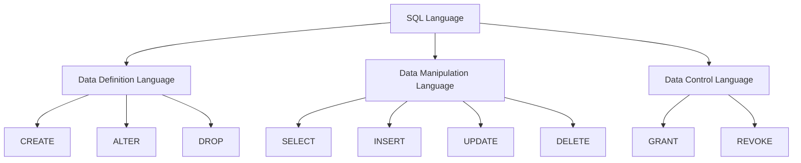
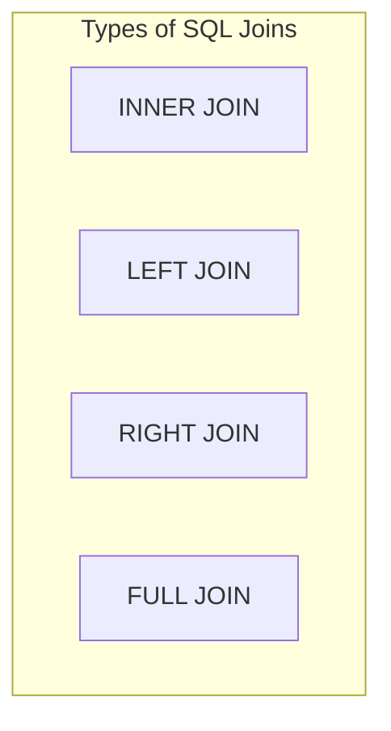

# SQL Fundamentals

## Introduction

Structured Query Language (SQL) is the standard language for managing and manipulating relational databases. It allows you to create, read, update, and delete data in database systems like MySQL, PostgreSQL, SQLite, Microsoft SQL Server, and Oracle.

SQL is one of the most valuable skills in the tech industry today, as organizations of all sizes rely on databases to store and manage their information. Whether you're analyzing data, building web applications, or managing business systems, understanding SQL fundamentals is essential.

## What is SQL?

SQL (often pronounced "sequel") was developed in the 1970s at IBM and has since become the industry standard for relational database management. It's a declarative language, meaning you specify **what** you want to retrieve or modify, not **how** to do it.

SQL has several components:

- **Data Definition Language (DDL)**: Commands for creating and modifying database structures
- **Data Manipulation Language (DML)**: Commands for inserting, updating, and querying data
- **Data Control Language (DCL)**: Commands for managing access permissions

Let's visualize the relationship between these SQL components:



## Getting Started with SQL

### Database Structure Basics

Before diving into SQL commands, let's understand the basic structure of a relational database:

1. **Database**: The overall container for all your data
2. **Tables**: Structures that organize data into rows and columns
3. **Columns**: Individual fields with a specific data type
4. **Rows**: Individual records or entries
5. **Primary Keys**: Unique identifiers for each row
6. **Foreign Keys**: References to primary keys in other tables

### Creating a Database

Let's start by creating a new database:

```sql
CREATE DATABASE library;
```

This command creates a new empty database named "library".

### Creating Tables

Now, let's create a table to store information about books:

```sql
CREATE TABLE books (
    book_id INT PRIMARY KEY,
    title VARCHAR(100) NOT NULL,
    author VARCHAR(50),
    publication_year INT,
    isbn VARCHAR(13) UNIQUE,
    available BOOLEAN DEFAULT TRUE
);
```

Here's what each part means:
- `CREATE TABLE books`: Creates a new table named "books"
- `book_id INT PRIMARY KEY`: Creates a column for a unique identifier
- `title VARCHAR(100) NOT NULL`: Creates a column for book titles that can't be empty
- `author VARCHAR(50)`: Creates a column for author names
- `publication_year INT`: Creates a column for the publication year
- `isbn VARCHAR(13) UNIQUE`: Creates a column for the ISBN that must be unique
- `available BOOLEAN DEFAULT TRUE`: Creates a column indicating if the book is available, with a default value of TRUE

## Data Manipulation: CRUD Operations

SQL operations follow the CRUD principle: Create, Read, Update, and Delete.

### Create (INSERT)

To add new records to a table:

```sql
INSERT INTO books (book_id, title, author, publication_year, isbn)
VALUES (1, 'To Kill a Mockingbird', 'Harper Lee', 1960, '9780061120084');
```

You can insert multiple records at once:

```sql
INSERT INTO books (book_id, title, author, publication_year, isbn)
VALUES 
    (2, '1984', 'George Orwell', 1949, '9780451524935'),
    (3, 'The Great Gatsby', 'F. Scott Fitzgerald', 1925, '9780743273565');
```

### Read (SELECT)

The SELECT statement is used to retrieve data from a table:

```sql
SELECT * FROM books;
```

Output:
```
book_id | title                 | author            | publication_year | isbn           | available
--------|----------------------|-------------------|-----------------|----------------|----------
1       | To Kill a Mockingbird | Harper Lee        | 1960            | 9780061120084  | TRUE
2       | 1984                  | George Orwell     | 1949            | 9780451524935  | TRUE
3       | The Great Gatsby      | F. Scott Fitzgerald| 1925           | 9780743273565  | TRUE
```

You can select specific columns:

```sql
SELECT title, author FROM books;
```

Output:
```
title                 | author
----------------------|-------------------
To Kill a Mockingbird | Harper Lee
1984                  | George Orwell
The Great Gatsby      | F. Scott Fitzgerald
```

### Filtering with WHERE

The WHERE clause allows you to filter records:

```sql
SELECT * FROM books WHERE publication_year > 1950;
```

Output:
```
book_id | title                 | author            | publication_year | isbn           | available
--------|----------------------|-------------------|-----------------|----------------|----------
1       | To Kill a Mockingbird | Harper Lee        | 1960            | 9780061120084  | TRUE
```

### Update (UPDATE)

To modify existing records:

```sql
UPDATE books
SET available = FALSE
WHERE book_id = 2;
```

This marks the book with ID 2 as unavailable.

### Delete (DELETE)

To remove records:

```sql
DELETE FROM books WHERE book_id = 3;
```

This removes "The Great Gatsby" from our table.

## Advanced SQL Concepts

### Filtering and Sorting

#### The WHERE Clause

The WHERE clause allows you to filter records based on conditions:

```sql
-- Find books by Harper Lee
SELECT * FROM books WHERE author = 'Harper Lee';

-- Find books published after 1950
SELECT * FROM books WHERE publication_year > 1950;

-- Find books that are currently available
SELECT * FROM books WHERE available = TRUE;
```

You can use multiple conditions with AND and OR:

```sql
-- Find available books published after 1950
SELECT * FROM books 
WHERE publication_year > 1950 AND available = TRUE;
```

#### ORDER BY

You can sort results using ORDER BY:

```sql
-- Sort books by publication year (oldest first)
SELECT * FROM books ORDER BY publication_year;

-- Sort books by publication year (newest first)
SELECT * FROM books ORDER BY publication_year DESC;
```

#### LIMIT and OFFSET

You can limit the number of results:

```sql
-- Return only the first 5 books
SELECT * FROM books LIMIT 5;

-- Skip the first 5 books and return the next 5
SELECT * FROM books LIMIT 5 OFFSET 5;
```

### Joins: Connecting Tables

Let's add another table for authors:

```sql
CREATE TABLE authors (
    author_id INT PRIMARY KEY,
    author_name VARCHAR(50) NOT NULL,
    birth_year INT,
    country VARCHAR(30)
);

INSERT INTO authors (author_id, author_name, birth_year, country)
VALUES 
    (1, 'Harper Lee', 1926, 'USA'),
    (2, 'George Orwell', 1903, 'United Kingdom');
    
-- Let's modify our books table to reference authors
ALTER TABLE books ADD COLUMN author_id INT;
UPDATE books SET author_id = 1 WHERE author = 'Harper Lee';
UPDATE books SET author_id = 2 WHERE author = 'George Orwell';
```

Now we can join these tables:

```sql
SELECT books.title, authors.author_name, authors.country
FROM books
JOIN authors ON books.author_id = authors.author_id;
```

Output:
```
title                 | author_name    | country
----------------------|----------------|----------------
To Kill a Mockingbird | Harper Lee     | USA
1984                  | George Orwell  | United Kingdom
```

### Types of Joins

SQL supports several types of joins:



- **INNER JOIN**: Returns records that have matching values in both tables
- **LEFT JOIN**: Returns all records from the left table and matching records from the right table
- **RIGHT JOIN**: Returns all records from the right table and matching records from the left table
- **FULL JOIN**: Returns all records when there's a match in either left or right table

### Aggregate Functions

SQL provides several functions to perform calculations on data:

```sql
-- Count the total number of books
SELECT COUNT(*) FROM books;

-- Find the earliest publication year
SELECT MIN(publication_year) FROM books;

-- Find the latest publication year
SELECT MAX(publication_year) FROM books;

-- Calculate the average publication year
SELECT AVG(publication_year) FROM books;
```

### GROUP BY

You can group results based on a column:

```sql
-- Count books by each author
SELECT author_id, COUNT(*) as book_count
FROM books
GROUP BY author_id;
```

Output:
```
author_id | book_count
----------|------------
1         | 1
2         | 1
```

## Real-World SQL Applications

### Case Study: Library Management System

Let's expand our library database with more tables:

```sql
-- Create a table for library members
CREATE TABLE members (
    member_id INT PRIMARY KEY,
    first_name VARCHAR(50) NOT NULL,
    last_name VARCHAR(50) NOT NULL,
    email VARCHAR(100) UNIQUE,
    join_date DATE DEFAULT CURRENT_DATE
);

-- Create a table for book loans
CREATE TABLE loans (
    loan_id INT PRIMARY KEY,
    book_id INT,
    member_id INT,
    loan_date DATE DEFAULT CURRENT_DATE,
    return_date DATE,
    FOREIGN KEY (book_id) REFERENCES books(book_id),
    FOREIGN KEY (member_id) REFERENCES members(member_id)
);
```

Now we can perform more complex queries:

```sql
-- Insert some members
INSERT INTO members (member_id, first_name, last_name, email)
VALUES 
    (1, 'John', 'Smith', 'john@example.com'),
    (2, 'Sarah', 'Johnson', 'sarah@example.com');

-- Record some book loans
INSERT INTO loans (loan_id, book_id, member_id, loan_date, return_date)
VALUES 
    (1, 1, 1, '2023-01-10', '2023-01-24'),
    (2, 2, 2, '2023-01-15', NULL);

-- Find all currently borrowed books
SELECT 
    m.first_name, 
    m.last_name, 
    b.title, 
    l.loan_date
FROM loans l
JOIN members m ON l.member_id = m.member_id
JOIN books b ON l.book_id = b.book_id
WHERE l.return_date IS NULL;
```

Output:
```
first_name | last_name | title | loan_date
-----------|-----------|-------|----------
Sarah      | Johnson   | 1984   | 2023-01-15
```

### Subqueries

Subqueries allow you to nest queries within other queries:

```sql
-- Find members who have borrowed books published after 1950
SELECT first_name, last_name
FROM members
WHERE member_id IN (
    SELECT DISTINCT member_id
    FROM loans
    WHERE book_id IN (
        SELECT book_id
        FROM books
        WHERE publication_year > 1950
    )
);
```

## Best Practices for SQL

1. **Use Meaningful Names**: Choose clear names for databases, tables, and columns
2. **Comment Your Queries**: Add comments to explain complex operations
3. **Avoid SELECT * in Production**: Specify only the columns you need
4. **Use Indexes**: Add indexes to columns frequently used in WHERE clauses
5. **Use Transactions**: Wrap related operations in transactions to ensure data integrity
6. **Sanitize Inputs**: Always validate and sanitize inputs to prevent SQL injection

## Summary

SQL fundamentals provide the foundation for working with relational databases efficiently. In this guide, we've covered:

- Basic database concepts and SQL components
- How to create databases and tables
- CRUD operations (Create, Read, Update, Delete)
- Filtering and sorting data
- Joining tables to combine related information
- Aggregate functions and grouping
- Real-world applications with a library database example

Understanding these fundamentals allows you to effectively manage and query data, a crucial skill for any programmer or data professional.

## Exercises

Practice your SQL skills with these exercises:

1. Create a new table called `genres` with columns for `genre_id`, `genre_name`, and a brief `description`.
2. Modify the `books` table to include a `genre_id` column as a foreign key.
3. Write a query to list all books along with their genres.
4. Write a query to find the genre with the most books.
5. Create a view that shows all overdue books (books where the return date has passed).

## Additional Resources

- [SQL Practice on W3Schools](https://www.w3schools.com/sql/)
- [Mode Analytics SQL Tutorial](https://mode.com/sql-tutorial/)
- [PostgreSQL Documentation](https://www.postgresql.org/docs/)
- [MySQL Documentation](https://dev.mysql.com/doc/)