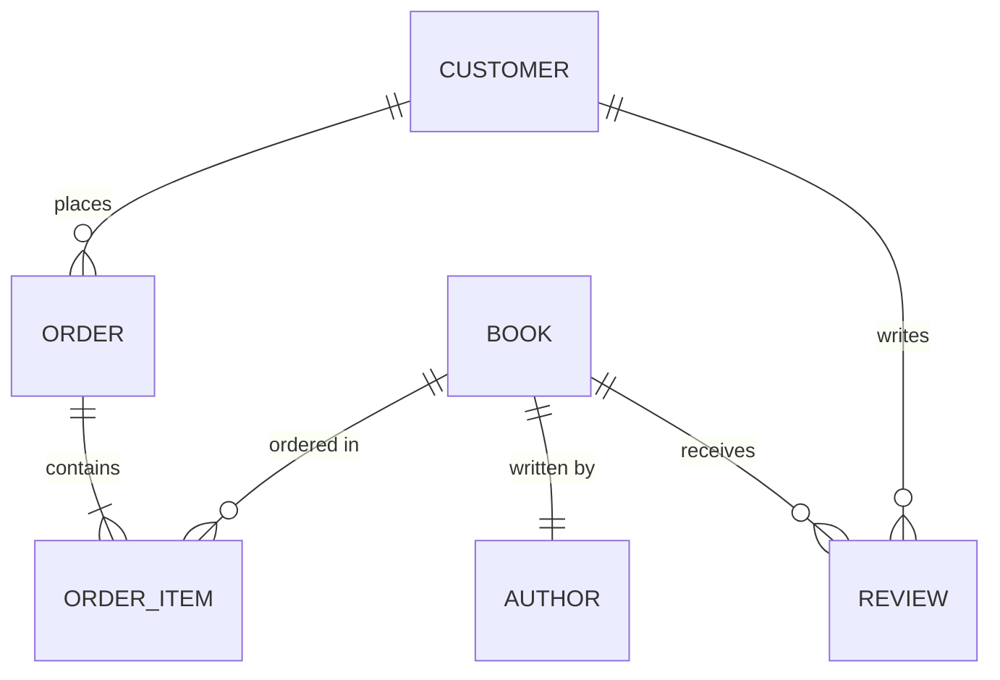

# Database Design

## Introduction

Database design is the process of creating a structured blueprint for a database. It involves defining the data elements, their relationships, and the organizational structure to efficiently store and retrieve information. A well-designed database serves as the foundation for applications, ensuring data integrity, reducing redundancy, and optimizing performance.

In this guide, we'll explore the fundamental concepts of database design, from understanding data requirements to creating efficient database schemas. Whether you're building a simple app or a complex system, these principles will help you create databases that are reliable, scalable, and maintainable.

## Why Database Design Matters

Before diving into the technical aspects, let's understand why proper database design is crucial:

- **Data Integrity**: Ensures your data remains accurate and consistent
- **Efficiency**: Minimizes redundancy and optimizes storage space
- **Performance**: Enables faster queries and data manipulation
- **Scalability**: Accommodates growth without major restructuring
- **Maintenance**: Makes it easier to update and troubleshoot your database

Poor database design, on the other hand, can lead to data inconsistencies, slow performance, and difficult maintenance as your application grows.

## The Database Design Process

Let's walk through the step-by-step process of designing a database:

### 1. Requirements Analysis

The first step is to understand what data your system needs to store and how it will be used:

- Identify the entities (objects) your system will track
- Determine the attributes (properties) of each entity
- Understand the relationships between entities
- Define business rules and constraints
- Identify reporting and analysis requirements

**Example**: For an online bookstore, you might need to track:
- Books (ISBN, title, author, price, etc.)
- Customers (name, email, address, etc.)
- Orders (order ID, date, items, quantity, etc.)
- Inventory (stock levels, location, etc.)

### 2. Conceptual Data Modeling

Once you understand the requirements, create a high-level conceptual model that identifies the main entities and their relationships. Entity-Relationship Diagrams (ERDs) are commonly used for this purpose.



In this diagram:
- A customer can place multiple orders (one-to-many relationship)
- An order contains multiple order items (one-to-many)
- A book can be part of multiple order items (one-to-many)
- A book is written by an author (one-to-one in this simplified model)
- A book can receive multiple reviews (one-to-many)
- A customer can write multiple reviews (one-to-many)

### 3. Logical Database Design

The logical design transforms your conceptual model into a database schema, defining tables, columns, primary keys, foreign keys, and constraints. This is when you apply normalization principles to reduce redundancy.

**Example**: For our bookstore, a simplified logical model might look like:

```
Customers (customer_id, name, email, address, phone)
Books (book_id, isbn, title, price, publication_date, publisher_id)
Authors (author_id, name, biography)
BookAuthors (book_id, author_id)
Orders (order_id, customer_id, order_date, status, total_amount)
OrderItems (order_item_id, order_id, book_id, quantity, price)
Reviews (review_id, book_id, customer_id, rating, comment, review_date)
Publishers (publisher_id, name, address)
```

### 4. Normalization

Normalization is a technique to organize data efficiently and eliminate redundancy. There are several normal forms (1NF, 2NF, 3NF, BCNF, etc.), each building upon the previous one:

- **First Normal Form (1NF)**: Eliminate repeating groups and ensure atomic values
- **Second Normal Form (2NF)**: Remove partial dependencies on primary key
- **Third Normal Form (3NF)**: Remove transitive dependencies

**Example of Normalization**:

Before normalization, you might have a single Orders table:

```
Orders (order_id, customer_name, customer_email, book_title, book_price, quantity, total_price, order_date)
```

This design has problems:
- Customer information is repeated for each order
- Book information is repeated for each order item
- Calculation (total_price) is stored instead of calculated

After normalization (3NF):

```
Customers (customer_id, name, email, address)
Books (book_id, title, price, isbn)
Orders (order_id, customer_id, order_date)
OrderItems (order_item_id, order_id, book_id, quantity)
```

### 5. Physical Database Design

Physical design involves implementing your logical schema in a specific database system. This includes:

- Creating tables and defining data types
- Setting up indexes for performance
- Implementing constraints (primary keys, foreign keys, unique, check)
- Considering partitioning, clustering, and other physical storage optimizations

**Example SQL for creating the Books table**:

```sql
CREATE TABLE Books (
    book_id INT PRIMARY KEY AUTO_INCREMENT,
    isbn VARCHAR(13) UNIQUE NOT NULL,
    title VARCHAR(255) NOT NULL,
    price DECIMAL(10, 2) NOT NULL,
    publication_date DATE,
    publisher_id INT,
    FOREIGN KEY (publisher_id) REFERENCES Publishers(publisher_id)
);

-- Creating an index on the title for faster searches
CREATE INDEX idx_book_title ON Books(title);
```

## Understanding Relationships

Databases handle three main types of relationships:

### One-to-One (1:1)

In a one-to-one relationship, each record in Table A relates to exactly one record in Table B.

**Example**: A Person and a Passport. Each person has one passport, and each passport belongs to one person.

```sql
CREATE TABLE Persons (
    person_id INT PRIMARY KEY,
    name VARCHAR(100),
    date_of_birth DATE
);

CREATE TABLE Passports (
    passport_id VARCHAR(20) PRIMARY KEY,
    issue_date DATE,
    expiry_date DATE,
    person_id INT UNIQUE,
    FOREIGN KEY (person_id) REFERENCES Persons(person_id)
);
```

### One-to-Many (1:N)

In a one-to-many relationship, each record in Table A can relate to multiple records in Table B, but each record in Table B relates to only one record in Table A.

**Example**: An Author and Books. One author can write multiple books, but each book has one primary author (in this simplified model).

```sql
CREATE TABLE Authors (
    author_id INT PRIMARY KEY,
    name VARCHAR(100),
    biography TEXT
);

CREATE TABLE Books (
    book_id INT PRIMARY KEY,
    title VARCHAR(255),
    publication_year INT,
    author_id INT,
    FOREIGN KEY (author_id) REFERENCES Authors(author_id)
);
```

### Many-to-Many (M:N)

In a many-to-many relationship, each record in Table A can relate to multiple records in Table B, and vice versa. This requires a junction table (also called a bridge or associative table).

**Example**: Books and Categories. A book can belong to multiple categories, and each category can contain multiple books.

```sql
CREATE TABLE Books (
    book_id INT PRIMARY KEY,
    title VARCHAR(255),
    isbn VARCHAR(13)
);

CREATE TABLE Categories (
    category_id INT PRIMARY KEY,
    name VARCHAR(50)
);

CREATE TABLE BookCategories (
    book_id INT,
    category_id INT,
    PRIMARY KEY (book_id, category_id),
    FOREIGN KEY (book_id) REFERENCES Books(book_id),
    FOREIGN KEY (category_id) REFERENCES Categories(category_id)
);
```

## Keys and Constraints

### Types of Keys

- **Primary Key**: Uniquely identifies each record in a table
- **Foreign Key**: Creates a link between tables by referencing a primary key
- **Composite Key**: A primary key composed of multiple columns
- **Candidate Key**: A column that could potentially be a primary key
- **Surrogate Key**: An artificial key created solely for identification (like auto-increment IDs)

### Database Constraints

Constraints enforce rules on your data to maintain integrity:

- **NOT NULL**: Ensures a column cannot contain NULL values
- **UNIQUE**: Ensures all values in a column are unique
- **PRIMARY KEY**: Combines NOT NULL and UNIQUE
- **FOREIGN KEY**: Ensures referential integrity between tables
- **CHECK**: Ensures values meet specific conditions
- **DEFAULT**: Sets a default value for a column

## Practical Example: Building a Library Database

Let's design a simplified library management system:

### Step 1: Identify Entities and Attributes

- **Books**: ISBN, title, publication_year, publisher, available_copies
- **Authors**: Author ID, name, biography
- **Members**: Member ID, name, email, join_date
- **Loans**: Loan ID, book_ID, member_ID, loan_date, due_date, return_date
- **Publishers**: Publisher ID, name, address

### Step 2: Create an ERD


### Step 3: Create SQL Tables

```sql
-- Publishers Table
CREATE TABLE Publishers (
    publisher_id INT PRIMARY KEY AUTO_INCREMENT,
    name VARCHAR(100) NOT NULL,
    address VARCHAR(255)
);

-- Books Table
CREATE TABLE Books (
    book_id INT PRIMARY KEY AUTO_INCREMENT,
    isbn VARCHAR(13) UNIQUE NOT NULL,
    title VARCHAR(255) NOT NULL,
    publication_year INT,
    publisher_id INT,
    available_copies INT DEFAULT 0,
    FOREIGN KEY (publisher_id) REFERENCES Publishers(publisher_id)
);

-- Authors Table
CREATE TABLE Authors (
    author_id INT PRIMARY KEY AUTO_INCREMENT,
    name VARCHAR(100) NOT NULL,
    biography TEXT
);

-- Book-Author Junction Table (for many-to-many relationship)
CREATE TABLE BookAuthors (
    book_id INT,
    author_id INT,
    PRIMARY KEY (book_id, author_id),
    FOREIGN KEY (book_id) REFERENCES Books(book_id),
    FOREIGN KEY (author_id) REFERENCES Authors(author_id)
);

-- Members Table
CREATE TABLE Members (
    member_id INT PRIMARY KEY AUTO_INCREMENT,
    name VARCHAR(100) NOT NULL,
    email VARCHAR(100) UNIQUE NOT NULL,
    join_date DATE NOT NULL
);

-- Loans Table
CREATE TABLE Loans (
    loan_id INT PRIMARY KEY AUTO_INCREMENT,
    book_id INT NOT NULL,
    member_id INT NOT NULL,
    loan_date DATE NOT NULL,
    due_date DATE NOT NULL,
    return_date DATE,
    FOREIGN KEY (book_id) REFERENCES Books(book_id),
    FOREIGN KEY (member_id) REFERENCES Members(member_id),
    CHECK (return_date IS NULL OR return_date >= loan_date)
);
```

### Step 4: Create Indexes for Performance

```sql
-- Index for searching books by title
CREATE INDEX idx_book_title ON Books(title);

-- Index for searching members by name
CREATE INDEX idx_member_name ON Members(name);

-- Index for tracking overdue books
CREATE INDEX idx_loan_due_date ON Loans(due_date);
```

## Best Practices for Database Design

1. **Start with thorough requirements analysis**: Understand what data you need and how it will be used before designing.

2. **Follow naming conventions**: Use clear, consistent names for tables and columns (e.g., singular nouns for tables, snake_case or camelCase).

3. **Use appropriate data types**: Choose the right data type for each column to optimize storage and performance.

4. **Normalize to reduce redundancy**: Apply normalization principles, but be pragmatic about it.

5. **Denormalize selectively for performance**: Sometimes denormalization helps with read-heavy workloads.

6. **Create indexes wisely**: Index columns that are frequently searched or joined, but don't over-index.

7. **Implement constraints**: Use constraints to enforce business rules and maintain data integrity.

8. **Document your design**: Create diagrams and documentation to explain your database structure.

9. **Plan for scalability**: Consider how your database will handle growth in data volume and user load.

10. **Consider security early**: Design with data privacy and security in mind from the start.

## Common Database Design Mistakes to Avoid

1. **Using natural keys instead of surrogate keys**: Business identifiers might change over time.

2. **Over-normalization**: Sometimes perfect normalization hurts performance.

3. **Under-normalization**: Too much redundancy leads to update anomalies and wasted space.

4. **Ignoring indexing**: Lack of proper indexes can severely impact query performance.

5. **Storing calculated values**: Store raw data and calculate values when needed.

6. **Using inappropriate data types**: Like using VARCHAR for numeric values or dates.

7. **Neglecting foreign key constraints**: These are crucial for maintaining referential integrity.

8. **Creating too many tables**: Overly complex schemas are difficult to work with.

9. **Using inconsistent naming conventions**: Makes the database harder to understand and maintain.

10. **Storing file paths in databases**: Instead of storing actual files in appropriate storage.

## When to Consider NoSQL Databases

While relational databases are excellent for structured data with clear relationships, NoSQL databases may be better suited for:

- Handling semi-structured or unstructured data
- Extremely large scale applications requiring horizontal scaling
- Flexible schema requirements that change frequently
- Specific data models like document, key-value, column-family, or graph

## Summary

Database design is a critical foundation for application development. A well-designed database ensures data integrity, optimizes performance, and supports the evolving needs of your application. Key steps include:

1. Requirements analysis
2. Conceptual data modeling with ERDs
3. Logical database design and normalization
4. Physical implementation with appropriate keys, constraints, and indexes

Remember that database design is often an iterative process. As you learn more about your data and how it's used, you may need to refine your design to better serve your application's needs.

## Exercises

1. **Design a Social Media Database**: Create an ERD for a simple social media platform with users, posts, comments, and likes.

2. **Normalize a Table**: Take the following denormalized table and convert it to 3NF:
   ```
   Orders (order_id, customer_name, customer_email, product_name, product_category, quantity, unit_price, total_price)
   ```

3. **Create Relationships**: Design a database schema for a school with students, teachers, classes, and grades.

4. **Optimize Queries**: Given a database of products and sales, write SQL to find the top 5 best-selling products by month.

5. **Implement Constraints**: Add appropriate constraints to a banking database with accounts, customers, and transactions tables.

## Additional Resources

- **Books**:
  - "Database Design for Mere Mortals" by Michael J. Hernandez
  - "SQL Antipatterns" by Bill Karwin

- **Online Courses**:
  - Stanford's Database Course
  - Codecademy's SQL and Database Courses

- **Tools**:
  - DbDesigner.net - Free online database design tool
  - MySQL Workbench - Comprehensive database design tool
  - Lucidchart - For creating ERDs

- **Communities**:
  - Stack Overflow's Database Administration forum
  - Reddit's r/SQL and r/DatabaseDesign communities