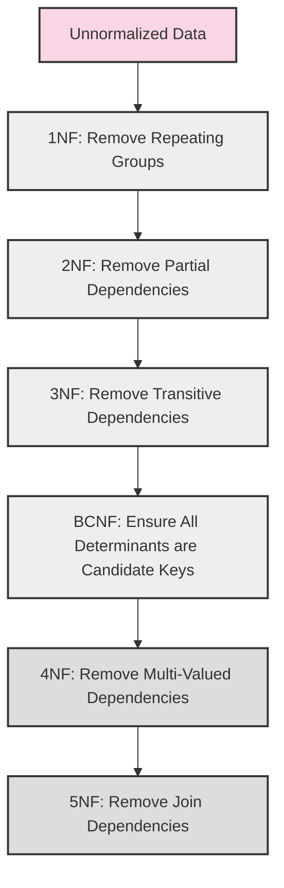

# Database Normalization

## Introduction

Database normalization is a systematic approach to organizing data in a relational database. Think of it as tidying up a messy room – you're structuring your database tables to minimize redundancy and dependency issues, which helps prevent data anomalies and ensures data integrity.

As a beginner in database design, understanding normalization is crucial because it forms the foundation for creating efficient, maintainable, and reliable database systems. In this guide, we'll explore what normalization is, why it matters, and how to apply different normalization forms to your database designs.

## Why Normalize Your Database?

Before diving into normalization techniques, let's understand why we need to normalize databases in the first place:

1. **Eliminate data redundancy** - Avoid storing the same data in multiple places
2. **Prevent update anomalies** - Ensure data remains consistent when updated
3. **Reduce insertion anomalies** - Make it easier to add new data without inconsistencies
4. **Avoid deletion anomalies** - Prevent unintentional data loss when records are deleted
5. **Improve query performance** - Optimize database structure for faster searches
6. **Enhance data integrity** - Maintain accuracy and consistency of stored data

## Understanding the Problem: Unnormalized Tables

Let's look at an example of an unnormalized table to understand the issues that normalization solves:

```sql
-- Unnormalized Students Table
CREATE TABLE Students (
    StudentID INT,
    StudentName VARCHAR(100),
    Address VARCHAR(255),
    CourseID INT,
    CourseName VARCHAR(100),
    InstructorID INT,
    InstructorName VARCHAR(100),
    InstructorEmail VARCHAR(100),
    Grade CHAR(1)
);
```

This table design has several problems:
- Course information is repeated for every student taking the same course
- Instructor information is duplicated for every student taught by the same instructor
- If an instructor's email changes, we need to update multiple rows
- We can't add a new course without associating it with a student
- If we delete a student, we might lose information about courses or instructors

## Normalization Process: The Forms

Normalization is applied in stages, with each "normal form" addressing specific types of data redundancy.

### First Normal Form (1NF)

**Rule**: A table is in 1NF if it:
- Contains only atomic (indivisible) values
- Has no repeating groups
- Has a primary key

#### Example of Violation:

```sql
CREATE TABLE StudentContacts (
    StudentID INT,
    StudentName VARCHAR(100),
    PhoneNumbers VARCHAR(255) -- Contains "555-1234, 555-5678, 555-9012"
);
```

#### Corrected 1NF Table:

```sql
CREATE TABLE Students (
    StudentID INT PRIMARY KEY,
    StudentName VARCHAR(100)
);

CREATE TABLE StudentPhones (
    RecordID INT PRIMARY KEY,
    StudentID INT,
    PhoneNumber VARCHAR(20),
    FOREIGN KEY (StudentID) REFERENCES Students(StudentID)
);
```

### Second Normal Form (2NF)

**Rule**: A table is in 2NF if it:
- Is in 1NF
- All non-key attributes are fully functionally dependent on the entire primary key (not just part of it)

This is especially important for tables with composite primary keys.

#### Example of Violation:

```sql
CREATE TABLE StudentCourses (
    StudentID INT,
    CourseID INT,
    StudentName VARCHAR(100),
    CourseName VARCHAR(100),
    Grade CHAR(1),
    PRIMARY KEY (StudentID, CourseID)
);
```

Here, `StudentName` depends only on `StudentID` (not the full primary key), and `CourseName` depends only on `CourseID`.

#### Corrected 2NF Tables:

```sql
CREATE TABLE Students (
    StudentID INT PRIMARY KEY,
    StudentName VARCHAR(100)
);

CREATE TABLE Courses (
    CourseID INT PRIMARY KEY,
    CourseName VARCHAR(100)
);

CREATE TABLE Enrollments (
    StudentID INT,
    CourseID INT,
    Grade CHAR(1),
    PRIMARY KEY (StudentID, CourseID),
    FOREIGN KEY (StudentID) REFERENCES Students(StudentID),
    FOREIGN KEY (CourseID) REFERENCES Courses(CourseID)
);
```

### Third Normal Form (3NF)

**Rule**: A table is in 3NF if it:
- Is in 2NF
- Has no transitive dependencies (non-key attributes depending on other non-key attributes)

#### Example of Violation:

```sql
CREATE TABLE Students (
    StudentID INT PRIMARY KEY,
    StudentName VARCHAR(100),
    DepartmentID INT,
    DepartmentName VARCHAR(100),
    DepartmentLocation VARCHAR(100)
);
```

Here, `DepartmentName` and `DepartmentLocation` depend on `DepartmentID`, not directly on the primary key `StudentID`.

#### Corrected 3NF Tables:

```sql
CREATE TABLE Departments (
    DepartmentID INT PRIMARY KEY,
    DepartmentName VARCHAR(100),
    DepartmentLocation VARCHAR(100)
);

CREATE TABLE Students (
    StudentID INT PRIMARY KEY,
    StudentName VARCHAR(100),
    DepartmentID INT,
    FOREIGN KEY (DepartmentID) REFERENCES Departments(DepartmentID)
);
```

### Boyce-Codd Normal Form (BCNF)

**Rule**: A table is in BCNF if for every dependency X → Y, X is a superkey.

This is a stricter version of 3NF that addresses certain anomalies that 3NF doesn't fully resolve.

#### Example of Violation:

```sql
CREATE TABLE StudentAdvisors (
    StudentID INT,
    Subject VARCHAR(50),
    Advisor VARCHAR(100),
    PRIMARY KEY (StudentID, Subject)
);
```

If each advisor teaches only one subject, then `Advisor → Subject` is a functional dependency but `Advisor` is not a superkey.

#### Corrected BCNF Tables:

```sql
CREATE TABLE SubjectAdvisors (
    Advisor VARCHAR(100) PRIMARY KEY,
    Subject VARCHAR(50)
);

CREATE TABLE StudentAdvisors (
    StudentID INT,
    Advisor VARCHAR(100),
    PRIMARY KEY (StudentID, Advisor),
    FOREIGN KEY (Advisor) REFERENCES SubjectAdvisors(Advisor)
);
```

### Fourth and Fifth Normal Forms

These higher normal forms deal with multi-valued dependencies and join dependencies, which are more advanced concepts. For most applications, achieving BCNF is sufficient for a well-designed database.

## Visualizing Normalization

Let's visualize the normalization process using a diagram:



## Real-World Example: Online Bookstore Database

Let's apply normalization to design a database for an online bookstore:

### Unnormalized Table:

```sql
CREATE TABLE BookOrders (
    OrderID INT,
    OrderDate DATE,
    CustomerID INT,
    CustomerName VARCHAR(100),
    CustomerEmail VARCHAR(100),
    CustomerAddress VARCHAR(255),
    BookID INT,
    BookTitle VARCHAR(200),
    AuthorName VARCHAR(100),
    Genre VARCHAR(50),
    Price DECIMAL(10,2),
    Quantity INT
);
```

### Normalized Tables (3NF):

```sql
-- Customers Table
CREATE TABLE Customers (
    CustomerID INT PRIMARY KEY,
    CustomerName VARCHAR(100),
    CustomerEmail VARCHAR(100),
    CustomerAddress VARCHAR(255)
);

-- Authors Table
CREATE TABLE Authors (
    AuthorID INT PRIMARY KEY,
    AuthorName VARCHAR(100)
);

-- Books Table
CREATE TABLE Books (
    BookID INT PRIMARY KEY,
    BookTitle VARCHAR(200),
    AuthorID INT,
    Genre VARCHAR(50),
    Price DECIMAL(10,2),
    FOREIGN KEY (AuthorID) REFERENCES Authors(AuthorID)
);

-- Orders Table
CREATE TABLE Orders (
    OrderID INT PRIMARY KEY,
    OrderDate DATE,
    CustomerID INT,
    FOREIGN KEY (CustomerID) REFERENCES Customers(CustomerID)
);

-- OrderDetails Table
CREATE TABLE OrderDetails (
    OrderDetailID INT PRIMARY KEY,
    OrderID INT,
    BookID INT,
    Quantity INT,
    FOREIGN KEY (OrderID) REFERENCES Orders(OrderID),
    FOREIGN KEY (BookID) REFERENCES Books(BookID)
);
```

This normalized design:
- Eliminates redundancy (customer and book information is stored only once)
- Prevents update anomalies (changing a customer's email requires updating only one row)
- Avoids insertion and deletion anomalies (can add books without orders, or delete orders without losing book information)

## When Not to Normalize

While normalization brings many benefits, it isn't always the right choice for every scenario:

1. **Reporting databases** - Denormalized structures can improve read performance for analytical queries
2. **Extremely high-volume applications** - Where performance outweighs the benefits of data integrity
3. **Data warehouses** - Often use star or snowflake schemas that aren't fully normalized
4. **NoSQL databases** - Follow different design principles (though normalization concepts can still apply)

## Practical Tips for Normalization

1. **Start with a clear understanding of your data requirements**
2. **Identify all entities** (people, places, things, events) in your system
3. **Define relationships** between entities (one-to-one, one-to-many, many-to-many)
4. **Identify functional dependencies** in your data
5. **Apply normalization forms progressively** (1NF → 2NF → 3NF → BCNF)
6. **Review and refine** your design based on real-world usage patterns

## Summary

Database normalization is a crucial skill for designing efficient, reliable, and maintainable database systems. By understanding and applying the different normal forms, you can:

- Eliminate data redundancy
- Ensure data consistency
- Prevent update, insertion, and deletion anomalies
- Create a more flexible database structure

Remember that normalization is a process, not a destination. The appropriate level of normalization depends on your specific application needs, balancing data integrity against performance requirements.

## Exercises

1. Identify the normal form of the following table and explain why:
   ```sql
   CREATE TABLE Employees (
       EmployeeID INT PRIMARY KEY,
       EmployeeName VARCHAR(100),
       DepartmentName VARCHAR(100),
       ManagerID INT,
       ManagerName VARCHAR(100)
   );
   ```

2. Normalize the following table to 3NF:
   ```sql
   CREATE TABLE Products (
       ProductID INT,
       ProductName VARCHAR(100),
       CategoryID INT,
       CategoryName VARCHAR(100),
       SupplierID INT,
       SupplierName VARCHAR(100),
       SupplierCountry VARCHAR(100),
       Price DECIMAL(10,2)
   );
   ```

3. Design a normalized database schema (3NF) for a library management system that needs to track books, authors, members, and borrowing records.

## Additional Resources

- [Database Design for Mere Mortals](https://www.informit.com/store/database-design-for-mere-mortals-a-hands-on-guide-to-9780321884497) by Michael J. Hernandez
- [SQL for Mere Mortals](https://www.informit.com/store/sql-for-mere-mortals-a-hands-on-guide-to-data-manipulation-9780134858333) by John L. Viescas
- [Stanford's Database Course](https://www.edx.org/course/databases-5-sql) on edX
- [W3Schools SQL Tutorial](https://www.w3schools.com/sql/)