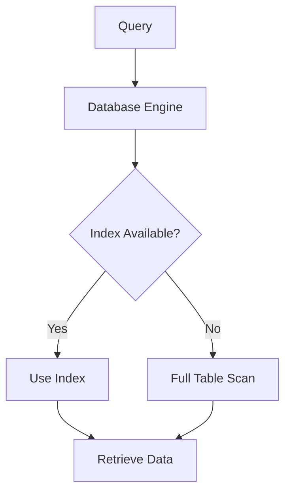

# Indexes and Optimization

## Introduction

When your application grows and database tables start accumulating thousands or millions of rows, query performance can degrade significantly. This is where **database indexes** and **query optimization** techniques become crucial skills for any developer.

Think of a database index like the index at the back of a book - instead of reading through the entire book to find information about a specific topic, you can quickly look up the page numbers in the index. Similarly, database indexes allow the database engine to find data quickly without scanning the entire table.

In this guide, we'll explore how indexes work, when to use them, and various optimization techniques to make your database queries faster and more efficient.

## Understanding Database Indexes

### What is a Database Index?

A database index is a data structure that improves the speed of data retrieval operations on a database table. It works by creating a separate structure that points to the actual data, allowing the database engine to find rows quickly without scanning the entire table.



### Types of Indexes

Different database systems offer various types of indexes, but the most common ones include:

1. **B-Tree Indexes**: The most common type, balanced tree structures efficient for equality and range queries.
2. **Hash Indexes**: Optimized for equality comparisons but not useful for range queries.
3. **Full-Text Indexes**: Specialized for text searching.
4. **Spatial Indexes**: Used for geographical data.
5. **Composite Indexes**: Built on multiple columns.

## Creating and Managing Indexes

### Basic Index Creation

Most relational databases use similar syntax for creating indexes:

```sql
-- Creating a basic index
CREATE INDEX idx_customer_name ON customers(last_name);

-- Creating a unique index
CREATE UNIQUE INDEX idx_product_code ON products(product_code);

-- Creating a composite index
CREATE INDEX idx_order_customer ON orders(order_date, customer_id);
```

### When to Create Indexes

Indexes are particularly helpful on:

- Primary key columns (automatically indexed in most databases)
- Foreign key columns
- Columns frequently used in WHERE clauses
- Columns frequently used in JOIN conditions
- Columns frequently used in ORDER BY or GROUP BY clauses

### The Cost of Indexes

While indexes speed up data retrieval, they come with costs:

- They consume disk space
- They slow down write operations (INSERT, UPDATE, DELETE)
- They need to be maintained by the database

This creates a trade-off: more indexes mean faster reads but slower writes. For read-heavy applications, more indexes often make sense. For write-heavy applications, you might want to be more selective.

## Query Optimization Techniques

Creating indexes is just one part of the optimization process. Let's explore additional techniques to optimize your database queries.

### SELECT Only What You Need

Instead of using `SELECT *`, explicitly list only the columns you need:

```sql
-- Instead of this
SELECT * FROM employees WHERE department_id = 5;

-- Do this
SELECT employee_id, first_name, last_name, email 
FROM employees 
WHERE department_id = 5;
```

This reduces the amount of data that needs to be transferred from the database to your application.

### Use EXPLAIN/EXECUTION PLAN

Most database systems provide a way to see how a query will be executed:

```sql
-- MySQL/PostgreSQL
EXPLAIN SELECT * FROM customers WHERE last_name = 'Smith';

-- SQL Server
SET SHOWPLAN_ALL ON;
GO
SELECT * FROM customers WHERE last_name = 'Smith';
GO
SET SHOWPLAN_ALL OFF;
```

This helps you understand whether your query is using indexes effectively.

### Avoid Functions in WHERE Clauses

Using functions on indexed columns can prevent the database from using indexes:

```sql
-- Bad: Index on last_name won't be used
SELECT * FROM customers WHERE UPPER(last_name) = 'SMITH';

-- Better: Index can be used
SELECT * FROM customers WHERE last_name = 'Smith';
```

### Use JOINs Efficiently

When joining tables, ensure you're joining on indexed columns and using the appropriate join type:

```sql
-- Use appropriate join types
SELECT o.order_id, c.customer_name
FROM orders o
INNER JOIN customers c ON o.customer_id = c.customer_id
WHERE o.order_date > '2023-01-01';
```

### Limit Results When Possible

Many databases allow you to limit the number of results returned:

```sql
-- MySQL/PostgreSQL
SELECT * FROM products ORDER BY price DESC LIMIT 10;

-- SQL Server
SELECT TOP 10 * FROM products ORDER BY price DESC;
```

### Batch Processing

For operations involving many rows, process data in batches:

```sql
-- Instead of one large operation
DELETE FROM log_entries WHERE created_date < '2022-01-01';

-- Break into batches
DELETE FROM log_entries 
WHERE created_date < '2022-01-01' 
ORDER BY created_date 
LIMIT 1000;
-- Repeat until no more rows are affected
```

### Index Maintenance

Regularly maintain your indexes to ensure optimal performance:

```sql
-- PostgreSQL
REINDEX TABLE customers;

-- MySQL
OPTIMIZE TABLE customers;

-- SQL Server
ALTER INDEX ALL ON customers REBUILD;
```

## Practical Example: Optimizing a Blog Database

Let's consider a practical example of optimizing a simple blog database.

### Initial Schema

```sql
CREATE TABLE posts (
    id INT PRIMARY KEY,
    title VARCHAR(255),
    content TEXT,
    author_id INT,
    category_id INT,
    published_date TIMESTAMP,
    is_published BOOLEAN
);

CREATE TABLE comments (
    id INT PRIMARY KEY,
    post_id INT,
    author_id INT,
    content TEXT,
    created_at TIMESTAMP
);
```

### Identifying Slow Queries

Suppose we notice that the following query is slow:

```sql
SELECT p.title, COUNT(c.id) as comment_count
FROM posts p
LEFT JOIN comments c ON p.id = c.post_id
WHERE p.category_id = 5 AND p.is_published = true
GROUP BY p.id, p.title
ORDER BY p.published_date DESC;
```

### Adding Appropriate Indexes

To optimize this query, we can add the following indexes:

```sql
-- Index for filtering posts by category and published status
CREATE INDEX idx_posts_category_published ON posts(category_id, is_published);

-- Index for sorting by published date
CREATE INDEX idx_posts_published_date ON posts(published_date);

-- Index for the join between posts and comments
CREATE INDEX idx_comments_post_id ON comments(post_id);
```

### Measuring Improvement

Using EXPLAIN before and after adding indexes can show the performance improvement:

```sql
-- Before adding indexes
EXPLAIN SELECT p.title, COUNT(c.id) as comment_count
FROM posts p
LEFT JOIN comments c ON p.id = c.post_id
WHERE p.category_id = 5 AND p.is_published = true
GROUP BY p.id, p.title
ORDER BY p.published_date DESC;

-- After adding indexes
EXPLAIN SELECT p.title, COUNT(c.id) as comment_count
FROM posts p
LEFT JOIN comments c ON p.id = c.post_id
WHERE p.category_id = 5 AND p.is_published = true
GROUP BY p.id, p.title
ORDER BY p.published_date DESC;
```

You might see the query execution plan change from a full table scan to an index scan, with a significant reduction in estimated cost and execution time.

## Common Pitfalls to Avoid

When working with database indexes and optimization, watch out for these common issues:

1. **Over-indexing**: Having too many indexes can slow down write operations and increase storage requirements.

2. **Ignoring cardinality**: Indexes work best on columns with high cardinality (many unique values). Indexing a boolean column (with only two possible values) might not be effective.

3. **Not monitoring performance**: Regularly check for slow queries in your production environment.

4. **One-size-fits-all approach**: Different queries might need different optimization techniques.

5. **Premature optimization**: Don't optimize until you have real performance data showing a problem.

## Advanced Topics

Once you're comfortable with basic indexing and optimization, explore these advanced topics:

### Partial Indexes

Some databases support indexing only a subset of rows:

```sql
-- PostgreSQL partial index
CREATE INDEX idx_active_users ON users(email) 
WHERE is_active = true;
```

### Covering Indexes

A covering index includes all columns needed for a query, allowing the database to satisfy the query from the index alone:

```sql
-- Index includes all columns needed for the query
CREATE INDEX idx_products_covering ON products(category_id, price, name);

-- Query that can be satisfied from the index
SELECT name, price FROM products WHERE category_id = 5;
```

### Index-Only Scans

Similar to covering indexes, when a query can be satisfied entirely from an index without accessing the table:

```sql
-- PostgreSQL can use an index-only scan for this query
-- if an appropriate index exists
SELECT count(*) FROM products WHERE category_id = 5;
```

## Summary

Database indexing and query optimization are essential skills for developing performant applications. Key takeaways include:

- Indexes speed up data retrieval but slow down data modification
- Choose the right columns to index based on query patterns
- Use EXPLAIN or execution plans to understand query performance
- Write SQL that can leverage indexes (avoid functions on indexed columns)
- Regularly maintain indexes for optimal performance
- Only select the data you actually need
- Monitor and optimize based on real-world performance

By applying these principles, you'll be able to build applications that remain responsive even as your data grows.

## Exercises

1. Create a database with a table containing at least 10,000 rows and experiment with different indexes to see how they affect query performance.

2. Take a slow query from one of your projects and optimize it using the techniques in this guide.

3. Use your database's EXPLAIN feature to analyze the execution plan of a complex query and identify potential optimizations.

4. Benchmark the performance difference between using `SELECT *` and selecting only needed columns on a large table.

5. Compare the write performance (INSERT operations) with and without indexes on a test table.

## Additional Resources

- [Use the Index, Luke](https://use-the-index-luke.com/) - A guide to database performance for developers
- [PostgreSQL Indexing](https://www.postgresql.org/docs/current/indexes.html) - Official documentation
- [MySQL Optimization and Indexes](https://dev.mysql.com/doc/refman/8.0/en/optimization-indexes.html) - Official documentation
- [SQL Server Index Architecture and Design Guide](https://docs.microsoft.com/en-us/sql/relational-databases/sql-server-index-design-guide) - Microsoft's guide