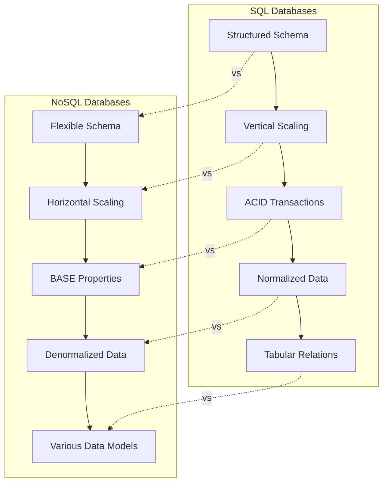

# NoSQL Databases

## Introduction

NoSQL (Not Only SQL) databases emerged as an alternative to traditional relational database management systems (RDBMS). Unlike relational databases that use structured query language (SQL) for defining and manipulating data, NoSQL databases provide a mechanism for storage and retrieval of data that is modeled in means other than the tabular relations used in relational databases.

NoSQL databases became popular as web applications grew in complexity and scale. Companies like Google, Amazon, and Facebook faced challenges that traditional RDBMS couldn't efficiently handle, such as:

- Processing extremely large volumes of data
- Supporting millions of concurrent users
- Distributing data across multiple servers or data centers
- Handling semi-structured or unstructured data
- Providing high availability with no single point of failure

## Key Characteristics of NoSQL Databases

NoSQL databases typically share several common characteristics:

- **Flexible schemas**: Unlike relational databases, many NoSQL databases allow you to add fields to database records without having to define changes to the structure first.
- **Horizontal scalability**: NoSQL databases are designed to expand transparently to take advantage of new nodes, which is particularly useful for cloud computing.
- **High availability**: Many NoSQL databases are designed to have no single point of failure through data replication.
- **Eventually consistent**: Some NoSQL systems sacrifice immediate consistency for eventual consistency and availability.
- **Built for specific data models**: Different NoSQL databases are optimized for specific types of data and query patterns.

## Types of NoSQL Databases

NoSQL databases can be classified into four main categories:

### 1. Document Databases

Document databases store data in document-like structures, typically in JSON or BSON format. Each document contains pairs of fields and values, and the values can be various data types, including strings, numbers, booleans, arrays, or even nested documents.

**Example: MongoDB**

Here's how you might store user data in MongoDB:

```javascript
// Creating a user document
db.users.insertOne({
  username: "johndoe",
  email: "john@example.com",
  profile: {
    firstName: "John",
    lastName: "Doe",
    age: 28,
    interests: ["programming", "databases", "hiking"]
  },
  createdAt: new Date()
})

// Query to find the user
db.users.findOne({ username: "johndoe" })

```

Output:

```json
{
  "_id": ObjectId("5f8a716c27c7f04b7cb13a53"),
  "username": "johndoe",
  "email": "john@example.com",
  "profile": {
    "firstName": "John",
    "lastName": "Doe",
    "age": 28,
    "interests": ["programming", "databases", "hiking"]
  },
  "createdAt": ISODate("2023-03-17T08:23:12.421Z")
}
```

**Advantages:**
- Schema flexibility allows for easy addition of fields
- Documents can represent complex hierarchical relationships
- No need for complex joins

**Use cases:**
- Content management systems
- E-commerce platforms
- User profiles and preferences
- Real-time analytics

### 2. Key-Value Stores

Key-value databases are the simplest form of NoSQL databases. They store data as a collection of key-value pairs, where the key serves as a unique identifier.

**Example: Redis**

```javascript
// Setting a simple key-value pair
SET user:1000 "John Doe"

// Setting a hash (multiple fields for a key)
HMSET user:1001 username "janedoe" email "jane@example.com" age 25

// Getting values
GET user:1000
// Output: "John Doe"

HGETALL user:1001
// Output:
// 1) "username"
// 2) "janedoe"
// 3) "email"
// 4) "jane@example.com"
// 5) "age"
// 6) "25"
```

**Advantages:**
- Extremely fast lookups
- High scalability
- Simple data model

**Use cases:**
- Caching
- Session management
- User preferences
- Real-time leaderboards

### 3. Column-Family Stores

Column-family databases store data in column families as rows that have many columns associated with a row key. They are optimized for queries over large datasets and store data in a column-oriented way.

**Example: Cassandra**

```sql
-- Creating a table (column family)
CREATE TABLE users (
  user_id uuid PRIMARY KEY,
  first_name text,
  last_name text,
  email text
);

-- Inserting data
INSERT INTO users (user_id, first_name, last_name, email)
VALUES (uuid(), 'John', 'Doe', 'john@example.com');

-- Querying data
SELECT * FROM users WHERE user_id = 550e8400-e29b-41d4-a716-446655440000;

-- Output:
-- user_id                              | first_name | last_name | email
-- ---------------------------------------|------------|-----------|----------------
-- 550e8400-e29b-41d4-a716-446655440000 | John       | Doe       | john@example.com
```

**Advantages:**
- Designed for high throughput and horizontal scalability
- Efficient for specific query patterns
- Optimized for writes and time-series data

**Use cases:**
- Time-series data
- Weather data
- IoT applications
- Recommendation engines

### 4. Graph Databases

Graph databases use graph structures with nodes, edges, and properties to represent and store data. They are optimized for complex relationships between data elements.

**Example: Neo4j**

```cypher
// Creating nodes and relationships
CREATE (john:Person {name: 'John', age: 28})
CREATE (jane:Person {name: 'Jane', age: 27})
CREATE (john)-[:FRIEND {since: 2020}]->(jane)

// Querying friends of John
MATCH (p:Person {name: 'John'})-[:FRIEND]->(friend)
RETURN friend.name, friend.age

// Output:
// friend.name | friend.age
// ------------|------------
// Jane        | 27
```

**Advantages:**
- Intuitive modeling of connected data
- Efficient traversal of relationships
- Powerful query capabilities for relationship-intensive data

**Use cases:**
- Social networks
- Recommendation engines
- Fraud detection
- Network/IT operations

## NoSQL vs. SQL Databases

Here's a comparison of NoSQL and SQL (relational) databases:



### Key Differences

| Feature | SQL Databases | NoSQL Databases |
|---------|---------------|----------------|
| Data Model | Tables with fixed rows and columns | Document, key-value, wide-column, or graph |
| Schema | Fixed schema | Dynamic schema |
| Scaling | Primarily vertical | Primarily horizontal |
| ACID Properties | Emphasized | Often relaxed for performance |
| Query Language | SQL | Database-specific APIs |
| Relationships | Joins | Embedded documents, references |
| Best For | Complex queries, transactions | Large volumes of rapidly changing data |

## When to Use NoSQL Databases

NoSQL databases are particularly well-suited for:

1. **Handling large volumes of data**: When you need to store and process terabytes or petabytes of data.
2. **High write throughput**: When your application needs to handle thousands of write operations per second.
3. **Flexible data models**: When your data structure might evolve over time and doesn't fit neatly into tables.
4. **Geographic distribution**: When you need to distribute data across multiple data centers.
5. **Specific query patterns**: When your application has specific access patterns that align with a particular NoSQL type.

## Real-World Applications

### E-commerce Product Catalog (Document DB)

An e-commerce site might use MongoDB to store product information because:
- Products have varying attributes (some have sizes, colors, materials, etc.)
- The catalog structure may evolve over time
- Document databases handle nested data well (variants, options, etc.)

```javascript
// Product document example
{
  "_id": "prod12345",
  "name": "Wireless Headphones",
  "brand": "AudioTech",
  "price": 79.99,
  "category": "Electronics",
  "attributes": {
    "color": "Black",
    "connectivity": "Bluetooth 5.0",
    "batteryLife": "20 hours"
  },
  "variants": [
    { "color": "White", "price": 79.99, "inStock": true },
    { "color": "Blue", "price": 84.99, "inStock": false }
  ],
  "reviews": [
    { "user": "user123", "rating": 4.5, "comment": "Great sound quality!" }
  ]
}
```

### Session Store (Key-Value DB)

Web applications often use Redis to store session data because:
- Session lookups need to be extremely fast
- Session data has a simple structure
- Sessions are often short-lived and benefit from Redis's TTL (Time To Live) feature

```javascript
// Setting session data with a 30-minute expiration
SET "session:abc123" "{\"user_id\": 1001, \"username\": \"johndoe\", \"loggedIn\": true}"
EXPIRE "session:abc123" 1800

// Later retrieving the session
GET "session:abc123"
```

### Social Network (Graph DB)

A social networking application might use Neo4j to store and query relationships:

```cypher
// Find friends of friends who live in "New York" and like "Database Technology"
MATCH (person:Person {name: 'John'})-[:FRIEND]->(friend)-[:FRIEND]->(friendOfFriend)
WHERE friendOfFriend.city = 'New York'
  AND (friendOfFriend)-[:LIKES]->(:Interest {name: 'Database Technology'})
  AND NOT (person)-[:FRIEND]->(friendOfFriend)
RETURN friendOfFriend.name
```

This query would be complex in a relational database but is intuitive and efficient in a graph database.

## Getting Started with NoSQL

If you're interested in experimenting with NoSQL databases, here are some ways to get started:

### MongoDB

1. Install MongoDB Community Edition from the [official website](https://www.mongodb.com/try/download/community)
2. Start MongoDB using `mongod` command
3. Connect to MongoDB shell using `mongo` command
4. Basic operations:

```javascript
// Create a database
use myFirstDatabase

// Insert a document
db.users.insertOne({ name: "John", age: 30 })

// Find documents
db.users.find()
```

### Redis

1. Install Redis from the [official website](https://redis.io/download)
2. Start Redis server using `redis-server`
3. Connect to Redis using `redis-cli`
4. Basic operations:

```
SET name "John"
GET name
KEYS *
```

## Common Pitfalls and Best Practices

### Pitfalls to Avoid

1. **Using NoSQL just because it's trendy**: Choose based on your specific requirements, not hype
2. **Ignoring data consistency needs**: Some applications require strong consistency
3. **Improper data modeling**: NoSQL requires different data modeling approaches than SQL
4. **Neglecting security**: NoSQL databases need proper security configurations too
5. **Overembedding documents**: In document databases, excessive nesting can lead to performance issues

### Best Practices

1. **Understand your access patterns**: Design your schema based on how you'll query the data
2. **Plan for scaling**: Consider partitioning strategy from the start
3. **Choose the right NoSQL type**: Match the database type to your data structure and access needs
4. **Consider using multiple database types**: Polyglot persistence can leverage strengths of different databases
5. **Test at scale**: Performance characteristics can change dramatically at scale

## Summary

NoSQL databases offer flexible, scalable alternatives to traditional relational databases. They come in various types (document, key-value, column-family, and graph), each optimized for specific use cases. While they sacrifice some of the strict consistency guarantees of relational databases, they provide superior performance and scalability for many modern application requirements.

The choice between SQL and NoSQL is not binary—many modern applications use both types of databases, selecting the right tool for each specific data storage and retrieval challenge.

## Exercises

1. **Basic MongoDB Exercise**: Create a simple document collection to store information about books and authors. Implement queries to find books by a specific author.

2. **Redis Implementation**: Build a simple leaderboard system using Redis sorted sets. Implement functions to add scores and retrieve top 10 players.

3. **Data Modeling Challenge**: Take an existing relational database schema and redesign it for a NoSQL database of your choice. Explain the decisions you made in the process.

4. **Comparison Project**: Set up a simple application with both SQL and NoSQL backends. Compare the performance for different types of operations.

## Additional Resources

- **Books**:
  - "NoSQL Distilled" by Pramod J. Sadalage and Martin Fowler
  - "MongoDB: The Definitive Guide" by Kristina Chodorow

- **Online Courses**:
  - MongoDB University offers free courses
  - Redis University for learning Redis
  - DataStax Academy for learning Cassandra

- **Documentation**:
  - Each NoSQL database has comprehensive documentation
  - Pay special attention to data modeling best practices