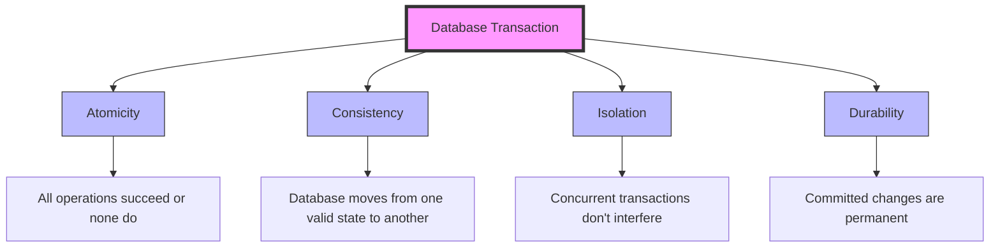

# ACID Properties

## Introduction

When working with databases, especially in applications where data integrity is crucial (like banking or inventory systems), you'll encounter the term "ACID properties." These properties ensure that database transactions are processed reliably, even when multiple users interact with the database simultaneously or when system failures occur.

ACID is an acronym that stands for:

- **A**tomicity
- **C**onsistency
- **I**solation
- **D**urability

These four properties work together to guarantee that your database transactions are processed reliably and maintain data integrity at all times. Let's explore each property in detail.

## Atomicity: All or Nothing

Atomicity guarantees that each transaction is treated as a single, indivisible unit. Either all operations within a transaction are completed successfully, or none of them are.

### How It Works

Think of atomicity like sending a package. Either the entire package arrives at its destination, or none of it does. There's no such thing as receiving half a package.

### Example

Let's consider a bank transfer between two accounts:

```sql
-- Start transaction
BEGIN TRANSACTION;

-- Deduct $100 from Account A
UPDATE accounts SET balance = balance - 100 WHERE account_id = 'A';

-- Add $100 to Account B
UPDATE accounts SET balance = balance + 100 WHERE account_id = 'B';

-- Commit changes if both operations succeed
COMMIT;
```

If the first update succeeds but the second fails (perhaps Account B doesn't exist), atomicity ensures the entire transaction is rolled back. Account A's balance would return to its original state as if the transaction never happened.

Without atomicity, Account A would lose $100, but Account B would never receive it—creating an inconsistent state where money simply disappears.

## Consistency: Maintaining Database Rules

Consistency ensures that a transaction can only bring the database from one valid state to another, maintaining all predefined rules, constraints, and triggers.

### How It Works

Any transaction must ensure that the database remains in a consistent state before and after the transaction. If a transaction would violate any database constraints, it's rolled back entirely.

### Example

Imagine we have a rule that account balances can't go below zero:

```sql
BEGIN TRANSACTION;

-- This would violate our constraint if Account A only has $50
UPDATE accounts SET balance = balance - 100 WHERE account_id = 'A';

UPDATE accounts SET balance = balance + 100 WHERE account_id = 'B';

COMMIT;
```

If Account A only has $50, consistency would prevent this transaction from completing because it would violate our "no negative balance" rule.

## Isolation: Transactions Don't Interfere

Isolation ensures that concurrent transactions execute as if they were running one after another (serially), even though they may actually run simultaneously.

### How It Works

When multiple transactions are executing concurrently, isolation ensures that one transaction cannot see the intermediate states of other transactions. Each transaction operates as if it's the only transaction running in the system.

### Isolation Levels

Databases typically offer different isolation levels with varying degrees of strictness:

1. **Read Uncommitted** - Lowest level, allows dirty reads
2. **Read Committed** - Prevents dirty reads
3. **Repeatable Read** - Prevents dirty and non-repeatable reads
4. **Serializable** - Highest level, prevents all concurrency issues

### Example

Two customers, Alice and Bob, want to book the last seat on a flight:

```sql
-- Alice's Transaction
BEGIN TRANSACTION;
SELECT seat_available FROM flights WHERE flight_id = 'FL123'; -- Returns TRUE
UPDATE flights SET seat_available = FALSE WHERE flight_id = 'FL123';
COMMIT;

-- Bob's Transaction (runs concurrently)
BEGIN TRANSACTION;
SELECT seat_available FROM flights WHERE flight_id = 'FL123'; -- Should return FALSE with proper isolation
UPDATE flights SET seat_available = FALSE WHERE flight_id = 'FL123';
COMMIT;
```

With proper isolation, Bob's transaction would see that the seat is no longer available after Alice's transaction commits, preventing double-booking.

## Durability: Changes Are Permanent

Durability guarantees that once a transaction is committed, it remains committed even in the case of a system failure (like a power outage or crash).

### How It Works

When a transaction is committed, its changes are permanently stored in the database. These changes survive any subsequent system failures.

### Implementation Methods

Databases implement durability through:
- Write-ahead logging (WAL)
- Database backups
- Redundant systems

### Example

```sql
BEGIN TRANSACTION;
UPDATE customer_orders SET status = 'SHIPPED' WHERE order_id = '12345';
COMMIT;
```

After this transaction commits, the order status change is permanent. Even if the database server crashes immediately after the COMMIT, when the system recovers, the order will still show as 'SHIPPED'.

## ACID Properties in Action: Real-World Applications

### Banking System

A banking application relies heavily on ACID properties:

- **Atomicity**: Ensures that money transfers either complete fully or not at all
- **Consistency**: Maintains rules like "total money in the system remains constant"
- **Isolation**: Prevents concurrent access issues when multiple transactions access the same account
- **Durability**: Guarantees that once a transaction is confirmed, it won't be lost

### E-commerce Order Processing

When you place an order online:

- **Atomicity**: The entire order process (inventory update, payment processing, order creation) succeeds or fails as a unit
- **Consistency**: Inventory counts remain accurate
- **Isolation**: Prevents two customers from purchasing the last item simultaneously
- **Durability**: Ensures your order is not lost even if the server crashes

## Visualizing ACID Properties



## Practical Implementation: Transaction Control in SQL

Most relational databases provide transaction control commands:

```sql
-- Start a transaction
BEGIN TRANSACTION;

-- Perform operations
INSERT INTO orders (customer_id, product_id, quantity) VALUES (101, 506, 2);
UPDATE inventory SET stock = stock - 2 WHERE product_id = 506;

-- If everything succeeds, commit the changes
COMMIT;

-- If there's an error, roll back all changes
-- ROLLBACK;
```

In many programming languages, you can also control transactions programmatically:

```javascript
// Node.js with MySQL example
async function placeOrder(customerId, productId, quantity) {
  const connection = await mysql.createConnection({/*connection details*/});
  
  try {
    await connection.beginTransaction();
    
    // Create order
    await connection.query(
      'INSERT INTO orders (customer_id, product_id, quantity) VALUES (?, ?, ?)',
      [customerId, productId, quantity]
    );
    
    // Update inventory
    const [result] = await connection.query(
      'UPDATE inventory SET stock = stock - ? WHERE product_id = ? AND stock >= ?',
      [quantity, productId, quantity]
    );
    
    // Check if update was successful
    if (result.affectedRows === 0) {
      throw new Error('Insufficient inventory');
    }
    
    // Commit transaction
    await connection.commit();
    return { success: true };
    
  } catch (error) {
    // Roll back on error
    await connection.rollback();
    return { success: false, error: error.message };
    
  } finally {
    connection.close();
  }
}
```

## When ACID Properties Might Be Relaxed

While ACID properties are crucial for many applications, some modern systems (particularly NoSQL databases) relax certain ACID guarantees in exchange for:

- Better performance
- Higher availability
- Horizontal scalability

These systems often follow the BASE model instead:
- **B**asically **A**vailable
- **S**oft state
- **E**ventual consistency

Use cases where relaxed ACID properties might be acceptable:
- Social media posts
- Content caching
- Analytics data
- High-volume logging

## Summary

ACID properties are foundational concepts in database systems that ensure reliable transaction processing:

- **Atomicity**: Transactions are all-or-nothing operations
- **Consistency**: Transactions maintain database integrity 
- **Isolation**: Concurrent transactions don't interfere with each other
- **Durability**: Once committed, transactions are permanent

Understanding these properties is essential for designing robust database applications, especially for systems that handle critical data like financial transactions or medical records.

## Further Learning

To deepen your understanding of ACID properties, you can:

1. Practice implementing transactions in your preferred database system
2. Experiment with different isolation levels to observe their effects
3. Compare ACID compliance across different database types (SQL vs. NoSQL)

## Exercise: Testing Your Knowledge

1. Write a SQL transaction for a user registration system that:
   - Creates a user record
   - Creates a default profile
   - Adds the user to a default group
   - Implements proper error handling

2. Identify potential ACID violations in the following scenario:
   - Two customers try to book the same hotel room for the same date
   - The system checks availability before booking
   - No transaction control is implemented

3. Design a database schema for a simple banking application and explain how you would ensure ACID compliance for money transfer operations.