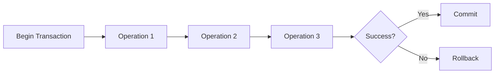

# Transactions in Databases

## Introduction

Database transactions are fundamental to maintaining data integrity in applications. A transaction is a sequence of database operations that are treated as a single logical unit of work. Either all operations within a transaction succeed (commit), or none of them take effect (rollback).

Think of a bank transfer: money must be both withdrawn from one account and deposited to another. If either operation fails, the entire transfer should be canceled to prevent inconsistencies. Transactions make this possible.

## What are Transactions?

A transaction is a logical unit of work that contains one or more database operations (such as `INSERT`, `UPDATE`, or `DELETE`). The key benefit of transactions is that they allow you to group multiple operations together so that either all of them succeed or none of them take effect.



## ACID Properties

Transactions are characterized by four key properties, commonly known as ACID:

### Atomicity

Atomicity ensures that all operations within a transaction are treated as a single unit. Either all operations succeed, or none of them do.

**Example:** Consider transferring $100 from Account A to Account B:
1. Deduct $100 from Account A
2. Add $100 to Account B

If the system fails after step 1 but before step 2, atomicity ensures the transaction is rolled back, and Account A is not debited.

### Consistency

Consistency ensures that a transaction brings the database from one valid state to another valid state, maintaining all predefined rules and constraints.

**Example:** If a database rule states that all accounts must have a non-negative balance, a transaction that would result in a negative balance will be rejected entirely.

### Isolation

Isolation ensures that concurrent execution of transactions leaves the database in the same state as if the transactions were executed sequentially.

**Example:** If two users try to withdraw money from the same account simultaneously, isolation ensures that the withdrawals are processed one after another, preventing both users from withdrawing the same money.

### Durability

Durability guarantees that once a transaction is committed, it remains committed even in the case of a system failure.

**Example:** After a successful transfer is confirmed to the user, that transfer will persist even if the database crashes immediately afterward.

## Transaction Commands in SQL

Here are the basic SQL commands used to control transactions:

### BEGIN TRANSACTION

The `BEGIN TRANSACTION` statement marks the starting point of a transaction.

```sql
BEGIN TRANSACTION;
-- or simply
BEGIN;
```

### COMMIT

The `COMMIT` statement permanently saves all changes made during the current transaction.

```sql
COMMIT;
```

### ROLLBACK

The `ROLLBACK` statement undoes all changes made during the current transaction.

```sql
ROLLBACK;
```

### SAVEPOINT

The `SAVEPOINT` statement creates points within a transaction to which you can roll back without rolling back the entire transaction.

```sql
SAVEPOINT savepoint_name;
```

### ROLLBACK TO SAVEPOINT

The `ROLLBACK TO SAVEPOINT` statement rolls back a transaction to a specific savepoint.

```sql
ROLLBACK TO SAVEPOINT savepoint_name;
```

## Practical Examples

### Example 1: Bank Transfer in SQL

Let's implement a bank transfer transaction in SQL:

```sql
-- Start transaction
BEGIN;

-- Withdraw from account A
UPDATE accounts 
SET balance = balance - 100 
WHERE account_id = 'A';

-- Check if account A has sufficient funds
SELECT balance FROM accounts WHERE account_id = 'A';
-- If balance < 0, then ROLLBACK (we'll assume this check is handled by application code)

-- Deposit to account B
UPDATE accounts 
SET balance = balance + 100 
WHERE account_id = 'B';

-- Commit the transaction
COMMIT;
```

If any error occurs during this process, we would use:

```sql
ROLLBACK;
```

### Example 2: Transaction with Savepoints

```sql
BEGIN;

-- Add a new customer
INSERT INTO customers (name, email) 
VALUES ('John Doe', 'john@example.com');

-- Create a savepoint after adding the customer
SAVEPOINT new_customer;

-- Add address for the customer
INSERT INTO addresses (customer_id, street, city, zip) 
VALUES (LAST_INSERT_ID(), '123 Main St', 'Springfield', '12345');

-- If there's a problem with the address but we want to keep the customer:
-- ROLLBACK TO SAVEPOINT new_customer;

-- Add phone number for the customer
INSERT INTO phone_numbers (customer_id, number, type) 
VALUES (LAST_INSERT_ID(), '555-123-4567', 'mobile');

-- Commit all changes
COMMIT;
```

### Example 3: Transaction in Node.js with MySQL

Here's how you might implement a transaction in a Node.js application using the MySQL package:

```javascript
const mysql = require('mysql2/promise');

async function transferFunds(fromAccount, toAccount, amount) {
  const connection = await mysql.createConnection({
    host: 'localhost',
    user: 'root',
    password: 'password',
    database: 'bank'
  });
  
  try {
    // Start transaction
    await connection.beginTransaction();
    
    // Withdraw from source account
    const [result1] = await connection.execute(
      'UPDATE accounts SET balance = balance - ? WHERE account_id = ?',
      [amount, fromAccount]
    );
    
    // Check sufficient funds (this could be done with a database constraint too)
    const [rows] = await connection.execute(
      'SELECT balance FROM accounts WHERE account_id = ?',
      [fromAccount]
    );
    
    if (rows[0].balance < 0) {
      throw new Error('Insufficient funds');
    }
    
    // Deposit to destination account
    const [result2] = await connection.execute(
      'UPDATE accounts SET balance = balance + ? WHERE account_id = ?',
      [amount, toAccount]
    );
    
    // Commit transaction
    await connection.commit();
    
    return { success: true, message: 'Transfer completed' };
  } catch (error) {
    // Rollback transaction in case of error
    await connection.rollback();
    return { success: false, message: error.message };
  } finally {
    // Close connection
    await connection.end();
  }
}

// Usage
transferFunds('A', 'B', 100)
  .then(result => console.log(result))
  .catch(err => console.error(err));
```

## Transaction Isolation Levels

SQL defines four standard isolation levels that provide different trade-offs between performance and the consistency guarantees they provide:

1. **READ UNCOMMITTED** - Allows dirty reads
2. **READ COMMITTED** - Prevents dirty reads
3. **REPEATABLE READ** - Prevents dirty reads and non-repeatable reads
4. **SERIALIZABLE** - Prevents all concurrency issues

You can set the isolation level in SQL:

```sql
SET TRANSACTION ISOLATION LEVEL READ COMMITTED;
```

## Common Concurrency Problems

Without proper isolation, the following problems can occur:

### Dirty Reads

A transaction reads data that has been modified by another transaction that has not yet been committed.

### Non-repeatable Reads

A transaction reads the same row twice and gets different results because another committed transaction modified the row between reads.

### Phantom Reads

A transaction executes a query that returns a set of rows, and another transaction inserts new rows that match the query, causing the original transaction to see different results if it re-executes the query.

## Best Practices for Using Transactions

1. **Keep transactions short**: Long-running transactions can lock resources and reduce concurrency.

2. **Only include necessary operations**: Include only the operations that must succeed or fail together.

3. **Handle errors properly**: Always include error handling that rolls back transactions when needed.

4. **Choose appropriate isolation levels**: Select the isolation level that provides the necessary guarantees with minimal performance impact.

5. **Be aware of deadlocks**: Design transactions to minimize the risk of deadlocks between competing transactions.

## Summary

Transactions are essential for maintaining data integrity in database systems. They ensure that related operations are treated as a single unit of work that either completely succeeds or completely fails.

The ACID properties (Atomicity, Consistency, Isolation, and Durability) define the guarantees that transactions provide. Different database systems may implement these properties differently, but the core concepts remain the same.

By properly using transactions, you can ensure that your database remains in a consistent state even when errors occur or when multiple users access the data simultaneously.

## Exercises

1. Write a transaction that creates a new order and updates the inventory for each ordered item.

2. Implement error handling in a transaction that transfers funds between accounts.

3. Research how your preferred database system implements transaction isolation levels and what the default level is.

4. Create a scenario where two concurrent transactions might cause a deadlock, and explore ways to prevent it.

5. Implement a transaction with savepoints and practice rolling back to different points within the transaction.

## Additional Resources

- Your database system's documentation on transactions
- Books on database design and SQL programming
- Online courses that cover advanced database concepts
- Practice implementing transactions in your preferred programming language