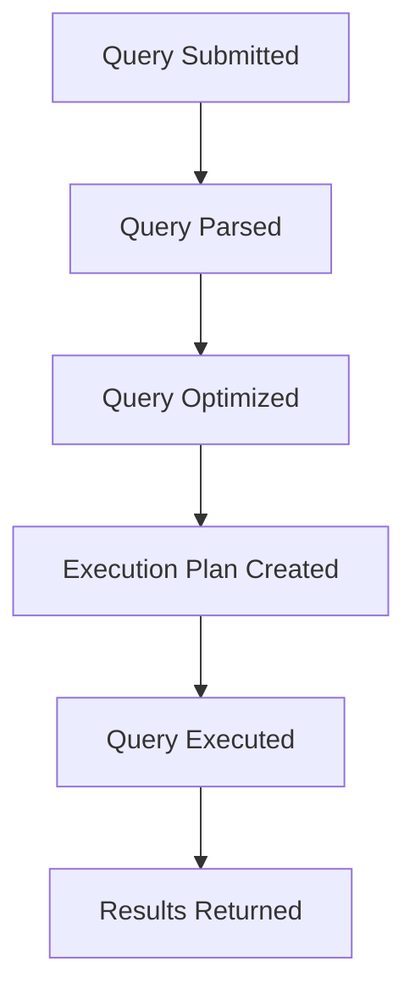

# Database Queries

## Introduction

Database queries are commands used to retrieve, manipulate, or manage data stored in a database. They are the primary way programmers and applications interact with databases to access the information they need. Whether you're building a small personal project or enterprise software, understanding how to create effective database queries is an essential skill for any programmer.

In this tutorial, we'll explore the fundamentals of database queries, focusing on the most widely used query language: SQL (Structured Query Language). By the end, you'll be able to write basic queries to retrieve data, filter results, and perform simple data manipulations.

## What Are Database Queries?

A database query is a request for data or information from a database. Queries can:

- Retrieve specific data (SELECT)
- Insert new data (INSERT)
- Update existing data (UPDATE)
- Delete data (DELETE)
- Create or modify database structures (CREATE, ALTER)

Think of queries as conversations with your database. You ask questions or make requests, and the database responds accordingly.

## SQL: The Language of Database Queries

SQL (pronounced "sequel" or "S-Q-L") is the standard language for interacting with relational databases like MySQL, PostgreSQL, SQL Server, and Oracle. Almost all database systems use SQL or an SQL-like language for queries.

### Basic SQL Query Structure

Most SQL queries follow a similar pattern:

```sql
SELECT column1, column2, ...
FROM table_name
WHERE condition;
```

Let's break down what each part means:

- `SELECT`: Specifies which columns you want to retrieve
- `FROM`: Identifies the table containing the data
- `WHERE`: Filters the results based on specific conditions

## Types of Database Queries

### 1. SELECT Queries

The SELECT query is the most common type, used to retrieve data from one or more tables.

#### Basic SELECT Query

```sql
SELECT first_name, last_name, email
FROM customers;
```

**Output:**
```
+------------+-----------+------------------------+
| first_name | last_name | email                  |
+------------+-----------+------------------------+
| John       | Doe       | john.doe@example.com   |
| Jane       | Smith     | jane.smith@example.com |
| Robert     | Johnson   | robert.j@example.com   |
+------------+-----------+------------------------+
```

#### SELECT with WHERE Clause

The WHERE clause filters records that fulfill a specified condition:

```sql
SELECT product_name, price
FROM products
WHERE price < 50;
```

**Output:**
```
+---------------+-------+
| product_name  | price |
+---------------+-------+
| Basic T-shirt | 19.99 |
| Water Bottle  | 12.50 |
| Notebook      | 4.99  |
+---------------+-------+
```

#### SELECT with ORDER BY

The ORDER BY clause sorts the results:

```sql
SELECT product_name, price
FROM products
ORDER BY price DESC;
```

**Output:**
```
+----------------+--------+
| product_name   | price  |
+----------------+--------+
| Smartphone     | 699.99 |
| Laptop         | 499.99 |
| Wireless Mouse | 29.99  |
| Basic T-shirt  | 19.99  |
| Water Bottle   | 12.50  |
| Notebook       | 4.99   |
+----------------+--------+
```

### 2. INSERT Queries

INSERT queries add new records to a table:

```sql
INSERT INTO customers (first_name, last_name, email)
VALUES ('Michael', 'Brown', 'michael.brown@example.com');
```

### 3. UPDATE Queries

UPDATE queries modify existing records:

```sql
UPDATE products
SET price = 24.99
WHERE product_name = 'Basic T-shirt';
```

### 4. DELETE Queries

DELETE queries remove records from a table:

```sql
DELETE FROM customers
WHERE last_name = 'Johnson';
```

## Advanced Query Concepts

### Joining Tables

One of the most powerful features of SQL is the ability to combine data from multiple tables using JOINs:

```sql
SELECT orders.order_id, customers.first_name, customers.last_name, orders.order_date
FROM orders
JOIN customers ON orders.customer_id = customers.customer_id;
```

**Output:**
```
+----------+------------+-----------+------------+
| order_id | first_name | last_name | order_date |
+----------+------------+-----------+------------+
| 1001     | John       | Doe       | 2023-01-15 |
| 1002     | Jane       | Smith     | 2023-01-16 |
| 1003     | John       | Doe       | 2023-01-20 |
+----------+------------+-----------+------------+
```

### Aggregate Functions

SQL provides functions to perform calculations on data:

```sql
SELECT COUNT(*) as total_customers
FROM customers;
```

**Output:**
```
+-----------------+
| total_customers |
+-----------------+
| 3               |
+-----------------+
```

Other common aggregate functions include:
- `SUM()`: Calculates the sum of a numeric column
- `AVG()`: Calculates the average of a numeric column
- `MIN()`: Returns the minimum value in a column
- `MAX()`: Returns the maximum value in a column

```sql
SELECT 
    AVG(price) as average_price,
    MAX(price) as highest_price,
    MIN(price) as lowest_price
FROM products;
```

**Output:**
```
+---------------+---------------+--------------+
| average_price | highest_price | lowest_price |
+---------------+---------------+--------------+
| 211.24        | 699.99        | 4.99         |
+---------------+---------------+--------------+
```

### GROUP BY Clause

The GROUP BY clause groups rows that have the same values:

```sql
SELECT category, COUNT(*) as product_count
FROM products
GROUP BY category;
```

**Output:**
```
+------------+---------------+
| category   | product_count |
+------------+---------------+
| Electronics | 3             |
| Clothing    | 1             |
| Accessories | 2             |
+------------+---------------+
```

## Query Execution Process

When you submit a query, the database goes through several steps to process it:



Understanding this process can help you write more efficient queries and troubleshoot performance issues.

## Real-World Examples

### E-commerce Product Search

Imagine you're building an e-commerce website and need to display products that match certain criteria:

```sql
SELECT product_name, description, price, stock_quantity
FROM products
WHERE category = 'Electronics'
AND price BETWEEN 100 AND 500
AND stock_quantity > 0
ORDER BY price ASC;
```

This query finds all available electronics products priced between $100 and $500, sorted from lowest to highest price.

### User Authentication

For a login system, you might verify a user's credentials with:

```sql
SELECT user_id, username, role
FROM users
WHERE username = 'user_input_username'
AND password_hash = 'hashed_password_input';
```

> **Important:** Never store plain text passwords in your database! Always hash passwords and compare the hashes.

### Data Analysis

For business reporting, you might analyze order data:

```sql
SELECT 
    DATE_FORMAT(order_date, '%Y-%m') as month,
    COUNT(*) as order_count,
    SUM(total_amount) as total_revenue
FROM orders
WHERE order_date >= '2023-01-01'
GROUP BY DATE_FORMAT(order_date, '%Y-%m')
ORDER BY month;
```

This query generates a monthly report of orders and revenue for 2023.

## Query Optimization Tips

Writing efficient queries is crucial for application performance. Here are some tips:

1. **Select only the columns you need** - Avoid `SELECT *`
2. **Use appropriate indexes** on columns used in WHERE clauses and JOINs
3. **Limit result sets** when possible using LIMIT or TOP
4. **Use specific data types** rather than converting between types in queries
5. **Avoid subqueries** when JOINs can accomplish the same result

## Common SQL Mistakes to Avoid

1. **Missing WHERE clause** in UPDATE or DELETE statements (can affect all records!)
2. **Improper use of quotes** - Use single quotes for string values, not column names
3. **Incorrect JOIN conditions** leading to Cartesian products
4. **Case sensitivity issues** - Database object names might be case-sensitive depending on the database
5. **Not handling NULL values** properly - Use IS NULL or IS NOT NULL

## Practice Exercises

To solidify your understanding, try these exercises:

1. Write a query to select all customers who have placed more than 3 orders.
2. Create a query to find the average order value grouped by customer.
3. Write a query to find products that have never been ordered.
4. Create a query to list the top 5 best-selling products.
5. Write a query to find customers who haven't placed an order in the last 6 months.

## Summary

Database queries are the foundation of data retrieval and manipulation in modern applications. In this tutorial, we've covered:

- The basics of SQL query syntax
- Different types of queries (SELECT, INSERT, UPDATE, DELETE)
- Advanced concepts like JOINs, aggregate functions, and GROUP BY
- Real-world examples and optimization tips

As you continue learning, practice writing different types of queries and experiment with more complex database operations. With time and practice, you'll become proficient in communicating with databases and extracting exactly the information you need.

## Additional Resources

- [SQL Tutorial on W3Schools](https://www.w3schools.com/sql/)
- [PostgreSQL Documentation](https://www.postgresql.org/docs/)
- [MySQL Documentation](https://dev.mysql.com/doc/)
- [SQLite Documentation](https://www.sqlite.org/docs.html)
- [SQL Practice Exercises](https://www.sqlzoo.net)

Remember that different database systems may have slightly different syntax or features, but the core concepts remain the same across most SQL databases.