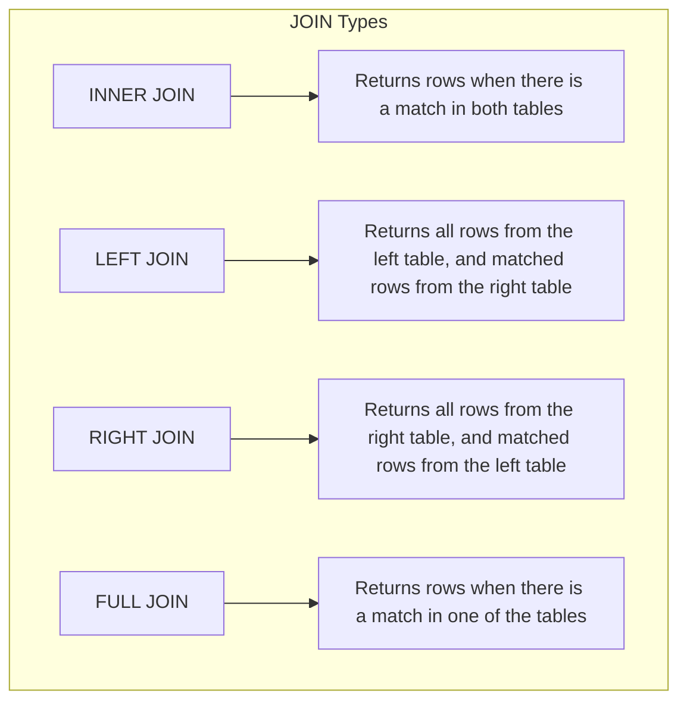

# Common SQL Problems

## Introduction

SQL (Structured Query Language) is the standard language for interacting with relational databases. While SQL is powerful and versatile, beginners often encounter common problems that can be frustrating to debug. This guide will walk you through the most frequent SQL issues, their causes, and how to solve them. Understanding these common pitfalls will help you write more efficient and error-free database queries.

## 1. Syntax Errors

Syntax errors occur when your SQL statement doesn't follow the correct syntax rules. These are typically the easiest to identify as the database will usually provide an error message.

### Common Syntax Issues

#### Missing Semicolons

```sql
-- Incorrect (missing semicolon)
SELECT * FROM customers
SELECT * FROM orders

-- Correct
SELECT * FROM customers;
SELECT * FROM orders;
```

#### Incorrect Quotation Marks

```sql
-- Incorrect (mixing quote types)
SELECT * FROM customers WHERE name = "John's Shop";

-- Correct
SELECT * FROM customers WHERE name = 'John''s Shop';
-- Or
SELECT * FROM customers WHERE name = "John's Shop";  -- In some databases
```

#### Misspelled Keywords

```sql
-- Incorrect
SELCT * FROM customers;

-- Correct
SELECT * FROM customers;
```

## 2. Table or Column Does Not Exist

This error occurs when you reference a table or column that doesn't exist in your database or is misspelled.

```sql
-- Error if "customer" table doesn't exist (maybe it's "customers")
SELECT * FROM customer;

-- Error if "customer_name" column doesn't exist (maybe it's "name")
SELECT customer_name FROM customers;
```

### How to Troubleshoot:

```sql
-- List all tables in the database
SHOW TABLES;  -- MySQL/MariaDB
SELECT table_name FROM information_schema.tables;  -- Standard SQL

-- List all columns in a specific table
DESCRIBE customers;  -- MySQL/MariaDB
PRAGMA table_info(customers);  -- SQLite
SELECT column_name FROM information_schema.columns WHERE table_name = 'customers';  -- Standard SQL
```

## 3. Data Type Mismatches

This occurs when you try to compare or insert values with incompatible data types.

```sql
-- Error: Comparing string to number without conversion
SELECT * FROM products WHERE price = '10.99';

-- Correct approaches
SELECT * FROM products WHERE price = 10.99;
-- Or explicit conversion in some databases:
SELECT * FROM products WHERE price = CAST('10.99' AS DECIMAL);
```

### Real-world Example:

```sql
-- Creating a table with specific data types
CREATE TABLE orders (
  order_id INT PRIMARY KEY,
  customer_id INT,
  order_date DATE,
  total_amount DECIMAL(10, 2)
);

-- This might fail if the date format doesn't match the database's expected format
INSERT INTO orders VALUES (1, 101, '31/12/2023', 145.99);

-- Correct (using ISO format date)
INSERT INTO orders VALUES (1, 101, '2023-12-31', 145.99);
```

## 4. NULL Value Confusion

NULL represents missing or unknown data in SQL. Many beginners struggle with how to properly handle NULL values.

```sql
-- Incorrect: This will not find rows where email is NULL
SELECT * FROM customers WHERE email = NULL;

-- Correct: Use IS NULL or IS NOT NULL
SELECT * FROM customers WHERE email IS NULL;
SELECT * FROM customers WHERE email IS NOT NULL;
```

### Practical Example:

```sql
-- Finding customers without phone numbers
SELECT 
  customer_id, 
  first_name, 
  last_name 
FROM 
  customers 
WHERE 
  phone_number IS NULL;

-- Counting customers with and without email addresses
SELECT 
  COUNT(customer_id) AS total_customers,
  COUNT(email) AS customers_with_email,
  COUNT(*) - COUNT(email) AS customers_without_email
FROM 
  customers;
```

## 5. JOIN Problems

JOINs are powerful but can be confusing for beginners, leading to common issues.

### Cartesian Product (Unintended Cross Join)

```sql
-- Problem: Missing join condition creates a cartesian product
SELECT * FROM orders, customers;

-- Correct: Add proper join condition
SELECT * FROM orders
JOIN customers ON orders.customer_id = customers.customer_id;
```

### Incorrect Join Type

```sql
-- Problem: Using INNER JOIN when you want to keep all customers
SELECT 
  customers.name,
  orders.order_id
FROM 
  customers
INNER JOIN orders ON customers.customer_id = orders.customer_id;

-- Correct: Using LEFT JOIN to keep all customers
SELECT 
  customers.name,
  orders.order_id
FROM 
  customers
LEFT JOIN orders ON customers.customer_id = orders.customer_id;
```

### Visual Representation of JOIN Types



## 6. GROUP BY Misconceptions

GROUP BY is often misunderstood, particularly regarding which columns can be selected.

```sql
-- Error: Selecting a column not in GROUP BY
SELECT 
  customer_id,
  first_name,  -- This will cause an error
  COUNT(order_id) AS order_count
FROM 
  orders
GROUP BY 
  customer_id;

-- Correct: Include all non-aggregated columns in GROUP BY
SELECT 
  customer_id,
  first_name,
  COUNT(order_id) AS order_count
FROM 
  orders
GROUP BY 
  customer_id, first_name;

-- Alternative: Only select grouped or aggregated columns
SELECT 
  customer_id,
  COUNT(order_id) AS order_count
FROM 
  orders
GROUP BY 
  customer_id;
```

## 7. Subquery Issues

Subqueries can be powerful but also cause common problems for beginners.

### Returning Multiple Values in Single-Value Context

```sql
-- Error: Subquery returns multiple rows but is used in a single-value context
SELECT * FROM products 
WHERE price = (SELECT price FROM products WHERE category = 'Electronics');

-- Correct: Use IN operator for multi-row subqueries
SELECT * FROM products 
WHERE price IN (SELECT price FROM products WHERE category = 'Electronics');

-- Or use a specific aggregate function for a single value
SELECT * FROM products 
WHERE price = (SELECT MAX(price) FROM products WHERE category = 'Electronics');
```

### Correlated Subquery Performance

```sql
-- Potentially slow: Correlated subquery runs once per outer row
SELECT 
  customer_id,
  first_name,
  last_name,
  (SELECT COUNT(*) FROM orders WHERE orders.customer_id = customers.customer_id) AS order_count
FROM 
  customers;

-- Often faster: Using JOIN with GROUP BY
SELECT 
  c.customer_id,
  c.first_name,
  c.last_name,
  COUNT(o.order_id) AS order_count
FROM 
  customers c
LEFT JOIN 
  orders o ON c.customer_id = o.customer_id
GROUP BY 
  c.customer_id, c.first_name, c.last_name;
```

## 8. Transaction Management Problems

Proper transaction management is crucial for data integrity but often overlooked by beginners.

```sql
-- Problem: No transaction for multiple related operations
UPDATE accounts SET balance = balance - 100 WHERE account_id = 123;
-- What if the system crashes here?
UPDATE accounts SET balance = balance + 100 WHERE account_id = 456;

-- Correct: Using transactions
BEGIN TRANSACTION;
  UPDATE accounts SET balance = balance - 100 WHERE account_id = 123;
  UPDATE accounts SET balance = balance + 100 WHERE account_id = 456;
COMMIT;
-- Or rollback if something goes wrong
-- ROLLBACK;
```

## 9. Performance Issues

SQL performance issues can be subtle and only appear as your database grows.

### Missing Indexes

```sql
-- Query that might be slow without proper indexes
SELECT * FROM customers WHERE email = 'example@email.com';

-- Solution: Create an index on frequently queried columns
CREATE INDEX idx_customers_email ON customers(email);
```

### Using SELECT *

```sql
-- Inefficient: Selecting all columns when you only need a few
SELECT * FROM large_table WHERE date_column > '2023-01-01';

-- More efficient: Select only needed columns
SELECT customer_id, order_date, total_amount 
FROM large_table 
WHERE date_column > '2023-01-01';
```

### N+1 Query Problem

This happens when you execute a query for a parent record, then execute N additional queries to fetch related child records.

```sql
-- Inefficient approach (conceptual pseudocode):
customers = SELECT * FROM customers LIMIT 10;
for each customer in customers:
    orders = SELECT * FROM orders WHERE customer_id = customer.id;
    -- Process orders
    
-- More efficient: Single query with JOIN
SELECT c.*, o.*
FROM customers c
LEFT JOIN orders o ON c.customer_id = o.customer_id
WHERE c.customer_id IN (/* IDs of the 10 customers */);
```

## 10. Case Sensitivity Issues

SQL case sensitivity can vary between database systems and configurations.

```sql
-- MySQL (default settings): Not case-sensitive for table/column names
SELECT * FROM Customers;  -- Same as SELECT * FROM customers;

-- PostgreSQL: Case-sensitive for table/column names unless quoted
SELECT * FROM "Customers";  -- Not the same as SELECT * FROM customers;

-- Most databases: String comparisons may be case-sensitive
SELECT * FROM customers WHERE name = 'john';  -- May not match 'John'

-- Case-insensitive string comparison
SELECT * FROM customers WHERE UPPER(name) = UPPER('john');
```

## Real-world Application: Customer Order Analysis

Let's tie these concepts together with a comprehensive example analyzing customer order data. This example addresses multiple common SQL problems within a realistic scenario.

```sql
-- Creating sample tables
CREATE TABLE customers (
  customer_id INT PRIMARY KEY,
  first_name VARCHAR(50),
  last_name VARCHAR(50),
  email VARCHAR(100) UNIQUE,
  signup_date DATE
);

CREATE TABLE orders (
  order_id INT PRIMARY KEY,
  customer_id INT,
  order_date DATE,
  total_amount DECIMAL(10, 2),
  status VARCHAR(20),
  FOREIGN KEY (customer_id) REFERENCES customers(customer_id)
);

-- Analyzing customer order patterns
-- This query handles NULLs, uses proper JOIN, avoids GROUP BY issues, and selects only needed columns
SELECT 
  c.customer_id,
  c.first_name || ' ' || c.last_name AS customer_name,
  COUNT(o.order_id) AS total_orders,
  COALESCE(SUM(o.total_amount), 0) AS total_spent,
  MIN(o.order_date) AS first_order_date,
  MAX(o.order_date) AS most_recent_order,
  ROUND(AVG(o.total_amount), 2) AS average_order_value
FROM 
  customers c
LEFT JOIN 
  orders o ON c.customer_id = o.customer_id
GROUP BY 
  c.customer_id, c.first_name, c.last_name
HAVING 
  COUNT(o.order_id) > 0
ORDER BY 
  total_spent DESC
LIMIT 10;
```

This query demonstrates:
- Proper `LEFT JOIN` usage to include all customers
- Handling NULL values with `COALESCE`
- String concatenation for better output formatting
- Using proper column names in `GROUP BY`
- Value formatting with `ROUND`
- Using `HAVING` to filter grouped results
- Limiting results for better performance

## Summary

In this guide, we've covered the most common SQL problems beginners face, including:

1. Syntax errors and how to fix them
2. Table and column reference issues
3. Data type mismatches and proper conversions
4. NULL value handling techniques
5. JOIN complications and solutions
6. GROUP BY misconceptions
7. Subquery challenges
8. Transaction management best practices
9. Performance optimization strategies
10. Case sensitivity considerations

Understanding these common issues will help you write more reliable, efficient, and error-free SQL queries. Remember that database systems may differ in specific syntax and behavior, so always consult your database's documentation for system-specific details.

## Practice Exercises

1. Debug the following query:
   ```sql
   SELECT customer_name count(order_id) AS total_orders
   FROM customer
   JOIN order ON customer.id = order.customer_id
   GROUP BY customer_id;
   ```

2. Optimize this inefficient query:
   ```sql
   SELECT * FROM products 
   WHERE product_name LIKE '%laptop%' 
   ORDER BY price ASC;
   ```

3. Fix the transaction handling:
   ```sql
   UPDATE inventory SET quantity = quantity - 5 WHERE product_id = 101;
   INSERT INTO order_items (order_id, product_id, quantity) VALUES (1001, 101, 5);
   ```

## Additional Resources

- [SQL Zoo](https://sqlzoo.net/) - Interactive SQL Tutorial
- [Mode Analytics SQL Tutorial](https://mode.com/sql-tutorial/)
- [PostgreSQL Documentation](https://www.postgresql.org/docs/)
- [MySQL Documentation](https://dev.mysql.com/doc/)
- [SQLite Documentation](https://sqlite.org/docs.html)

Remember that practice is key to mastering SQL. Work through exercises regularly and don't be discouraged by errors - they're valuable learning opportunities!