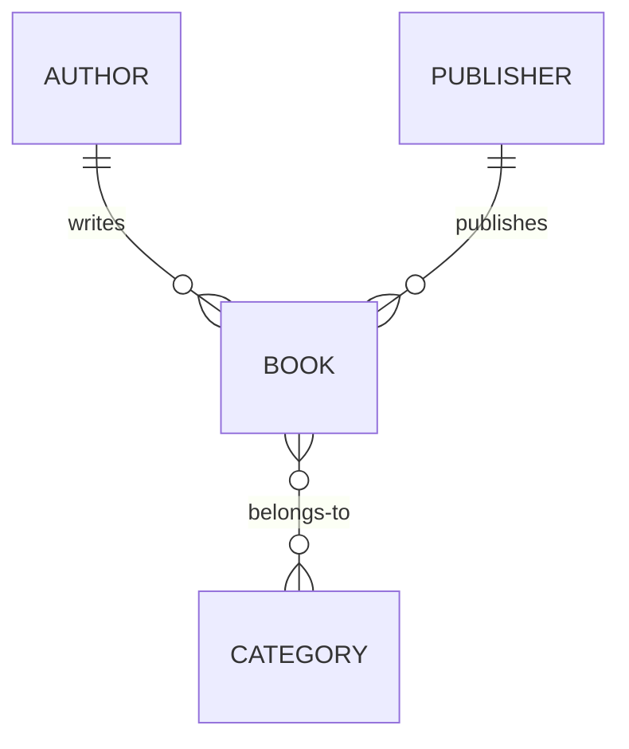
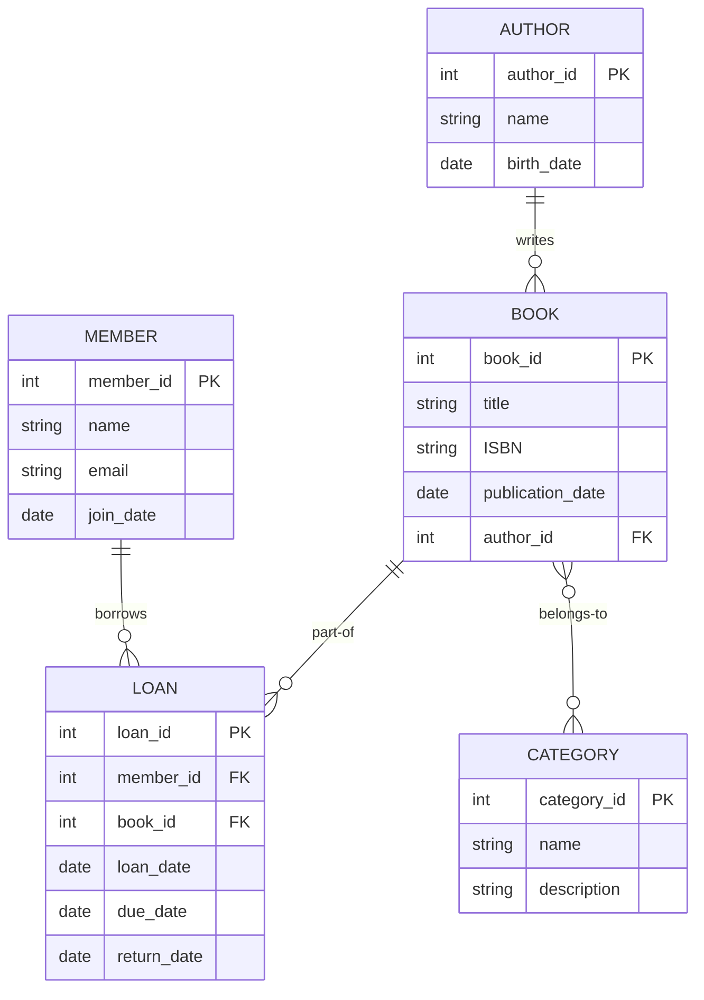
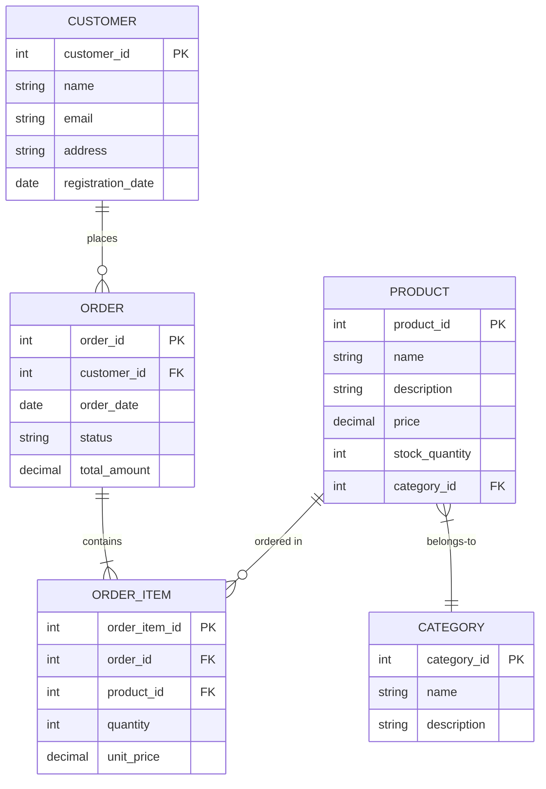

# Database Schema Design

## Introduction

Database schema design is the process of planning and organizing how data will be stored in a database. Think of it as creating the blueprint for your database before you actually build it. A well-designed schema ensures data integrity, reduces redundancy, improves performance, and makes your database easier to maintain and scale as your application grows.

In this guide, we'll explore the fundamentals of database schema design, from identifying entities and relationships to implementing normalization techniques that will help you create efficient and robust database structures.

## Key Concepts in Database Schema Design

### Entities and Attributes

An **entity** represents a real-world object, concept, or event about which you want to store data. For example, in a library database, entities might include `Book`, `Author`, `Member`, and `Loan`.

**Attributes** are properties or characteristics of an entity. For example, a `Book` entity might have attributes like `title`, `ISBN`, `publication_date`, and `page_count`.

```sql
-- Example of a Books table definition
CREATE TABLE Books (
    book_id INT PRIMARY KEY,
    title VARCHAR(200) NOT NULL,
    ISBN VARCHAR(13) UNIQUE,
    publication_date DATE,
    page_count INT,
    publisher_id INT
);
```

### Relationships

Relationships define how entities are connected to each other. There are three main types of relationships:

1. **One-to-One (1:1)**: Each record in Table A relates to exactly one record in Table B, and vice versa.
2. **One-to-Many (1:N)**: Each record in Table A can relate to multiple records in Table B, but each record in Table B relates to only one record in Table A.
3. **Many-to-Many (M:N)**: Each record in Table A can relate to multiple records in Table B, and vice versa.



In the diagram above:
- An author can write multiple books, but each book has only one author (One-to-Many)
- A publisher can publish multiple books, but each book has only one publisher (One-to-Many)
- A book can belong to multiple categories, and each category can have multiple books (Many-to-Many)

### Primary and Foreign Keys

A **primary key** uniquely identifies each record in a table. It must contain unique values and cannot be null.

A **foreign key** is a field in one table that refers to the primary key in another table, establishing a relationship between the two tables.

```sql
-- Example of tables with primary and foreign keys
CREATE TABLE Publishers (
    publisher_id INT PRIMARY KEY,
    name VARCHAR(100) NOT NULL,
    founded_year INT
);

CREATE TABLE Books (
    book_id INT PRIMARY KEY,
    title VARCHAR(200) NOT NULL,
    publisher_id INT,
    FOREIGN KEY (publisher_id) REFERENCES Publishers(publisher_id)
);
```

## Entity-Relationship (ER) Modeling

Entity-Relationship modeling is a technique used to visualize the design of a database. An ER diagram helps identify entities, attributes, and relationships before implementing the actual database.

### Steps to Create an ER Diagram:

1. **Identify entities**: Determine the main objects in your system.
2. **Identify attributes**: Define the properties of each entity.
3. **Establish relationships**: Determine how entities relate to each other.
4. **Assign cardinality**: Specify the type of relationship (1:1, 1:N, M:N).

Here's a simple ER diagram for a library management system:



## Database Normalization

Normalization is the process of organizing data in a database to reduce redundancy and improve data integrity. It involves dividing large tables into smaller, more manageable ones and defining relationships between them.

### First Normal Form (1NF)

A table is in 1NF if:
- It has a primary key
- Each column contains atomic (indivisible) values
- There are no repeating groups

**Before 1NF:**
```
| book_id | title           | authors                     |
|---------|-----------------|------------------------------|
| 1       | Database Design | John Smith, Sarah Johnson    |
```

**After 1NF:**
```
| book_id | title           | author_name    |
|---------|-----------------|----------------|
| 1       | Database Design | John Smith     |
| 1       | Database Design | Sarah Johnson  |
```

### Second Normal Form (2NF)

A table is in 2NF if:
- It is in 1NF
- All non-key attributes are fully functionally dependent on the primary key

**Before 2NF:**
```
| book_id | author_id | title           | author_name    |
|---------|-----------|-----------------|----------------|
| 1       | 101       | Database Design | John Smith     |
| 1       | 102       | Database Design | Sarah Johnson  |
```

**After 2NF:**
```
| book_id | title           |
|---------|-----------------|
| 1       | Database Design |

| book_id | author_id |
|---------|-----------|
| 1       | 101       |
| 1       | 102       |

| author_id | author_name    |
|-----------|----------------|
| 101       | John Smith     |
| 102       | Sarah Johnson  |
```

### Third Normal Form (3NF)

A table is in 3NF if:
- It is in 2NF
- It has no transitive dependencies (non-key attributes depending on other non-key attributes)

**Before 3NF:**
```
| book_id | publisher_id | publisher_name      | publisher_city |
|---------|--------------|---------------------|----------------|
| 1       | 201          | TechBooks Publishing| New York       |
```

**After 3NF:**
```
| book_id | publisher_id |
|---------|--------------|
| 1       | 201          |

| publisher_id | publisher_name        | publisher_city |
|--------------|----------------------|----------------|
| 201          | TechBooks Publishing | New York       |
```

## Practical Database Schema Design Example

Let's design a schema for a simple e-commerce system:



SQL implementation:

```sql
-- Create tables for e-commerce database
CREATE TABLE Customers (
    customer_id INT PRIMARY KEY,
    name VARCHAR(100) NOT NULL,
    email VARCHAR(100) UNIQUE NOT NULL,
    address TEXT,
    registration_date DATE DEFAULT CURRENT_DATE
);

CREATE TABLE Categories (
    category_id INT PRIMARY KEY,
    name VARCHAR(50) NOT NULL,
    description TEXT
);

CREATE TABLE Products (
    product_id INT PRIMARY KEY,
    name VARCHAR(100) NOT NULL,
    description TEXT,
    price DECIMAL(10, 2) NOT NULL,
    stock_quantity INT NOT NULL DEFAULT 0,
    category_id INT,
    FOREIGN KEY (category_id) REFERENCES Categories(category_id)
);

CREATE TABLE Orders (
    order_id INT PRIMARY KEY,
    customer_id INT NOT NULL,
    order_date TIMESTAMP DEFAULT CURRENT_TIMESTAMP,
    status VARCHAR(20) DEFAULT 'pending',
    total_amount DECIMAL(10, 2),
    FOREIGN KEY (customer_id) REFERENCES Customers(customer_id)
);

CREATE TABLE Order_Items (
    order_item_id INT PRIMARY KEY,
    order_id INT NOT NULL,
    product_id INT NOT NULL,
    quantity INT NOT NULL,
    unit_price DECIMAL(10, 2) NOT NULL,
    FOREIGN KEY (order_id) REFERENCES Orders(order_id),
    FOREIGN KEY (product_id) REFERENCES Products(product_id)
);
```

## Best Practices for Database Schema Design

1. **Plan Before Implementation**: Spend time understanding requirements and designing your schema before writing any SQL.

2. **Use Appropriate Data Types**: Choose the right data types for your columns to optimize storage and performance.

3. **Apply Normalization**: Normalize your database to reduce redundancy, but be mindful of performance implications.

4. **Name Consistently**: Use consistent naming conventions for tables, columns, and constraints.

5. **Document Your Schema**: Keep documentation of your database schema, including diagrams and descriptions.

6. **Consider Indexing**: Add indexes to columns frequently used in WHERE clauses or JOIN conditions to improve query performance.

7. **Plan for Growth**: Design your schema to accommodate future growth and changes in requirements.

8. **Test With Real Data**: Test your schema with realistic data volumes to identify potential performance issues.

## Common Schema Design Patterns

### Hierarchical Data Storage

For storing hierarchical data like categories and subcategories:

```sql
CREATE TABLE Categories (
    category_id INT PRIMARY KEY,
    name VARCHAR(50) NOT NULL,
    parent_id INT,
    FOREIGN KEY (parent_id) REFERENCES Categories(category_id)
);
```

### Handling Many-to-Many Relationships

Many-to-many relationships require a junction (or bridge) table:

```sql
CREATE TABLE Products (
    product_id INT PRIMARY KEY,
    name VARCHAR(100) NOT NULL
);

CREATE TABLE Tags (
    tag_id INT PRIMARY KEY,
    name VARCHAR(50) NOT NULL
);

CREATE TABLE Product_Tags (
    product_id INT,
    tag_id INT,
    PRIMARY KEY (product_id, tag_id),
    FOREIGN KEY (product_id) REFERENCES Products(product_id),
    FOREIGN KEY (tag_id) REFERENCES Tags(tag_id)
);
```

### Temporal Data

For tracking changes over time:

```sql
CREATE TABLE Product_Prices (
    price_id INT PRIMARY KEY,
    product_id INT,
    price DECIMAL(10, 2) NOT NULL,
    effective_from DATE NOT NULL,
    effective_to DATE,
    FOREIGN KEY (product_id) REFERENCES Products(product_id)
);
```

## Summary

Database schema design is a critical part of building effective database systems. By understanding entities, relationships, and normalization principles, you can create schemas that are efficient, maintainable, and scalable. Remember that good schema design balances theoretical best practices with practical considerations for your specific application.

A well-designed schema will:
- Ensure data integrity through proper constraints
- Minimize redundancy through normalization
- Support efficient queries through appropriate indexing
- Adapt to changing requirements through thoughtful design

## Exercises

1. Design a database schema for a university system with entities like Student, Course, Instructor, and Department.

2. Take an existing database with data redundancy issues and normalize it to 3NF.

3. Create an ER diagram for a social media platform with Users, Posts, Comments, and Likes.

4. Implement a schema for a movie database that includes films, actors, directors, and genres.

## Additional Resources

- Books:
  - "Database Design for Mere Mortals" by Michael J. Hernandez
  - "SQL Antipatterns" by Bill Karwin

- Online courses:
  - Stanford's "Introduction to Databases"
  - Khan Academy's "SQL and Databases"

- Tools:
  - Draw.io for creating ER diagrams
  - MySQL Workbench for visual schema design
  - PostgreSQL's pgAdmin for database management