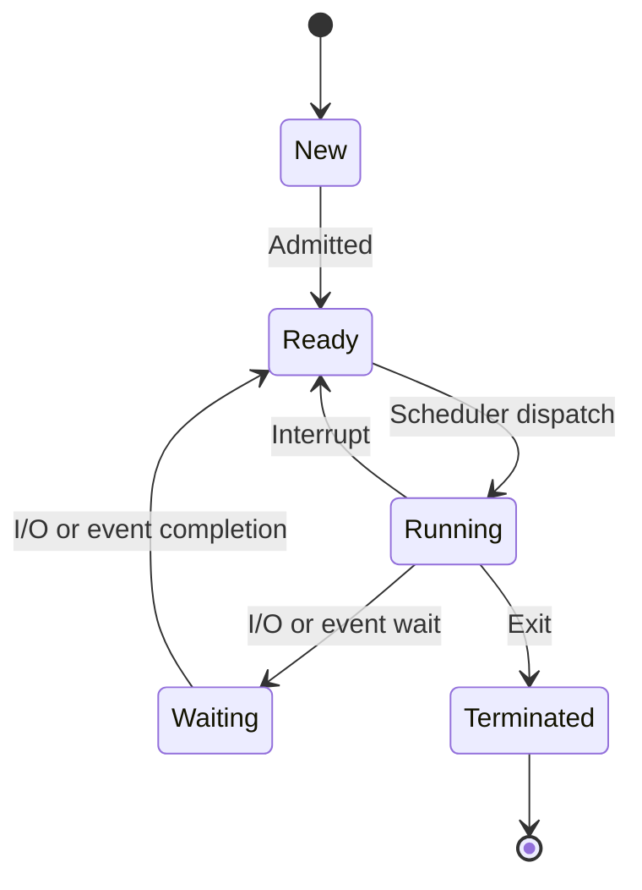

# Process Management

## Introduction

Process management is one of the fundamental responsibilities of an operating system. A process is simply a program in execution - when you run an application like a web browser or text editor, the operating system creates one or more processes to execute that program. Understanding how processes work is essential for any programmer wanting to build efficient software.

In this article, we'll explore what processes are, how they're managed by the operating system, and how they communicate with each other. We'll also look at practical examples to solidify these concepts.

## What is a Process?

A process is a program in execution. When you start an application, the operating system:
1. Loads the program code into memory
2. Allocates memory for variables and data structures
3. Sets up resources like file handles
4. Begins execution at the program's entry point

Each process has its own memory space and set of resources, which helps maintain isolation between different applications.

### Process vs Program

A common confusion is between processes and programs:

| Program | Process |
|---------|---------|
| Passive entity | Active entity |
| Code stored on disk | Program in execution |
| Static | Dynamic |
| One program | Can have multiple processes |

For example, opening multiple tabs in a web browser might create multiple processes, all running the same program code.

## Process States

During its lifetime, a process can exist in various states. The basic process state model includes:



- **New**: The process is being created
- **Ready**: The process is waiting to be assigned to a processor
- **Running**: Instructions are being executed
- **Waiting**: The process is waiting for some event to occur (such as an I/O operation)
- **Terminated**: The process has finished execution

## Process Control Block (PCB)

The operating system maintains information about each process in a data structure called the Process Control Block (PCB). This structure contains:

- Process ID (PID)
- Process state
- Program counter (pointing to the next instruction)
- CPU registers
- CPU scheduling information
- Memory management information
- I/O status information
- Accounting information

Here's a simplified version of what a PCB might look like in C:

```c
struct PCB {
    int process_id;
    enum {NEW, READY, RUNNING, WAITING, TERMINATED} state;
    int program_counter;
    int cpu_registers[16];
    int priority;
    struct MemoryInfo *memory_info;
    struct IOInfo *io_info;
    // Other information
};
```

## Process Scheduling

Since computers have a limited number of CPUs but often need to run many processes, the operating system must decide which processes run when. This is handled by the process scheduler.

### Scheduling Algorithms

Several scheduling algorithms exist, each with its own advantages:

1. **First-Come, First-Served (FCFS)**: Processes are executed in the order they arrive
2. **Shortest Job First (SJF)**: Processes with the shortest estimated execution time run first
3. **Priority Scheduling**: Processes with higher priority run first
4. **Round Robin**: Each process gets a small time slice, then returns to the ready queue
5. **Multilevel Queue**: Processes are assigned to different queues with different priorities

Let's see a simple example of Round Robin scheduling with a time quantum of 2 time units:

```
Process | Burst Time
--------|-----------
P1      | 5
P2      | 3
P3      | 8

Execution Order: P1(2) → P2(2) → P3(2) → P1(2) → P2(1) → P3(2) → P1(1) → P3(2) → P3(2)
```

The numbers in parentheses indicate how many time units each process runs before being preempted.

## Process Creation

Operating systems use system calls to create new processes. In Unix-like systems, processes are created using the `fork()` system call, which creates a copy of the calling process. The new process (child) gets a new PID but initially has the same code, data, and resources as the parent.

Here's a simple example of process creation using `fork()` in C:

```c
#include <stdio.h>
#include <unistd.h>

int main() {
    pid_t pid = fork();
    
    if (pid < 0) {
        // Error occurred
        fprintf(stderr, "Fork failed
");
        return 1;
    } else if (pid == 0) {
        // Child process
        printf("Child process (PID: %d)
", getpid());
    } else {
        // Parent process
        printf("Parent process (PID: %d), created child (PID: %d)
", getpid(), pid);
    }
    
    return 0;
}
```

**Output:**
```
Parent process (PID: 5432), created child (PID: 5433)
Child process (PID: 5433)
```

After `fork()`, the child process often uses the `exec()` family of system calls to replace its memory space with a new program.

## Inter-Process Communication (IPC)

Processes need to communicate with each other, but they have separate memory spaces. The operating system provides several mechanisms for inter-process communication:

1. **Pipes**: Allow one-way communication between related processes
2. **Named Pipes (FIFOs)**: Allow communication between unrelated processes
3. **Message Queues**: Store messages until they're retrieved
4. **Shared Memory**: Multiple processes access the same memory region
5. **Semaphores**: Synchronize access to shared resources
6. **Sockets**: Allow communication between processes on different machines

### Example: Pipe Communication

Here's a simple example of using a pipe for communication between a parent and child process:

```c
#include <stdio.h>
#include <stdlib.h>
#include <unistd.h>
#include <string.h>

int main() {
    int pipe_fd[2];
    pid_t pid;
    char message[] = "Hello from parent!";
    char buffer[100];
    
    // Create pipe
    if (pipe(pipe_fd) == -1) {
        perror("Pipe creation failed");
        exit(1);
    }
    
    pid = fork();
    
    if (pid < 0) {
        perror("Fork failed");
        exit(1);
    } else if (pid == 0) {
        // Child process: read from pipe
        close(pipe_fd[1]);  // Close write end
        
        read(pipe_fd[0], buffer, sizeof(buffer));
        printf("Child received: %s
", buffer);
        
        close(pipe_fd[0]);
    } else {
        // Parent process: write to pipe
        close(pipe_fd[0]);  // Close read end
        
        write(pipe_fd[1], message, strlen(message) + 1);
        printf("Parent sent: %s
", message);
        
        close(pipe_fd[1]);
    }
    
    return 0;
}
```

**Output:**
```
Parent sent: Hello from parent!
Child received: Hello from parent!
```

## Threads vs Processes

While processes are independent execution units with separate memory spaces, threads are "lightweight processes" that share the same memory space:

| Processes | Threads |
|-----------|---------|
| Separate memory space | Shared memory space |
| Communication is expensive | Communication is inexpensive |
| Context switching is expensive | Context switching is cheaper |
| More isolated (fault in one process doesn't affect others) | Less isolated (fault in one thread can affect all threads) |

Many modern applications use a combination of processes and threads to balance isolation and efficiency.

## Real-World Applications

Process management concepts are vital in many real-world scenarios:

1. **Web Servers**: Handle multiple concurrent connections using processes or threads
2. **Mobile Operating Systems**: Manage battery usage by controlling which processes run
3. **Database Systems**: Ensure transactions are processed correctly even with concurrent access
4. **Video Games**: Balance graphics rendering, physics calculations, and user input in separate processes

## Practical Example: System Monitoring

On Unix-like systems, you can use tools like `ps` and `top` to monitor processes:

```bash
# List all processes
ps aux

# Interactive process viewer
top
```

In Python, you can use the `psutil` library to get process information:

```python
import psutil

# Get list of running processes
for proc in psutil.process_iter(['pid', 'name', 'username']):
    print(proc.info)

# Get CPU and memory usage of a specific process
process = psutil.Process(1234)  # replace with actual PID
print(f"CPU usage: {process.cpu_percent()}%")
print(f"Memory usage: {process.memory_info().rss / (1024 * 1024):.2f} MB")
```

## Summary

Process management is a core function of operating systems, involving:

- Creating and terminating processes
- Suspending and resuming processes
- Synchronizing processes
- Communication between processes
- Deadlock handling

Understanding these concepts is essential for writing efficient, concurrent programs and for debugging performance issues in complex applications.

## Exercises

1. Write a program that creates a child process using `fork()` and has the child process print the numbers 1 to 10 while the parent prints the letters A to J. Make sure they print in alternating order.

2. Research how your favorite application uses processes and threads. Does it spawn multiple processes, or does it use threads within a single process?

3. Implement a simple producer-consumer problem using shared memory and semaphores.

## Further Reading

- "Operating System Concepts" by Silberschatz, Galvin, and Gagne
- "Modern Operating Systems" by Andrew S. Tanenbaum
- The Linux man pages for system calls like `fork()`, `exec()`, and `wait()`
- The POSIX threads (pthreads) documentation