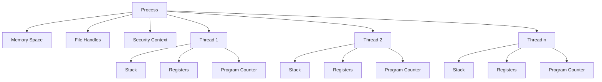
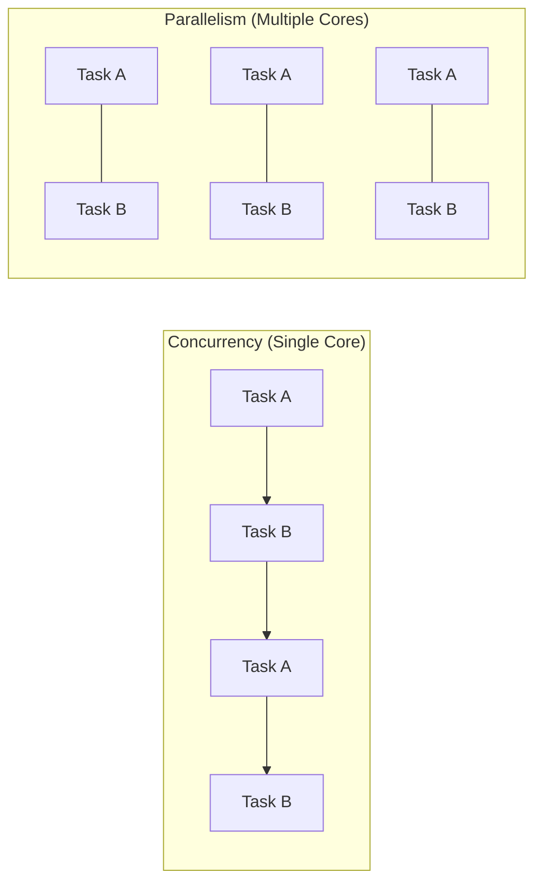
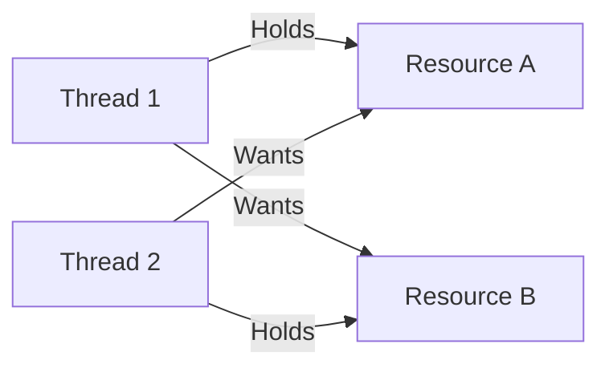

# Threading and Concurrency

## Introduction

In modern computing, doing multiple things at once is essential. Whether you're using a smartphone that runs apps while checking for notifications, or a web server handling thousands of requests simultaneously, the concepts of threading and concurrency are at work behind the scenes.

Threading and concurrency allow operating systems and applications to perform multiple operations simultaneously, maximizing CPU usage and improving responsiveness. These concepts are fundamental to understanding how modern software works efficiently on multi-core processors.

In this tutorial, we'll explore:
- What threads and processes are
- How concurrency differs from parallelism
- Common concurrency problems
- Synchronization mechanisms
- Real-world applications of threading and concurrency

## Processes vs. Threads

### What is a Process?

A process is an executing instance of a program. The operating system allocates resources to each process, including:

- Memory space (both code and data)
- File handles
- Security context
- At least one thread of execution

Each process is isolated from other processes, with its own dedicated resources.

### What is a Thread?

A thread is the smallest unit of execution within a process. Threads within the same process share:

- The same memory space (heap)
- File handles
- Other process resources

However, each thread has its own:
- Stack (for local variables)
- Register values
- Program counter
- Thread-specific data



### Key Differences

| Feature | Process | Thread |
|---------|---------|--------|
| Creation time | Slower | Faster |
| Context switching | Expensive | Less expensive |
| Memory isolation | Complete isolation | Shared memory |
| Communication | Inter-process communication (IPC) required | Direct memory access |
| Failure impact | Other processes unaffected | Can crash entire process |

## Concurrency vs. Parallelism

### Concurrency

Concurrency is about dealing with multiple things at once. It doesn't necessarily mean executing tasks simultaneously. Instead, it involves managing the execution of multiple tasks by interleaving their operations.

Think of a chef preparing multiple dishes by switching between them - chopping vegetables for one dish, then stirring another, then checking the oven for a third.

### Parallelism

Parallelism is about doing multiple things simultaneously. It requires multiple execution units (like CPU cores).

Think of multiple chefs working together in a kitchen, each preparing a different dish simultaneously.



> **Key insight**: Concurrency is about structure; parallelism is about execution. You need concurrency to achieve parallelism, but you can have concurrency without parallelism.

## Thread Implementation: A Simple Example

Let's look at a basic example of creating and using threads in different programming languages:

### Python Example

```python
import threading
import time

def print_numbers():
    for i in range(5):
        time.sleep(0.5)
        print(f"Number thread: {i}")

def print_letters():
    for letter in 'abcde':
        time.sleep(0.7)
        print(f"Letter thread: {letter}")

# Create threads
number_thread = threading.Thread(target=print_numbers)
letter_thread = threading.Thread(target=print_letters)

# Start threads
print("Starting threads...")
number_thread.start()
letter_thread.start()

# Wait for threads to complete
number_thread.join()
letter_thread.join()
print("Threads completed!")
```

Output:
```
Starting threads...
Number thread: 0
Letter thread: a
Number thread: 1
Number thread: 2
Letter thread: b
Number thread: 3
Letter thread: c
Number thread: 4
Letter thread: d
Letter thread: e
Threads completed!
```

### Java Example

```java
class NumberThread extends Thread {
    public void run() {
        try {
            for (int i = 0; i < 5; i++) {
                Thread.sleep(500);
                System.out.println("Number thread: " + i);
            }
        } catch (InterruptedException e) {
            System.out.println("Number thread interrupted.");
        }
    }
}

class LetterThread extends Thread {
    public void run() {
        try {
            char[] letters = {'a', 'b', 'c', 'd', 'e'};
            for (char letter : letters) {
                Thread.sleep(700);
                System.out.println("Letter thread: " + letter);
            }
        } catch (InterruptedException e) {
            System.out.println("Letter thread interrupted.");
        }
    }
}

public class ThreadDemo {
    public static void main(String[] args) {
        System.out.println("Starting threads...");
        
        NumberThread t1 = new NumberThread();
        LetterThread t2 = new LetterThread();
        
        t1.start();
        t2.start();
        
        try {
            t1.join();
            t2.join();
        } catch (InterruptedException e) {
            System.out.println("Main thread interrupted.");
        }
        
        System.out.println("Threads completed!");
    }
}
```

## Common Concurrency Problems

### Race Conditions

A race condition occurs when multiple threads access and modify shared data simultaneously, causing unpredictable behavior.

#### Example of a Race Condition:

```python
import threading

counter = 0

def increment():
    global counter
    for _ in range(100000):
        # This operation is not atomic!
        # It involves: read counter, add 1, write counter
        counter += 1

# Create threads
t1 = threading.Thread(target=increment)
t2 = threading.Thread(target=increment)

# Start threads
t1.start()
t2.start()

# Wait for completion
t1.join()
t2.join()

print(f"Final counter value: {counter}")
# Expected: 200000
# Actual: Less than 200000 due to race condition
```

### Deadlocks

A deadlock occurs when two or more threads are blocked forever, waiting for each other to release resources.



#### Deadlock Example:

```python
import threading
import time

# Create locks
lock_a = threading.Lock()
lock_b = threading.Lock()

def thread_1():
    print("Thread 1: Attempting to acquire Lock A")
    lock_a.acquire()
    print("Thread 1: Acquired Lock A")
    
    time.sleep(0.5)  # Create opportunity for deadlock
    
    print("Thread 1: Attempting to acquire Lock B")
    lock_b.acquire()
    print("Thread 1: Acquired Lock B")
    
    # Release locks
    lock_b.release()
    lock_a.release()

def thread_2():
    print("Thread 2: Attempting to acquire Lock B")
    lock_b.acquire()
    print("Thread 2: Acquired Lock B")
    
    time.sleep(0.5)  # Create opportunity for deadlock
    
    print("Thread 2: Attempting to acquire Lock A")
    lock_a.acquire()
    print("Thread 2: Acquired Lock A")
    
    # Release locks
    lock_a.release()
    lock_b.release()

# Create threads
t1 = threading.Thread(target=thread_1)
t2 = threading.Thread(target=thread_2)

# Start threads
t1.start()
t2.start()

# Wait for completion
t1.join()
t2.join()

print("No deadlock occurred")
```

### Starvation

Starvation occurs when a thread is unable to gain regular access to shared resources and is unable to make progress.

### Livelock

A livelock occurs when threads are actively responding to each other but cannot make progress. It's like two people in a hallway who keep moving to let each other pass but end up blocking each other.

## Synchronization Mechanisms

To solve concurrency problems, operating systems provide various synchronization mechanisms:

### Mutexes (Mutual Exclusion)

A mutex is a lock that ensures only one thread can access a resource at a time.

```python
import threading

counter = 0
mutex = threading.Lock()

def safe_increment():
    global counter
    for _ in range(100000):
        mutex.acquire()
        try:
            counter += 1
        finally:
            mutex.release()

# Create threads
t1 = threading.Thread(target=safe_increment)
t2 = threading.Thread(target=safe_increment)

# Start threads
t1.start()
t2.start()

# Wait for completion
t1.join()
t2.join()

print(f"Final counter value: {counter}")  # Correctly outputs 200000
```

### Semaphores

A semaphore controls access to a resource by multiple threads using a counter.

```python
import threading
import time

# Semaphore limiting to 2 concurrent threads
semaphore = threading.Semaphore(2)

def access_resource(thread_id):
    print(f"Thread {thread_id}: Waiting to access resource")
    
    semaphore.acquire()
    try:
        print(f"Thread {thread_id}: Accessing resource")
        time.sleep(2)  # Simulate resource usage
    finally:
        print(f"Thread {thread_id}: Releasing resource")
        semaphore.release()

# Create and start 5 threads
threads = []
for i in range(5):
    t = threading.Thread(target=access_resource, args=(i,))
    threads.append(t)
    t.start()

# Wait for all threads to complete
for t in threads:
    t.join()
```

### Monitors

A monitor is a high-level synchronization mechanism that allows threads to have mutual exclusion and the ability to wait for a condition to become true.

### Condition Variables

Condition variables allow threads to wait until a specific condition occurs.

```python
import threading
import time

# Shared resources
item = None
condition = threading.Condition()

def producer():
    global item
    
    time.sleep(1)  # Simulate work
    
    with condition:
        item = "Product"
        print("Producer created item")
        condition.notify()  # Notify consumer

def consumer():
    global item
    
    with condition:
        while item is None:
            print("Consumer waiting...")
            condition.wait()  # Wait for producer
        
        print(f"Consumer consumed {item}")

# Create threads
producer_thread = threading.Thread(target=producer)
consumer_thread = threading.Thread(target=consumer)

# Start threads
consumer_thread.start()  # Start consumer first (it will wait)
producer_thread.start()

# Wait for threads to complete
consumer_thread.join()
producer_thread.join()
```

## Thread Pools

Creating threads has overhead. Thread pools maintain a collection of ready-to-use threads for executing tasks.

```python
import concurrent.futures
import time

def task(name):
    print(f"Task {name} started")
    time.sleep(1)  # Simulate work
    return f"Task {name} completed"

# Create a thread pool with 3 worker threads
with concurrent.futures.ThreadPoolExecutor(max_workers=3) as executor:
    # Submit 5 tasks
    futures = [executor.submit(task, i) for i in range(5)]
    
    # Process results as they complete
    for future in concurrent.futures.as_completed(futures):
        print(future.result())
```

## Real-World Applications

### Web Servers

Web servers use threading or asynchronous I/O to handle multiple client requests simultaneously.

```python
# Simplified example of a threaded web server
import socket
import threading

def handle_client(client_socket):
    # Receive request
    request = client_socket.recv(1024).decode()
    
    # Process request (simplified)
    response = """HTTP/1.1 200 OK\r
Content-Type: text/html\r
\r
<html><body><h1>Hello, World!</h1></body></html>"""
    
    # Send response
    client_socket.send(response.encode())
    client_socket.close()

def start_server():
    server_socket = socket.socket(socket.AF_INET, socket.SOCK_STREAM)
    server_socket.bind(('0.0.0.0', 8080))
    server_socket.listen(5)
    
    print("Server listening on port 8080")
    
    while True:
        client_socket, addr = server_socket.accept()
        print(f"Accepted connection from {addr}")
        
        # Create a new thread to handle the client
        client_handler = threading.Thread(target=handle_client, args=(client_socket,))
        client_handler.start()

# To run the server: start_server()
```

### GUI Applications

GUI applications use threading to keep the user interface responsive while performing operations in the background.

### Parallel Data Processing

Applications that process large datasets can use threading to divide work among multiple CPU cores.

```python
import concurrent.futures
import time

def process_chunk(data_chunk):
    # Simulate complex data processing
    result = sum(x * x for x in data_chunk)
    return result

def parallel_processing_example():
    # Create a large dataset
    data = list(range(10000000))
    
    # Divide data into chunks
    chunk_size = len(data) // 8  # For 8 cores
    chunks = [data[i:i + chunk_size] for i in range(0, len(data), chunk_size)]
    
    start_time = time.time()
    
    # Process in parallel
    with concurrent.futures.ProcessPoolExecutor() as executor:
        results = list(executor.map(process_chunk, chunks))
    
    total_result = sum(results)
    
    end_time = time.time()
    print(f"Parallel processing completed in {end_time - start_time:.2f} seconds")
    print(f"Result: {total_result}")

# Sequential version for comparison
def sequential_processing_example():
    # Create a large dataset
    data = list(range(10000000))
    
    start_time = time.time()
    
    # Process sequentially
    result = process_chunk(data)
    
    end_time = time.time()
    print(f"Sequential processing completed in {end_time - start_time:.2f} seconds")
    print(f"Result: {result}")
```

## Best Practices for Threading and Concurrency

1. **Minimize Shared State**: The fewer shared resources, the fewer synchronization problems.

2. **Use Thread-Safe Data Structures**: Many languages provide thread-safe collections that handle synchronization internally.

3. **Keep Critical Sections Small**: Minimize the time locks are held to improve concurrency.

4. **Prefer Higher-Level Abstractions**: Use thread pools, concurrent collections, and parallel programming libraries when available.

5. **Avoid Nested Locks**: They can easily lead to deadlocks.

6. **Use Timeouts**: When acquiring locks or waiting for conditions, use timeouts to prevent indefinite waiting.

7. **Consider Thread Affinity**: In performance-critical applications, consider binding threads to specific CPU cores.

8. **Test Thoroughly**: Concurrency bugs can be difficult to reproduce and diagnose.

## Summary

Threading and concurrency are fundamental concepts in modern computing that allow programs to:

- Execute multiple operations simultaneously
- Utilize multi-core processors efficiently
- Maintain responsiveness in interactive applications
- Handle multiple clients/requests concurrently

We've explored:
- The differences between processes and threads
- Concurrency versus parallelism
- Common concurrency problems (race conditions, deadlocks)
- Synchronization mechanisms (mutexes, semaphores, monitors)
- Real-world applications and best practices

As computing hardware continues to evolve with more cores rather than faster clock speeds, understanding threading and concurrency becomes increasingly important for developing efficient software.

## Exercises

1. Implement a threaded program that counts the number of prime numbers in a range, dividing the work among multiple threads.

2. Create a producer-consumer scenario with multiple producers and consumers sharing a bounded buffer.

3. Modify the race condition example to use different synchronization mechanisms (mutex, semaphore, etc.) and compare their performance.

4. Implement a simple web server that creates a new thread for each client connection, then modify it to use a thread pool instead.

5. Create a program that demonstrates a deadlock scenario, then modify it to prevent the deadlock using various techniques.

## Additional Resources

- **Books**:
  - "Java Concurrency in Practice" by Brian Goetz
  - "Programming with POSIX Threads" by David R. Butenhof
  - "Concurrency in Go" by Katherine Cox-Buday

- **Online**:
  - Python threading documentation
  - Java concurrency tutorials
  - Operating systems courses covering threading models

- **Advanced Topics**:
  - Actor Model
  - Software Transactional Memory
  - Lock-free algorithms
  - Async/await patterns