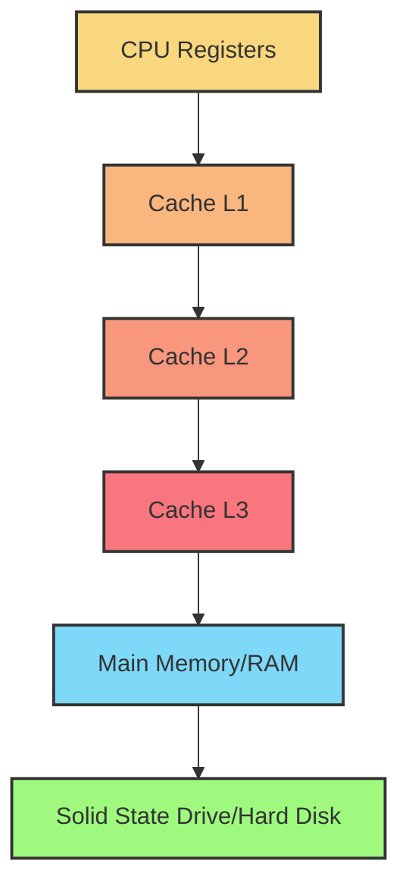
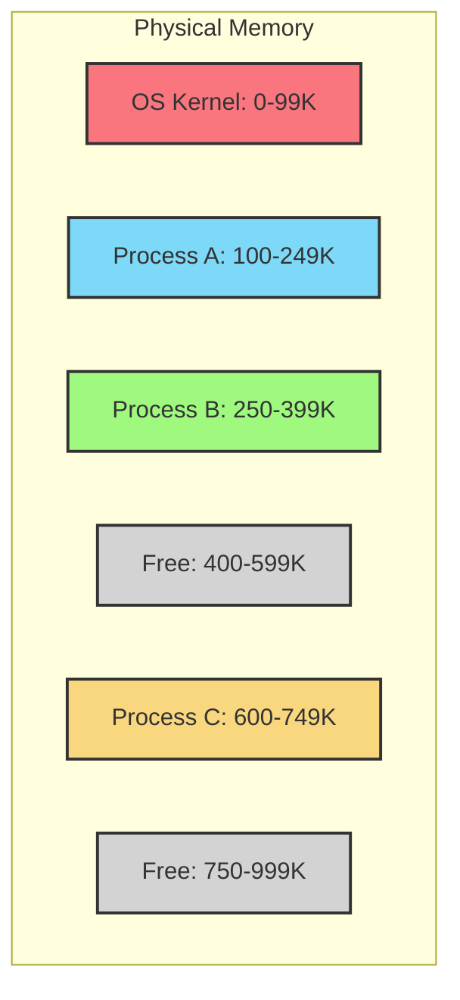
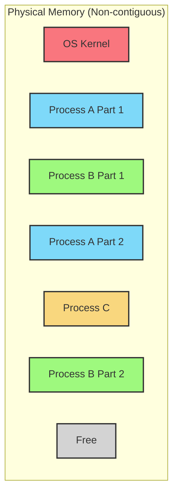
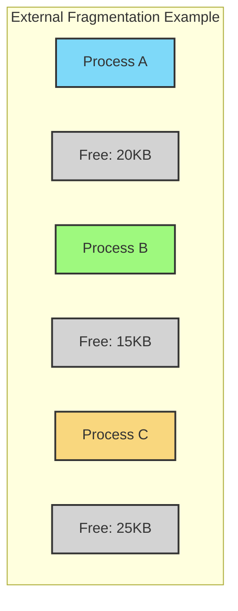
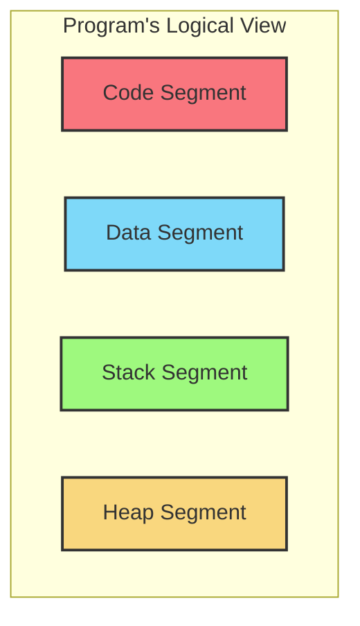

# Memory Management

## Introduction

Memory management is one of the fundamental responsibilities of an operating system. It involves organizing and controlling the computer's primary memory (RAM) to ensure efficient operation of the system. Good memory management allows multiple processes to safely share the limited memory resources while providing each process with the illusion of having access to a large, continuous block of memory.

In this guide, we'll explore how operating systems handle memory, the challenges they face, and the strategies they employ to optimize memory usage.

## Why Memory Management Matters

Think of your computer's memory as a workspace. Just like a cluttered desk makes finding important documents difficult, poor memory management leads to:

- System slowdowns
- Inefficient use of available resources
- Program crashes
- Security vulnerabilities

As a programmer, understanding memory management helps you write more efficient code and debug memory-related issues.

## Memory Hierarchy

Before diving into memory management techniques, let's understand the memory hierarchy in modern computers:



As we move down this hierarchy:
- Speed decreases
- Size increases
- Cost per byte decreases

Memory management primarily focuses on efficiently using the main memory (RAM), which serves as a middle ground between ultra-fast but tiny CPU registers and the vast but slow secondary storage.

## Basic Memory Management Concepts

### Memory Allocation

Operating systems must allocate memory to processes when they're created and reclaim it when they terminate. Two main approaches exist:

#### 1. Contiguous Allocation

In this approach, each process gets a single continuous block of memory.



#### 2. Non-contiguous Allocation

A process's memory can be spread across different physical locations.



### Memory Allocation Strategies

Operating systems use various strategies to decide which memory blocks to allocate:

1. **First-Fit**: Allocate the first memory block that's large enough
2. **Best-Fit**: Allocate the smallest memory block that's large enough
3. **Worst-Fit**: Allocate the largest available memory block

Let's see how these strategies compare with a simple example:

```c
// Memory blocks available (in KB):
// Block 1: 100 KB
// Block 2: 500 KB
// Block 3: 200 KB
// Block 4: 300 KB

// Process requesting 150 KB would get:
// First-Fit: Block 1 (first block that fits)
// Best-Fit: Block 3 (smallest block that fits)
// Worst-Fit: Block 2 (largest block available)
```

Each strategy has its pros and cons:

- **First-Fit**: Fastest allocation, but can lead to external fragmentation
- **Best-Fit**: Reduces wasted space, but slower and can create tiny, unusable fragments
- **Worst-Fit**: Leaves larger free blocks, but can quickly exhaust large blocks

### Memory Fragmentation

As processes are allocated and deallocated memory, the memory space can become fragmented:

#### External Fragmentation

This occurs when free memory is available but scattered in small blocks, making it impossible to allocate continuous large chunks.



In this example, we have 60KB of free memory total, but we can't allocate a process needing 50KB continuously.

#### Internal Fragmentation

This happens when memory allocated to a process is slightly larger than requested, leaving some memory unused but not available to other processes.

For example, if memory is allocated in fixed blocks of 4KB and a process needs 10KB, it will receive 12KB (3 blocks), wasting 2KB internally.

## Virtual Memory

Virtual memory is a technique that gives each process the illusion of having its own large, contiguous memory space, regardless of the actual physical memory available or its fragmentation state.

Key benefits of virtual memory include:

1. Programs can be larger than physical memory
2. Programs are isolated from each other (better security and stability)
3. More efficient use of physical memory
4. Simplifies programming (developers don't need to worry about memory constraints)

### Address Translation

In a virtual memory system, programs use virtual addresses that the hardware, with OS support, translates to physical addresses:


The operating system maintains a mapping between virtual addresses and physical addresses. This mapping is stored in data structures called page tables.

### Paging

Paging is the most common implementation of virtual memory. In paging:

1. Memory is divided into fixed-size blocks called **pages** (typically 4KB)
2. Physical memory is divided into same-sized blocks called **frames**
3. Pages can be stored in frames or temporarily moved to disk (swap space)

Let's see a simple example of address translation with paging:

```c
// Example: 32-bit system with 4KB pages
// Virtual address: 0x12345678

// Step 1: Split into page number and offset
// Page number = 0x12345 (bits 31-12)
// Offset = 0x678 (bits 11-0)

// Step 2: Use page table to translate page number to frame number
// Assume page 0x12345 maps to frame 0x98765

// Step 3: Physical address = (frame number × page size) + offset
// Physical address = 0x98765000 + 0x678 = 0x98765678
```

This translation is typically performed by a hardware component called the Memory Management Unit (MMU).

### Page Tables

Page tables store the mapping between virtual pages and physical frames. A simple page table might look like:

| Virtual Page | Valid Bit | Frame Number | Protection Bits |
|--------------|-----------|--------------|----------------|
| 0            | 1         | 25           | RW-            |
| 1            | 1         | 14           | R--            |
| 2            | 0         | -            | ---            |
| 3            | 1         | 79           | RWX            |

- **Valid bit**: Indicates if the page is in physical memory
- **Frame number**: Where the page is located in physical memory
- **Protection bits**: Read/Write/Execute permissions

### Page Faults

When a program accesses a page that's not in physical memory (valid bit = 0), a page fault occurs:

1. The CPU traps to the operating system
2. The OS finds the page on disk (in swap space)
3. The OS finds a free frame or evicts an existing page
4. The OS loads the required page into the free frame
5. The OS updates the page table
6. The CPU restarts the instruction that caused the fault

This process is transparent to the application but can cause performance slowdowns if excessive.

### Page Replacement Algorithms

When memory is full and a new page needs to be loaded, the OS must decide which existing page to remove. Various algorithms exist:

1. **FIFO** (First-In-First-Out): Evict the oldest page
2. **LRU** (Least Recently Used): Evict the page that hasn't been used for the longest time
3. **Clock/Second Chance**: A more efficient approximation of LRU
4. **Optimal**: Evict the page that won't be used for the longest time in the future (theoretical benchmark)

Let's compare these with a simple example:

```
Page reference sequence: 1, 2, 3, 4, 1, 2, 5, 1, 2, 3, 4, 5
Memory capacity: 3 frames

FIFO:
[1] -> [1,2] -> [1,2,3] -> [4,2,3] -> [4,1,3] -> [4,1,2] -> [4,1,5] -> ...
Page faults: 9

LRU:
[1] -> [1,2] -> [1,2,3] -> [4,2,3] -> [4,1,3] -> [4,1,2] -> [4,1,5] -> ...
Page faults: 8

Optimal:
[1] -> [1,2] -> [1,2,3] -> [1,2,4] -> [1,2,4] -> [1,2,4] -> [1,2,5] -> ...
Page faults: 6
```

In real systems, LRU is often approximated because tracking exact usage patterns is expensive.

## Segmentation

Segmentation is another memory management technique that divides a program's memory space into logical segments based on the program's structure:

- Code segment (text)
- Data segment
- Stack segment
- Heap segment

Each segment can have different sizes and access permissions.



Segmentation allows for:
- Different protection policies for different types of data
- Sharing of segments between processes (e.g., shared libraries)
- Natural growth of segments (like stack or heap)

Modern systems often combine segmentation and paging for the best of both worlds.

## Memory Management in Action: A Real-World Example

Let's look at a simple C program and observe how memory is managed:

```c
#include <stdio.h>
#include <stdlib.h>

int global_var = 100;  // Data segment
int uninit_var;        // BSS segment

int main() {
    // The following goes on the stack:
    int local_var = 200;
    
    // The following goes on the heap:
    int* dynamic_var = (int*)malloc(sizeof(int));
    *dynamic_var = 300;
    
    printf("Global: %d, Local: %d, Dynamic: %d
", 
           global_var, local_var, *dynamic_var);
    
    // Free heap memory
    free(dynamic_var);
    
    return 0;
}
```

Output:
```
Global: 100, Local: 200, Dynamic: 300
```

In this program:

1. `global_var` is allocated in the data segment
2. `uninit_var` is in the BSS segment (zero-initialized)
3. `local_var` is allocated on the stack when `main()` is called
4. `dynamic_var` points to memory allocated on the heap
5. After `free()`, the heap memory is returned to the operating system

When the program terminates, all its memory (stack, heap, data segments) is reclaimed by the OS.

## Memory Management in Different Operating Systems

Memory management strategies vary across operating systems:

### Linux

Linux uses a demand-paged virtual memory system with a variety of sophisticated features:

- Transparent Huge Pages for large memory applications
- Kernel Same-page Merging (KSM) for memory deduplication
- Overcommitment of memory (allocates more virtual memory than physical)
- Control groups (cgroups) for resource allocation

### Windows

Windows memory management includes:

- Working set management to control how many pages a process keeps in RAM
- Standby page list for recently used pages
- SuperFetch to preload commonly used applications
- Memory compression to store more data in RAM

### macOS

macOS memory management features:

- Compressed memory for better performance
- Automatic memory purging when low on memory
- App Nap to reduce memory usage of background applications
- Memory pressure notifications to applications

## Common Memory-Related Problems

### Memory Leaks

When a program allocates memory but never frees it. Over time, this can exhaust available memory.

```c
void memory_leak_example() {
    while(1) {
        int* data = malloc(1000);
        // Never free(data) - memory leak!
        // Do something with data...
    }
}
```

### Buffer Overflows

When a program writes beyond the allocated memory:

```c
void buffer_overflow_example() {
    char buffer[10];
    // Dangerous! Writing 15 chars to a 10-char buffer
    strcpy(buffer, "This is too long");
}
```

Buffer overflows can cause crashes or security vulnerabilities.

### Segmentation Faults

Occur when a program tries to access memory it doesn't have permission for:

```c
void segfault_example() {
    int* ptr = NULL;
    *ptr = 42;  // Trying to write to address 0 - segmentation fault!
}
```

## Memory Management Tools for Developers

Several tools can help detect and debug memory issues:

- **Valgrind**: Detects memory leaks, use-after-free, and other memory errors
- **AddressSanitizer**: Fast detector of memory errors
- **Electric Fence**: Helps detect buffer overflows
- **jemalloc/tcmalloc**: High-performance memory allocators
- **vmstat/free**: Monitor system memory usage

## Summary

Memory management is a critical part of operating systems that enables efficient use of limited physical memory resources. We've covered:

- Basic memory allocation strategies
- Virtual memory concepts
- Paging and segmentation
- Page replacement algorithms
- Memory management in different operating systems
- Common memory problems and tools

As a programmer, understanding these concepts will help you write more efficient, robust code and debug memory-related issues more effectively.

## Exercises

1. Write a program that deliberately causes a memory leak. Use a memory profiler to observe the leak.
2. Compare the performance of different allocation algorithms (first-fit, best-fit, worst-fit) using a simulation.
3. Implement a simple virtual memory manager that translates virtual addresses to physical addresses using a page table.
4. Create a program that demonstrates different types of memory segments (code, data, stack, heap) and observe how they grow.
5. Use `top` or Task Manager to observe how different applications use memory on your system.

## Additional Resources

- "Operating System Concepts" by Silberschatz, Galvin, and Gagne
- The [Linux Documentation Project](https://tldp.org/) for Linux memory management details
- [FreeBSD Memory Management](https://www.freebsd.org/doc/en_US.ISO8859-1/books/developers-handbook/vm.html)
- [Understanding the Linux Virtual Memory Manager](https://www.kernel.org/doc/gorman/)
- Your operating system's developer documentation