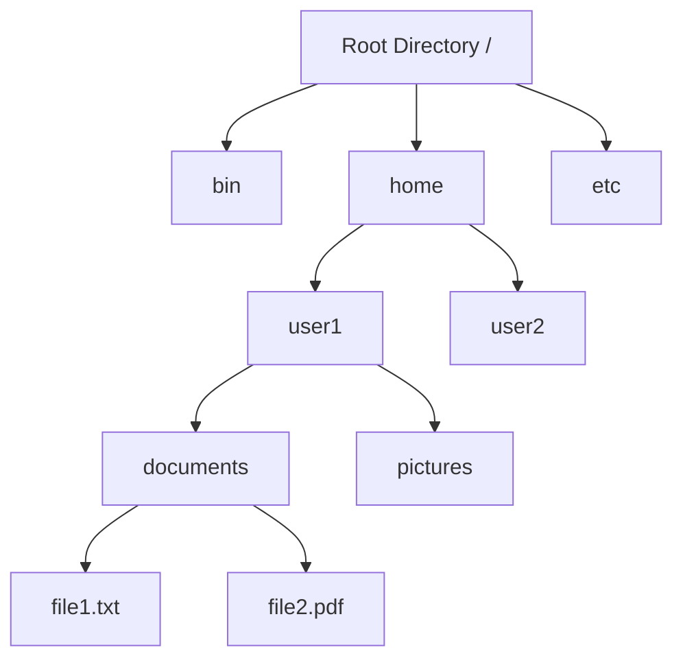

# File Systems

## Introduction

A file system is one of the most crucial components of an operating system. It provides the mechanism for storing, retrieving, and organizing data on storage devices. Without file systems, data on your computer would exist as one large body of unorganized information, making it practically unusable.

File systems create a layer of abstraction that allows users and applications to interact with files rather than directly with the raw storage hardware. This abstraction simplifies data management and provides structure to your digital information.

## What is a File?

At its core, a file is a named collection of related information recorded on secondary storage. It can contain text, images, programs, or any other form of data.

### File Attributes

Each file in a file system has several attributes associated with it:

- **Name**: A human-readable identifier
- **Type/Extension**: Indicates the kind of data stored (e.g., .txt, .exe, .jpg)
- **Size**: The amount of data stored in the file
- **Location**: Physical location on the storage device
- **Protection**: Access control information
- **Time, date, and user identification**: Creation, last modification, and last access timestamps

### File Operations

Operating systems typically provide several operations that can be performed on files:

- **Create**: Allocates space for a new file
- **Write**: Transfers data from memory to a file
- **Read**: Transfers data from a file to memory
- **Reposition/Seek**: Moves to a specific position within a file
- **Delete**: Removes a file and frees its space
- **Truncate**: Resets a file to zero length while maintaining its attributes

## Directory Structure

Directories (also called folders) are special files that contain information about other files and directories, creating a hierarchical structure.



### Types of Directory Structures

1. **Single-Level Directory**: All files are contained in one directory
2. **Two-Level Directory**: Each user has their own directory
3. **Tree-Structured Directory**: Hierarchical structure with directories containing files and other directories
4. **Acyclic-Graph Directory**: Tree structure with shared directories and files
5. **General Graph Directory**: Contains cycles, making traversal more complex

## File System Implementation

### Allocation Methods

There are three main methods to allocate disk space for files:

#### 1. Contiguous Allocation

Files occupy a set of contiguous blocks on disk.

**Advantages:**
- Simple implementation
- Excellent read performance (sequential access)

**Disadvantages:**
- External fragmentation
- File size must be known at creation time

#### 2. Linked Allocation

Each file block points to the next block in the file.

**Advantages:**
- No external fragmentation
- Files can grow dynamically

**Disadvantages:**
- Poor random access performance
- Space required for pointers
- Reliability issues (broken links)

#### 3. Indexed Allocation

Special index blocks contain pointers to file blocks.

**Advantages:**
- Supports direct access
- No external fragmentation

**Disadvantages:**
- Index block overhead
- Maximum file size limited by index block size

## File System Examples

### Unix File System (UFS)

The Unix File System uses an inode-based structure:

- **Inodes**: Each file has an inode that stores all file attributes and block pointers
- **Block Size**: Typically 4KB
- **Directories**: Special files mapping filenames to inode numbers

```
// Example of listing files in a Unix system
$ ls -li
1234567 -rw-r--r-- 1 user group 4096 Jan 1 10:00 example.txt
```

The number `1234567` is the inode number that uniquely identifies the file in the file system.

### FAT (File Allocation Table)

FAT is a simpler system used in many smaller devices and older Windows systems:

- Uses a table to track which clusters belong to which files
- Each entry contains the next cluster in the file or an end-of-file marker
- No support for permissions or ownership

### NTFS (New Technology File System)

Microsoft's advanced file system:

- **Master File Table (MFT)**: Similar to inodes, containing file metadata
- **Journaling**: Keeps track of changes before committing them, improving reliability
- **Advanced features**: Compression, encryption, permissions, quotas

## Practical Example: Implementing a Simple File System in C

Let's create a very simple simulation of a file system in C to demonstrate basic concepts:

```c
#include <stdio.h>
#include <stdlib.h>
#include <string.h>

#define BLOCK_SIZE 512
#define MAX_BLOCKS 1024
#define MAX_FILES 64
#define MAX_FILENAME 32

// Simulated disk
char disk[BLOCK_SIZE * MAX_BLOCKS];

// File entry structure
typedef struct {
    char name[MAX_FILENAME];
    int starting_block;
    int file_size;
    int is_used;
} file_entry;

// File allocation table
file_entry file_table[MAX_FILES];

// Block allocation bitmap
int block_bitmap[MAX_BLOCKS];

// Initialize the file system
void format_filesystem() {
    // Clear the disk
    memset(disk, 0, BLOCK_SIZE * MAX_BLOCKS);
    
    // Clear the file table
    memset(file_table, 0, sizeof(file_table));
    
    // Clear the block bitmap
    memset(block_bitmap, 0, sizeof(block_bitmap));
    
    printf("File system formatted successfully.
");
}

// Create a new file
int create_file(char* filename, int size) {
    int i, j;
    int required_blocks = (size + BLOCK_SIZE - 1) / BLOCK_SIZE;
    int consecutive_blocks = 0;
    int start_block = -1;
    
    // Find an empty file entry
    int file_index = -1;
    for (i = 0; i < MAX_FILES; i++) {
        if (file_table[i].is_used == 0) {
            file_index = i;
            break;
        }
    }
    
    if (file_index == -1) {
        printf("Error: File table is full.
");
        return -1;
    }
    
    // Check if filename already exists
    for (i = 0; i < MAX_FILES; i++) {
        if (file_table[i].is_used && strcmp(file_table[i].name, filename) == 0) {
            printf("Error: File '%s' already exists.
", filename);
            return -1;
        }
    }
    
    // Search for contiguous free blocks
    for (i = 0; i < MAX_BLOCKS; i++) {
        if (block_bitmap[i] == 0) {
            if (consecutive_blocks == 0) {
                start_block = i;
            }
            consecutive_blocks++;
            
            if (consecutive_blocks == required_blocks) {
                break;
            }
        } else {
            consecutive_blocks = 0;
            start_block = -1;
        }
    }
    
    if (consecutive_blocks < required_blocks) {
        printf("Error: Not enough contiguous space for file.
");
        return -1;
    }
    
    // Allocate blocks
    for (i = start_block; i < start_block + required_blocks; i++) {
        block_bitmap[i] = 1;
    }
    
    // Create file entry
    strcpy(file_table[file_index].name, filename);
    file_table[file_index].starting_block = start_block;
    file_table[file_index].file_size = size;
    file_table[file_index].is_used = 1;
    
    printf("File '%s' created successfully (Blocks %d-%d).
", 
           filename, start_block, start_block + required_blocks - 1);
    
    return 0;
}

// List all files
void list_files() {
    int i;
    int count = 0;
    
    printf("
File Listing:
");
    printf("%-32s %-10s %-10s
", "Filename", "Size", "Blocks");
    printf("--------------------------------------------------
");
    
    for (i = 0; i < MAX_FILES; i++) {
        if (file_table[i].is_used) {
            int blocks = (file_table[i].file_size + BLOCK_SIZE - 1) / BLOCK_SIZE;
            printf("%-32s %-10d %-10d
", 
                   file_table[i].name, 
                   file_table[i].file_size,
                   blocks);
            count++;
        }
    }
    
    if (count == 0) {
        printf("No files found.
");
    }
}

// Delete a file
int delete_file(char* filename) {
    int i;
    int file_index = -1;
    
    // Find the file
    for (i = 0; i < MAX_FILES; i++) {
        if (file_table[i].is_used && strcmp(file_table[i].name, filename) == 0) {
            file_index = i;
            break;
        }
    }
    
    if (file_index == -1) {
        printf("Error: File '%s' not found.
", filename);
        return -1;
    }
    
    // Calculate number of blocks
    int blocks = (file_table[file_index].file_size + BLOCK_SIZE - 1) / BLOCK_SIZE;
    
    // Free the blocks
    for (i = file_table[file_index].starting_block; 
         i < file_table[file_index].starting_block + blocks; 
         i++) {
        block_bitmap[i] = 0;
    }
    
    // Clear the file entry
    file_table[file_index].is_used = 0;
    
    printf("File '%s' deleted successfully.
", filename);
    
    return 0;
}

int main() {
    printf("Simple File System Simulation

");
    
    format_filesystem();
    
    create_file("document.txt", 1024);  // 2 blocks
    create_file("image.jpg", 2048);     // 4 blocks
    create_file("program.exe", 5120);   // 10 blocks
    
    list_files();
    
    delete_file("image.jpg");
    
    list_files();
    
    create_file("newfile.dat", 1536);   // 3 blocks
    
    list_files();
    
    return 0;
}
```

**Output:**

```
Simple File System Simulation

File system formatted successfully.
File 'document.txt' created successfully (Blocks 0-1).
File 'image.jpg' created successfully (Blocks 2-5).
File 'program.exe' created successfully (Blocks 6-15).

File Listing:
Filename                        Size       Blocks    
--------------------------------------------------
document.txt                    1024       2         
image.jpg                       2048       4         
program.exe                     5120       10        

File 'image.jpg' deleted successfully.

File Listing:
Filename                        Size       Blocks    
--------------------------------------------------
document.txt                    1024       2         
program.exe                     5120       10        

File 'newfile.dat' created successfully (Blocks 2-4).

File Listing:
Filename                        Size       Blocks    
--------------------------------------------------
document.txt                    1024       2         
program.exe                     5120       10        
newfile.dat                     1536       3         
```

This simplified example demonstrates:
- File creation with contiguous allocation
- Block management with a bitmap
- File deletion and space reclamation
- File listing

## File System Performance and Optimization

Several techniques are used to improve file system performance:

### Caching and Buffering

Operating systems maintain a cache of recently accessed disk blocks in memory:

```c
// Simplified pseudocode for buffer cache
struct buffer_cache_entry {
    int block_number;
    char data[BLOCK_SIZE];
    bool dirty;  // Has been modified
    int reference_count;
};

buffer_cache_entry cache[CACHE_SIZE];

// Read block with caching
char* read_block(int block_num) {
    // Check if block is in cache
    for (int i = 0; i < CACHE_SIZE; i++) {
        if (cache[i].block_number == block_num) {
            // Cache hit
            return cache[i].data;
        }
    }
    
    // Cache miss - read from disk and store in cache
    int cache_slot = find_free_cache_slot();
    read_physical_block(block_num, cache[cache_slot].data);
    cache[cache_slot].block_number = block_num;
    cache[cache_slot].dirty = false;
    
    return cache[cache_slot].data;
}
```

### Block Size Optimization

Larger block sizes:
- Reduce the number of I/O operations
- Increase internal fragmentation
- Transfer more data per operation

Smaller block sizes:
- Reduce internal fragmentation
- Increase metadata overhead
- Require more I/O operations

### Journaling

Journaling file systems like ext4, NTFS, and HFS+ maintain a journal of changes:

1. Write intended changes to the journal
2. Write a commit record to the journal
3. Apply changes to the actual file system
4. Mark the journal entry as complete

This ensures that file system operations are atomic, even in the event of a system crash.

## Real-world Applications

### Cloud Storage File Systems

Services like Dropbox, Google Drive, and OneDrive implement specialized file systems:
- Version tracking
- Conflict resolution
- Selective synchronization
- Distributed storage across multiple servers

### Mobile Device File Systems

Mobile operating systems use specialized file systems optimized for:
- Flash memory characteristics (wear leveling)
- Power efficiency
- Limited storage space
- Encryption for security

### Distributed File Systems

Systems like NFS (Network File System) and SMB/CIFS (Server Message Block) allow files to be accessed across a network as if they were local.

## Summary

File systems are the backbone of data storage in operating systems. They provide:

1. **Organization**: Hierarchical structure for files and directories
2. **Abstraction**: Users work with files rather than raw storage
3. **Efficiency**: Optimized allocation of storage space
4. **Security**: Access control and protection
5. **Reliability**: Data integrity even after system failures

The design of file systems involves numerous tradeoffs between simplicity, efficiency, reliability, and functionality. Different file systems are optimized for different use cases, from embedded systems to enterprise storage solutions.

## Exercises

1. **Basic File System Navigator**: Write a program that simulates navigating a directory structure with commands like `cd`, `ls`, and `pwd`.

2. **File System Analysis**: Write a program that analyzes a directory and reports on file types, sizes, and disk usage.

3. **Recovery Tool**: Create a simple program that can recover deleted files from a simulated file system (based on the simple file system example).

4. **Custom Allocation Strategy**: Modify the simple file system example to use linked allocation instead of contiguous allocation.

5. **Extended Attributes**: Add support for file metadata like creation time, last modified time, and permissions to the simple file system example.

## Additional Resources

- **Books**:
  - "Operating System Concepts" by Silberschatz, Galvin, and Gagne
  - "Modern Operating Systems" by Andrew S. Tanenbaum

- **Online**:
  - The Linux Documentation Project (TLDP) - File System section
  - Microsoft Developer Network (MSDN) - File Systems

- **Tools**:
  - `fsck` and `scandisk` - File system checking tools
  - `df` and `du` - Disk usage analysis tools
  - `debugfs` - File system debugging tool

By understanding file systems, you gain insight into how your data is stored, organized, and accessed by the operating system. This knowledge is fundamental for any programmer working with files, storage, or system-level applications.