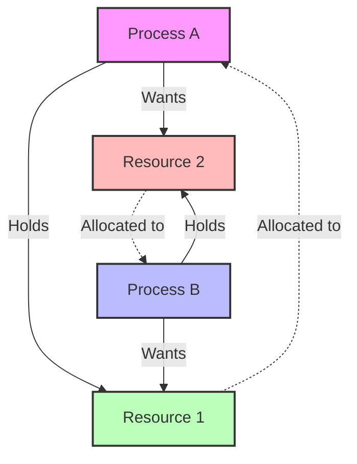

# Deadlocks in Operating Systems

## Introduction

Imagine four cars meeting at a four-way intersection with no traffic signals. Each driver wants to proceed straight through, but none can move forward because each is waiting for the car to their right to move first. This real-world example illustrates a **deadlock** - a situation where two or more processes are unable to proceed because each is waiting for resources held by another.

In the context of operating systems, deadlocks are particularly problematic as they can cause programs to freeze, resources to be wasted, and in extreme cases, require system restarts. Understanding deadlocks is essential for any programmer working with concurrent systems.

## What is a Deadlock?

A deadlock occurs when two or more processes are blocked forever, each waiting for resources that are held by another process in the same group. This creates a circular waiting condition where no process can continue.

### Four Necessary Conditions for Deadlock

For a deadlock to occur, the following four conditions must be present simultaneously:

1. **Mutual Exclusion**: At least one resource must be held in a non-sharable mode, meaning only one process can use it at a time.
2. **Hold and Wait**: A process must be holding at least one resource while waiting to acquire additional resources.
3. **No Preemption**: Resources cannot be forcibly taken from a process; they must be released voluntarily.
4. **Circular Wait**: A circular chain of processes exists, where each process is waiting for a resource held by the next process in the chain.

Let's visualize these conditions with a diagram:



## Deadlock Example in Code

Let's look at a simple Java example that demonstrates a deadlock:

```java
public class DeadlockExample {
    private static final Object RESOURCE_A = new Object();
    private static final Object RESOURCE_B = new Object();

    public static void main(String[] args) {
        Thread thread1 = new Thread(() -> {
            synchronized (RESOURCE_A) {
                System.out.println("Thread 1: Holding Resource A...");
                try { Thread.sleep(100); } catch (InterruptedException e) {}
                System.out.println("Thread 1: Waiting for Resource B...");
                
                synchronized (RESOURCE_B) {
                    System.out.println("Thread 1: Holding Resources A and B");
                }
            }
        });

        Thread thread2 = new Thread(() -> {
            synchronized (RESOURCE_B) {
                System.out.println("Thread 2: Holding Resource B...");
                try { Thread.sleep(100); } catch (InterruptedException e) {}
                System.out.println("Thread 2: Waiting for Resource A...");
                
                synchronized (RESOURCE_A) {
                    System.out.println("Thread 2: Holding Resources B and A");
                }
            }
        });

        thread1.start();
        thread2.start();
    }
}
```

**Output:**
```
Thread 1: Holding Resource A...
Thread 2: Holding Resource B...
Thread 1: Waiting for Resource B...
Thread 2: Waiting for Resource A...
```

Notice that the program never completes execution because both threads are waiting indefinitely for resources held by each other.

## Strategies for Handling Deadlocks

There are four common strategies for dealing with deadlocks:

### 1. Deadlock Prevention

This approach involves designing the system to ensure that at least one of the four necessary conditions for deadlock cannot occur.

```java
// Example of deadlock prevention by ordering resource allocation
public class DeadlockPrevention {
    private static final Object RESOURCE_A = new Object();
    private static final Object RESOURCE_B = new Object();
    
    public static void main(String[] args) {
        Thread thread1 = new Thread(() -> {
            // Always acquire resources in the same order (A then B)
            synchronized (RESOURCE_A) {
                System.out.println("Thread 1: Holding Resource A...");
                try { Thread.sleep(100); } catch (InterruptedException e) {}
                
                synchronized (RESOURCE_B) {
                    System.out.println("Thread 1: Holding Resources A and B");
                }
            }
        });

        Thread thread2 = new Thread(() -> {
            // Always acquire resources in the same order (A then B)
            synchronized (RESOURCE_A) {
                System.out.println("Thread 2: Holding Resource A...");
                try { Thread.sleep(100); } catch (InterruptedException e) {}
                
                synchronized (RESOURCE_B) {
                    System.out.println("Thread 2: Holding Resources A and B");
                }
            }
        });

        thread1.start();
        thread2.start();
    }
}
```

**Output:**
```
Thread 1: Holding Resource A...
Thread 1: Holding Resources A and B
Thread 2: Holding Resource A...
Thread 2: Holding Resources A and B
```

### 2. Deadlock Avoidance

This approach involves making decisions dynamically at runtime to avoid potential deadlocks. The Banker's Algorithm is a classic example:

```java
// Simplified representation of Banker's Algorithm concept
public class BankersAlgorithm {
    private int[] available;      // Available resources
    private int[][] maximum;      // Maximum demand of each process
    private int[][] allocation;   // Currently allocated resources to each process
    private int[][] need;         // Remaining resource need of each process
    
    // Request resources method
    public boolean requestResources(int process, int[] request) {
        // Check if request is valid
        for (int i = 0; i < request.length; i++) {
            if (request[i] > need[process][i]) {
                return false; // Requesting more than declared maximum
            }
            if (request[i] > available[i]) {
                return false; // Not enough resources available
            }
        }
        
        // Try allocation
        simulateAllocation(process, request);
        
        // Check if state is safe
        if (isSafeState()) {
            // Actually allocate resources
            commitAllocation(process, request);
            return true;
        } else {
            // Restore original state
            rollbackAllocation(process, request);
            return false;
        }
    }
    
    // Other methods would be implemented here
    private void simulateAllocation(int process, int[] request) {
        // Simulation logic
    }
    
    private boolean isSafeState() {
        // Safety check logic
        return true;  // Simplified return
    }
    
    private void commitAllocation(int process, int[] request) {
        // Commit logic
    }
    
    private void rollbackAllocation(int process, int[] request) {
        // Rollback logic
    }
}
```

### 3. Deadlock Detection and Recovery

This approach allows deadlocks to happen but includes mechanisms to detect and recover from them.

```java
// Conceptual example of deadlock detection
public class DeadlockDetector {
    private Map<Thread, List<Resource>> threadResources;
    
    public void checkForDeadlocks() {
        // Build a resource allocation graph
        DirectedGraph resourceGraph = buildResourceGraph();
        
        // Check for cycles in the graph
        List<List<Node>> cycles = findCycles(resourceGraph);
        
        if (!cycles.isEmpty()) {
            // Deadlock detected!
            recoverFromDeadlock(cycles);
        }
    }
    
    private DirectedGraph buildResourceGraph() {
        // Implementation to build resource allocation graph
        return new DirectedGraph();  // Simplified return
    }
    
    private List<List<Node>> findCycles(DirectedGraph graph) {
        // Implementation to find cycles in the graph
        return new ArrayList<>();  // Simplified return
    }
    
    private void recoverFromDeadlock(List<List<Node>> cycles) {
        // Choose a victim process and terminate/preempt it
        Thread victim = selectVictim(cycles);
        terminateThread(victim);
    }
    
    private Thread selectVictim(List<List<Node>> cycles) {
        // Logic to select which process to terminate
        return null;  // Simplified return
    }
    
    private void terminateThread(Thread victim) {
        // Logic to terminate a thread and free its resources
    }
    
    // Inner classes for graph representation would be here
    class DirectedGraph {
        // Graph implementation
    }
    
    class Node {
        // Node implementation
    }
}
```

### 4. Deadlock Ignorance

Some systems, including most desktop operating systems, simply ignore the problem, assuming deadlocks occur infrequently enough that the cost of prevention is not worth it. In these cases, a system reboot is often required when a deadlock occurs.

## Real-World Applications

### Database Transaction Management

Databases use locking mechanisms to ensure data consistency, which can lead to deadlocks. For example, when Transaction A locks Table 1 and needs access to Table 2, while Transaction B locks Table 2 and needs access to Table 1.

Most database management systems have built-in deadlock detection mechanisms:

```sql
-- Example MySQL configuration parameters for deadlock management
-- SET innodb_deadlock_detect = ON;           -- Enable deadlock detection
-- SET innodb_lock_wait_timeout = 50;         -- Time in seconds before timing out
```

Database systems typically handle deadlocks by automatically rolling back one of the transactions:

```
Transaction A: BEGIN;
Transaction A: UPDATE accounts SET balance = balance - 100 WHERE id = 1;
Transaction B: BEGIN;
Transaction B: UPDATE accounts SET balance = balance + 200 WHERE id = 2;
Transaction A: UPDATE accounts SET balance = balance + 100 WHERE id = 2; -- Waits for lock
Transaction B: UPDATE accounts SET balance = balance - 200 WHERE id = 1; -- Deadlock!

-- Database detects deadlock and chooses a victim:
ERROR 1213 (40001): Deadlock found when trying to get lock; try restarting transaction
```

### Operating System Resource Allocation

Operating systems must manage resources like CPU time, memory, and I/O devices. Deadlocks can occur when processes compete for these resources.

For example, a process might hold memory while waiting for a printer, while another process holds the printer while waiting for memory.

Modern operating systems use techniques like resource ordering, timeouts, and priority-based preemption to mitigate deadlock risks.

## Practical Tips for Avoiding Deadlocks

1. **Always acquire resources in a consistent order**
   ```java
   // Good practice
   synchronized(lockA) {
       synchronized(lockB) {
           // Use resources
       }
   }
   ```

2. **Use timeouts when acquiring locks**
   ```java
   // Using tryLock with timeout
   Lock lockA = new ReentrantLock();
   Lock lockB = new ReentrantLock();
   
   boolean gotBothLocks = false;
   try {
       boolean gotLockA = lockA.tryLock(1, TimeUnit.SECONDS);
       if (gotLockA) {
           boolean gotLockB = lockB.tryLock(1, TimeUnit.SECONDS);
           gotBothLocks = gotLockB;
       }
       
       if (gotBothLocks) {
           // Use the resources
       } else {
           // Couldn't get both locks, handle appropriately
       }
   } catch (InterruptedException e) {
       // Handle interruption
   } finally {
       if (gotBothLocks) {
           lockB.unlock();
       }
       if (lockA.isHeldByCurrentThread()) {
           lockA.unlock();
       }
   }
   ```

3. **Avoid nested locks when possible**
   ```java
   // Instead of nested locks, combine operations
   public void transferMoney(Account from, Account to, double amount) {
       // Bad approach: acquire locks separately
       // synchronized(from) {
       //     synchronized(to) {
       //         from.debit(amount);
       //         to.credit(amount);
       //     }
       // }
       
       // Better approach: use a global lock or lock ordering
       if (from.getId() < to.getId()) {
           synchronized(from) {
               synchronized(to) {
                   from.debit(amount);
                   to.credit(amount);
               }
           }
       } else {
           synchronized(to) {
               synchronized(from) {
                   from.debit(amount);
                   to.credit(amount);
               }
           }
       }
   }
   ```

4. **Use higher-level concurrency utilities**
   ```java
   // Instead of raw synchronization
   ExecutorService executor = Executors.newFixedThreadPool(10);
   
   // Submit tasks to executor
   Future<Result> result = executor.submit(() -> {
       // Execute task without manual synchronization
       return processData();
   });
   ```

## Summary

Deadlocks are a critical concern in concurrent programming and operating systems design. They occur when processes are unable to proceed due to circular resource dependencies. The four necessary conditions for deadlock are mutual exclusion, hold and wait, no preemption, and circular wait.

Strategies for dealing with deadlocks include prevention, avoidance, detection and recovery, and ignorance. Each approach has its trade-offs in terms of performance, implementation complexity, and resource utilization.

Understanding deadlocks is essential for designing robust systems that can handle resource contention efficiently. By applying techniques like resource ordering, timeouts, and proper concurrency utilities, developers can minimize the risk of deadlocks in their applications.

## Exercises

1. Modify the `DeadlockExample` to prevent deadlock by applying resource ordering.
2. Implement a simple deadlock detection algorithm for two processes and two resources.
3. Research and explain how your operating system handles deadlocks.
4. Create a program that demonstrates a deadlock involving three or more threads.
5. Implement a solution for the classic dining philosophers problem that avoids deadlock.

## Additional Resources

- Operating Systems: Three Easy Pieces - Chapter on Deadlock
- "The Art of Multiprocessor Programming" by Maurice Herlihy and Nir Shavit
- Java Concurrency in Practice by Brian Goetz
- [Oracle Java Tutorial on Deadlock](https://docs.oracle.com/javase/tutorial/essential/concurrency/deadlock.html)