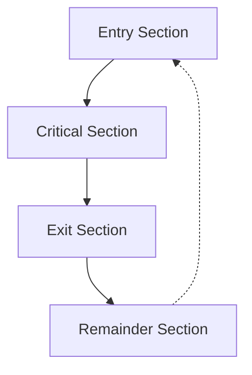
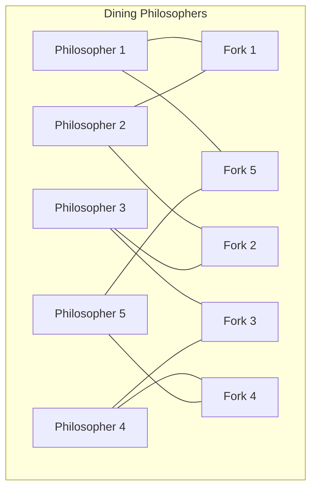

# Synchronization in Operating Systems

## Introduction

In modern operating systems, multiple processes often need to execute concurrently while sharing resources. This concurrent access to shared resources can lead to unexpected behaviors and data inconsistencies if not properly managed. **Synchronization** is the mechanism that ensures orderly execution of cooperating processes that share a logical address space, so that data consistency is maintained.

Imagine two processes trying to update a shared variable simultaneously - without proper synchronization, the final value becomes unpredictable. This is one of the key problems synchronization solves.

## The Critical Section Problem

### What is a Critical Section?

A critical section is a segment of code where a process accesses shared resources, such as variables, files, or data structures, that must not be concurrently accessed by other processes.



Every solution to the critical section problem must satisfy these three requirements:

1. **Mutual Exclusion**: If a process is executing in its critical section, no other process can execute in their critical section.
2. **Progress**: If no process is in its critical section and some processes want to enter, one of them must be allowed to enter eventually.
3. **Bounded Waiting**: There must be a limit on the number of times other processes are allowed to enter their critical sections after a process has made a request to enter its critical section.

### Race Conditions

A race condition occurs when multiple processes access and manipulate shared data concurrently, and the outcome depends on the particular order in which the access takes place.

Let's look at a simple example where two processes try to increment a counter:

```c
// Shared variable
int counter = 0;

// Process 1
void process1() {
    int temp = counter;
    temp = temp + 1;
    counter = temp;
}

// Process 2
void process2() {
    int temp = counter;
    temp = temp + 1;
    counter = temp;
}
```

If both processes execute simultaneously, the counter might only increment once instead of twice:

1. Both processes read `counter = 0`
2. Both processes compute `temp = 1`
3. Both processes write `counter = 1`

The final value of counter is 1, not 2 as expected. This is a race condition.

## Synchronization Mechanisms

### Mutex Locks

Mutex (Mutual Exclusion) is the simplest synchronization tool. It's essentially a variable that can be in one of two states: locked or unlocked.

```c
// Pseudocode for mutex implementation
acquire() {
    while (mutex == locked) {
        // busy wait
    }
    mutex = locked;
}

release() {
    mutex = unlocked;
}
```

Example usage:

```c
// Shared variable
int counter = 0;
mutex counter_mutex;

void increment() {
    acquire(counter_mutex);
    counter++;
    release(counter_mutex);
}
```

### Semaphores

A semaphore is a more sophisticated synchronization tool that maintains a count. It's used to control access to a resource that has multiple instances.

```c
// Pseudocode for semaphore operations
wait(S) {
    while (S <= 0) {
        // busy wait
    }
    S--;
}

signal(S) {
    S++;
}
```

Example usage with a binary semaphore (similar to mutex):

```c
// Shared variable
int counter = 0;
semaphore counter_sem = 1; // Binary semaphore

void increment() {
    wait(counter_sem);
    counter++;
    signal(counter_sem);
}
```

#### Types of Semaphores

1. **Binary Semaphore**: Can have only 0 or 1 as value. Similar to a mutex.
2. **Counting Semaphore**: Can have arbitrary non-negative values.

### Monitors

Monitors are high-level synchronization constructs that encapsulate both the shared data and the operations on that data in a module, thus ensuring controlled access.

```java
// Java example using synchronized methods
public class Counter {
    private int count = 0;
    
    public synchronized void increment() {
        count++;
    }
    
    public synchronized int getCount() {
        return count;
    }
}
```

## Classical Synchronization Problems

### The Producer-Consumer Problem

In this problem, a producer process produces items and places them in a buffer, and a consumer process removes items from the buffer.

```c
// Pseudocode for producer-consumer with semaphores
semaphore mutex = 1;       // Controls access to critical region
semaphore empty = n;       // Counts empty buffer slots
semaphore full = 0;        // Counts filled buffer slots

// Producer
void producer() {
    while (true) {
        item = produce_item();
        wait(empty);      // Wait if buffer is full
        wait(mutex);      // Enter critical region
        
        add_item_to_buffer(item);
        
        signal(mutex);    // Leave critical region
        signal(full);     // Signal that a new item is in buffer
    }
}

// Consumer
void consumer() {
    while (true) {
        wait(full);       // Wait if buffer is empty
        wait(mutex);      // Enter critical region
        
        item = remove_item_from_buffer();
        
        signal(mutex);    // Leave critical region
        signal(empty);    // Signal that a buffer slot is empty
        consume_item(item);
    }
}
```

### The Readers-Writers Problem

Multiple readers can read simultaneously, but writers need exclusive access.

```c
// Pseudocode for readers-writers with semaphores
semaphore mutex = 1;       // Controls access to 'readcount'
semaphore db = 1;          // Controls access to the database
int readcount = 0;         // Number of readers currently accessing resource

// Reader
void reader() {
    wait(mutex);              // Lock access to readcount
    readcount++;
    if (readcount == 1)       // First reader gets db lock
        wait(db);
    signal(mutex);            // Unlock access to readcount
    
    // Reading is performed
    read_database();
    
    wait(mutex);              // Lock access to readcount
    readcount--;
    if (readcount == 0)       // Last reader releases db lock
        signal(db);
    signal(mutex);            // Unlock access to readcount
}

// Writer
void writer() {
    wait(db);                 // Lock database
    
    // Writing is performed
    write_database();
    
    signal(db);               // Unlock database
}
```

### The Dining Philosophers Problem

Five philosophers sit at a round table with five forks. Each philosopher needs two forks to eat.



Solution (preventing deadlock):

```c
// Pseudocode for dining philosophers
semaphore fork[5] = {1, 1, 1, 1, 1};  // All forks are available
semaphore max_diners = 4;             // At most 4 philosophers can try to eat

void philosopher(int i) {
    while (true) {
        think();
        
        wait(max_diners);            // Only 4 philosophers can try to eat
        wait(fork[i]);               // Pick up left fork
        wait(fork[(i+1) % 5]);       // Pick up right fork
        
        eat();
        
        signal(fork[i]);             // Put down left fork
        signal(fork[(i+1) % 5]);     // Put down right fork
        signal(max_diners);          // Allow another philosopher to try to eat
    }
}
```

## Deadlocks and Starvation

### Deadlock

A deadlock occurs when processes are waiting indefinitely for resources held by each other. For a deadlock to occur, four conditions must be present:

1. **Mutual Exclusion**: At least one resource must be held in a non-sharable mode.
2. **Hold and Wait**: A process must be holding at least one resource and waiting to acquire additional resources.
3. **No Preemption**: Resources cannot be forcibly removed from a process.
4. **Circular Wait**: There must be a circular chain of processes, each waiting for a resource held by the next process in the chain.


### Starvation

Starvation is a situation where a process is indefinitely denied necessary resources. This can happen if the scheduling algorithm always favors certain processes over others.

## Real-World Applications

### Banking Systems

Banks use synchronization mechanisms to ensure that account transactions are processed correctly. For example, when transferring money between accounts, we need to ensure that the money is both withdrawn from one account and deposited into another atomically.

```java
public synchronized boolean transfer(Account from, Account to, double amount) {
    if (from.getBalance() < amount) {
        return false;
    }
    
    from.withdraw(amount);
    to.deposit(amount);
    return true;
}
```

### Web Servers

Web servers handle multiple client requests concurrently. Synchronization ensures that resources like connection pools, cache, and session data remain consistent.

```python
import threading

class WebServer:
    def __init__(self):
        self.request_count = 0
        self.lock = threading.Lock()
    
    def handle_request(self, request):
        # Process the request
        response = self.process(request)
        
        # Update statistics safely
        with self.lock:
            self.request_count += 1
        
        return response
```

### Database Management Systems

Databases use locking mechanisms to implement isolation in ACID transactions. This ensures that concurrent transactions don't interfere with each other.

```sql
-- Transaction example in SQL
BEGIN TRANSACTION;
    UPDATE Accounts SET balance = balance - 100 WHERE account_id = 1;
    UPDATE Accounts SET balance = balance + 100 WHERE account_id = 2;
COMMIT;
```

## Summary

Synchronization in operating systems is crucial for maintaining data consistency and preventing race conditions when multiple processes run concurrently. We've explored:

- The critical section problem and its requirements
- Race conditions and their consequences
- Several synchronization mechanisms like mutex locks, semaphores, and monitors
- Classical synchronization problems including producer-consumer, readers-writers, and dining philosophers
- Deadlocks, their conditions, and prevention strategies
- Real-world applications of synchronization

Understanding these concepts is essential for writing robust concurrent programs and avoiding subtle bugs that can occur in multi-process or multi-threaded environments.

## Exercises

1. Implement a bounded buffer solution to the producer-consumer problem using semaphores in a language of your choice.
2. Modify the dining philosophers problem to use a different strategy for preventing deadlocks.
3. Write a multi-threaded program demonstrating a race condition, then fix it using appropriate synchronization mechanisms.
4. Implement a readers-writers solution that prevents starvation of writers.
5. Design a system to simulate a bank with multiple tellers and customers, ensuring proper synchronization of account transactions.

## Additional Resources

- Operating System Concepts by Silberschatz, Galvin, and Gagne
- Modern Operating Systems by Andrew S. Tanenbaum
- The Little Book of Semaphores by Allen B. Downey
- Concurrency: The Works of Leslie Lamport
- Java Concurrency in Practice by Brian Goetz