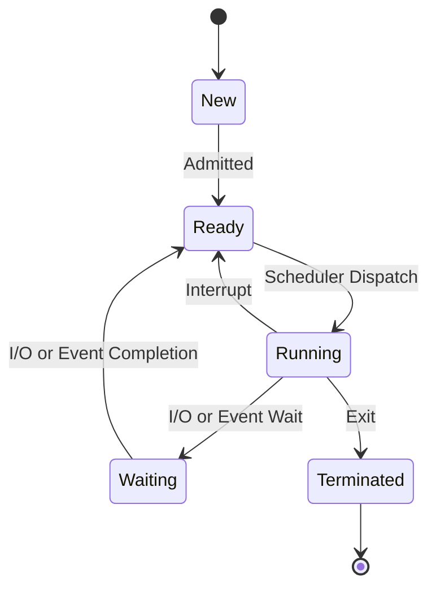
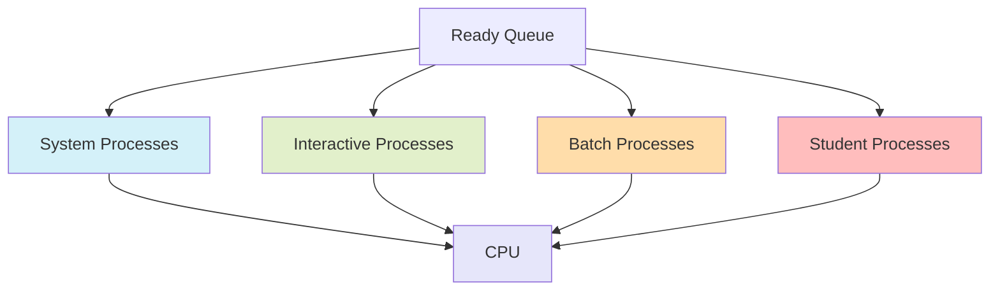

```mermaid
gantt
    title FCFS Scheduling
    dateFormat X
    axisFormat %d
    
    section Processes
    P1 : 0, 24
    P2 : 24, 3
    P3 : 27, 3
```

```mermaid
gantt
    title Round Robin Scheduling (Quantum = 4)
    dateFormat X
    axisFormat %d
    
    section Processes
    P1 (4/24) : 0, 4
    P2 (3/3)  : 4, 3
    P3 (3/3)  : 7, 3
    P1 (8/24) : 10, 4
    P1 (12/24): 14, 4
    P1 (16/24): 18, 4
    P1 (20/24): 22, 4
    P1 (24/24): 26, 4
```

# CPU Scheduling

## Introduction

CPU scheduling is one of the fundamental mechanisms in an operating system that determines which process gets to use the CPU at any given time. In a modern computer system, multiple processes compete for limited CPU resources. The operating system must decide which process runs, when it runs, and for how long it runs - this is the essence of CPU scheduling.

Think of CPU scheduling like managing a busy restaurant with limited seating. The host (operating system) decides which customers (processes) get seated (CPU time) based on various strategies like reservation time, party size, or VIP status. The goal is to maximize throughput, minimize waiting times, and ensure fairness.

## Why CPU Scheduling Matters

CPU scheduling directly affects:

- **System throughput**: How many processes complete per unit of time
- **Response time**: How quickly the system responds to user requests
- **Resource utilization**: How efficiently the CPU is used
- **Fairness**: Ensuring all processes get adequate CPU time

For a beginner programmer, understanding CPU scheduling provides insight into how your programs interact with the operating system and compete with other processes for resources.

## Key Concepts in CPU Scheduling

### Process States

Before diving into scheduling algorithms, let's understand the different states a process can be in:

<div className="process-states">



</div>

- **New**: Process is being created
- **Ready**: Process is waiting to be assigned to the CPU
- **Running**: Process is executing on the CPU
- **Waiting**: Process is waiting for some event (like I/O completion)
- **Terminated**: Process has finished execution

### CPU Scheduler Types

There are three main types of CPU schedulers:

1. **Long-term scheduler (Job scheduler)**: Controls which programs are admitted to the system for processing
2. **Medium-term scheduler**: Handles swapping processes in and out of memory (between disk and main memory)
3. **Short-term scheduler (CPU scheduler)**: Decides which process in the ready queue gets CPU time

Our focus will be on the short-term scheduler, which makes decisions much more frequently (milliseconds).

## CPU Scheduling Algorithms

Let's explore the most common scheduling algorithms with examples:

### 1. First-Come, First-Served (FCFS)

This is the simplest scheduling algorithm - processes are executed in the order they arrive.

#### Example:

Consider three processes with their arrival time and burst time (execution time):

| Process | Arrival Time | Burst Time |
|---------|--------------|------------|
| P1      | 0            | 24         |
| P2      | 1            | 3          |
| P3      | 2            | 3          |



**Waiting time calculation**:
- P1: 0 (runs immediately)
- P2: 24 - 1 = 23 (arrives at 1 but waits until P1 finishes at 24)
- P3: 27 - 2 = 25 (arrives at 2 but waits until P2 finishes at 27)

**Average waiting time**: (0 + 23 + 25) / 3 = 16 time units

**Problem with FCFS**: Notice how P2 and P3 wait a long time even though they're short processes? This is known as the "convoy effect" - short processes get stuck waiting behind long processes.

### 2. Shortest Job First (SJF)

SJF selects the process with the smallest burst time to execute next.

#### Example:

Using the same processes:

| Process | Arrival Time | Burst Time |
|---------|--------------|------------|
| P1      | 0            | 24         |
| P2      | 1            | 3          |
| P3      | 2            | 3          |

If we use non-preemptive SJF:

```mermaid
gantt
    title Non-preemptive SJF Scheduling
    dateFormat X
    axisFormat %d
    
    section Processes
    P1 : 0, 24
    P2 : 24, 3
    P3 : 27, 3
```



The execution order is the same as FCFS because P1 arrives first and starts executing, and SJF is non-preemptive, meaning we don't interrupt P1 when shorter jobs arrive.

If we use preemptive SJF (also called Shortest Remaining Time First):

```mermaid
gantt
    title Preemptive SJF Scheduling
    dateFormat X
    axisFormat %d
    
    section Processes
    P1 (part 1) : 0, 1
    P2          : 1, 3
    P3          : 4, 3
    P1 (part 2) : 7, 23
```



**Waiting time calculation**:
- P1: 1 + 6 = 7 (gets interrupted after 1 time unit, waits 6 more until P2 and P3 finish)
- P2: 0 (runs immediately after arrival)
- P3: 4 - 2 = 2 (arrives at 2 but waits until P2 finishes at 4)

**Average waiting time**: (7 + 0 + 2) / 3 = 3 time units

### 3. Round Robin (RR)

Round Robin is designed especially for time-sharing systems. Each process gets a small unit of CPU time (called a time quantum or time slice), and after this time has elapsed, the process is preempted and added to the back of the ready queue.

#### Example:

Using the same processes with a time quantum of 4:

| Process | Arrival Time | Burst Time |
|---------|--------------|------------|
| P1      | 0            | 24         |
| P2      | 1            | 3          |
| P3      | 2            | 3          |



**Waiting time calculation**:
- P1: 0 + (10-4) + (14-8) + (18-12) + (22-16) + (26-20) = 0 + 6 + 6 + 6 + 6 + 6 = 30
- P2: 4 - 1 = 3
- P3: 7 - 2 = 5

**Average waiting time**: (30 + 3 + 5) / 3 = 12.67 time units

### 4. Priority Scheduling

Each process is assigned a priority, and the CPU is allocated to the process with the highest priority.

#### Example:

Consider processes with their priorities (lower number means higher priority):

| Process | Arrival Time | Burst Time | Priority |
|---------|--------------|------------|----------|
| P1      | 0            | 10         | 3        |
| P2      | 1            | 1          | 1        |
| P3      | 2            | 2          | 4        |
| P4      | 3            | 1          | 2        |

```mermaid
gantt
    title Priority Scheduling
    dateFormat X
    axisFormat %d
    
    section Processes
    P1 (part 1) : 0, 1
    P2          : 1, 1
    P4          : 2, 1
    P1 (part 2) : 3, 9
    P3          : 12, 2
```



In preemptive priority scheduling, P1 starts first but is preempted when P2 arrives with higher priority. After P2 and P4 complete, P1 resumes, and finally P3 runs.

### 5. Multilevel Queue Scheduling

Processes are permanently assigned to different queues based on their characteristics (e.g., foreground vs. background). Each queue has its own scheduling algorithm.



Each queue has a different priority level, with different scheduling algorithms. For example:
- System processes: Highest priority, Round Robin
- Interactive processes: Medium priority, Round Robin
- Batch processes: Low priority, FCFS
- Student processes: Lowest priority, FCFS

## Scheduling Metrics

How do we evaluate which scheduling algorithm is better? Here are some common performance metrics:

1. **CPU Utilization**: Keep the CPU as busy as possible (ideally 100%)
2. **Throughput**: Number of processes completed per time unit
3. **Turnaround Time**: Time taken from process submission to completion
4. **Waiting Time**: Time spent waiting in the ready queue
5. **Response Time**: Time from submission until first response

## Implementing a Simple CPU Scheduler in Python

Let's implement a simple First-Come, First-Served (FCFS) scheduler to understand the concept better:

```python
def fcfs_scheduler(processes):
    n = len(processes)
    # Initialize waiting time and turnaround time arrays
    waiting_time = [0] * n
    turnaround_time = [0] * n
    
    # Calculate waiting time for all processes
    for i in range(1, n):
        waiting_time[i] = processes[i-1][1] + waiting_time[i-1]
    
    # Calculate turnaround time for all processes
    for i in range(n):
        turnaround_time[i] = processes[i][1] + waiting_time[i]
    
    # Calculate average waiting and turnaround times
    avg_waiting_time = sum(waiting_time) / n
    avg_turnaround_time = sum(turnaround_time) / n
    
    # Print results
    print("Process\tBurst Time\tWaiting Time\tTurnaround Time")
    for i in range(n):
        print(f"P{i+1}\t{processes[i][1]}\t\t{waiting_time[i]}\t\t{turnaround_time[i]}")
    
    print(f"Average Waiting Time: {avg_waiting_time:.2f}")
    print(f"Average Turnaround Time: {avg_turnaround_time:.2f}")

# Example usage
# Format: (process_id, burst_time)
processes = [(1, 24), (2, 3), (3, 3)]
fcfs_scheduler(processes)
```

### Output:
```
Process	Burst Time	Waiting Time	Turnaround Time
P1	24		0		24
P2	3		24		27
P3	3		27		30

Average Waiting Time: 17.00
Average Turnaround Time: 27.00
```

## Real-World Applications

Understanding CPU scheduling has practical applications in:

### 1. Operating System Design

Different operating systems implement various scheduling algorithms:
- **Linux**: Uses the Completely Fair Scheduler (CFS), which ensures each process gets a fair share of CPU time
- **Windows**: Implements a multilevel feedback queue with priorities
- **macOS**: Uses a priority-based system with thread aging

### 2. Process Priority in Your Applications

As a programmer, you can sometimes influence how your program is scheduled:

```python
import os
import psutil

def set_process_priority(pid=None, priority=psutil.NORMAL_PRIORITY_CLASS):
    """Set process priority.
    
    pid: Process ID (current process if None)
    priority: psutil.IDLE_PRIORITY_CLASS
              psutil.BELOW_NORMAL_PRIORITY_CLASS
              psutil.NORMAL_PRIORITY_CLASS
              psutil.ABOVE_NORMAL_PRIORITY_CLASS
              psutil.HIGH_PRIORITY_CLASS
              psutil.REALTIME_PRIORITY_CLASS
    """
    p = psutil.Process(pid or os.getpid())
    p.nice(priority)
    
# Example: Set current process to high priority
set_process_priority(priority=psutil.HIGH_PRIORITY_CLASS)
print("Process priority increased")
```

### 3. Task Management in Web Servers

Web servers use scheduling principles to handle thousands of concurrent connections:
- **Nginx** uses an event-driven architecture for efficient request processing
- **Node.js** uses a non-blocking event loop to handle asynchronous operations

## Summary

CPU scheduling is a fundamental concept in operating systems that determines how the CPU's time is allocated among competing processes. We've explored several scheduling algorithms:

- **First-Come, First-Served (FCFS)**: Simple but can lead to convoy effect
- **Shortest Job First (SJF)**: Optimal for minimizing waiting time but requires knowing job lengths
- **Round Robin (RR)**: Fair for time-sharing systems, but time quantum selection is crucial
- **Priority Scheduling**: Assigns importance to processes but can lead to starvation
- **Multilevel Queue**: Separates processes into different queues with different priorities

Each algorithm has its strengths and weaknesses, and the choice depends on the specific requirements of the system, such as whether it's batch processing, interactive, or real-time.

## Exercises

1. Implement the Shortest Job First (SJF) scheduling algorithm in Python.
2. Calculate the average waiting time for the following processes using Round Robin with a quantum of 2:
   - P1: Arrival time 0, Burst time 5
   - P2: Arrival time 1, Burst time 3
   - P3: Arrival time 2, Burst time 1
   - P4: Arrival time 3, Burst time 2
3. How would you design a scheduler for a real-time system where certain processes must complete within strict deadlines?
4. Research and write a short description of how the Linux Completely Fair Scheduler works.

## Additional Resources

- Operating System Concepts by Silberschatz, Galvin, and Gagne
- Modern Operating Systems by Andrew S. Tanenbaum
- Linux Kernel Development by Robert Love
- The Art of Concurrency by Clay Breshears

Understanding CPU scheduling gives you insight into how your programs interact with the operating system and helps you write more efficient, resource-aware applications. As you develop more complex software, these concepts will become increasingly valuable!