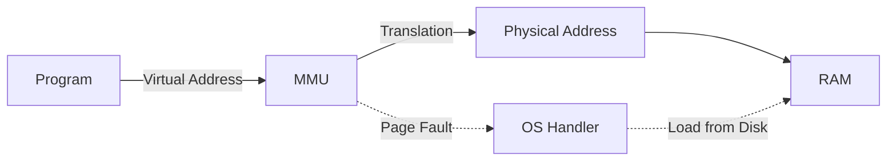
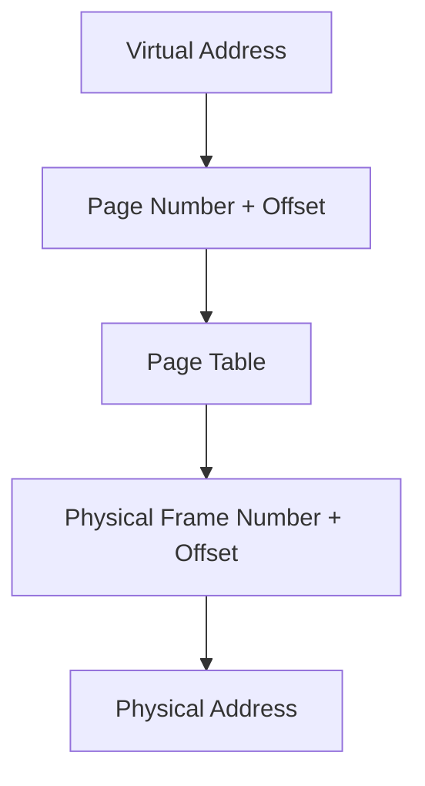
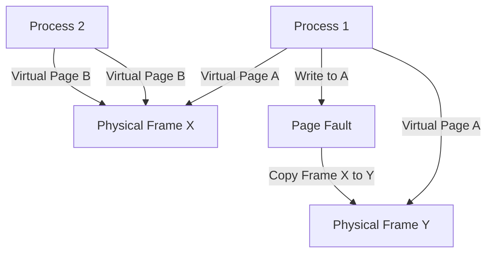

# Virtual Memory

## Introduction

Virtual memory is one of the most important concepts in modern operating systems. It allows computers to run programs that require more memory than is physically available by using disk space as an extension of RAM. This elegant solution has become a fundamental part of operating systems since the 1960s.

In this article, we'll explore how virtual memory works, why it's necessary, and how operating systems implement it through techniques like paging and page replacement algorithms.

## What is Virtual Memory?

Virtual memory is a memory management capability of an operating system that uses hardware and software to allow a computer to compensate for physical memory shortages by temporarily transferring data from random access memory (RAM) to disk storage.

With virtual memory, each program operates as if it has access to a large, contiguous address space, regardless of the actual physical memory available.

### Key Benefits of Virtual Memory

1. **Running larger programs**: Programs can be larger than physical memory
2. **Simplifying programming**: Developers don't need to worry about memory constraints
3. **Increasing multi-tasking capabilities**: More programs can run simultaneously
4. **Providing memory protection**: Programs are isolated from each other

## How Virtual Memory Works

Virtual memory works by using a combination of hardware (the Memory Management Unit or MMU) and software (operating system routines) to translate virtual addresses (used by programs) to physical addresses (actual locations in RAM).

### Address Translation

When a program accesses memory, it uses virtual addresses. The system must translate these to physical addresses:



Let's see an example of how address translation might work:

```c
// Program using virtual address
int main() {
    int *ptr = (int*)0x12345678;  // Virtual address
    *ptr = 42;                    // Access memory
    return 0;
}
```

In this simple example, the program believes it's writing to memory location `0x12345678`, but the actual physical location might be completely different, like `0x00A4F310`.

## Paging: The Core Mechanism

Paging is the most common implementation of virtual memory. In a paging system:

1. Virtual address space is divided into fixed-size units called **pages**
2. Physical memory is divided into the same size units called **page frames**
3. Pages can be stored either in RAM or on disk
4. A **page table** keeps track of where each page is located

### Page Tables

Page tables map virtual page numbers to physical frame numbers:



### Example of Paging

Consider a system with:
- 32-bit virtual addresses
- 4 KB (4,096 bytes) page size
- Physical memory of 16 MB

For such a system:
- Each virtual address would have 12 bits of offset (since 2^12 = 4,096) and 20 bits of page number
- The page table would have 2^20 entries (over a million entries)

Here's how an address translation might work:

```
Virtual address:  0x00403C10
Page number:      0x00403 (using top 20 bits)
Offset:           0xC10 (using bottom 12 bits)

Page table lookup: 0x00403 → 0x00091 (physical frame)

Physical address: 0x00091C10
```

## Page Faults and Demand Paging

A **page fault** occurs when a program accesses a page that is mapped in the virtual address space but not loaded in physical memory. The operating system must handle this by:

1. Suspending the program
2. Finding a free frame in physical memory
3. Loading the required page from disk
4. Updating the page table
5. Resuming the program

This process is called **demand paging** because pages are only brought into memory when they are needed.

### Page Fault Handling Code Example

Here's a simplified pseudocode example of how an operating system might handle a page fault:

```c
void handle_page_fault(virtual_address addr) {
    // Extract page number from virtual address
    page_number = (addr >> OFFSET_BITS);
    
    // Find a free frame or select a victim frame
    frame_number = find_free_frame();
    if (frame_number == -1) {
        // No free frames, use page replacement algorithm
        frame_number = select_victim_frame();
        if (is_dirty(frame_number)) {
            // Write back to disk if modified
            write_to_disk(frame_number);
        }
    }
    
    // Load page from disk to the selected frame
    load_from_disk(page_number, frame_number);
    
    // Update page table
    update_page_table(page_number, frame_number);
    
    // Set page as present
    set_present_bit(page_number);
}
```

## Page Replacement Algorithms

When physical memory is full and a new page needs to be loaded, the operating system must decide which page to evict. Several algorithms exist for this purpose:

### 1. First-In-First-Out (FIFO)

Replaces the oldest page in memory.

### 2. Least Recently Used (LRU)

Replaces the page that hasn't been used for the longest time.

```c
// Simplified LRU implementation
void access_page(int page_number) {
    // Update timestamp for this page
    page_timestamp[page_number] = current_time++;
}

int find_lru_victim() {
    int lru_page = 0;
    for (int i = 1; i < NUM_PAGES; i++) {
        if (page_timestamp[i] < page_timestamp[lru_page]) {
            lru_page = i;
        }
    }
    return lru_page;
}
```

### 3. Optimal

Replaces the page that will not be used for the longest time in the future. This is theoretically optimal but impossible to implement perfectly in practice as it requires knowledge of future accesses.

### 4. Clock (Second Chance)

A more practical approximation of LRU that uses a reference bit.

## Thrashing

**Thrashing** occurs when the computer spends more time swapping pages than executing the program. This happens when the working set (set of pages a process needs) is larger than available physical memory.

Signs of thrashing include:
- High disk activity
- Low CPU utilization
- Poor system performance

To prevent thrashing, operating systems:
1. Limit the number of active processes
2. Implement working set models
3. Use page fault frequency algorithms

## Practical Applications

### Memory-Mapped Files

Modern operating systems use virtual memory mechanisms to map files directly into a process's address space:

```c
// Memory mapping a file in C (POSIX)
#include <sys/mman.h>
#include <fcntl.h>

int main() {
    int fd = open("data.bin", O_RDWR);
    char *file_data = mmap(NULL, 4096, PROT_READ | PROT_WRITE, 
                           MAP_SHARED, fd, 0);
    
    // Now we can access the file as if it were memory
    file_data[0] = 'A';  // This will modify the file
    
    munmap(file_data, 4096);
    close(fd);
    return 0;
}
```

### Copy-on-Write (COW)

This technique allows multiple processes to share the same physical pages until one of them modifies a page:



### Example in Modern OSes

In Linux, you can see virtual memory statistics using the `vmstat` command:

```bash
$ vmstat
procs -----------memory---------- ---swap-- -----io---- -system-- ------cpu-----
 r  b   swpd   free   buff  cache   si   so    bi    bo   in   cs us sy id wa st
 1  0      0 2915476  93636 523712    0    0    16    32  105  232  3  1 96  0  0
```

Windows Task Manager also shows virtual memory usage under the "Performance" tab.

## Virtual Memory in Different Operating Systems

### Linux

Linux uses a demand-paged virtual memory system with support for swapping. The kernel provides the following mechanisms:

- **Swap space**: Dedicated disk partitions or files for storing pages
- **Overcommit**: Allowing processes to allocate more memory than physically available
- **OOM Killer**: A component that kills processes when memory is critically low

### Windows

Windows implements virtual memory through a paging file (pagefile.sys):

- Each process has a private address space of 4GB (in 32-bit systems)
- The working set of a process is monitored and adjusted
- Memory is divided into different pools (paged and non-paged)

### macOS

macOS combines paging with a sophisticated VM system:

- Uses compressed memory to reduce swapping
- Implements automatic page-out processes
- Provides memory pressure notifications to applications

## Summary

Virtual memory is a powerful abstraction that allows operating systems to:

1. Execute programs larger than physical memory
2. Provide memory isolation between processes
3. Simplify application development by providing a consistent memory model
4. Optimize memory usage through sharing and demand paging

Key concepts we've covered include:
- Address translation between virtual and physical addresses
- Paging and page tables
- Page faults and demand paging
- Page replacement algorithms
- Memory protection and sharing

## Exercises

1. Calculate the number of pages needed for a 64MB program on a system with 4KB page size.
2. Implement a simple FIFO page replacement algorithm in your preferred language.
3. Draw the memory layout of a system with 8 pages and 4 frames, showing what happens during a series of memory accesses.
4. Research and compare the virtual memory implementations in Linux, Windows, and macOS.
5. Modify the example code for memory-mapped files to count the frequency of each byte in a file.

## Additional Resources

- "Operating System Concepts" by Silberschatz, Galvin, and Gagne
- "Modern Operating Systems" by Andrew S. Tanenbaum
- Linux source code: The memory management subsystem
- The Wikipedia article on Virtual Memory provides a good overview
- MIT's Operating Systems Engineering course materials

Happy learning!