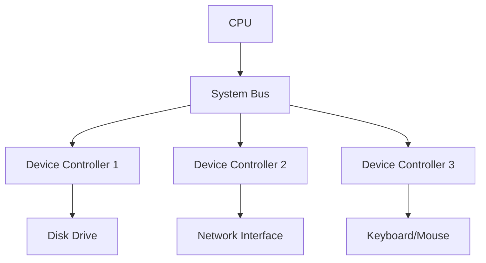
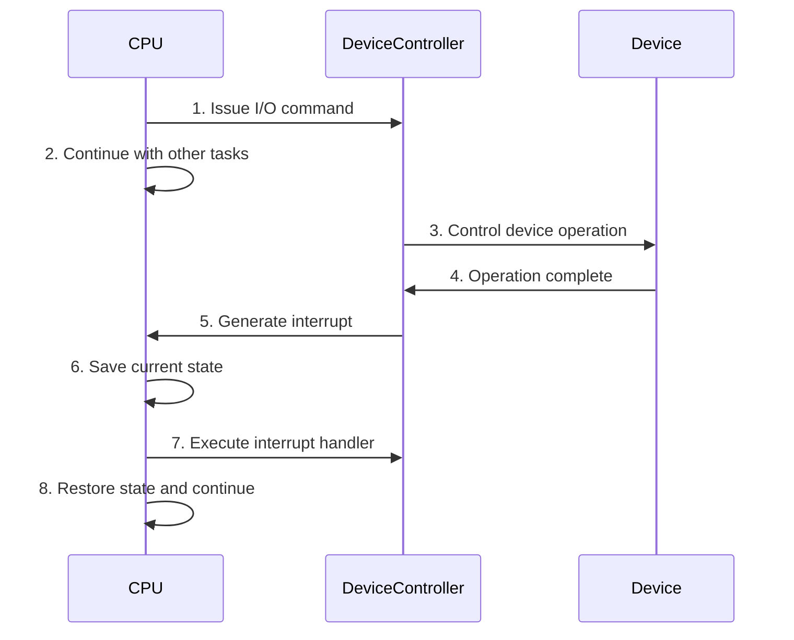
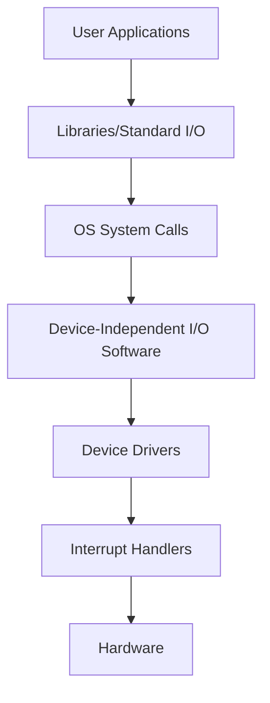

# I/O Systems

## Introduction

Input/Output (I/O) systems form a critical part of any operating system, serving as the bridge between the computer and the outside world. When you press a key, click a mouse, save a file, or browse the web, you're interacting with the I/O system of your operating system.

This article explores how operating systems manage the complex task of communicating with diverse hardware devices while providing a consistent interface to applications. We'll examine both the hardware and software aspects of I/O systems, and see how they work together to enable efficient data transfer between the computer and external devices.

## I/O Hardware Basics

### Types of I/O Devices

I/O devices can be categorized based on several criteria:

1. **Direction of data flow**:
   - **Input devices**: Keyboard, mouse, scanner, microphone
   - **Output devices**: Monitor, printer, speakers
   - **Storage devices**: Hard disks, SSDs, USB drives (both input and output)

2. **Data transfer rate**:
   - **Low-speed**: Keyboards, mice (a few bytes per second)
   - **Medium-speed**: Printers, scanners (KB to MB per second)
   - **High-speed**: Disks, network interfaces (MB to GB per second)

3. **Method of operation**:
   - **Character devices**: Transfer data one character at a time (keyboard)
   - **Block devices**: Transfer data in fixed-size blocks (disks)

### Device Controllers

Devices connect to the computer through hardware interfaces called **device controllers** or **adapters**. These controllers:

- Act as intermediaries between the device and the CPU
- Convert the CPU's electrical signals to signals the device can understand
- Contain their own processors, memory, and software
- Provide a standard interface to the OS while handling device-specific details



### How I/O Operations Work

I/O operations typically involve three main components:

1. **CPU**: Issues commands to the device controller
2. **Device Controller**: Manages the device and executes CPU commands
3. **Device**: The physical hardware that inputs or outputs data

## I/O Communication Methods

### Memory-Mapped I/O vs. Port-Mapped I/O

Operating systems use two primary methods to communicate with device controllers:

1. **Port-Mapped I/O**:
   - Uses special CPU instructions for I/O operations
   - Addresses a separate I/O address space
   - Uses specific instructions like `IN` and `OUT`

```c
// Example of Port-Mapped I/O in assembly (x86)
// Read a byte from port 0x60 (keyboard controller)
unsigned char read_keyboard_port() {
    unsigned char value;
    __asm__ __volatile__ ("inb $0x60, %0" : "=a" (value));
    return value;
}

// Write a byte to port 0x20 (PIC controller)
void write_to_pic(unsigned char value) {
    __asm__ __volatile__ ("outb %0, $0x20" : : "a" (value));
}
```

2. **Memory-Mapped I/O**:
   - Maps device controllers' registers to memory addresses
   - Uses regular memory access instructions
   - Treats I/O devices as if they were memory locations

```c
// Example of Memory-Mapped I/O
// Assuming a device's register is mapped to address 0x1000
void write_to_device(unsigned char value) {
    *(volatile unsigned char*)0x1000 = value;
}

unsigned char read_from_device() {
    return *(volatile unsigned char*)0x1000;
}
```

### Polling vs. Interrupts

There are two main ways for the CPU to check if an I/O operation is complete:

1. **Polling**:
   - The CPU continuously checks the status register of the device
   - Simple to implement but wastes CPU cycles

```c
// Example of polling
void write_data_polling(char data) {
    // Write data to device data register
    *(volatile char*)DEVICE_DATA_REG = data;
    
    // Poll until the operation is complete
    while ((*(volatile char*)DEVICE_STATUS_REG & READY_BIT) == 0) {
        // Just wait
    }
}
```

2. **Interrupts**:
   - The device signals the CPU when an operation is complete
   - More efficient but more complex to implement
   - The CPU can perform other tasks while waiting



### Direct Memory Access (DMA)

For large data transfers, involving the CPU in every byte transfer is inefficient. **Direct Memory Access (DMA)** allows devices to transfer data directly to/from memory without CPU intervention.

1. The CPU sets up the DMA controller with:
   - Source and destination addresses
   - Amount of data to transfer
   - Direction of transfer

2. The DMA controller handles the transfer independently

3. Once complete, the DMA controller generates an interrupt

```c
// Simplified example of setting up a DMA transfer
void setup_dma_transfer(void* source, void* destination, size_t size) {
    // Set source address
    *(volatile void**)DMA_SOURCE_REG = source;
    
    // Set destination address
    *(volatile void**)DMA_DEST_REG = destination;
    
    // Set transfer size
    *(volatile size_t*)DMA_SIZE_REG = size;
    
    // Start transfer (assuming bit 0 starts the transfer)
    *(volatile char*)DMA_CONTROL_REG |= 0x01;
}
```

## I/O Software Layers

I/O software is organized into several layers, each with specific responsibilities:



Let's examine each layer:

### 1. User-Level Libraries

These provide standard functions for I/O operations that applications can use.

```c
// Example using standard I/O library in C
#include <stdio.h>

int main() {
    FILE *file = fopen("example.txt", "w");
    if (file) {
        fprintf(file, "Hello, I/O Systems!");
        fclose(file);
    }
    return 0;
}
```

### 2. OS System Calls

System calls provide the interface between user applications and the operating system's I/O facilities.

```c
// Example using system calls directly
#include <unistd.h>
#include <fcntl.h>

int main() {
    int fd = open("example.txt", O_WRONLY | O_CREAT, 0644);
    if (fd != -1) {
        write(fd, "Hello, I/O Systems!", 19);
        close(fd);
    }
    return 0;
}
```

### 3. Device-Independent I/O Software

This layer provides common functions across different device types, including:

- Uniform interfacing for device drivers
- Buffering management
- Error reporting
- Allocation and release of dedicated devices

### 4. Device Drivers

Device drivers are specialized software that understand how to communicate with specific hardware devices.

```c
// Simplified example of a character device driver
struct char_device_driver {
    int (*open)(struct device*);
    int (*close)(struct device*);
    ssize_t (*read)(struct device*, char*, size_t);
    ssize_t (*write)(struct device*, const char*, size_t);
};

// Implementation for a specific device
ssize_t my_device_write(struct device* dev, const char* buffer, size_t size) {
    // Device-specific code to write data
    for (size_t i = 0; i < size; i++) {
        // Write each byte to the device's data register
        write_to_device_register(dev->base_addr + DATA_REG, buffer[i]);
        
        // Wait for the device to process the byte
        while (!device_ready(dev)) {
            // Wait
        }
    }
    return size;
}
```

### 5. Interrupt Handlers

Interrupt handlers are responsible for:
- Acknowledging the interrupt
- Checking for errors
- Transferring data if needed
- Waking up processes waiting for I/O completion

```c
// Simplified interrupt handler for a device
void keyboard_interrupt_handler() {
    // Read the scancode from the keyboard controller
    unsigned char scancode = read_keyboard_port();
    
    // Process the scancode
    process_keypress(scancode);
    
    // Acknowledge the interrupt to the interrupt controller
    acknowledge_interrupt();
}
```

## I/O Performance Optimization Techniques

### Buffering

Buffering involves storing data temporarily during transfer to improve efficiency.

Three common buffering strategies:

1. **Single Buffering**: Uses one buffer to hold data being transferred
2. **Double Buffering**: Uses two buffers - while one is being processed, the other is being filled/emptied
3. **Circular Buffering**: Uses multiple buffers in a circular queue

```c
// Example of a circular buffer implementation
#define BUFFER_SIZE 256

struct circular_buffer {
    char buffer[BUFFER_SIZE];
    int read_index;
    int write_index;
    int count;
};

void init_buffer(struct circular_buffer* cb) {
    cb->read_index = 0;
    cb->write_index = 0;
    cb->count = 0;
}

int buffer_write(struct circular_buffer* cb, char data) {
    if (cb->count == BUFFER_SIZE) {
        return -1;  // Buffer full
    }
    
    cb->buffer[cb->write_index] = data;
    cb->write_index = (cb->write_index + 1) % BUFFER_SIZE;
    cb->count++;
    return 0;
}

int buffer_read(struct circular_buffer* cb, char* data) {
    if (cb->count == 0) {
        return -1;  // Buffer empty
    }
    
    *data = cb->buffer[cb->read_index];
    cb->read_index = (cb->read_index + 1) % BUFFER_SIZE;
    cb->count--;
    return 0;
}
```

### Caching

Caching keeps frequently accessed data in faster memory to reduce I/O operations.

### Spooling

Spooling (Simultaneous Peripheral Operation On-Line) allows devices like printers to be shared among multiple processes.

### Scheduling

I/O scheduling optimizes the order of I/O requests to improve throughput and reduce latency.

Common disk scheduling algorithms include:
- First-Come, First-Served (FCFS)
- Shortest Seek Time First (SSTF)
- SCAN (Elevator algorithm)
- C-SCAN (Circular SCAN)

```c
// Example of SCAN (Elevator) disk scheduling algorithm
void scan_algorithm(int requests[], int n, int head_position, int direction) {
    // Sort requests
    sort(requests, n);
    
    printf("Seek Sequence: ");
    
    // If moving toward higher cylinder numbers
    if (direction == 1) {
        // Service requests higher than head position
        for (int i = 0; i < n; i++) {
            if (requests[i] >= head_position) {
                printf("%d ", requests[i]);
            }
        }
        
        // Then reverse direction and service lower requests
        for (int i = n - 1; i >= 0; i--) {
            if (requests[i] < head_position) {
                printf("%d ", requests[i]);
            }
        }
    } else {
        // Service requests lower than head position
        for (int i = n - 1; i >= 0; i--) {
            if (requests[i] <= head_position) {
                printf("%d ", requests[i]);
            }
        }
        
        // Then reverse direction and service higher requests
        for (int i = 0; i < n; i++) {
            if (requests[i] > head_position) {
                printf("%d ", requests[i]);
            }
        }
    }
}
```

## Real-World Examples

### Example 1: Reading from a File

Let's trace what happens when a program reads data from a file:

1. The application calls `fread()` from the standard library
2. The library function calls the `read()` system call
3. The OS locates the file and determines which blocks to read
4. The OS issues commands to the disk controller
5. The disk controller retrieves the data using DMA
6. An interrupt signals completion
7. The OS processes the interrupt and returns data to the application

### Example 2: Network Communication

When sending data over a network:

1. The application writes data to a socket
2. The OS's network stack processes the data through various protocols (TCP/IP, etc.)
3. The network driver prepares packets and sends them to the network interface
4. The network controller transmits the packets
5. For incoming data, the process works in reverse

```c
// Simple TCP client example
#include <stdio.h>
#include <stdlib.h>
#include <string.h>
#include <unistd.h>
#include <arpa/inet.h>

int main() {
    // Create socket
    int sock = socket(AF_INET, SOCK_STREAM, 0);
    if (sock == -1) {
        perror("Socket creation failed");
        return 1;
    }
    
    // Prepare server address
    struct sockaddr_in server;
    server.sin_family = AF_INET;
    server.sin_port = htons(8080);
    server.sin_addr.s_addr = inet_addr("127.0.0.1");
    
    // Connect to server
    if (connect(sock, (struct sockaddr*)&server, sizeof(server)) < 0) {
        perror("Connection failed");
        return 1;
    }
    
    // Send data
    const char* message = "Hello, I/O Systems!";
    send(sock, message, strlen(message), 0);
    
    // Cleanup
    close(sock);
    return 0;
}
```

### Example 3: Device Driver Integration

Modern operating systems use device drivers to integrate new hardware. When you plug in a new USB device:

1. The USB controller detects the device and generates an interrupt
2. The OS's USB driver reads device descriptors
3. The OS locates and loads the appropriate device driver
4. The driver initializes the device and registers it with the system
5. The device becomes available to applications

## Summary

I/O systems are complex but crucial components of operating systems, responsible for managing the communication between computers and the outside world. We've explored:

- **I/O Hardware**: The physical components that enable input and output
- **Communication Methods**: How CPUs talk to devices using port-mapped or memory-mapped I/O
- **Polling vs. Interrupts**: Different ways to check for operation completion
- **DMA**: How large data transfers can bypass CPU involvement
- **I/O Software Layers**: From application libraries down to device drivers
- **Performance Optimization**: Techniques like buffering, caching, and scheduling
- **Real-World Examples**: Practical applications of I/O systems

Understanding I/O systems helps developers write more efficient code and appreciate the complexity hidden beneath seemingly simple operations like reading a file or sending network data.

## Exercises

1. Write a program that measures the time taken to read a large file using different buffer sizes. How does the buffer size affect performance?

2. Research how your operating system manages printer spooling. What problems does spooling solve?

3. Implement a simple circular buffer and test it with a producer-consumer scenario.

4. Compare the disk scheduling algorithms FCFS, SSTF, and SCAN using a simulation. Which performs best under different workloads?

5. Find out which I/O method (polling or interrupts) your keyboard driver uses. How would the user experience differ if it used the other method?

## Additional Resources

- "Operating System Concepts" by Silberschatz, Galvin, and Gagne
- Linux Documentation Project's guides on writing device drivers
- Your operating system's developer documentation for device driver APIs
- Online tutorials on socket programming and file I/O