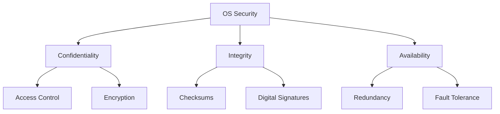
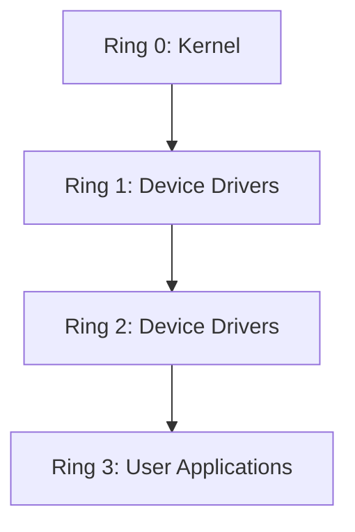

# OS Security Concepts

## Introduction

Operating System security is a crucial aspect of computer science that focuses on protecting computer systems from unauthorized access, malicious attacks, and data breaches. As the intermediary between hardware and applications, the operating system plays a vital role in maintaining the security and integrity of the entire computing environment.

In this guide, we'll explore the fundamental concepts of OS security, understand the different security mechanisms implemented in modern operating systems, and learn how these concepts apply to real-world scenarios.

## Core Security Principles

### Confidentiality, Integrity, and Availability (CIA Triad)

The CIA triad represents the three primary goals of any security system:

1. **Confidentiality**: Ensuring that information is accessible only to those authorized to access it
2. **Integrity**: Maintaining and assuring the accuracy and consistency of data over its lifecycle
3. **Availability**: Ensuring that information is available when needed by authorized users



## Authentication and Authorization

### Authentication

Authentication is the process of verifying the identity of a user, device, or system. Operating systems use various authentication mechanisms to ensure that only legitimate users gain access to the system.

#### Password-Based Authentication

The most common form of authentication involves the use of passwords.

```bash
# Example of a login prompt in a Unix-like system
login: user123
Password: ********
```

#### Multi-Factor Authentication (MFA)

Modern operating systems often implement multi-factor authentication, requiring users to provide two or more verification factors:

1. Something you know (password)
2. Something you have (security token)
3. Something you are (biometric verification)

### Authorization

Once authenticated, authorization determines what resources a user can access and what operations they can perform on those resources.

## Access Control Mechanisms

Access control is how operating systems restrict access to resources. There are several models:

### Discretionary Access Control (DAC)

In DAC, the owner of a resource defines access permissions.

```bash
# Example: Setting file permissions in Linux
chmod 644 myfile.txt  # Owner can read/write; others can only read
chmod 700 script.sh   # Only owner can read/write/execute
```

### Mandatory Access Control (MAC)

MAC enforces access based on system-wide policies that cannot be modified by users.

```bash
# Example: SELinux context for a file
ls -Z /etc/passwd
# Output: system_u:object_r:passwd_file_t:s0 /etc/passwd
```

### Role-Based Access Control (RBAC)

RBAC assigns permissions to roles, and users are assigned to appropriate roles.

```bash
# Example: Adding a user to the sudo group in Linux
sudo usermod -aG sudo username
```

## Process Isolation and Memory Protection

Operating systems implement various techniques to isolate processes from each other:

### Memory Protection

Memory protection prevents processes from accessing memory spaces allocated to other processes.

```c
// Example: Segmentation fault when trying to access memory outside boundaries
#include <stdio.h>

int main() {
    int *ptr = NULL;
    *ptr = 42;  // This will cause a segmentation fault
    printf("Value: %d
", *ptr);
    return 0;
}

// Output: Segmentation fault (core dumped)
```

### Privilege Levels (Rings)

Modern processors support multiple privilege levels, often called rings. Operating systems use these levels to separate kernel space (highest privilege) from user space (lowest privilege).



## Encryption and Secure Communication

### File System Encryption

Operating systems can encrypt file systems to protect data from unauthorized access.

```bash
# Example: Creating an encrypted partition in Linux using LUKS
sudo cryptsetup luksFormat /dev/sdb1
sudo cryptsetup open /dev/sdb1 encrypted_data
sudo mkfs.ext4 /dev/mapper/encrypted_data
sudo mount /dev/mapper/encrypted_data /mnt/secure
```

### Secure Communication Channels

Operating systems provide mechanisms for secure communication between processes and across networks.

```python
# Example: Secure socket communication in Python
import ssl
import socket

# Create a secure context
context = ssl.create_default_context()

# Create a secure socket
with socket.socket(socket.AF_INET, socket.SOCK_STREAM) as sock:
    with context.wrap_socket(sock, server_hostname="example.com") as ssock:
        ssock.connect(("example.com", 443))
        # Secure communication happens here
```

## Security Vulnerabilities and Defenses

### Buffer Overflow Protection

Buffer overflows are a common vulnerability. Modern operating systems implement various protections:

```c
// Vulnerable code example
#include <stdio.h>
#include <string.h>

void vulnerable_function(char *input) {
    char buffer[10];
    strcpy(buffer, input);  // No bounds checking!
}

int main(int argc, char *argv[]) {
    if (argc > 1) {
        vulnerable_function(argv[1]);
    }
    return 0;
}
```

Protections include:

1. **Address Space Layout Randomization (ASLR)**: Randomly arranges memory addresses to make exploitation harder
2. **Data Execution Prevention (DEP)**: Marks memory regions as non-executable
3. **Stack Canaries**: Places known values on the stack to detect overflows

### Privilege Escalation Prevention

Operating systems implement mechanisms to prevent unauthorized privilege escalation:

```bash
# Example: Using sudo for temporary privilege escalation
sudo apt update  # Temporarily gains root privileges for this command only
```

## Real-World Application: Security in Linux

Linux implements multiple security measures:

### SELinux (Security-Enhanced Linux)

SELinux provides mandatory access control beyond traditional Unix permissions.

```bash
# Check SELinux status
getenforce
# Output: Enforcing

# View SELinux context of files
ls -Z /var/www/html/
# Output: system_u:object_r:httpd_sys_content_t:s0 index.html
```

### AppArmor

AppArmor is another Linux security module that restricts programs' capabilities:

```bash
# Check AppArmor status
sudo aa-status

# View AppArmor profile for a program
cat /etc/apparmor.d/usr.bin.firefox
```

## Practical Security Configurations

### Firewall Configuration

Operating systems typically include firewall capabilities to control network traffic:

```bash
# Example: Configure firewall rules in Linux using ufw
sudo ufw enable
sudo ufw allow 22/tcp  # Allow SSH connections
sudo ufw deny 23/tcp   # Block telnet
sudo ufw status
```

### User Account Security

Proper user account configuration is essential for OS security:

```bash
# Set password policies
sudo passwd -x 90 username  # Maximum password age: 90 days
sudo passwd -n 7 username   # Minimum password age: 7 days
```

## Summary

Operating System security is a multi-layered approach that combines:

1. **Authentication and Authorization**: Verifying user identities and controlling access to resources
2. **Access Control**: Implementing DAC, MAC, or RBAC to protect system resources
3. **Process Isolation**: Preventing processes from interfering with each other
4. **Encryption**: Protecting data at rest and in transit
5. **Vulnerability Protection**: Implementing safeguards against common attack vectors

Understanding these concepts is crucial for anyone working with computer systems, as they form the foundation of secure computing environments.

## Additional Resources

- Practice implementing file permissions in a Linux environment
- Set up a virtual machine and experiment with different security configurations
- Try to identify security mechanisms in your current operating system
- Research common OS security vulnerabilities and how they were patched

## Exercises

1. Compare the security features of Windows, macOS, and Linux. What are the strengths and weaknesses of each?
2. Implement a simple access control list for files in a programming language of your choice.
3. Configure SELinux or AppArmor policies for a web server to enhance security.
4. Analyze a recent OS security vulnerability and explain how it could have been prevented.