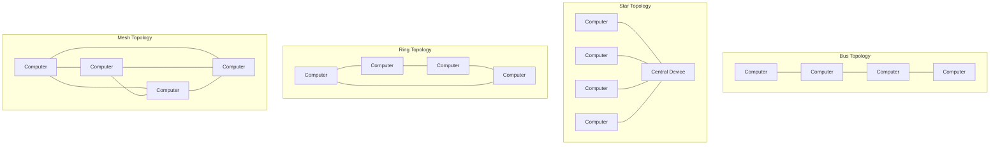
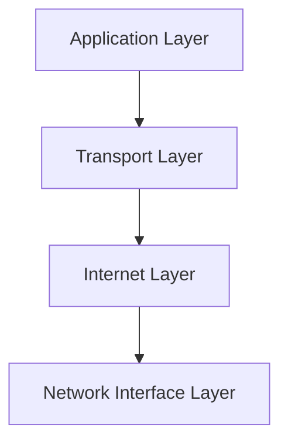

# Networks Introduction

## What is a Computer Network?

A computer network is a collection of computing devices connected together to share resources and communicate with each other. These resources can include data, software, hardware (like printers), and services (like internet access).

Think of a network like a city's road system - it allows traffic (data) to flow between different locations (computers) following certain rules (protocols) to ensure everything runs smoothly.

## Why Do We Need Networks?

Networks have transformed how we use computers. Before networks, computers were isolated machines. Now, they're interconnected systems enabling:

- **Resource sharing**: Use printers, storage, and software from anywhere
- **Communication**: Email, chat, video calls
- **Collaboration**: Multiple people working on the same document
- **Data access**: Retrieve information from anywhere in the world
- **Cost efficiency**: Share expensive resources rather than duplicating them

## Network Components

### 1. Hardware Components

Networks require specific hardware to function:

- **Nodes**: End devices like computers, smartphones, printers, servers
- **Network Interface Cards (NICs)**: Hardware allowing devices to connect to networks
- **Transmission Media**: The physical paths data travels through:
  - **Wired**: Copper cables, fiber optic
  - **Wireless**: Radio waves, microwaves
- **Connecting Devices**:
  - **Hubs**: Simple devices that forward data to all connected devices
  - **Switches**: Intelligent devices that forward data only to the intended recipient
  - **Routers**: Connect different networks together and determine the best path for data
  - **Modems**: Convert digital signals to analog (and vice versa) for transmission

### 2. Software Components

- **Operating Systems**: Provide network functionality
- **Network Software**: Applications designed for network use
- **Protocols**: Rules governing how data is transmitted

## Network Topologies

The physical or logical arrangement of devices in a network is called its topology. Each has advantages and disadvantages:



1. **Bus Topology**: All devices connect to a single cable (the bus)
   - **Pros**: Simple, inexpensive
   - **Cons**: If the main cable fails, the entire network fails

2. **Star Topology**: All devices connect to a central device
   - **Pros**: Easy to add devices, failure of one device doesn't affect others
   - **Cons**: If the central device fails, the entire network fails

3. **Ring Topology**: Devices connect in a closed loop
   - **Pros**: Equal access for all devices
   - **Cons**: Single point of failure can disrupt the entire network

4. **Mesh Topology**: Devices are interconnected with multiple paths
   - **Pros**: Fault-tolerant, high reliability
   - **Cons**: Expensive, complex to implement

## Types of Networks

Networks can be classified by their geographic scope:

1. **LAN (Local Area Network)**: 
   - Covers a small area like a home, office, or building
   - Fast data transfer rates
   - Example: Your home Wi-Fi network

2. **WAN (Wide Area Network)**:
   - Spans a large geographic area, like a country or continent
   - Usually slower than LANs
   - Example: The Internet is the largest WAN

3. **MAN (Metropolitan Area Network)**:
   - Covers a city or large campus
   - Larger than LANs but smaller than WANs
   - Example: City-wide government networks

4. **PAN (Personal Area Network)**:
   - Very small network for personal devices
   - Example: Connecting your phone to your car via Bluetooth

## Network Protocols

Protocols are the rules that govern how data is transmitted over a network. They're like languages that devices use to communicate.

### The TCP/IP Protocol Suite

The most common protocol suite is TCP/IP (Transmission Control Protocol/Internet Protocol), which forms the foundation of the Internet.



1. **Application Layer**: Protocols users interact with (HTTP, FTP, SMTP, DNS)
2. **Transport Layer**: Manages data flow (TCP, UDP)
3. **Internet Layer**: Handles routing (IP)
4. **Network Interface Layer**: Physical and data link connection

### Common Network Protocols

- **HTTP/HTTPS**: Web browsing
- **FTP**: File transfer
- **SMTP**: Email sending
- **POP3/IMAP**: Email receiving
- **DNS**: Domain name resolution
- **DHCP**: Automatic IP address assignment

## Basic Networking in Practice

Let's write a simple Python program to check if a website is reachable:

```python
import socket

def check_website(url):
    try:
        # Attempt to create a socket connection
        socket.create_connection((url, 80), timeout=5)
        return f"{url} is reachable!"
    except OSError:
        return f"{url} is not reachable."

# Test with some websites
websites = ["google.com", "example.com", "localhost"]

for site in websites:
    print(check_website(site))
```

Output:
```
google.com is reachable!
example.com is reachable!
localhost is not reachable.
```

## IP Addresses and Domain Names

Every device on a network needs an address to receive data. On the Internet, these are called IP addresses.

### IP Addresses

An IPv4 address looks like this: `192.168.1.1` - four numbers separated by dots.

We can use Python to find our computer's IP address:

```python
import socket

# Get hostname
hostname = socket.gethostname()
# Get IP address
ip_address = socket.gethostbyname(hostname)

print(f"Hostname: {hostname}")
print(f"IP Address: {ip_address}")
```

Output (will vary based on your computer):
```
Hostname: MyComputer
IP Address: 192.168.1.105
```

### Domain Names

Domain names are human-readable addresses (like `google.com`) that map to IP addresses. The Domain Name System (DNS) translates between them.

We can look up a domain's IP address:

```python
import socket

domain = "google.com"
ip_address = socket.gethostbyname(domain)

print(f"Domain: {domain}")
print(f"IP Address: {ip_address}")
```

Output:
```
Domain: google.com
IP Address: 142.250.190.78
```
(The actual IP may differ when you run this)

## Network Security Basics

Network security is crucial for protecting your data. Basic security measures include:

1. **Firewalls**: Filter network traffic
2. **Encryption**: Protect data during transmission
3. **Authentication**: Verify users' identities
4. **Access Control**: Limit who can access resources
5. **Regular Updates**: Patch security vulnerabilities

## Real-World Applications

Networks are everywhere in our daily lives:

1. **Home Networks**: Connect your devices to the internet and each other
2. **Business Networks**: Allow companies to share resources and information
3. **Cloud Computing**: Remote servers providing services over the internet
4. **Internet of Things (IoT)**: Connect everyday objects to the internet
5. **Social Media Platforms**: Connect people through network infrastructure

## Summary

Networks form the backbone of modern computing, enabling communication and resource sharing between devices. We've covered:

- Basic network components (hardware and software)
- Network topologies and types
- The TCP/IP protocol suite
- IP addresses and domain names
- Practical examples with Python
- Network security fundamentals

Understanding networks is essential for any programmer, as most modern applications rely on network communication in some form.

## Practice Exercises

1. Use the `ping` command from your command line to test connectivity to different websites
2. Write a Python script that scans your local network for active devices
3. Set up a small home network with file sharing between computers
4. Use Wireshark (a network analyzer) to observe the protocols being used as you browse the web
5. Research the differences between IPv4 and IPv6 addresses

## Further Resources

- Books:
  - "Computer Networking: A Top-Down Approach" by Kurose and Ross
  - "TCP/IP Illustrated" by Richard Stevens
- Online Resources:
  - Networking courses on platforms like Coursera, edX, and Khan Academy
  - Cisco Networking Academy has excellent free resources
- Practice:
  - Packet Tracer for network simulation
  - GNS3 for more advanced network emulation