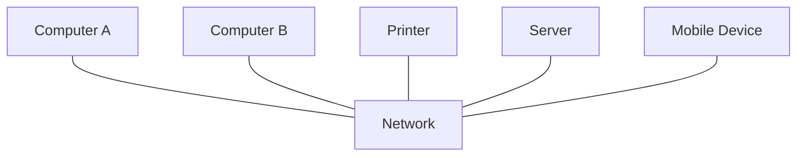
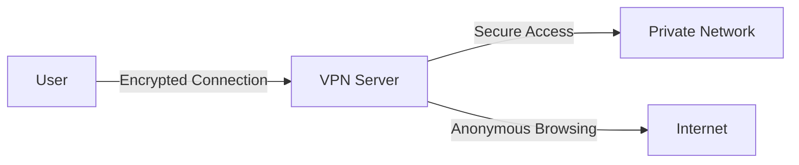

# Networks Terminology

## Introduction

Understanding computer networks is essential for any programmer, regardless of specialization. Networks are the foundation that enables devices to communicate and share resources. Before diving into complex networking topics, it's important to familiarize yourself with the basic terminology that forms the building blocks of network communication.

This guide will introduce you to fundamental networking terms and concepts that every beginner should know. By the end, you'll have a solid understanding of the language used to describe networks and their components.

## Core Networking Concepts

### Network

A **network** is a collection of computers, servers, mainframes, or other devices connected to allow data sharing. The internet itself is essentially a vast network of networks.



### Protocol

A **protocol** is a set of rules that governs how data is transmitted between devices on a network. These rules define the format, timing, sequencing, and error control of data transmission. Common protocols include:

- **TCP/IP** (Transmission Control Protocol/Internet Protocol): The fundamental communication protocol of the internet
- **HTTP/HTTPS** (Hypertext Transfer Protocol/Secure): Used for transferring web pages
- **FTP** (File Transfer Protocol): Used for transferring files
- **SMTP** (Simple Mail Transfer Protocol): Used for email transmission

### IP Address

An **IP address** (Internet Protocol address) is a unique numerical label assigned to each device connected to a computer network. It serves two main functions: host or network interface identification and location addressing.

IP addresses come in two versions:
- **IPv4**: Uses a 32-bit number, typically displayed as four numbers separated by periods (e.g., `192.168.1.1`)
- **IPv6**: Uses a 128-bit number, displayed as eight groups of four hexadecimal digits (e.g., `2001:0db8:85a3:0000:0000:8a2e:0370:7334`)

Example of getting your IP address in Python:

```python
import socket

def get_ip_address():
    hostname = socket.gethostname()
    ip_address = socket.gethostbyname(hostname)
    return ip_address

# Output example: 192.168.1.105
print(f"Your IP address is: {get_ip_address()}")
```

### MAC Address

A **MAC address** (Media Access Control address) is a unique identifier assigned to a network interface controller (NIC) for use as a network address in communications within a network segment. It's a hardware address, embedded into the network card.

Example format: `00:1A:2B:3C:4D:5E`

### Router

A **router** is a networking device that forwards data packets between computer networks. Routers perform the traffic directing functions on the internet. They connect your home network to other networks, including the internet.

### Switch

A **switch** is a networking device that connects devices within a network (often a local area network, or LAN) and uses packet switching to forward data to the destination device.

### Gateway

A **gateway** is a network node that serves as an entrance to another network. In homes, the router typically acts as the gateway to the internet.

## Network Types

### LAN (Local Area Network)

A **LAN** connects computers and devices in a limited area such as a home, school, office building, or closely positioned group of buildings.

### WAN (Wide Area Network)

A **WAN** spans a large geographic area, such as a state, province, or country. The internet is the largest WAN.

### WLAN (Wireless Local Area Network)

A **WLAN** is a wireless network that links two or more devices using wireless communication to form a local area network within a limited area.

### VPN (Virtual Private Network)

A **VPN** extends a private network across a public network, enabling users to send and receive data across shared or public networks as if their computing devices were directly connected to the private network.



## Network Models

### OSI Model

The **OSI Model** (Open Systems Interconnection Model) is a conceptual framework used to understand network interactions. It consists of seven layers:

1. **Physical Layer**: Transmission and reception of raw bit streams
2. **Data Link Layer**: Node-to-node data transfer and error detection
3. **Network Layer**: Packet forwarding and routing
4. **Transport Layer**: End-to-end communication and data transfer
5. **Session Layer**: Managing communication sessions
6. **Presentation Layer**: Data translation, encryption, and compression
7. **Application Layer**: User-facing applications and services

### TCP/IP Model

The **TCP/IP Model** is a more practical implementation used in real-world networking, consisting of four layers:

1. **Network Interface Layer**: Corresponds to the Physical and Data Link layers of the OSI model
2. **Internet Layer**: Corresponds to the Network layer of the OSI model
3. **Transport Layer**: Corresponds to the Transport layer of the OSI model
4. **Application Layer**: Corresponds to the Session, Presentation, and Application layers of the OSI model

## Network Communication Concepts

### Packet

A **packet** is a unit of data routed between an origin and a destination on the internet or any packet-switched network.

### Bandwidth

**Bandwidth** refers to the maximum rate of data transfer across a given path. It's typically measured in bits per second (bps), kilobits per second (Kbps), megabits per second (Mbps), or gigabits per second (Gbps).

### Latency

**Latency** is the delay before a transfer of data begins following an instruction for its transfer. It's often measured in milliseconds (ms).

Example of checking latency (ping) in Python:

```python
import subprocess
import platform

def check_ping(host="8.8.8.8"):
    param = '-n' if platform.system().lower() == 'windows' else '-c'
    command = ['ping', param, '4', host]
    
    response = subprocess.Popen(command, stdout=subprocess.PIPE)
    stdout, stderr = response.communicate()
    
    return stdout.decode()

# Output example: Ping statistics and latency information
print(check_ping())
```

### Port

A **port** is a communication endpoint that identifies a specific process or service in a computer's operating system. Ports are identified by numbers ranging from 0 to 65535.

Common ports include:
- Port 80: HTTP
- Port 443: HTTPS
- Port 22: SSH
- Port 21: FTP
- Port 25: SMTP

### DNS (Domain Name System)

**DNS** is a hierarchical, decentralized naming system for computers, services, or other resources connected to the internet or a private network. It translates human-readable domain names (like `example.com`) to IP addresses.

Example of DNS lookup in Python:

```python
import socket

def get_ip_from_domain(domain):
    try:
        return socket.gethostbyname(domain)
    except socket.gaierror:
        return "Unable to get IP"

# Output example: 93.184.216.34
print(f"IP of example.com: {get_ip_from_domain('example.com')}")
```

## Network Security Concepts

### Firewall

A **firewall** is a network security system that monitors and controls incoming and outgoing network traffic based on predetermined security rules.

### Encryption

**Encryption** is the process of encoding information in such a way that only authorized parties can access it.

### SSL/TLS

**SSL** (Secure Sockets Layer) and its successor **TLS** (Transport Layer Security) are cryptographic protocols designed to provide communications security over a computer network.

### HTTPS

**HTTPS** (Hypertext Transfer Protocol Secure) is an extension of HTTP used for secure communication over a computer network. It uses SSL/TLS for encryption.

## Real-World Applications

### Example 1: Web Browsing

When you type a URL in your browser:

1. Your browser requests the IP address for the domain from a DNS server
2. The browser establishes a connection to the server using HTTP or HTTPS
3. The server processes the request and sends back the webpage content
4. Your browser renders the content

### Example 2: Email Communication

When you send an email:

1. Your email client connects to an SMTP server
2. The email is routed through various servers to reach its destination
3. The recipient's email server stores the message
4. When the recipient checks their email, their client retrieves the message using POP3 or IMAP protocols

### Example 3: Building a Simple Socket Server

Here's a basic example of a socket server in Python:

```python
import socket

# Create a socket object
server_socket = socket.socket(socket.AF_INET, socket.SOCK_STREAM)

# Define the server address and port
host = 'localhost'  # or '127.0.0.1'
port = 12345

# Bind the socket to the address and port
server_socket.bind((host, port))

# Listen for incoming connections (maximum 5 queued connections)
server_socket.listen(5)

print(f"Server listening on {host}:{port}")

while True:
    # Accept a connection
    client_socket, client_address = server_socket.accept()
    print(f"Connection from {client_address}")
    
    # Send a message to the client
    message = "Hello, client! You've connected to the server."
    client_socket.send(message.encode('utf-8'))
    
    # Close the connection
    client_socket.close()
```

And a corresponding client:

```python
import socket

# Create a socket object
client_socket = socket.socket(socket.AF_INET, socket.SOCK_STREAM)

# Define the server address and port
host = 'localhost'
port = 12345

# Connect to the server
client_socket.connect((host, port))

# Receive data from the server
data = client_socket.recv(1024)
print(f"Received: {data.decode('utf-8')}")

# Close the connection
client_socket.close()
```

## Summary

Networking terminology forms the foundation of understanding how devices communicate. We've covered the essential concepts including:

- Basic network components (routers, switches, gateways)
- Network types (LAN, WAN, WLAN, VPN)
- Addressing systems (IP and MAC addresses)
- Communication concepts (packets, ports, protocols)
- Network models (OSI and TCP/IP)
- Security considerations (firewalls, encryption, SSL/TLS)

Understanding these terms will help you navigate more complex networking topics and provide context for programming network applications.

## Additional Resources and Exercises

### Practice Exercises

1. **Network Investigation**: Identify your computer's IP address, MAC address, and default gateway using command line tools like `ipconfig` (Windows) or `ifconfig` (Linux/macOS).

2. **Protocol Analysis**: Install Wireshark and capture network traffic while visiting a website. Try to identify different protocols in action.

3. **Socket Programming**: Extend the socket example to create a chat application where multiple clients can communicate.

4. **Network Mapping**: Create a diagram of your home or office network, identifying all connected devices and how they communicate.

### Further Learning

To deepen your understanding of networking, consider exploring:

- Network programming in your preferred language
- Network security principles and practices
- Cloud networking concepts
- Containerization and orchestration networking
- Internet of Things (IoT) networking

The networking field is vast and continuously evolving, making it an exciting area for programmers to specialize in or incorporate into their broader skill set.