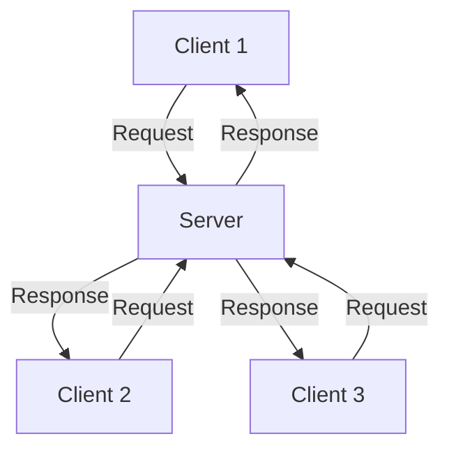
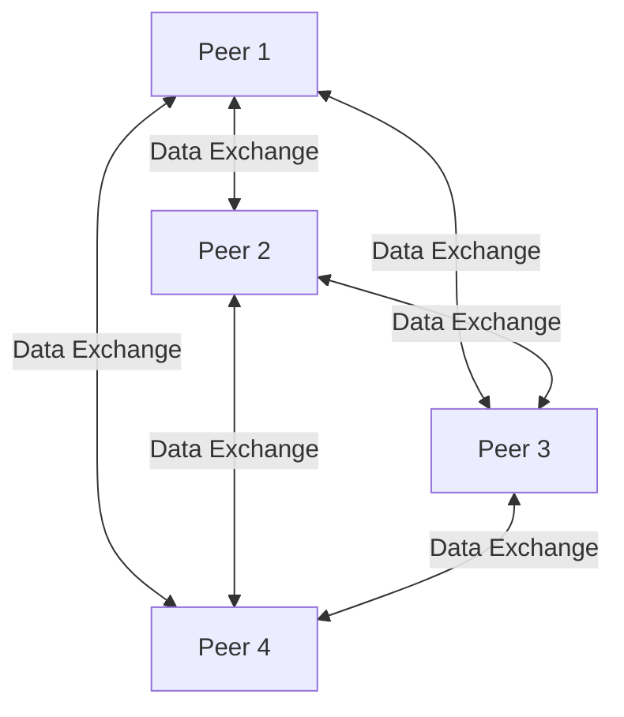
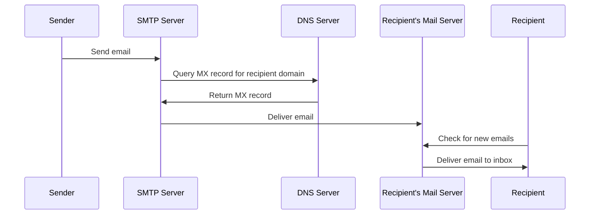
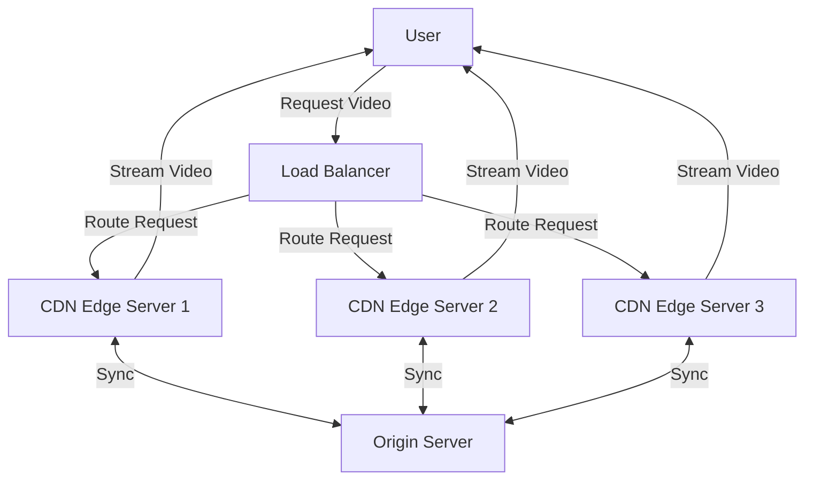
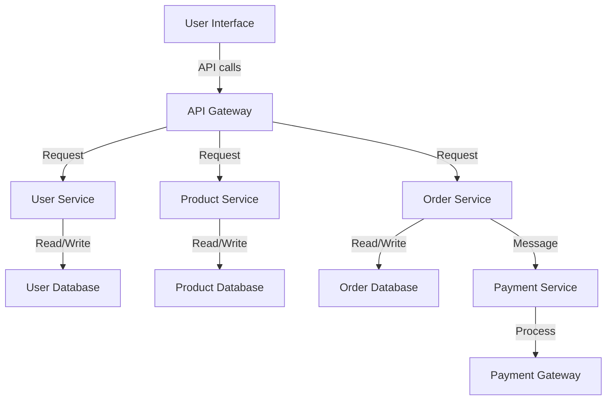

# Network Applications

## Introduction

Network applications are software programs that communicate across a network to perform specific tasks. They form the foundation of our digital experience, enabling everything from web browsing and instant messaging to file sharing and online gaming. Understanding network applications is essential for beginners in programming and networking as they represent the practical utility of network infrastructures.

In this guide, we'll explore the different types of network applications, their architectures, common protocols they use, and examples of how they function in real-world scenarios.

## Network Application Architectures

Network applications typically follow one of two fundamental architectural models:

### Client-Server Architecture

In the client-server architecture, there's a clear division of responsibilities:

- **Server**: A dedicated, always-on host that provides services or resources
- **Client**: A host that requests services or resources from servers



#### How It Works:

1. Clients initiate requests to the server
2. The server processes these requests
3. The server returns the appropriate responses to clients

#### Examples:
- Web applications (browsers and web servers)
- Email systems (mail clients and mail servers)
- File Transfer Protocol (FTP) services
- Database applications

### Peer-to-Peer (P2P) Architecture

In the peer-to-peer architecture, there's no dedicated server:

- All participants (peers) can function as both clients and servers
- Resources are distributed across multiple peers
- The network is resilient as it doesn't rely on a central server



#### How It Works:

1. Peers directly connect to each other without a central server
2. Resources and services are shared between peers
3. Each peer can request and provide resources simultaneously

#### Examples:
- BitTorrent and other file-sharing applications
- Blockchain networks
- Some instant messaging systems
- Distributed computing projects

## Common Network Applications

### Web Applications

Web applications are among the most widely used network applications, following the client-server model.

#### Components:
- **Web Client (Browser)**: Chrome, Firefox, Safari, etc.
- **Web Server**: Apache, Nginx, Microsoft IIS, etc.
- **Protocol**: HTTP/HTTPS

#### Simple HTTP Request Example:

```javascript
// Using JavaScript's fetch API to make an HTTP request
fetch('https://api.example.com/data')
  .then(response => response.json())
  .then(data => {
    console.log('Data received from server:', data);
  })
  .catch(error => {
    console.error('Error fetching data:', error);
  });
```

**Output:**
```
Data received from server: { "id": 1, "name": "Example Item", "status": "active" }
```

### Email Systems

Email is another fundamental network application that follows the client-server architecture but with multiple servers involved.

#### Components:
- **Mail Client**: Outlook, Gmail web interface, Apple Mail, etc.
- **Mail Servers**:
  - SMTP server (for sending emails)
  - POP3/IMAP server (for receiving emails)



### File Sharing Applications

File sharing applications allow users to transfer files across networks.

#### FTP (File Transfer Protocol):

A traditional client-server file sharing protocol:

```javascript
// Simple Node.js FTP client example using the 'basic-ftp' library
const ftp = require('basic-ftp');

async function example() {
  const client = new ftp.Client();
  client.ftp.verbose = true;
  
  try {
    await client.access({
      host: "ftp.example.com",
      user: "username",
      password: "password",
      secure: true
    });
    
    await client.uploadFrom("local-file.txt", "remote-file.txt");
    await client.downloadTo("downloaded-file.txt", "remote-file.txt");
  }
  catch(err) {
    console.error(err);
  }
  client.close();
}

example();
```

#### BitTorrent (P2P File Sharing):

A popular peer-to-peer file sharing protocol:

```javascript
// Conceptual example of a BitTorrent client in JavaScript
// Note: This is simplified for educational purposes
const WebTorrent = require('webtorrent');
const client = new WebTorrent();

// Downloading a torrent
client.add('magnet:?xt=urn:btih:EXAMPLE_HASH', function (torrent) {
  console.log('Downloading:', torrent.name);
  
  torrent.on('download', function (bytes) {
    console.log('Progress: ' + Math.round(torrent.progress * 100) + '%');
  });
  
  torrent.on('done', function () {
    console.log('Download completed!');
  });
});
```

### Instant Messaging

Instant messaging applications allow real-time text communication between users.

#### Architecture Variations:
- **Centralized**: Messages pass through a central server (WhatsApp, Telegram)
- **Peer-to-Peer**: Direct communication between users (some legacy systems)
- **Hybrid**: Combination of both approaches (some modern systems)

#### Example WebSocket Chat Application:

**Server (Node.js with WebSocket):**
```javascript
const WebSocket = require('ws');
const server = new WebSocket.Server({ port: 8080 });

const clients = new Set();

server.on('connection', (ws) => {
  clients.add(ws);
  
  ws.on('message', (message) => {
    // Broadcast message to all connected clients
    for (const client of clients) {
      if (client.readyState === WebSocket.OPEN) {
        client.send(message.toString());
      }
    }
  });
  
  ws.on('close', () => {
    clients.delete(ws);
  });
});

console.log('Chat server running on port 8080');
```

**Client (Browser JavaScript):**
```javascript
const ws = new WebSocket('ws://localhost:8080');

// Handle incoming messages
ws.onmessage = (event) => {
  const messageDiv = document.createElement('div');
  messageDiv.textContent = event.data;
  document.getElementById('chat-messages').appendChild(messageDiv);
};

// Send message function
function sendMessage() {
  const input = document.getElementById('message-input');
  const message = input.value;
  
  if (message.trim()) {
    ws.send(message);
    input.value = '';
  }
}
```

## Network Application Protocols

Network applications rely on specific protocols to define how data is exchanged. Here are some common ones:

### Application Layer Protocols

| Protocol | Port | Description | Applications |
|----------|------|-------------|--------------|
| HTTP/HTTPS | 80/443 | Hypertext Transfer Protocol | Web browsing |
| SMTP | 25 | Simple Mail Transfer Protocol | Sending email |
| POP3 | 110 | Post Office Protocol v3 | Retrieving email |
| IMAP | 143 | Internet Message Access Protocol | Email management |
| FTP | 21 | File Transfer Protocol | File transfers |
| DNS | 53 | Domain Name System | Name resolution |
| SSH | 22 | Secure Shell | Remote terminal |
| MQTT | 1883 | Message Queuing Telemetry Transport | IoT communication |

### Socket Programming

Underneath many network applications lies socket programming - the API that allows applications to create network connections. Here's a simple example of a TCP socket server and client in Python:

**Server:**
```python
import socket

# Create a socket
server_socket = socket.socket(socket.AF_INET, socket.SOCK_STREAM)

# Bind to address and port
server_socket.bind(('localhost', 12345))

# Listen for connections
server_socket.listen(5)
print("Server listening on port 12345")

while True:
    # Accept connection
    client_socket, client_address = server_socket.accept()
    print(f"Connection from {client_address}")
    
    # Receive and send data
    data = client_socket.recv(1024)
    print(f"Received: {data.decode()}")
    
    # Send response
    client_socket.send("Message received!".encode())
    
    # Close connection
    client_socket.close()
```

**Client:**
```python
import socket

# Create a socket
client_socket = socket.socket(socket.AF_INET, socket.SOCK_STREAM)

# Connect to server
client_socket.connect(('localhost', 12345))

# Send data
client_socket.send("Hello, server!".encode())

# Receive response
response = client_socket.recv(1024)
print(f"Server response: {response.decode()}")

# Close connection
client_socket.close()
```

**Output:**
```
Server: Server listening on port 12345
Server: Connection from ('127.0.0.1', 55789)
Server: Received: Hello, server!

Client: Server response: Message received!
```

## Real-World Applications

### Case Study: Video Streaming Services

Video streaming services like Netflix, YouTube, and Disney+ use network applications to deliver content to millions of users simultaneously.

#### Key Components:
1. **Content Delivery Networks (CDNs)**: Distributed servers that deliver content based on user location
2. **Adaptive Bitrate Streaming**: Adjusts video quality based on available bandwidth
3. **Load Balancing**: Distributes traffic across multiple servers
4. **Caching**: Stores popular content closer to users



### Case Study: Online Gaming

Online gaming platforms require specialized network applications to handle real-time interactions between players.

#### Key Requirements:
1. **Low Latency**: Minimize delay between player actions and game state updates
2. **State Synchronization**: Keep game state consistent across all players
3. **Fault Tolerance**: Handle player disconnections gracefully

```javascript
// Simplified example of a multiplayer game server using WebSockets
const WebSocket = require('ws');
const server = new WebSocket.Server({ port: 8080 });

// Game state
const gameState = {
  players: {},
  gameObjects: {}
};

server.on('connection', (ws) => {
  // Assign player ID
  const playerId = generateUniqueId();
  gameState.players[playerId] = {
    position: { x: 0, y: 0 },
    health: 100,
    score: 0
  };
  
  // Send initial game state to new player
  ws.send(JSON.stringify({
    type: 'init',
    playerId: playerId,
    gameState: gameState
  }));
  
  // Broadcast new player to others
  broadcastToAll({
    type: 'playerJoined',
    playerId: playerId
  }, ws);
  
  ws.on('message', (message) => {
    const data = JSON.parse(message);
    
    // Handle player input
    if (data.type === 'playerInput') {
      updatePlayerPosition(playerId, data.input);
      
      // Broadcast updated game state
      broadcastToAll({
        type: 'gameStateUpdate',
        gameState: gameState
      });
    }
  });
  
  ws.on('close', () => {
    // Remove player from game
    delete gameState.players[playerId];
    
    // Notify other players
    broadcastToAll({
      type: 'playerLeft',
      playerId: playerId
    });
  });
});

function broadcastToAll(data, exclude = null) {
  server.clients.forEach((client) => {
    if (client !== exclude && client.readyState === WebSocket.OPEN) {
      client.send(JSON.stringify(data));
    }
  });
}

function updatePlayerPosition(playerId, input) {
  // Update player position based on input
  // (Simplified physics calculation)
  const player = gameState.players[playerId];
  player.position.x += input.moveX * 5;
  player.position.y += input.moveY * 5;
}

function generateUniqueId() {
  return Math.random().toString(36).substr(2, 9);
}

console.log('Game server running on port 8080');
```

## Advanced Concepts

### API-Based Applications

Modern network applications often use APIs (Application Programming Interfaces) to communicate between services:

```javascript
// Example of using the Fetch API to interact with a RESTful service
async function getUserData(userId) {
  try {
    const response = await fetch(`https://api.example.com/users/${userId}`);
    
    if (!response.ok) {
      throw new Error(`HTTP error: ${response.status}`);
    }
    
    const userData = await response.json();
    return userData;
  } catch (error) {
    console.error('Failed to fetch user data:', error);
    return null;
  }
}

// Usage
getUserData(123).then(user => {
  if (user) {
    console.log(`User name: ${user.name}, Email: ${user.email}`);
  }
});
```

### Microservices Architecture

Many modern network applications use microservices architecture:



## Summary

Network applications form the backbone of our digital world, connecting users and services across the internet. In this guide, we've covered:

- The basic architectures of network applications (client-server and peer-to-peer)
- Common types of network applications (web, email, file sharing, messaging)
- Protocols that enable network communication
- Real-world examples and case studies
- Advanced concepts in modern network application development

Understanding network applications provides essential context for how software systems communicate and function in today's interconnected world.

## Exercises

To reinforce your understanding of network applications, try these exercises:

1. **Basic HTTP Client**: Create a simple program that fetches data from a public API and displays the results.

2. **Chat Application**: Implement a basic chat application using WebSockets that allows multiple users to exchange messages.

3. **File Transfer**: Build a simple file transfer program that can upload and download files using the FTP protocol.

4. **Network Analysis**: Use a tool like Wireshark to capture and analyze the network traffic generated by different applications on your computer.

5. **Distributed Application**: Design and implement a simple distributed application that demonstrates either client-server or peer-to-peer architecture.

## Further Resources

To deepen your knowledge of network applications, consider exploring these resources:

- **"Computer Networking: A Top-Down Approach"** by James Kurose and Keith Ross
- **"Socket Programming Guide"** by the Python Software Foundation
- **"RESTful Web Services"** by Leonard Richardson and Sam Ruby
- **MDN Web Docs** for web application development
- **Node.js Documentation** for server-side JavaScript applications