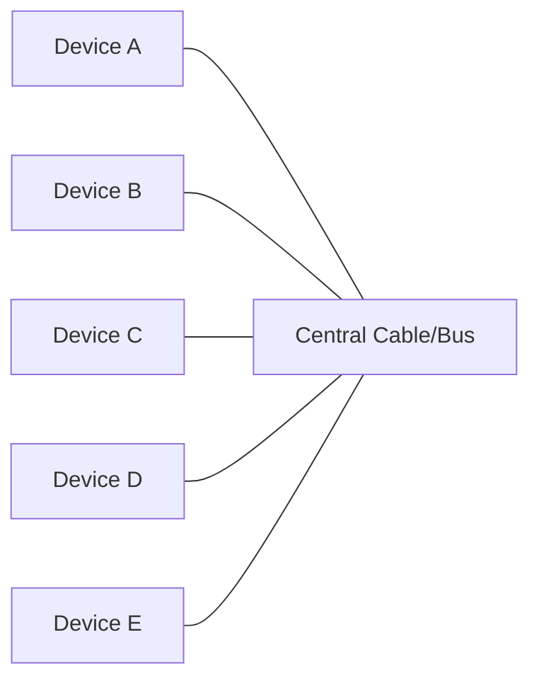
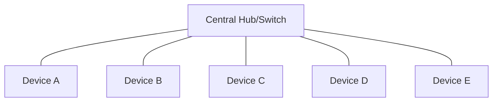
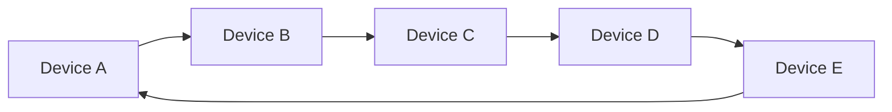
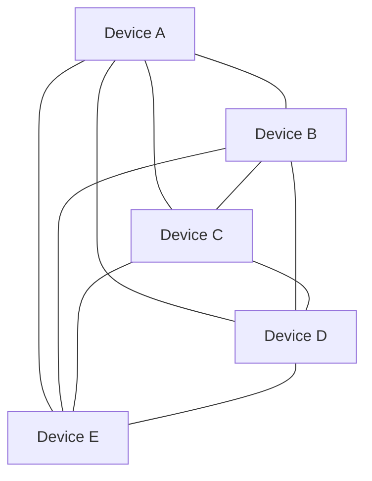

# Network Types

## Introduction

Computer networks form the backbone of modern information technology, allowing devices to communicate and share resources. Understanding different network types is essential for anyone learning programming or IT fundamentals. Networks vary in size, purpose, geographical reach, and topology, each designed to serve specific needs.

This guide explores the main types of computer networks, their characteristics, and real-world applications to help you understand when and why each type is used.

## Network Classification by Scale

Networks can be classified based on their geographical coverage and size:

### Personal Area Network (PAN)

A Personal Area Network connects devices within a very limited area, typically within reach of a single person.

**Characteristics:**
- Very small geographic area (typically within 10 meters)
- Usually owned and used by a single person
- Simple to set up and maintain
- Often uses wireless technologies

**Technologies used:**
- Bluetooth
- Infrared
- Near Field Communication (NFC)
- USB (for wired PANs)

**Real-world example:**

```javascript
// Example of establishing a Bluetooth connection in web browser
// (using Web Bluetooth API)
async function connectToBluetoothDevice() {
  try {
    // Request Bluetooth device selection from user
    const device = await navigator.bluetooth.requestDevice({
      acceptAllDevices: true
    });
    
    console.log('Device selected:', device.name);
    
    // Connect to the device
    const server = await device.gatt.connect();
    console.log('Connected to GATT server');
    
    return server;
  } catch (error) {
    console.error('Bluetooth connection failed:', error);
  }
}
```

In practice, PANs enable scenarios like:
- Connecting wireless earbuds to your smartphone
- Syncing fitness trackers with your devices
- Connecting peripherals to your laptop
- Making contactless payments with your phone

### Local Area Network (LAN)

A Local Area Network connects devices within a limited geographical area such as a home, school, or office building.

**Characteristics:**
- Limited geographic area (single building or campus)
- Higher data transfer rates compared to wider networks
- Usually owned and managed by a single organization
- Lower latency than larger networks

**Technologies used:**
- Ethernet (wired)
- Wi-Fi (wireless)
- Token Ring (older technology)

**Real-world example:**

```javascript
// Example Node.js code for a simple LAN server
const http = require('http');
const hostname = '192.168.1.100'; // Local IP address on the LAN
const port = 3000;

const server = http.createServer((req, res) => {
  res.statusCode = 200;
  res.setHeader('Content-Type', 'text/plain');
  res.end('Hello from LAN server!
');
});

server.listen(port, hostname, () => {
  console.log(`Server running at http://${hostname}:${port}/`);
});
```

In practice, LANs enable scenarios like:
- Office file sharing and printer access
- Home network connecting computers, smart TVs, and gaming consoles
- School computer labs
- Local multiplayer gaming

### Metropolitan Area Network (MAN)

A Metropolitan Area Network spans a city or large campus, connecting multiple LANs together.

**Characteristics:**
- City-wide coverage (up to 50km)
- Often owned by larger organizations or municipalities
- Medium data transfer rates
- Connects multiple buildings or sites within a city

**Technologies used:**
- Fiber optic connections
- Microwave links
- WiMAX

In practice, MANs enable scenarios like:
- University campus networks spanning multiple buildings
- City-wide traffic management systems
- Connected hospital systems across a city
- Municipal networks connecting government buildings

### Wide Area Network (WAN)

A Wide Area Network spans a large geographical area, often connecting multiple countries or continents.

**Characteristics:**
- Coverage across countries or continents
- Usually slower than LANs (though dedicated lines can be fast)
- Typically leased from telecommunications providers
- Connects multiple LANs and MANs together

**Technologies used:**
- Leased lines
- Fiber optic backbones
- Satellite links
- MPLS (Multiprotocol Label Switching)

**Real-world example:**

```python
# Python example of checking connectivity to a remote server across a WAN
import socket
import time

def check_connection(host, port):
    try:
        # Attempt to create a socket connection
        sock = socket.socket(socket.AF_INET, socket.SOCK_STREAM)
        sock.settimeout(5)  # 5 second timeout
        
        # Record start time
        start_time = time.time()
        
        # Attempt connection
        result = sock.connect_ex((host, port))
        
        # Calculate latency
        latency = time.time() - start_time
        
        if result == 0:
            print(f"Connection to {host}:{port} successful")
            print(f"Latency: {latency*1000:.2f} ms")
        else:
            print(f"Connection to {host}:{port} failed")
        
        sock.close()
    except socket.error as e:
        print(f"Error: {e}")

# Check connection to a remote server (example: Google's public DNS)
check_connection("8.8.8.8", 53)
```

In practice, WANs enable scenarios like:
- The Internet (the largest WAN)
- Corporate networks connecting offices across countries
- Banking networks connecting ATMs and branches globally
- Cloud service provider infrastructure

## Network Classification by Topology

Network topology refers to the arrangement of elements within a network. Different topologies offer different advantages in terms of reliability, scalability, and complexity:

### Bus Topology

All devices connect to a single cable (the bus).

**Characteristics:**
- Simple and inexpensive to implement
- Easy to extend for small networks
- Failure in the main cable affects the entire network
- Performance degrades with more devices



### Star Topology

All devices connect to a central device (hub, switch, or router).

**Characteristics:**
- Easy to add new devices
- Failure of one connection doesn't affect others
- Failure of the central device affects the entire network
- Better performance than bus topology



### Ring Topology

Devices connect in a closed loop.

**Characteristics:**
- Data travels in one direction (or two in dual-ring setups)
- Each device acts as a repeater, strengthening the signal
- Failure of any device can break the ring unless redundancy measures exist
- Historically used in token ring networks



### Mesh Topology

Devices connect directly to multiple other devices.

**Characteristics:**
- Highly reliable due to redundant connections
- Expensive to implement and maintain
- Excellent for critical systems requiring high availability
- Complex to configure

**Types:**
- Full mesh: Every device connects to every other device
- Partial mesh: Devices connect to some but not all other devices



**Real-world application example:**

```javascript
// Example of mesh network routing in JavaScript
class MeshNode {
  constructor(id) {
    this.id = id;
    this.connections = [];
    this.routingTable = new Map(); // destination -> next hop
  }
  
  connect(node) {
    if (!this.connections.includes(node)) {
      this.connections.push(node);
      node.connections.push(this);
      
      // Update routing tables
      this.updateRoutingTable();
      node.updateRoutingTable();
    }
  }
  
  updateRoutingTable() {
    // Start with direct connections
    this.routingTable.clear();
    for (const node of this.connections) {
      this.routingTable.set(node.id, node.id);
    }
    
    // Propagate route information
    for (const node of this.connections) {
      for (const [dest, nextHop] of node.routingTable.entries()) {
        if (!this.routingTable.has(dest) && dest !== this.id) {
          this.routingTable.set(dest, node.id);
        }
      }
    }
  }
  
  sendMessage(destination, message) {
    if (destination === this.id) {
      console.log(`Node ${this.id} received message: ${message}`);
      return true;
    }
    
    const nextHop = this.routingTable.get(destination);
    if (nextHop) {
      const nextNode = this.connections.find(node => node.id === nextHop);
      console.log(`Node ${this.id} forwarding to ${nextHop}`);
      return nextNode.sendMessage(destination, message);
    } else {
      console.log(`Node ${this.id} has no route to ${destination}`);
      return false;
    }
  }
}

// Create a simple mesh network
const nodeA = new MeshNode('A');
const nodeB = new MeshNode('B');
const nodeC = new MeshNode('C');
const nodeD = new MeshNode('D');

// Connect nodes
nodeA.connect(nodeB);
nodeB.connect(nodeC);
nodeC.connect(nodeD);
nodeB.connect(nodeD);

// Send a message
nodeA.sendMessage('D', 'Hello from A to D');
```

## Network Classification by Function

Networks can also be classified based on their primary function:

### Client-Server Network

In a client-server network, centralized servers provide resources and services to client devices.

**Characteristics:**
- Centralized resource management
- Easier security implementation
- Scalable for large organizations
- Requires professional management

**Real-world example:**

```javascript
// Express.js server example (server side of client-server model)
const express = require('express');
const app = express();
const port = 3000;

// Route to provide data to clients
app.get('/api/data', (req, res) => {
  const serverData = {
    timestamp: new Date(),
    message: 'Hello from server',
    resources: ['users', 'products', 'orders']
  };
  
  res.json(serverData);
});

app.listen(port, () => {
  console.log(`Server running at http://localhost:${port}`);
});
```

```javascript
// Client-side example using fetch
async function getDataFromServer() {
  try {
    const response = await fetch('http://localhost:3000/api/data');
    const data = await response.json();
    console.log('Received from server:', data);
    return data;
  } catch (error) {
    console.error('Error connecting to server:', error);
  }
}

// Call the function to get data
getDataFromServer();
```

### Peer-to-Peer (P2P) Network

In a peer-to-peer network, devices (peers) share resources directly without a central server.

**Characteristics:**
- No central server required
- Each device can be both client and server
- Difficult to secure and manage
- Highly resilient as there's no single point of failure

**Real-world example:**

```javascript
// Simplified P2P concept using WebRTC in JavaScript
// This is a conceptual example and requires additional setup in practice

// Peer 1 setup
async function setupPeer1(messageCallback) {
  // Create connection
  const peer1 = new RTCPeerConnection();
  
  // Set up data channel
  const dataChannel = peer1.createDataChannel('dataChannel');
  
  dataChannel.onopen = () => console.log('Data channel is open');
  dataChannel.onmessage = (event) => {
    console.log('Received message:', event.data);
    if (messageCallback) messageCallback(event.data);
  };
  
  // Create and share offer
  const offer = await peer1.createOffer();
  await peer1.setLocalDescription(offer);
  
  console.log('Share this offer with Peer 2:', JSON.stringify(offer));
  
  return { peer: peer1, dataChannel };
}

// Peer 2 would have similar setup but would accept the offer
// and create an answer to establish connection
```

P2P networks enable applications like:
- File sharing systems
- Blockchain networks
- Decentralized applications
- Distributed computing projects

## Special-Purpose Networks

### Storage Area Network (SAN)

A specialized high-speed network providing block-level data storage access.

**Characteristics:**
- Dedicated for storage devices
- High-speed, low-latency connections
- Used in data centers and enterprise environments
- Appears to the operating system as direct-attached storage

### Content Delivery Network (CDN)

A geographically distributed network designed to deliver content to users with high availability and performance.

**Characteristics:**
- Uses caching at strategic locations
- Reduces latency for accessing content
- Handles high traffic loads through distribution
- Improves website load times and streaming performance

**Example of using a CDN:**

```html
<!-- Example of including a JavaScript library from a CDN -->
<script src="https://cdn.example.com/libraries/framework.min.js"></script>

<!-- Example of loading an image from a CDN -->

```

## Virtual Networks

### Virtual Private Network (VPN)

Creates a secure, encrypted connection over a less secure network (like the internet).

**Characteristics:**
- Encrypts data in transit
- Provides secure remote access
- Can mask user location or identity
- Used for secure access to private networks

**Example of establishing a VPN connection programmatically:**

```python
# Example using Python and the pyOpenVPN library (conceptual)
# Note: In practice, VPNs are usually configured through specialized software

import pyopenvpn  # This is a conceptual library

def connect_to_vpn(config_file, username, password):
    # Initialize VPN client
    vpn_client = pyopenvpn.VPNClient()
    
    # Load configuration
    vpn_client.load_config(config_file)
    
    # Set credentials
    vpn_client.set_credentials(username, password)
    
    # Connect
    try:
        vpn_client.connect()
        print("Connected to VPN successfully")
        
        # Check new IP address
        original_ip = "Original IP address would be shown here"
        vpn_ip = "VPN IP address would be shown here"
        print(f"Original IP: {original_ip}")
        print(f"VPN IP: {vpn_ip}")
        
        return vpn_client
    except Exception as e:
        print(f"VPN connection failed: {e}")
        return None

# Usage
vpn = connect_to_vpn("corporate_vpn.ovpn", "username", "password")
```

### Virtual LAN (VLAN)

A logical subdivision of a physical network at the data link layer (Layer 2).

**Characteristics:**
- Logically separates networks without physical separation
- Improves network performance by reducing broadcast domains
- Enhances security by isolating sensitive systems
- Simplifies network management

**Example VLAN configuration (Cisco IOS CLI):**

```
! Configure VLAN 10 for Marketing department
Switch# configure terminal
Switch(config)# vlan 10
Switch(config-vlan)# name Marketing
Switch(config-vlan)# exit

! Configure VLAN 20 for Engineering department
Switch(config)# vlan 20
Switch(config-vlan)# name Engineering
Switch(config-vlan)# exit

! Assign ports to VLANs
Switch(config)# interface range gigabitethernet 0/1 - 5
Switch(config-if-range)# switchport mode access
Switch(config-if-range)# switchport access vlan 10
Switch(config-if-range)# exit

Switch(config)# interface range gigabitethernet 0/6 - 10
Switch(config-if-range)# switchport mode access
Switch(config-if-range)# switchport access vlan 20
Switch(config-if-range)# exit
```

## Internet of Things (IoT) Networks

Specialized networks designed for connecting smart devices and sensors.

**Characteristics:**
- Low power consumption
- Support for massive numbers of devices
- Often wireless
- May use mesh topologies for reliability

**Technologies used:**
- Zigbee
- Z-Wave
- LoRaWAN
- Bluetooth Low Energy (BLE)

**Example IoT device connection:**

```javascript
// Example using MQTT protocol for IoT devices with Node.js
const mqtt = require('mqtt');

// Connect to MQTT broker
const client = mqtt.connect('mqtt://broker.example.com');

// Set up event handlers
client.on('connect', () => {
  console.log('Connected to MQTT broker');
  
  // Subscribe to topics
  client.subscribe('home/sensors/temperature');
  client.subscribe('home/sensors/humidity');
  
  // Publish data periodically (simulating sensor readings)
  setInterval(() => {
    // Simulate temperature sensor
    const temperature = (20 + Math.random() * 5).toFixed(1);
    client.publish('home/sensors/temperature', temperature.toString());
    
    // Simulate humidity sensor
    const humidity = (40 + Math.random() * 20).toFixed(1);
    client.publish('home/sensors/humidity', humidity.toString());
    
    console.log(`Published: Temperature=${temperature}°C, Humidity=${humidity}%`);
  }, 5000);
});

// Handle incoming messages
client.on('message', (topic, message) => {
  console.log(`Received message on ${topic}: ${message.toString()}`);
  
  // Process message based on topic
  if (topic === 'home/sensors/temperature') {
    const temp = parseFloat(message.toString());
    if (temp > 24) {
      console.log('Temperature alert: Too hot!');
      // Could trigger an action like turning on AC
    }
  }
});
```

## Summary

Network types can be categorized by:

1. **Scale**:
   - Personal Area Network (PAN)
   - Local Area Network (LAN)
   - Metropolitan Area Network (MAN)
   - Wide Area Network (WAN)

2. **Topology**:
   - Bus
   - Star
   - Ring
   - Mesh

3. **Function**:
   - Client-Server
   - Peer-to-Peer (P2P)

4. **Special Purpose**:
   - Storage Area Network (SAN)
   - Content Delivery Network (CDN)
   - Virtual networks (VPN, VLAN)
   - IoT networks

Understanding different network types is crucial for designing appropriate networking solutions based on specific requirements like geographical coverage, reliability, performance, and security.

## Exercises

1. **Basic Exercise**: Identify which network type (PAN, LAN, MAN, or WAN) would best suit each of these scenarios:
   - Connecting your smartphone to your wireless earbuds
   - Setting up computers in a small office
   - Connecting all government buildings in a city
   - Creating a global banking system

2. **Intermediate Exercise**: Design a simple network for a small business with 10 employees. Specify the network type, topology, and basic equipment needed.

3. **Advanced Exercise**: Using Node.js or Python, create a simple client-server application that demonstrates basic network communication.


## Join the Community

Have questions about network types? Join our community forum at [community.ourwebsite.com](https://example.com) to discuss with fellow learners and experts!