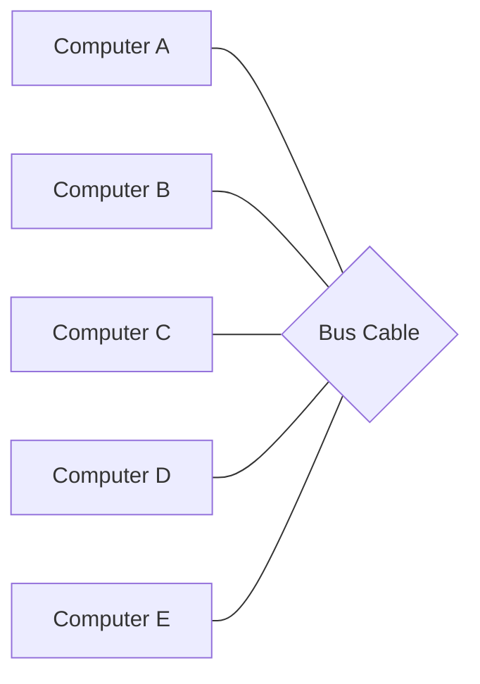
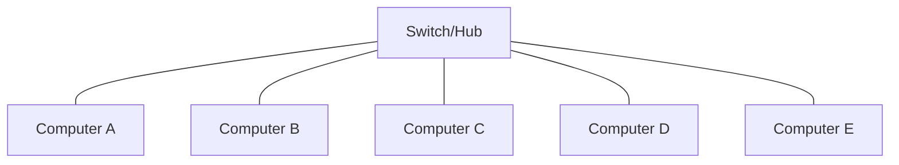
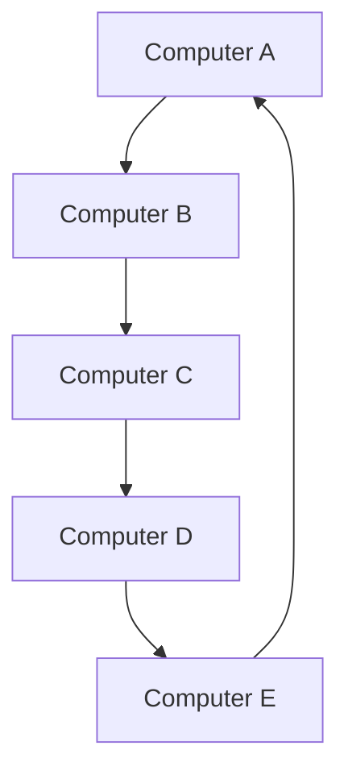
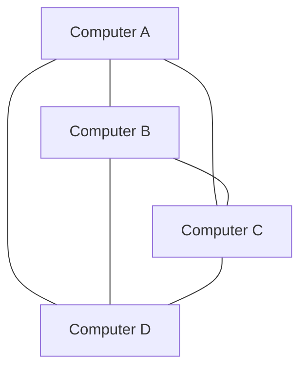
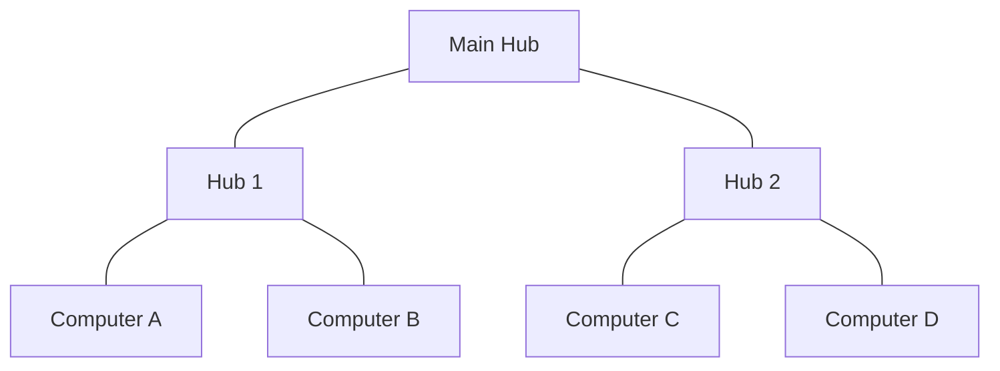
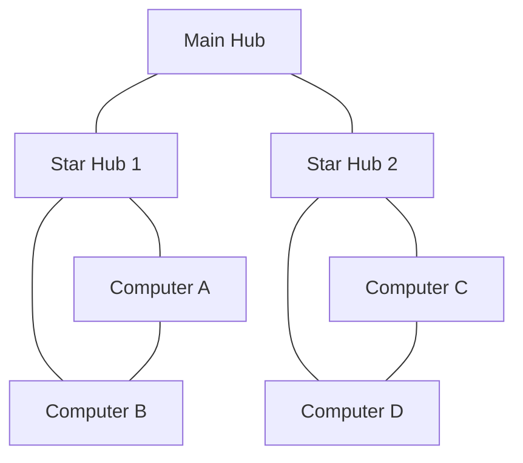
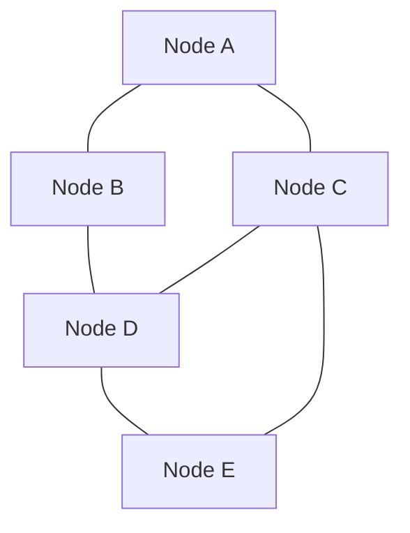

# Network Topologies

## Introduction

Network topology refers to the physical or logical arrangement of devices in a computer network. The way these devices are connected significantly impacts the network's performance, reliability, and scalability. Understanding different network topologies is foundational to mastering network design and troubleshooting.

In this guide, we'll explore the most common network topologies, their characteristics, advantages, disadvantages, and real-world applications. Whether you're building a small home network or understanding enterprise infrastructure, these concepts are essential.

## What is a Network Topology?

A network topology defines how computers, devices, and cables are physically or logically arranged in a network. There are two main categories:

- **Physical Topology**: The actual layout of the network hardware (cables, devices, etc.)
- **Logical Topology**: The way data flows within the network, regardless of physical arrangement

## Common Network Topologies

### Bus Topology

In a bus topology, all devices share a single communication line or cable called a bus.



#### Characteristics:
- All devices connect to a single cable with terminators at each end
- Simple to implement and requires less cable than other topologies

#### Advantages:
- Easy to set up and extend
- Requires less cable than other topologies
- Works well for small networks
- Cost-effective for limited budgets

#### Disadvantages:
- If the main cable fails, the entire network goes down
- Limited cable length and number of stations
- Performance degrades as more devices are added
- Difficult to troubleshoot
- Security concerns as all data passes through all devices

#### Real-world application:
Early Ethernet networks (10Base-2 and 10Base-5) used bus topology. Though less common today in large networks, it's still used in some small, temporary installations where simplicity and cost are priorities.

### Star Topology

In a star topology, all devices connect directly to a central device, typically a switch or hub.



#### Characteristics:
- All data passes through the central node
- Each device requires its own cable to connect to the central device

#### Advantages:
- Easy to install and wire
- Less disruption when adding or removing devices
- Failure of one device doesn't affect others
- Easy to detect faults and troubleshoot
- Better performance as no collisions between data from different computers

#### Disadvantages:
- Requires more cable than a bus topology
- If the central device fails, the entire network goes down
- More expensive due to the cost of the central switching equipment

#### Real-world application:
Most modern Ethernet LANs use a star topology. Home networks with a Wi-Fi router and office networks with switches typically implement star topologies.

### Ring Topology

In a ring topology, devices are connected in a closed loop, and data travels in one direction around the ring.



#### Characteristics:
- Each device connects to exactly two other devices, forming a single continuous path
- Data travels in one direction (or two directions in a dual ring topology)
- No terminators required

#### Advantages:
- Performance remains consistent even under heavy load
- Easy to install and reconfigure
- Each device has equal access to resources
- No data collisions as each station takes turns transmitting

#### Disadvantages:
- If one device or cable fails, the entire network may be affected
- Troubleshooting is more difficult
- Adding or removing devices disrupts the network temporarily

#### Real-world application:
Token Ring (IEEE 802.5) networks used ring topologies. Today, SONET (Synchronous Optical Network) and FDDI (Fiber Distributed Data Interface) use ring topologies for their fault tolerance in telecommunications infrastructure.

### Mesh Topology

In a mesh topology, every device connects directly to every other device in the network.



#### Characteristics:
- Every device has a dedicated point-to-point link to every other device
- Eliminates traffic problems caused by shared links

#### Advantages:
- Highly reliable and fault-tolerant
- Privacy and security as data takes a dedicated path
- No traffic congestion issues
- Easier to diagnose problems
- Can handle high volumes of traffic

#### Disadvantages:
- Very expensive to implement (requires n(n-1)/2 connections for n devices)
- Difficult to install and reconfigure
- Requires more resources and maintenance

#### Real-world application:
Core internet infrastructure and critical backbone networks often use mesh topologies. Military and financial networks where reliability and redundancy are crucial also implement mesh networks.

### Tree (Hierarchical) Topology

A tree topology combines characteristics of bus and star topologies, creating a hierarchy of nodes.



#### Characteristics:
- Nodes are arranged in a hierarchy, with a root node and branches extending from it
- Branches can have sub-branches

#### Advantages:
- Scalable and easy to expand
- Supports point-to-point wiring for individual segments
- Ideal for large networks that need organization into distinct groups
- Easier management of different departments or segments

#### Disadvantages:
- Depends heavily on the root node (single point of failure)
- Requires more cabling than a standard star topology
- More difficult to configure and manage

#### Real-world application:
Large corporate networks where departments need their own networks but must connect to a central infrastructure. Cable TV networks also use tree topologies to distribute signals.

### Hybrid Topology

A hybrid topology combines two or more different topology structures.



#### Characteristics:
- Takes advantage of multiple topologies
- Customized to meet specific requirements

#### Advantages:
- Extremely flexible
- Can be designed for optimal performance, reliability, and scalability
- Can accommodate future growth
- Different departments can have different topologies based on needs

#### Disadvantages:
- Complex to design and implement
- More expensive than simpler topologies
- Requires more expertise to manage and troubleshoot

#### Real-world application:
Enterprise-level networks typically implement hybrid topologies. For example, a company might use a star topology for department-level connections but a mesh topology for connections between critical servers.

## Practical Examples and Implementation

### Example 1: Setting Up a Small Office Network (Star Topology)

Let's walk through the steps of setting up a basic star topology network for a small office:

1. Choose a central location for your switch or router
2. Run Ethernet cables from each computer to the central switch
3. Configure IP addresses for each device (manually or via DHCP)

Basic network configuration code for a device:

```bash
# Linux IP configuration example
sudo ip addr add 192.168.1.10/24 dev eth0
sudo ip route add default via 192.168.1.1

# Windows IP configuration example (PowerShell)
New-NetIPAddress -InterfaceAlias "Ethernet" -IPAddress 192.168.1.10 -PrefixLength 24 -DefaultGateway 192.168.1.1
Set-DnsClientServerAddress -InterfaceAlias "Ethernet" -ServerAddresses 192.168.1.1
```

### Example 2: Testing Network Connectivity

After setting up your network topology, you can verify connectivity between devices:

```bash
# Ping another device on the network
ping 192.168.1.11

# Expected output:
# PING 192.168.1.11 (192.168.1.11) 56(84) bytes of data.
# 64 bytes from 192.168.1.11: icmp_seq=1 ttl=64 time=0.435 ms
# 64 bytes from 192.168.1.11: icmp_seq=2 ttl=64 time=0.507 ms
# 64 bytes from 192.168.1.11: icmp_seq=3 ttl=64 time=0.572 ms
```

### Example 3: Visualizing Your Network Topology

You can use simple network monitoring tools to visualize your network:

```bash
# Install and use traceroute to see the path to a destination
traceroute google.com

# Expected output:
# traceroute to google.com (142.250.190.78), 30 hops max, 60 byte packets
#  1  192.168.1.1 (192.168.1.1)  0.415 ms  0.438 ms  0.426 ms
#  2  10.0.0.1 (10.0.0.1)  1.498 ms  1.487 ms  1.475 ms
#  3  203.0.113.1 (203.0.113.1)  8.459 ms  8.447 ms  8.435 ms
#  ...
```

## Factors Affecting Topology Selection

When choosing a network topology, consider:

1. **Budget constraints**: Mesh topologies require more cabling and equipment than bus topologies
2. **Reliability requirements**: Critical applications may need redundant paths offered by mesh or hybrid topologies
3. **Scalability needs**: How much will your network grow in the future?
4. **Geographic distribution**: Physical location of devices affects feasible topologies
5. **Performance requirements**: Some topologies handle heavy traffic better than others

## Modern Network Topologies

### Wireless Mesh Networks

In modern networking, wireless mesh networks have become popular:



Wireless mesh networks provide:
- Self-healing capabilities (if one node fails, traffic reroutes)
- Extended wireless coverage without additional wiring
- Ideal for campus environments, smart cities, and IoT deployments

### Software-Defined Networking (SDN)

SDN separates the network control plane from the data plane, allowing for:
- Programmatic network configuration
- Central management
- Topology changes without physical reconfiguration
- Enhanced flexibility for modern applications

## Summary

Network topologies define how devices are connected in a network, influencing performance, reliability, and scalability. Key topologies include:

- **Bus**: Simple, linear connections with all devices sharing a central cable
- **Star**: All devices connect to a central hub or switch
- **Ring**: Devices connect in a closed loop with data traveling in a circle
- **Mesh**: Every device connects directly to every other device
- **Tree**: Hierarchical structure combining aspects of bus and star topologies
- **Hybrid**: Combination of two or more topologies for customized solutions

Understanding topologies helps you design networks that meet your specific requirements. As networking evolves, newer approaches like wireless mesh networks and software-defined networking are changing how we think about traditional topologies.

## Exercises and Projects

1. **Network Design Challenge**: Design a network topology for a small business with three departments, each with different reliability and performance needs.

2. **Topology Comparison**: Set up two small networks with different topologies (e.g., star and bus) and compare their performance under different loads.

3. **Troubleshooting Scenario**: Identify potential points of failure in different network topologies and create recovery plans for each.

4. **Research Project**: Investigate how modern cloud infrastructures implement network topologies and how they differ from traditional on-premises approaches.

## Further Resources

- Books: "Computer Networking: A Top-Down Approach" by Kurose and Ross
- Online courses: Cisco Networking Academy offers excellent networking fundamentals courses
- Practice platforms: Packet Tracer or GNS3 for virtual network topology experimentation
- Communities: r/networking subreddit and Network Engineering Stack Exchange for discussions

Understanding network topologies is just the beginning of your networking journey. As you progress, you'll learn how these fundamental concepts apply to everything from small home networks to global enterprise infrastructures.