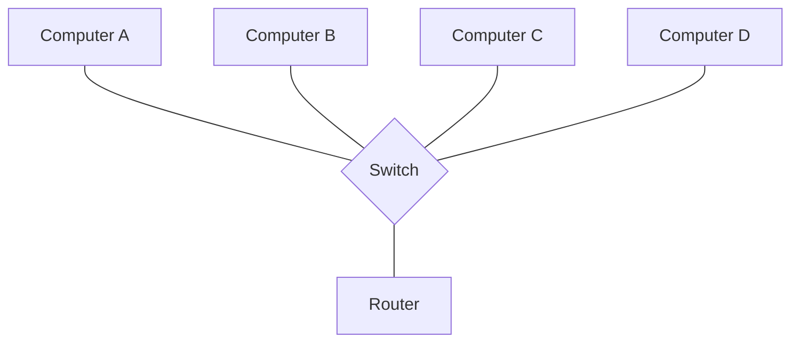
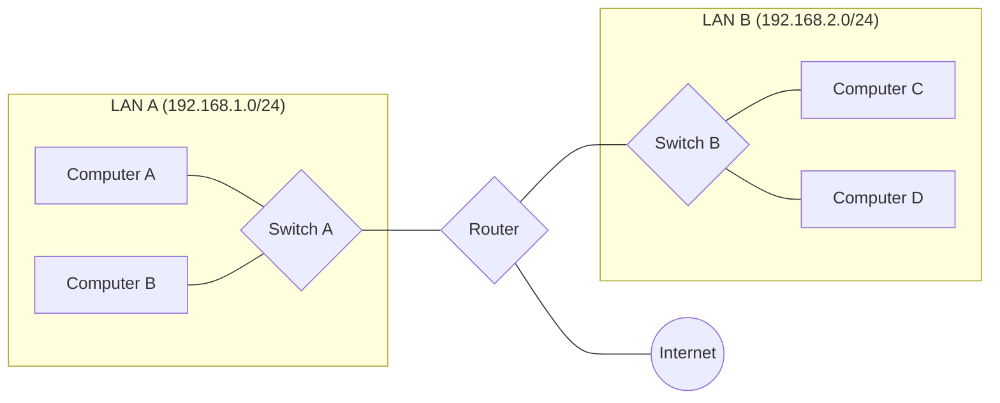
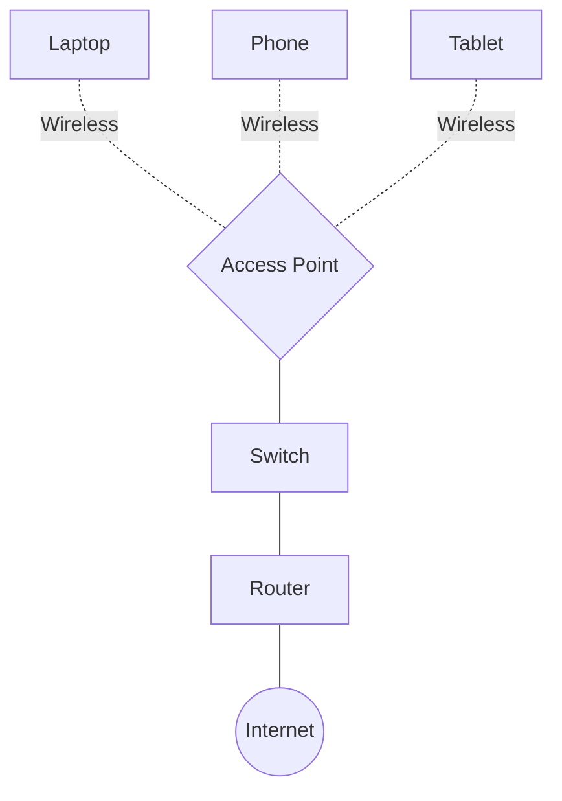
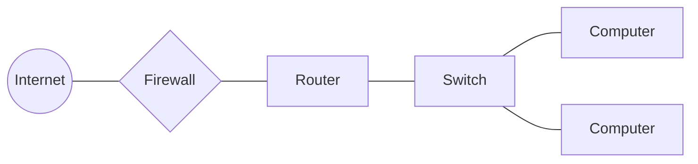
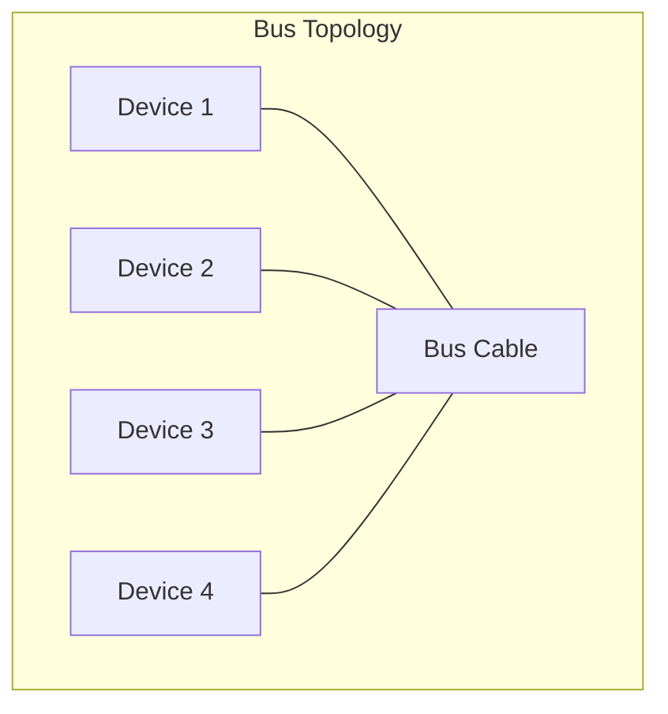
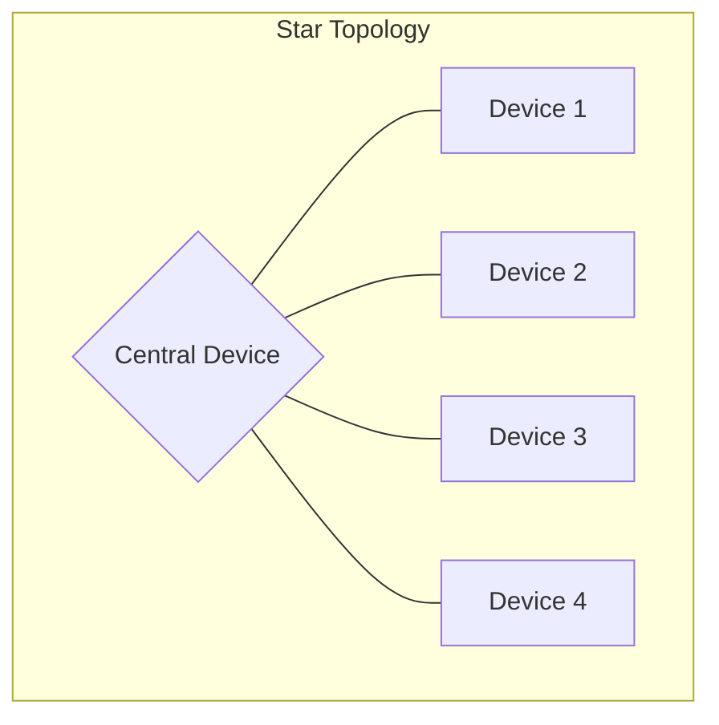
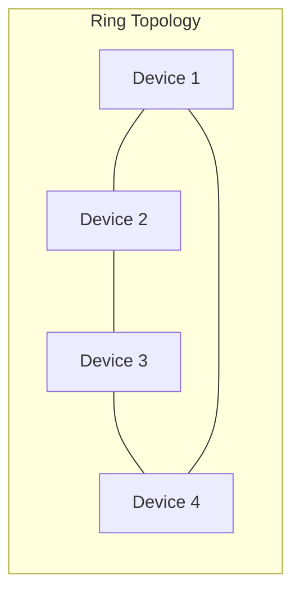
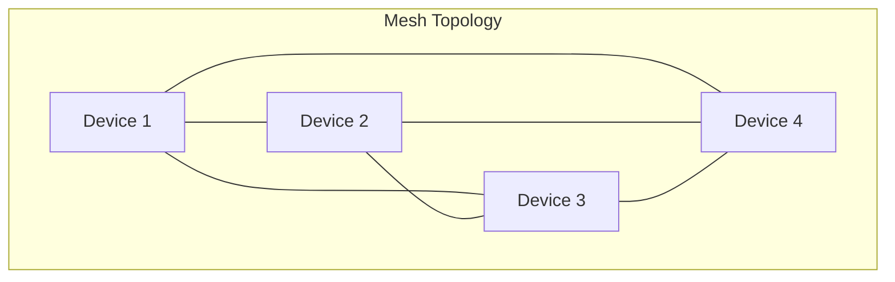
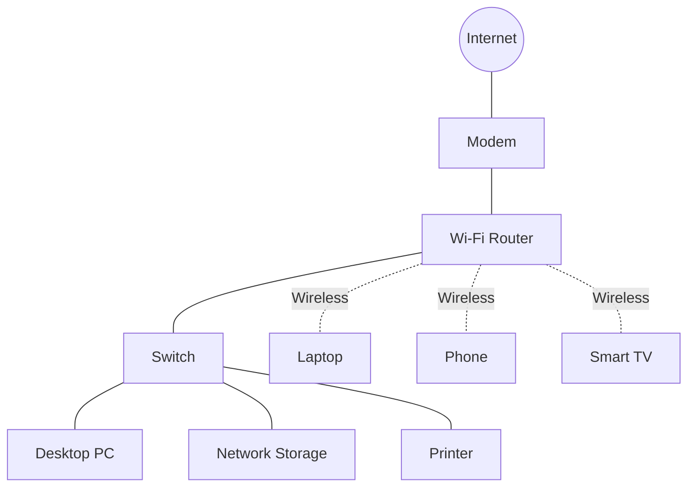
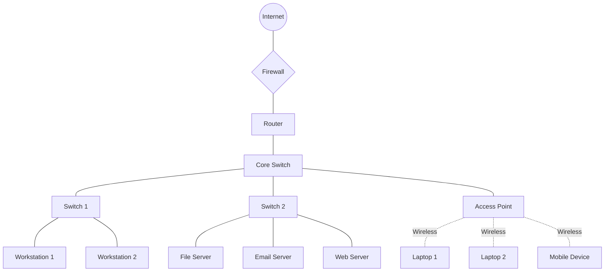

# Network Components

## Introduction

Computer networks are the backbone of modern digital communication, enabling devices to share information and resources across various distances. Whether you're browsing websites, sending emails, or streaming videos, you're utilizing a complex system of interconnected components working together seamlessly.

In this guide, we'll explore the essential components that make up computer networks. Understanding these building blocks is crucial for anyone looking to grasp how networks function, troubleshoot network issues, or design network solutions.

## Hardware Components

Hardware components form the physical infrastructure of any network. Let's examine the key devices you'll encounter:

### Nodes

Nodes are the endpoints in a network communication path.

- **End Devices**: Computers, smartphones, tablets, printers, and other devices that serve as the source or destination of network communications.
- **Intermediary Devices**: Devices that connect end devices and facilitate data transmission.

### Network Interface Cards (NICs)

```
+---------------+
|    Computer   |
|       +       |
|       |       |
|     [NIC]     |
|       |       |
+-------+-------+
        |
    To Network
```

A Network Interface Card (NIC) is a hardware component that:

- Connects a device to the network
- Contains a unique MAC address (hardware address)
- Converts data into signals that can travel across the network medium

```javascript
// Example: Accessing network interface information in Node.js
const os = require('os');
const networkInterfaces = os.networkInterfaces();

console.log('Network Interfaces:');
console.log(networkInterfaces);

// Output might look like:
// Network Interfaces:
// {
//   'Wi-Fi': [
//     {
//       address: '192.168.1.5',
//       netmask: '255.255.255.0',
//       family: 'IPv4',
//       mac: '01:23:45:67:89:ab',
//       internal: false
//     },
//     ...
//   ],
//   ...
// }
```

### Switches



Switches operate at layer 2 (Data Link layer) of the OSI model and:

- Connect multiple devices within the same local network (LAN)
- Use MAC addresses to forward frames to specific devices
- Create collision domains, improving network efficiency
- Can be managed or unmanaged

### Routers



Routers operate at layer 3 (Network layer) of the OSI model and:

- Connect different networks together
- Use IP addresses to determine the best path for data
- Provide a gateway between networks
- Implement network security through access control lists (ACLs)

```javascript
// Example: Basic ping to check router connectivity
const { exec } = require('child_process');

// Ping the default gateway (router)
exec('ping 192.168.1.1', (error, stdout, stderr) => {
  if (error) {
    console.error(`Error: ${error.message}`);
    return;
  }
  console.log('Router connectivity test:');
  console.log(stdout);
});

// Output might include:
// Router connectivity test:
// Pinging 192.168.1.1 with 32 bytes of data:
// Reply from 192.168.1.1: bytes=32 time=2ms TTL=64
// Reply from 192.168.1.1: bytes=32 time=1ms TTL=64
// ...
```

### Hubs (Legacy)

Hubs are older network devices that:

- Connect multiple devices in a network
- Operate at layer 1 (Physical layer)
- Broadcast data to all connected devices (no filtering)
- Create a single collision domain (less efficient than switches)

Hubs are largely obsolete and replaced by switches in modern networks.

### Access Points



Wireless Access Points (APs):

- Connect wireless devices to a wired network
- Use radio signals to communicate with devices
- Support Wi-Fi standards like 802.11n, 802.11ac, 802.11ax (Wi-Fi 6)
- May include additional features like security protocols (WPA3)

### Modems

Modems (Modulator-Demodulator):

- Convert digital signals from your computer to analog signals for transmission over telephone lines (or other media)
- Convert incoming analog signals back to digital signals
- Connect your local network to an Internet Service Provider (ISP)

### Firewalls



Firewalls can be hardware devices or software that:

- Monitor and filter incoming and outgoing network traffic
- Protect networks from unauthorized access
- Implement security policies
- May include advanced features like intrusion detection/prevention

```javascript
// Example: Simple firewall rule implementation in Node.js
const net = require('net');
const server = net.createServer((socket) => {
  const clientIP = socket.remoteAddress;
  
  // Simple IP-based filtering
  const blockedIPs = ['192.168.1.100', '10.0.0.5'];
  
  if (blockedIPs.includes(clientIP)) {
    console.log(`Blocked connection from ${clientIP}`);
    socket.end('Access denied
');
    return;
  }
  
  console.log(`Allowed connection from ${clientIP}`);
  socket.write('Welcome to the server!
');
  
  // Handle communication
  socket.on('data', (data) => {
    console.log(`Received: ${data}`);
    // Process data
  });
});

server.listen(8080, () => {
  console.log('Firewall server listening on port 8080');
});
```

## Transmission Media

The physical paths over which network signals travel:

### Wired Media

- **Twisted Pair Cables**: Common in LANs (Ethernet)
  - Unshielded Twisted Pair (UTP)
  - Shielded Twisted Pair (STP)
  - Categories: Cat5e, Cat6, Cat6a, Cat7, Cat8
  
- **Coaxial Cables**: Used for cable TV and some networks
  - Better shielding than twisted pair
  - Higher bandwidth over longer distances
  
- **Fiber Optic Cables**: Highest performance
  - Uses light signals instead of electrical signals
  - Single-mode (long distance) or multi-mode (shorter distance)
  - Highest bandwidth and transmission speeds
  - Immune to electromagnetic interference

### Wireless Media

- **Radio Frequencies**: Wi-Fi, cellular networks
- **Microwave**: Point-to-point communication
- **Infrared**: Short-range communication (e.g., remote controls)
- **Satellite**: Global communication

## Software Components

### Operating Systems

Operating systems provide network functionality through:

- Network protocol stacks
- Device drivers for network hardware
- Network configuration utilities
- Built-in firewalls and security features

### Network Protocols

Protocols are rules that govern network communication:

#### TCP/IP Protocol Suite

The foundation of Internet communications:

- **Internet Protocol (IP)**: Addressing and routing
- **Transmission Control Protocol (TCP)**: Reliable, connection-oriented communication
- **User Datagram Protocol (UDP)**: Faster, connectionless communication
- **Internet Control Message Protocol (ICMP)**: Network diagnostics and error reporting

```javascript
// Example: Creating TCP and UDP servers in Node.js

// TCP Server (reliable, connection-oriented)
const net = require('net');
const tcpServer = net.createServer((socket) => {
  console.log('Client connected to TCP server');
  socket.write('Welcome to the TCP server!
');
  
  socket.on('data', (data) => {
    console.log(`Received: ${data}`);
    socket.write(`Echo: ${data}`);
  });
  
  socket.on('end', () => {
    console.log('Client disconnected');
  });
});

tcpServer.listen(3000, () => {
  console.log('TCP server listening on port 3000');
});

// UDP Server (faster, connectionless)
const dgram = require('dgram');
const udpServer = dgram.createSocket('udp4');

udpServer.on('message', (msg, rinfo) => {
  console.log(`Received ${msg} from ${rinfo.address}:${rinfo.port}`);
  udpServer.send(`Echo: ${msg}`, rinfo.port, rinfo.address);
});

udpServer.on('listening', () => {
  const address = udpServer.address();
  console.log(`UDP server listening on ${address.address}:${address.port}`);
});

udpServer.bind(4000);
```

#### Application Layer Protocols

These protocols work at the application layer:

- **HTTP/HTTPS**: Web browsing
- **FTP**: File transfer
- **SMTP/POP3/IMAP**: Email communication
- **DNS**: Domain name resolution
- **DHCP**: Automatic IP address assignment
- **SSH**: Secure remote access
- **Telnet**: Remote terminal access (insecure)

```javascript
// Example: Basic HTTP server in Node.js
const http = require('http');

const server = http.createServer((req, res) => {
  res.statusCode = 200;
  res.setHeader('Content-Type', 'text/plain');
  res.end('Hello World! This is a simple HTTP server.
');
});

server.listen(8080, '127.0.0.1', () => {
  console.log('HTTP server running at http://127.0.0.1:8080/');
});
```

### Network Services

Software services that facilitate network operations:

- **DHCP Server**: Automatically assigns IP addresses
- **DNS Server**: Resolves domain names to IP addresses
- **File and Print Servers**: Share resources across networks
- **Directory Services**: Centralize user authentication and resource management
- **Web Servers**: Host websites and web applications

### Network Management Software

Tools for monitoring and managing networks:

- Network monitoring systems
- Traffic analyzers
- Configuration management tools
- Troubleshooting utilities

```javascript
// Example: Simple network monitor in Node.js
const http = require('http');
const os = require('os');

// Function to check if a host is online
function pingHost(host) {
  return new Promise((resolve) => {
    const req = http.get(`http://${host}:80`, () => {
      resolve(true);
    }).on('error', () => {
      resolve(false);
    });
    req.setTimeout(3000, () => {
      req.destroy();
      resolve(false);
    });
  });
}

// Monitor multiple hosts
async function monitorNetwork() {
  const hosts = ['google.com', 'example.com', 'localhost'];
  console.log('Network Monitoring Started');
  
  for (const host of hosts) {
    const isOnline = await pingHost(host);
    console.log(`${host}: ${isOnline ? 'ONLINE' : 'OFFLINE'}`);
  }
  
  // Display local network info
  const interfaces = os.networkInterfaces();
  console.log('
Local Network Interfaces:');
  
  Object.keys(interfaces).forEach((iface) => {
    interfaces[iface].forEach((details) => {
      if (details.family === 'IPv4') {
        console.log(`${iface}: ${details.address}`);
      }
    });
  });
}

// Run the monitor every 30 seconds
monitorNetwork();
setInterval(monitorNetwork, 30000);
```

## Network Topologies

The physical or logical arrangement of nodes in a network:

### Physical Topologies









- **Bus**: All devices connected to a single cable
- **Star**: All devices connected to a central hub/switch
- **Ring**: Devices connected in a closed loop
- **Mesh**: Each device connected to multiple other devices
- **Hybrid**: Combination of different topologies

### Logical Topologies

How data flows through the network, regardless of physical arrangement:

- **Broadcast**: Data sent to all devices (e.g., Ethernet)
- **Token Passing**: Data passed from device to device (e.g., Token Ring)
- **Point-to-Point**: Direct connections between pairs of devices

## Real-World Examples

### Home Network



A typical home network includes:

- Internet connection through an ISP
- Modem to convert ISP signal
- Router (often with built-in switch and wireless)
- Multiple end devices (computers, phones, smart TVs)
- Possibly network storage or printers

### Small Business Network



A small business network typically includes:

- Dedicated internet connection
- Hardware firewall for security
- Router for internet access
- Switches to connect multiple devices
- Servers for file sharing, email, and web hosting
- Access points for wireless coverage
- Workstations for employees

### Enterprise Network

Enterprise networks expand on the small business model with:

- Multiple interconnected LANs
- Redundant components for high availability
- More sophisticated security measures
- Connection to data centers or cloud services
- Wide Area Network (WAN) connections between branches
- Network management and monitoring systems
- Centralized authentication and directory services

## Practical Lab: Setting Up a Basic Network

Let's walk through a simplified process of setting up a small network:

### 1. Planning the Network

- Identify the number of devices
- Choose appropriate hardware components
- Determine IP addressing scheme (e.g., 192.168.1.0/24)
- Plan for physical and wireless connectivity

### 2. Basic Configuration Steps

#### Router Configuration

1. Connect to the router (typically via web interface at 192.168.1.1 or similar)
2. Set up internet connection details (provided by ISP)
3. Configure LAN settings:

```javascript
// Example router settings (pseudocode)
const routerConfig = {
  lanSettings: {
    ipAddress: '192.168.1.1',
    subnetMask: '255.255.255.0',
    dhcpServer: {
      enabled: true,
      startAddress: '192.168.1.100',
      endAddress: '192.168.1.200',
      leaseTime: '24h'
    }
  },
  wirelessSettings: {
    ssid: 'MyNetwork',
    securityMode: 'WPA3',
    password: 'SecureNetworkPassword',
    channel: 'Auto',
    band: '5GHz'
  }
};
```

#### Switch Setup

1. For unmanaged switches, simply connect the devices
2. For managed switches, configure VLANs or port settings as needed

#### Connecting Devices

1. Use Ethernet cables to connect wired devices to switch/router
2. Configure wireless devices to connect to the Wi-Fi network

```javascript
// Example code for a device to connect to Wi-Fi (pseudocode)
function connectToWifi() {
  const wifiConfig = {
    ssid: 'MyNetwork',
    password: 'SecureNetworkPassword',
    securityType: 'WPA3'
  };
  
  wifi.connect(wifiConfig)
    .then(() => {
      console.log('Connected to network');
      const ipAddress = wifi.getIPAddress();
      console.log(`Assigned IP: ${ipAddress}`);
    })
    .catch((error) => {
      console.error(`Connection failed: ${error}`);
    });
}
```

### 3. Testing the Network

1. Verify device connectivity
   - Check IP address assignments
   - Ping other devices on the network
   - Test internet access

2. Troubleshoot common issues
   - No IP address (DHCP issues)
   - Can't reach other devices (firewall, routing issues)
   - No internet (DNS or gateway problems)

```javascript
// Example: Network testing script in Node.js
const { exec } = require('child_process');

// Function to run network tests
function testNetwork() {
  // Test 1: Check IP configuration
  exec('ipconfig', (error, stdout) => {
    console.log('IP Configuration:');
    console.log(stdout);
    
    // Test 2: Ping the gateway
    exec('ping 192.168.1.1', (error, stdout) => {
      console.log('
Gateway connectivity:');
      console.log(stdout);
      
      // Test 3: Ping an internet host
      exec('ping google.com', (error, stdout) => {
        console.log('
Internet connectivity:');
        console.log(stdout);
        
        // Test 4: DNS resolution
        exec('nslookup example.com', (error, stdout) => {
          console.log('
DNS resolution:');
          console.log(stdout);
        });
      });
    });
  });
}

testNetwork();
```

## Summary

Network components work together to create a functional communication system. Let's recap the key points:

- **Hardware components** like NICs, switches, routers, and access points form the physical infrastructure
- **Transmission media** (wired and wireless) provide the pathways for data
- **Software components** including operating systems, protocols, and network services enable communication
- **Network topologies** define how devices are arranged and connected
- Networks can range from simple home setups to complex enterprise environments

Understanding these components and how they interact is essential for designing, implementing, and troubleshooting networks of all sizes.

## Additional Resources

To continue your learning journey:

- **Practice Exercises**:
  - Set up a small home network with a router and multiple devices
  - Use command-line tools like `ping`, `traceroute`, and `ipconfig` to explore network characteristics
  - Create a network diagram of your home or office network

- **Study Topics**:
  - The OSI and TCP/IP networking models
  - IP addressing and subnetting
  - Network security principles
  - Wireless networking standards
  - Cloud networking concepts

- **Tools to Explore**:
  - Wireshark for packet analysis
  - Network simulators like Cisco Packet Tracer
  - Network monitoring tools