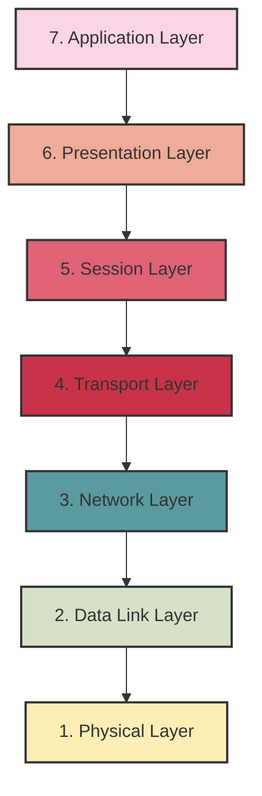
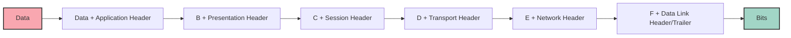
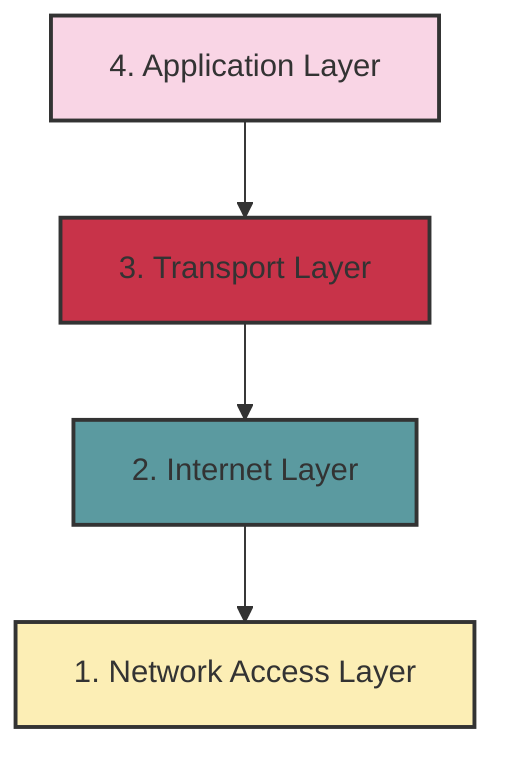
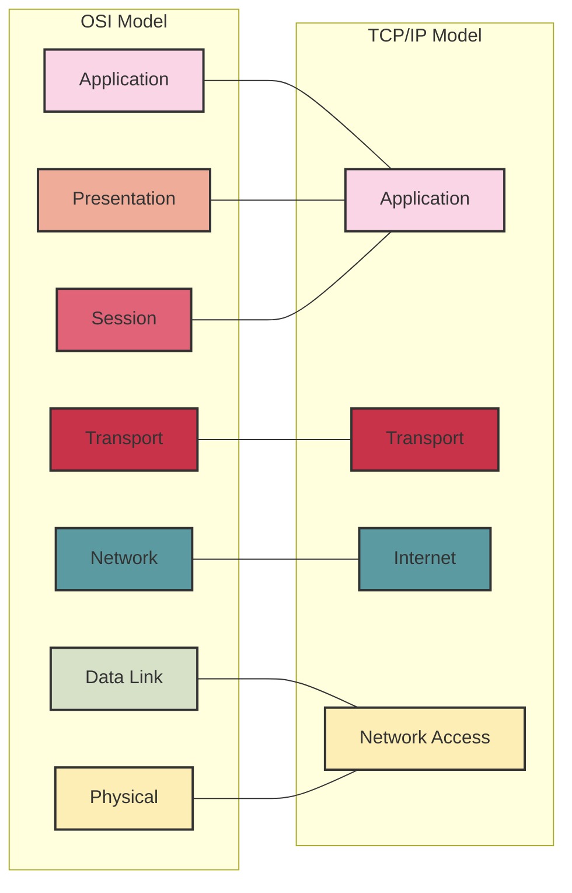

# Network Models

## Introduction

Network models are conceptual frameworks that define how communication occurs between different systems in a computer network. These models break down the complex process of network communication into simpler, more manageable layers, each with specific responsibilities. For beginners in programming and networking, understanding these models is crucial as they provide a structured approach to learning how data moves across networks.

In this guide, we'll explore the primary network models that form the foundation of modern networking, with a focus on the OSI (Open Systems Interconnection) model and the TCP/IP (Transmission Control Protocol/Internet Protocol) model. We'll examine how these models work, their differences, and their practical applications in real-world scenarios.

## The OSI Model

The OSI model, developed by the International Organization for Standardization (ISO) in 1984, is a conceptual framework consisting of seven layers that describe the functions of a networking system.

### The Seven Layers of the OSI Model



Let's examine each layer in detail, from bottom to top:

1. **Physical Layer**
   - Deals with the physical connection between devices
   - Concerned with transmitting raw bits over a communication channel
   - Defines hardware specifications like cables, pins, voltages
   - Example devices: Hubs, repeaters, cables, network adapters

2. **Data Link Layer**
   - Provides node-to-node data transfer
   - Handles error detection and correction from the Physical layer
   - Divides data into frames
   - Example protocols: Ethernet, PPP, HDLC

3. **Network Layer**
   - Manages device addressing, tracks the location of devices on the network
   - Routes packets from source to destination across multiple networks
   - Example protocol: Internet Protocol (IP)

4. **Transport Layer**
   - Provides end-to-end communication control
   - Ensures complete data transfer
   - Example protocols: TCP (connection-oriented), UDP (connectionless)

5. **Session Layer**
   - Establishes, manages, and terminates connections between applications
   - Example protocols: NetBIOS, PPTP

6. **Presentation Layer**
   - Translates data between the application layer and lower layers
   - Handles data encryption, compression, and format conversion
   - Example standards: JPEG, MPEG, GIF

7. **Application Layer**
   - Interface between the network and user applications
   - Provides services for email, file transfers, and other network software services
   - Example protocols: HTTP, FTP, SMTP, DNS

### Data Encapsulation in the OSI Model

When data travels down the OSI model from sender to receiver, each layer adds its own information to the data. This process is called encapsulation.



## The TCP/IP Model

While the OSI model is conceptual, the TCP/IP model is the practical implementation used in the Internet. It consists of four layers instead of seven.

### The Four Layers of the TCP/IP Model



1. **Network Access Layer**
   - Combines the functions of OSI's Physical and Data Link layers
   - Handles the physical transmission of data
   - Example protocols: Ethernet, Wi-Fi

2. **Internet Layer**
   - Equivalent to OSI's Network layer
   - Handles packet routing
   - Example protocol: IP (IPv4, IPv6)

3. **Transport Layer**
   - Similar to OSI's Transport layer
   - Provides end-to-end communication
   - Example protocols: TCP, UDP

4. **Application Layer**
   - Combines the functions of OSI's Application, Presentation, and Session layers
   - Interface for user applications
   - Example protocols: HTTP, FTP, SMTP, DNS

## Comparing OSI and TCP/IP Models

Let's compare the two primary network models to understand their relationship:



## Practical Example: HTTP Request Flow

Let's see how a simple HTTP request flows through the TCP/IP model:

```javascript
// Simple HTTP request in JavaScript
fetch('https://api.example.com/data')
  .then(response => response.json())
  .then(data => console.log(data))
  .catch(error => console.error('Error:', error));
```

Now, let's trace the journey of this request through the TCP/IP layers:

1. **Application Layer**:
   - The `fetch()` API creates an HTTP request
   - HTTP headers are added to the request

2. **Transport Layer**:
   - TCP establishes a connection with the server via a three-way handshake
   - TCP segment is created with source and destination ports

3. **Internet Layer**:
   - IP adds source and destination IP addresses
   - Routes the packet through the network

4. **Network Access Layer**:
   - Converts the packet to bits
   - Transmits the bits over the physical medium

The response follows the same path in reverse, traveling up through the layers.

## Real-World Applications

Understanding network models has practical applications in various areas:

### 1. Network Troubleshooting

When troubleshooting network issues, the layered approach helps isolate problems:

```javascript
// Sample network troubleshooting pseudo-code
function troubleshootNetwork() {
  // Check Physical Layer
  if (!isPhysicalConnectionWorking()) {
    return "Check cables and hardware";
  }
  
  // Check Data Link Layer
  if (!isMACAddressResolvable()) {
    return "Check switch configuration or NIC";
  }
  
  // Check Network Layer
  if (!isPingable("8.8.8.8")) {
    return "Check IP configuration or router";
  }
  
  // Check Transport Layer
  if (!isPortOpen(80)) {
    return "Check firewall settings";
  }
  
  // Check Application Layer
  if (!isDNSResolvable("example.com")) {
    return "Check DNS settings";
  }
  
  return "Network is functioning correctly";
}
```

### 2. Network Security Implementation

Network models guide the implementation of security controls at different layers:

- **Physical Layer**: Secure server rooms, cable protection
- **Data Link Layer**: MAC filtering, port security
- **Network Layer**: Firewalls, IP filtering
- **Transport Layer**: TLS/SSL, port restrictions
- **Application Layer**: Authentication, input validation

### 3. Protocol Development

When developing new network protocols, engineers use the layered model as a guide for where their protocol fits:

```javascript
// Example: Simple protocol definition
const myProtocol = {
  layer: "Application", // Which layer the protocol operates at
  dependencies: ["TCP"], // Lower layer protocols it requires
  headerFormat: {
    version: "uint8",
    messageType: "uint8",
    payloadLength: "uint16",
    sessionId: "uint32"
  },
  messageTypes: {
    REQUEST: 1,
    RESPONSE: 2,
    ERROR: 3
  }
};
```

## Practical Exercises

1. **Layer Identification**:
   Identify which network model layer each of the following belongs to:
   - Ethernet cable
   - IP address
   - HTTPS
   - TCP port
   - DNS

2. **Packet Tracing**:
   Install Wireshark and capture packets while visiting a website. Identify headers from different layers in the captured packets.

3. **Mini Network Simulator**:
   Create a simple JavaScript application that simulates data encapsulation through the OSI or TCP/IP layers.

```javascript
// Starting point for Exercise 3
class NetworkPacket {
  constructor(data) {
    this.data = data;
    this.headers = {
      application: null,
      transport: null,
      network: null,
      dataLink: null
    };
  }
  
  addApplicationHeader(header) {
    this.headers.application = header;
    return this;
  }
  
  addTransportHeader(header) {
    this.headers.transport = header;
    return this;
  }
  
  addNetworkHeader(header) {
    this.headers.network = header;
    return this;
  }
  
  addDataLinkHeader(header) {
    this.headers.dataLink = header;
    return this;
  }
  
  // Implement the transmit() method to simulate sending the packet
}
```

## Summary

Network models provide a structured framework for understanding the complex process of network communication. The OSI model serves as a conceptual reference with its seven layers, while the TCP/IP model offers a practical implementation used in real-world networks with its four layers.

Key takeaways from this guide:

- Network models divide complex networking processes into simpler, manageable layers
- Each layer has specific responsibilities and interfaces with adjacent layers
- The OSI model has seven layers and serves as a conceptual reference
- The TCP/IP model has four layers and is the practical implementation used in the Internet
- Understanding these models helps with network troubleshooting, security implementation, and protocol development

By understanding these foundational concepts, beginners can build a solid knowledge base for more advanced networking topics.

## Additional Resources

- **Books**:
  - "Computer Networks" by Andrew S. Tanenbaum
  - "TCP/IP Illustrated" by W. Richard Stevens

- **Online Courses**:
  - Cisco Networking Academy
  - CompTIA Network+ certification materials

- **Practice Tools**:
  - Wireshark for packet analysis
  - GNS3 for network simulation