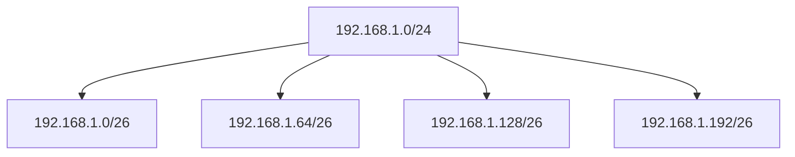
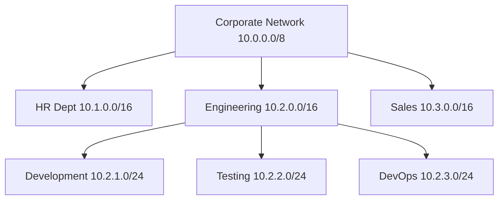
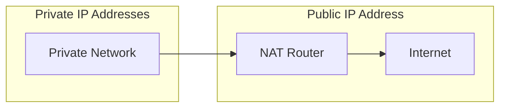

# Network Addresses

## Introduction

Network addresses are the foundation of all computer networks, serving as unique identifiers that enable devices to find and communicate with each other. Much like how a postal address helps locate a specific house, network addresses help data packets find their destination across the vast digital landscape.

In this guide, we'll explore different types of network addresses, how they work, and why they're essential for everything from browsing the web to sending emails and beyond.

## Types of Network Addresses

There are several types of network addresses, each serving different purposes within network communication:

### 1. MAC Addresses (Media Access Control)

MAC addresses are hardware addresses permanently assigned to network interfaces.

#### Key Characteristics:

- 48-bit (6-byte) physical address
- Assigned by manufacturers to network interface cards (NICs)
- Represented in hexadecimal format (e.g., `00:1A:2B:3C:4D:5E`)
- Operates at the Data Link Layer (Layer 2) of the OSI model
- Globally unique (in theory)

#### Example:

```
MAC Address: 00:1A:2B:3C:4D:5E
```

The first three bytes (`00:1A:2B`) identify the manufacturer (OUI - Organizationally Unique Identifier), while the last three bytes (`3C:4D:5E`) represent the specific device.

### 2. IP Addresses (Internet Protocol)

IP addresses identify devices on IP networks, including the internet.

#### IPv4 (Internet Protocol version 4)

- 32-bit address (4 bytes)
- Represented as four decimal numbers separated by dots (e.g., `192.168.1.1`)
- Limited to approximately 4.3 billion unique addresses
- Operates at the Network Layer (Layer 3) of the OSI model

#### IPv6 (Internet Protocol version 6)

- 128-bit address (16 bytes)
- Represented as eight groups of four hexadecimal digits separated by colons (e.g., `2001:0db8:85a3:0000:0000:8a2e:0370:7334`)
- Can be shortened by removing leading zeros and replacing consecutive sections of zeros with `::` (only once)
- Provides an enormous address space (340 undecillion addresses)

#### Example:

```
IPv4 Address: 192.168.1.100
IPv6 Address: 2001:0db8:85a3::8a2e:0370:7334 (shortened form)
```

## Understanding IP Addressing in Depth

### IP Address Classes (IPv4)

Traditionally, IPv4 addresses were divided into classes:

| Class | First Octet Range | Default Subnet Mask | Purpose |
|-------|-------------------|---------------------|---------|
| A     | 1-126             | 255.0.0.0           | Large networks |
| B     | 128-191           | 255.255.0.0         | Medium networks |
| C     | 192-223           | 255.255.255.0       | Small networks |
| D     | 224-239           | N/A                 | Multicast |
| E     | 240-255           | N/A                 | Experimental |

:::note
127.0.0.0/8 is reserved for loopback addresses (localhost).
:::

### Special IP Addresses

Several IP address ranges are reserved for special purposes:

- **Private IP Addresses**: For use in private networks
  - 10.0.0.0 to 10.255.255.255 (10.0.0.0/8)
  - 172.16.0.0 to 172.31.255.255 (172.16.0.0/12)
  - 192.168.0.0 to 192.168.255.255 (192.168.0.0/16)
  
- **Localhost**: 127.0.0.1 (IPv4) and ::1 (IPv6)
- **Link-local addresses**: 169.254.0.0/16 (IPv4) and fe80::/10 (IPv6)

## Subnetting and CIDR Notation

Subnetting divides a large network into smaller, more manageable sub-networks.

### CIDR Notation (Classless Inter-Domain Routing)

CIDR notation represents an IP address followed by a slash and a number (prefix length) that indicates how many bits are used for the network portion:

```
192.168.1.0/24
```

This means:
- The first 24 bits (3 bytes) represent the network portion
- The remaining 8 bits represent the host portion
- This network can have 2^8 - 2 = 254 usable host addresses

### Subnet Mask

A subnet mask is a 32-bit number that masks an IP address, dividing it into network and host portions:

```
IP Address:  192.168.1.100  (11000000.10101000.00000001.01100100)
Subnet Mask: 255.255.255.0  (11111111.11111111.11111111.00000000)
Network ID:  192.168.1.0    (11000000.10101000.00000001.00000000)
```

### Subnetting Example

Let's say we have a network `192.168.1.0/24` and want to create 4 subnets:



Each subnet now has a `/26` prefix (26 bits for network, 6 bits for hosts), allowing for 2^6 - 2 = 62 hosts per subnet.

## Subnetting Calculation

Here's how to calculate subnet information:

```javascript
// Example function to calculate subnet properties
function calculateSubnet(ipAddress, cidrPrefix) {
  // Convert IP address to binary
  const ipBinary = ipToBinary(ipAddress);
  
  // Create subnet mask based on CIDR prefix
  const subnetMaskBinary = '1'.repeat(cidrPrefix).padEnd(32, '0');
  const subnetMask = binaryToIp(subnetMaskBinary);
  
  // Calculate network ID (bitwise AND)
  const networkIdBinary = bitwiseAnd(ipBinary, subnetMaskBinary);
  const networkId = binaryToIp(networkIdBinary);
  
  // Calculate broadcast address
  const broadcastBinary = networkIdBinary.substring(0, cidrPrefix) + 
                         '1'.repeat(32 - cidrPrefix);
  const broadcast = binaryToIp(broadcastBinary);
  
  // Calculate usable hosts
  const usableHosts = Math.pow(2, (32 - cidrPrefix)) - 2;
  
  return {
    networkId,
    subnetMask,
    broadcast,
    usableHosts
  };
}
```

### Example Usage:

```javascript
const subnet = calculateSubnet('192.168.1.100', 24);
console.log(subnet);

/* Output:
{
  networkId: '192.168.1.0',
  subnetMask: '255.255.255.0',
  broadcast: '192.168.1.255',
  usableHosts: 254
}
*/
```

## Practical Applications

### 1. Home Network Setup

In a typical home network:

```
Internet <--> Router (WAN IP: 203.0.113.1, LAN IP: 192.168.1.1/24) <--> Devices
```

Devices receive private IP addresses via DHCP:
- Computer: 192.168.1.100
- Smartphone: 192.168.1.101
- Smart TV: 192.168.1.102

These private addresses are translated to the public IP (NAT) when accessing the internet.

### 2. Corporate Network Segmentation

A company might segment their network for security and management:



### 3. IP Address Resolution

When you type a domain name in your browser:

1. Your computer checks its DNS cache
2. If not found, it queries the configured DNS server
3. DNS server resolves the domain name to an IP address
4. Your computer uses the IP address to communicate with the server

```javascript
// Simplified DNS lookup example
async function lookupDomain(domainName) {
  try {
    const ipAddress = await dns.promises.lookup(domainName);
    console.log(`${domainName} resolves to ${ipAddress.address}`);
    return ipAddress.address;
  } catch (error) {
    console.error(`Failed to resolve ${domainName}: ${error.message}`);
    return null;
  }
}

// Usage
lookupDomain('example.com');
// Output: example.com resolves to 93.184.216.34
```

## Network Address Translation (NAT)

NAT allows multiple devices with private IP addresses to share a single public IP address:



NAT works by maintaining a translation table that maps private IP:port combinations to the public IP:port:

```
Private IP:Port       Public IP:Port
192.168.1.100:12345 → 203.0.113.1:24680
192.168.1.101:54321 → 203.0.113.1:13579
```

## Summary

Network addresses are essential identifiers that make communication possible across networks. Key points to remember:

- **MAC addresses** are hardware-based, permanent, and operate at Layer 2
- **IP addresses** are logical addresses that operate at Layer 3 and come in two versions: IPv4 and IPv6
- **Subnetting** divides networks into smaller segments for better management and security
- **CIDR notation** provides a concise way to represent network addresses and their prefix lengths
- **NAT** enables multiple devices to share a single public IP address

Network addressing forms the foundation of all network communications, enabling everything from local file sharing to global internet access.

## Exercises

1. Convert the following IP address to binary: `172.16.254.1`
2. What is the CIDR notation for a subnet mask of `255.255.240.0`?
3. How many usable host addresses are available in a `/22` network?
4. Divide the network `192.168.0.0/24` into 8 equal subnets. What are their network IDs and prefix lengths?
5. Determine whether the IP address `10.0.0.5` can communicate directly (without a router) with `10.0.0.200` if both have a subnet mask of `255.255.255.128`.

## Additional Resources

- [RFC 791](https://tools.ietf.org/html/rfc791) - Internet Protocol specification
- [RFC 4291](https://tools.ietf.org/html/rfc4291) - IPv6 Addressing Architecture
- [Network Subnet Calculator Tools](https://www.calculator.net/ip-subnet-calculator.html)

Happy networking!