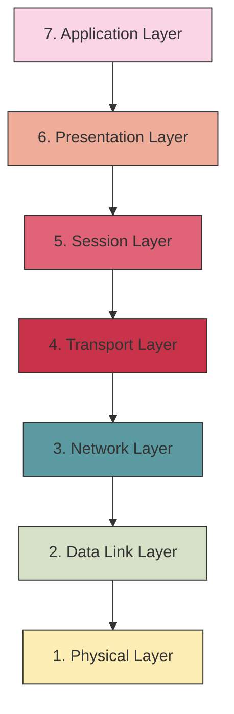
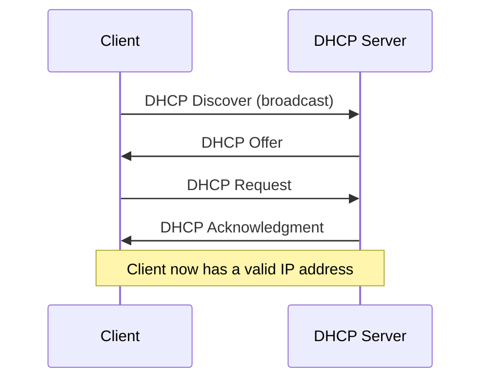

# Network Protocols

## Introduction

Network protocols are sets of rules and conventions that determine how data is transmitted between devices on a computer network. They act as a common language that allows different devices, regardless of their hardware or software configurations, to communicate efficiently and reliably.

Think of network protocols as the traffic rules of the digital highway. Just as road rules enable vehicles to navigate safely without collisions, network protocols enable data packets to travel across networks without loss or corruption.

## What Are Network Protocols?

Network protocols define several critical aspects of network communication:

- **Format of data**: How information is structured when transmitted
- **Address scheme**: How devices on a network are identified
- **Routing**: How data finds its path from source to destination
- **Error detection and correction**: How transmission problems are identified and resolved
- **Handshaking**: How devices establish connections before communication
- **Synchronization**: How data flow is managed between devices

## The OSI Model: A Framework for Understanding Protocols

To understand protocols better, we should first look at the OSI (Open Systems Interconnection) model, which divides network communications into seven layers. Each layer has specific protocols that handle particular aspects of communication.



Each layer serves a specific function:

1. **Physical Layer**: Manages physical connections and raw bit transmission
2. **Data Link Layer**: Handles node-to-node data transfer and error detection
3. **Network Layer**: Manages routing and forwarding of data packets
4. **Transport Layer**: Ensures reliable data delivery between endpoints
5. **Session Layer**: Establishes, maintains, and terminates connections
6. **Presentation Layer**: Translates data between application and network formats
7. **Application Layer**: Provides network services directly to user applications

## Key Network Protocols

Let's explore some of the most essential network protocols you'll encounter:

### TCP/IP: The Foundation of Internet Communication

The Transmission Control Protocol/Internet Protocol (TCP/IP) is the fundamental suite of protocols that powers the internet. It consists of four layers:

1. **Network Interface Layer**
2. **Internet Layer**
3. **Transport Layer**
4. **Application Layer**

Let's look at how TCP works:

```javascript
// Simplified TCP connection establishment (three-way handshake)
// This is pseudocode to illustrate the concept

// Step 1: Client sends SYN packet
client.send({
  type: "SYN",
  sequenceNumber: 100
});

// Step 2: Server responds with SYN-ACK
server.send({
  type: "SYN-ACK",
  sequenceNumber: 200,
  acknowledgmentNumber: 101 // client's sequence number + 1
});

// Step 3: Client sends ACK
client.send({
  type: "ACK",
  sequenceNumber: 101,
  acknowledgmentNumber: 201 // server's sequence number + 1
});

// Connection established!
console.log("TCP Connection established");
```

#### TCP vs. UDP: Reliability vs. Speed

TCP and UDP (User Datagram Protocol) are transport layer protocols with different priorities:

| Feature | TCP | UDP |
|---------|-----|-----|
| Connection | Connection-oriented | Connectionless |
| Reliability | Guaranteed delivery | Best-effort delivery |
| Order | Maintains sequence | No sequence guarantee |
| Speed | Slower due to overhead | Faster |
| Use cases | Web browsing, email, file transfers | Video streaming, online gaming, DNS lookups |

### HTTP: The Web's Protocol

HTTP (Hypertext Transfer Protocol) is an application layer protocol that powers the World Wide Web. When you access a website, your browser sends HTTP requests to web servers.

```javascript
// Basic HTTP GET request example
const httpRequest = {
  method: "GET",
  url: "/index.html",
  headers: {
    "Host": "www.example.com",
    "User-Agent": "Mozilla/5.0",
    "Accept": "text/html"
  }
};

// Server response
const httpResponse = {
  statusCode: 200,
  statusMessage: "OK",
  headers: {
    "Content-Type": "text/html",
    "Content-Length": "1234"
  },
  body: "<!DOCTYPE html><html>...</html>"
};

console.log(`Status: ${httpResponse.statusCode} ${httpResponse.statusMessage}`);
// Output: Status: 200 OK
```

HTTP works as a request-response protocol:

1. Client sends a request to the server
2. Server processes the request
3. Server sends back a response
4. Connection can be closed or maintained for additional requests

### DHCP: Automatic IP Configuration

Dynamic Host Configuration Protocol (DHCP) automates the process of assigning IP addresses to devices on a network.

The DHCP process follows four steps (DORA):

1. **Discovery**: Client broadcasts to find available DHCP servers
2. **Offer**: Server offers an IP address configuration
3. **Request**: Client requests the offered IP address
4. **Acknowledgment**: Server confirms the assignment



### DNS: Translating Domain Names to IP Addresses

Domain Name System (DNS) translates human-readable domain names (like `example.com`) into IP addresses (like `93.184.216.34`).

```javascript
// Simplified DNS lookup process (pseudocode)
function dnsLookup(domainName) {
  // First check local cache
  const cachedIP = dnsCache.get(domainName);
  
  if (cachedIP) {
    console.log(`Cache hit: ${domainName} -> ${cachedIP}`);
    return cachedIP;
  }
  
  // If not in cache, query DNS server
  const response = dnsServer.query(domainName);
  
  if (response.found) {
    const ipAddress = response.ipAddress;
    // Store in cache for future lookups
    dnsCache.set(domainName, ipAddress);
    console.log(`Resolved: ${domainName} -> ${ipAddress}`);
    return ipAddress;
  } else {
    console.log(`Could not resolve ${domainName}`);
    return null;
  }
}

// Example usage
const ip = dnsLookup("example.com");
// Output: Resolved: example.com -> 93.184.216.34
```

The DNS resolution process typically follows these steps:

1. Your computer checks its local DNS cache
2. If not found, it queries your configured DNS server (often provided by your ISP)
3. The DNS server may check its cache or forward the query to other DNS servers
4. Eventually, the authoritative DNS server for the domain provides the IP address
5. The result is returned to your computer and cached for future use

## Implementing Basic Socket Communication

Let's look at a simple example of how to implement basic network communication using sockets in Node.js:

```javascript
// Server code (server.js)
const net = require('net');

const server = net.createServer((socket) => {
  console.log('Client connected');
  
  socket.on('data', (data) => {
    const message = data.toString().trim();
    console.log(`Received: ${message}`);
    
    // Echo the message back
    socket.write(`Server received: ${message}
`);
  });
  
  socket.on('end', () => {
    console.log('Client disconnected');
  });
});

server.listen(3000, () => {
  console.log('Server listening on port 3000');
});
```

```javascript
// Client code (client.js)
const net = require('net');

const client = net.createConnection({ port: 3000 }, () => {
  console.log('Connected to server');
  client.write('Hello, server!
');
});

client.on('data', (data) => {
  console.log(data.toString());
  client.end();
});

client.on('end', () => {
  console.log('Disconnected from server');
});
```

When you run these programs:

1. Start the server: `node server.js`
2. In another terminal, run the client: `node client.js`

Output from client:
```
Connected to server
Server received: Hello, server!
Disconnected from server
```

Output from server:
```
Server listening on port 3000
Client connected
Received: Hello, server!
Client disconnected
```

This simple example demonstrates the basic principles of network protocols: establishing a connection, exchanging data according to a defined format, and terminating the connection properly.

## Wireshark: Observing Protocols in Action

To truly understand network protocols, it's helpful to see them in action. Wireshark is a powerful network protocol analyzer that allows you to capture and examine the packets being transmitted on a network.

Here's what a typical HTTP packet capture might look like:

```
Frame 74: 469 bytes on wire, 469 bytes captured
Ethernet II, Src: Dell_12:34:56 (00:14:22:12:34:56), Dst: Cisco_78:9a:bc (00:1a:2b:78:9a:bc)
Internet Protocol Version 4, Src: 192.168.1.5, Dst: 93.184.216.34
Transmission Control Protocol, Src Port: 54321, Dst Port: 80, Seq: 1, Ack: 1
Hypertext Transfer Protocol
    GET / HTTP/1.1\r

    Host: example.com\r

    User-Agent: Mozilla/5.0\r

    Accept: text/html,application/xhtml+xml\r

    Connection: keep-alive\r

    \r

```

This shows the layered nature of network protocols:
- Ethernet frame at the data link layer
- IP packet at the network layer
- TCP segment at the transport layer
- HTTP request at the application layer

## Real-World Applications of Network Protocols

Understanding network protocols has practical applications in many areas:

### Web Development

When building web applications, understanding HTTP is crucial for:
- Creating RESTful APIs
- Debugging client-server communication
- Implementing security features like HTTPS
- Optimizing performance through HTTP/2 or HTTP/3

### IoT (Internet of Things)

IoT devices often use lightweight protocols designed for efficiency:
- MQTT (Message Queuing Telemetry Transport) for sensor data
- CoAP (Constrained Application Protocol) for resource-constrained devices

### Network Security

Security professionals need to understand protocols to:
- Identify unusual traffic patterns
- Configure firewalls correctly
- Implement secure communication channels
- Detect protocol-based attacks

## Summary

Network protocols are the essential rules that enable digital communication. They provide standardized methods for devices to connect, exchange data, and disconnect in reliable ways. Understanding protocols is fundamental to working with any networked system.

Key takeaways:
- Protocols operate at different layers of the OSI model
- TCP/IP is the foundation of internet communication
- Different protocols serve different purposes (reliability, speed, specific applications)
- Understanding protocols helps with debugging network issues
- Modern applications rely on multiple protocols working together

## Exercises

1. **Basic Exercise**: Install Wireshark and capture HTTP traffic while browsing the web. Identify the different protocols in action.

2. **Intermediate Exercise**: Write a simple client-server application using WebSockets that allows two browsers to exchange messages.

3. **Advanced Exercise**: Implement a basic version of the DHCP protocol simulation that demonstrates the DORA process.

## Additional Resources

Here are some resources to deepen your understanding of network protocols:

- **Books**:
  - "Computer Networking: A Top-Down Approach" by Kurose and Ross
  - "TCP/IP Illustrated" by Richard Stevens

- **Online Documentation**:
  - IETF RFCs (Request for Comments) - the official protocol specifications
  - MDN Web Docs for HTTP and related web protocols

- **Tools**:
  - Wireshark for packet analysis
  - Postman for API testing
  - TCPDump for command-line packet capture

- **Online Courses**:
  - Stanford's "Introduction to Computer Networking"
  - Coursera's "Computer Communications" specialization