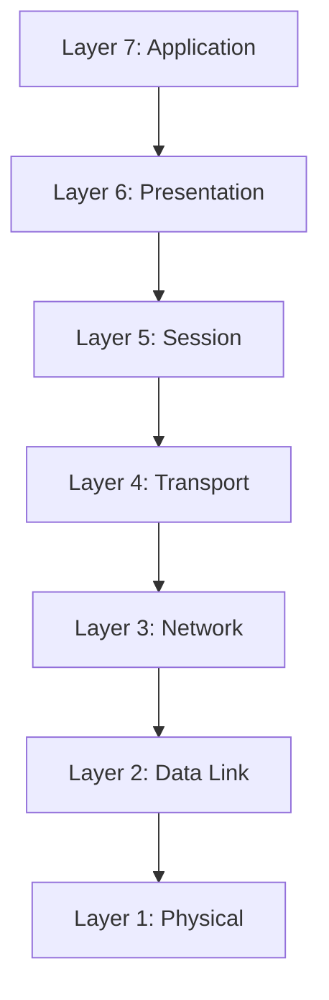
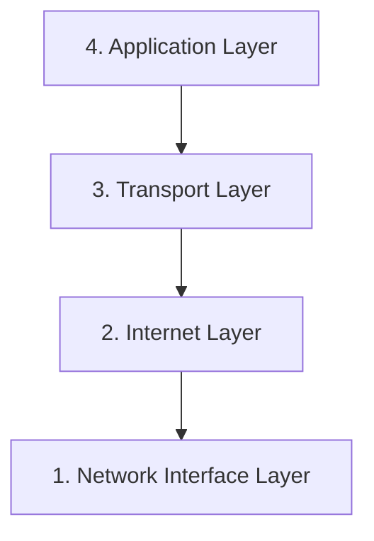
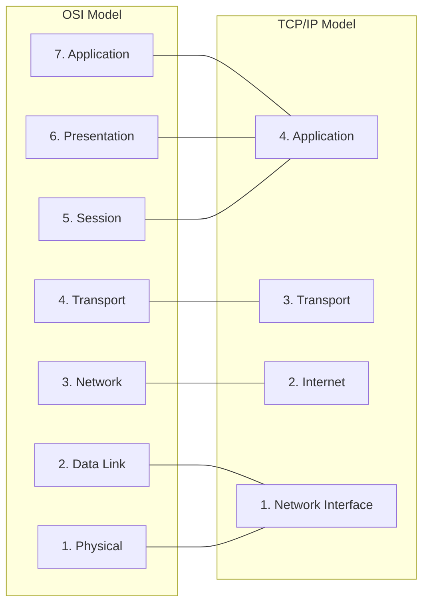
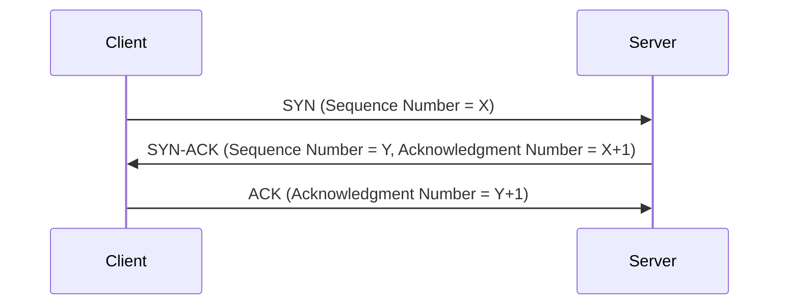
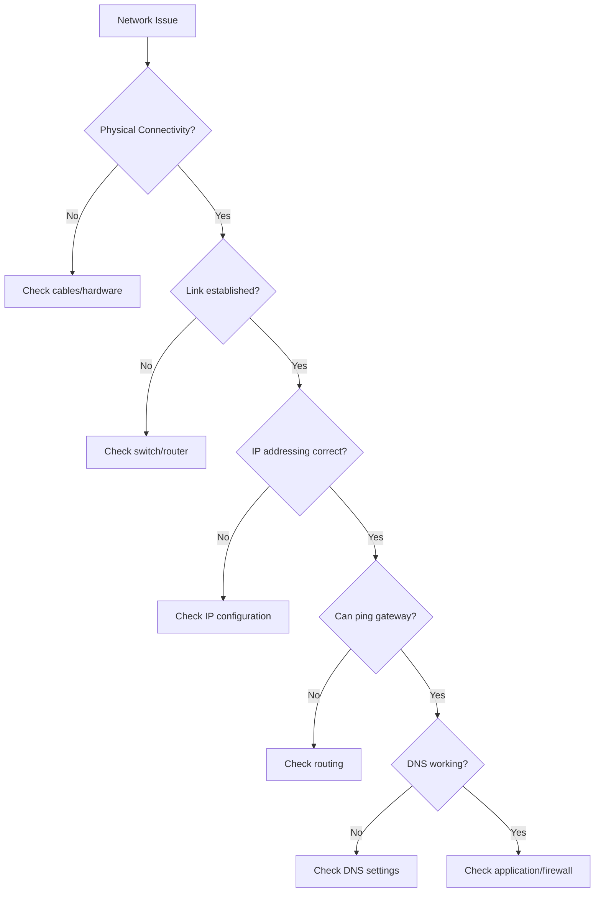

# Network Standards

## Introduction

Network standards are agreed-upon rules and specifications that allow different devices and systems to communicate with each other effectively. Think of them as the "language rules" that ensure all networking equipment can understand each other, regardless of who manufactured them. Without these standards, we would have isolated islands of technology that couldn't work together.

In this lesson, we'll explore the most important network standards, why they matter, and how they work together to create the connected world we rely on every day.

## Why Network Standards Matter

Before diving into specific standards, let's understand why they're so crucial:

1. **Interoperability**: Standards ensure devices from different manufacturers can work together.
2. **Consistency**: They provide a reliable framework for network development and troubleshooting.
3. **Scalability**: Standards-based networks can grow more easily as technologies evolve.
4. **Security**: Many standards include security protocols to protect data.

## Key Network Standardization Organizations

Several organizations develop and maintain network standards:

- **IEEE (Institute of Electrical and Electronics Engineers)**: Responsible for Ethernet (802.3) and Wi-Fi (802.11) standards
- **IETF (Internet Engineering Task Force)**: Develops Internet protocols like TCP/IP
- **ISO (International Organization for Standardization)**: Created the OSI model
- **ITU (International Telecommunication Union)**: Focuses on telecommunications standards
- **W3C (World Wide Web Consortium)**: Develops web standards

## The OSI Reference Model

The Open Systems Interconnection (OSI) model is a conceptual framework that standardizes network functions into seven distinct layers.



### Layer Breakdown:

1. **Physical Layer**: Concerned with transmitting raw bits over a physical medium.
   - Examples: Ethernet cables, fiber optics, wireless signals
   - Units: Bits

2. **Data Link Layer**: Provides node-to-node data transfer and error detection/correction.
   - Examples: Ethernet, Wi-Fi, PPP
   - Units: Frames

3. **Network Layer**: Handles packet routing through multiple nodes.
   - Examples: IP, ICMP
   - Units: Packets

4. **Transport Layer**: Provides end-to-end communication and reliability.
   - Examples: TCP, UDP
   - Units: Segments (TCP) or Datagrams (UDP)

5. **Session Layer**: Establishes, manages, and terminates connections.
   - Examples: NetBIOS, RPC
   - Units: Data

6. **Presentation Layer**: Translates data between application and network formats.
   - Examples: SSL/TLS, JPEG, ASCII
   - Units: Data

7. **Application Layer**: Interfaces directly with applications and users.
   - Examples: HTTP, FTP, SMTP
   - Units: Data

## The TCP/IP Model

While the OSI model is excellent for understanding networks conceptually, most real-world networks use the TCP/IP model (also called the Internet Protocol Suite).



### TCP/IP Layer Breakdown:

1. **Network Interface Layer**: Combines OSI's Physical and Data Link layers.
   - Examples: Ethernet, Wi-Fi, PPP

2. **Internet Layer**: Equivalent to OSI's Network layer.
   - Examples: IP, ICMP, ARP

3. **Transport Layer**: Equivalent to OSI's Transport layer.
   - Examples: TCP, UDP

4. **Application Layer**: Combines OSI's Session, Presentation, and Application layers.
   - Examples: HTTP, FTP, SMTP, DNS

### Comparing OSI and TCP/IP Models



## Ethernet Standards (IEEE 802.3)

Ethernet is the most common standard for local area networks (LANs). Over time, it has evolved to support faster speeds and different media types.

| Standard | Speed | Common Name | Typical Cable |
|----------|-------|-------------|--------------|
| 802.3i   | 10 Mbps | 10BASE-T | Cat3 or higher |
| 802.3u   | 100 Mbps | Fast Ethernet | Cat5 or higher |
| 802.3ab  | 1 Gbps | Gigabit Ethernet | Cat5e or higher |
| 802.3an  | 10 Gbps | 10 Gigabit Ethernet | Cat6a or higher |
| 802.3by  | 25 Gbps | 25 Gigabit Ethernet | Cat8 or fiber |
| 802.3ba  | 40/100 Gbps | 40/100 Gigabit Ethernet | Fiber optic |

### Ethernet Frame Structure

An Ethernet frame contains several fields that help in the reliable delivery of data:

```
+----------------+----------------+----------------+----------------+----------------+----------------+
| Preamble       | Destination    | Source         | Type/Length    | Data           | Checksum      |
| (8 bytes)      | MAC Address    | MAC Address    | (2 bytes)      | (46-1500       | (4 bytes)     |
|                | (6 bytes)      | (6 bytes)      |                | bytes)         |               |
+----------------+----------------+----------------+----------------+----------------+----------------+
```

## Wireless Standards (IEEE 802.11)

Wireless networking (Wi-Fi) standards have evolved significantly to provide faster speeds and better coverage.

| Standard | Max Speed | Frequency Band | Common Name |
|----------|-----------|----------------|------------|
| 802.11a  | 54 Mbps   | 5 GHz          | Wi-Fi 2    |
| 802.11b  | 11 Mbps   | 2.4 GHz        | Wi-Fi 1    |
| 802.11g  | 54 Mbps   | 2.4 GHz        | Wi-Fi 3    |
| 802.11n  | 600 Mbps  | 2.4/5 GHz      | Wi-Fi 4    |
| 802.11ac | 3.46 Gbps | 5 GHz          | Wi-Fi 5    |
| 802.11ax | 9.6 Gbps  | 2.4/5/6 GHz    | Wi-Fi 6    |
| 802.11be | 46 Gbps   | 2.4/5/6 GHz    | Wi-Fi 7    |

## Key Internet Protocols

### TCP (Transmission Control Protocol)

TCP is a connection-oriented protocol that ensures reliable, ordered delivery of data packets.

Key features:
- Connection establishment via three-way handshake
- Guaranteed delivery with acknowledgments
- Flow control and congestion management
- Ordered packet delivery
- Error detection and correction

#### Three-Way Handshake Example:



### UDP (User Datagram Protocol)

UDP is a connectionless protocol that prioritizes speed over reliability.

Key features:
- No connection establishment
- No guaranteed delivery
- No packet ordering
- Minimal header overhead
- Faster than TCP

### HTTP and HTTPS

HTTP (Hypertext Transfer Protocol) and its secure version HTTPS are application layer protocols used for transmitting web pages.

```javascript
// Simple Node.js example of an HTTP server
const http = require('http');

const server = http.createServer((req, res) => {
  res.statusCode = 200;
  res.setHeader('Content-Type', 'text/plain');
  res.end('Hello World
');
});

server.listen(3000, '127.0.0.1', () => {
  console.log('Server running at http://127.0.0.1:3000/');
});
```

Output:
```
Server running at http://127.0.0.1:3000/
```

When accessed in a browser, this server will display "Hello World".

### DNS (Domain Name System)

DNS translates human-readable domain names into IP addresses computers can understand.

```javascript
// Node.js example of DNS lookup
const dns = require('dns');

dns.lookup('example.com', (err, address, family) => {
  console.log(`Address: ${address}`);
  console.log(`IP version: IPv${family}`);
});
```

Example output:
```
Address: 93.184.216.34
IP version: IPv4
```

## Real-World Applications

### Case Study: How a Web Page Loads

When you type a URL into your browser, several network standards work together:

1. Your browser uses **DNS** to translate the domain name to an IP address.
2. The browser establishes a **TCP** connection with the server.
3. If using HTTPS, a **TLS** handshake occurs to establish encryption.
4. The browser sends an **HTTP** request for the webpage.
5. The server responds with HTML, CSS, and JavaScript files.
6. Your browser renders the page.

All of this happens in seconds because of standardized protocols!

### Troubleshooting Network Issues

Network standards also provide a framework for troubleshooting:



## Summary

Network standards are the foundation of modern communication systems. They ensure that devices from different manufacturers can work together seamlessly. Key points to remember:

- The OSI and TCP/IP models provide frameworks for understanding network communications
- Ethernet (IEEE 802.3) is the dominant standard for wired networks
- Wi-Fi (IEEE 802.11) standards govern wireless communications
- Internet protocols like TCP, UDP, HTTP, and DNS enable specific network functions
- Standards evolve over time to support new requirements and technologies

## Practice Exercises

1. **Network Layer Identification**: For each of the following technologies, identify which OSI layer it belongs to:
   - Bluetooth
   - Router
   - HTTPS
   - Fiber optic cable
   - MAC address

2. **Protocol Matching**: Match each protocol with its primary function:
   - TCP
   - DHCP
   - FTP
   - SMTP
   - ARP

3. **Build a Simple HTTP Server**: Using the Node.js example provided earlier, create a simple HTTP server and modify it to serve HTML content instead of plain text.

## Additional Resources

- IETF RFCs (Request for Comments) - The official documents that define Internet protocols
- IEEE Standards Association website for the latest updates on Ethernet and Wi-Fi standards
- Wireshark - A network protocol analyzer for hands-on learning about network packets
- Online network simulators for practicing with different network configurations

By understanding these fundamental network standards, you're building the knowledge base needed to work with any network technology!