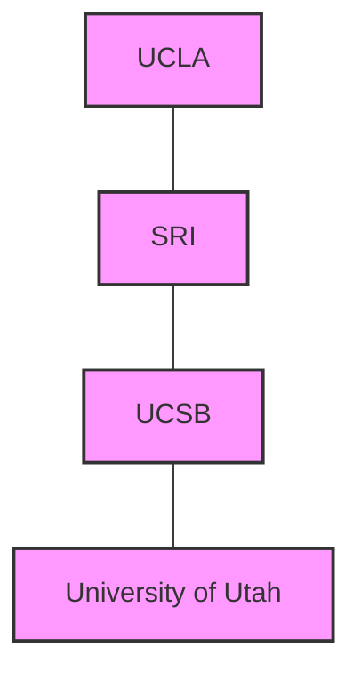
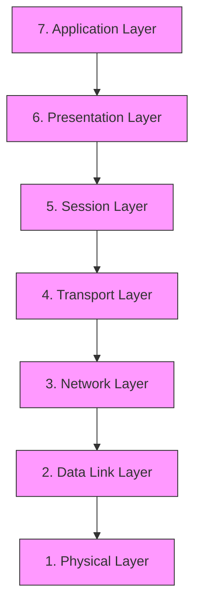
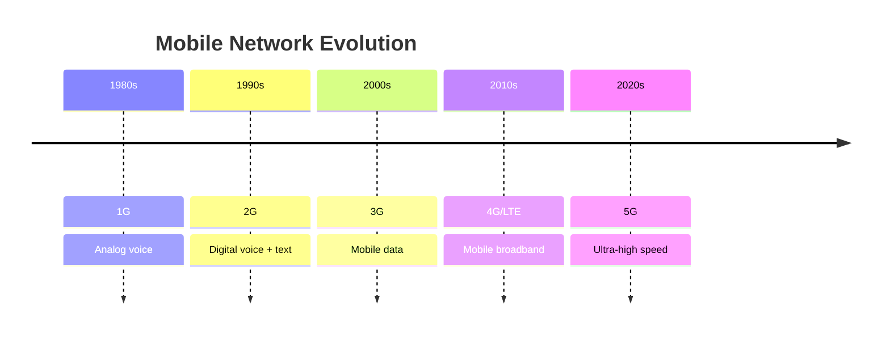

# Networks History

## Introduction

The history of computer networks represents one of the most significant technological revolutions in human history. What began as experimental connections between a few research computers has evolved into a global network connecting billions of devices and reshaping virtually every aspect of modern life. Understanding this evolution helps us appreciate the design decisions behind current network technologies and provides context for the fundamental concepts we use today.

## The Birth of Computer Networks (1960s)

### ARPANET: The Predecessor to the Internet

In the late 1960s, the Advanced Research Projects Agency (ARPA) of the U.S. Department of Defense initiated a project to connect computers at different research institutions. This project, called ARPANET, became the first operational packet-switching network and the foundation for what would eventually become the Internet.



The first ARPANET connection was established on October 29, 1969, between computers at UCLA and the Stanford Research Institute (SRI). By the end of 1969, four computers were connected in the network, forming the initial backbone of ARPANET.

### Key Technological Innovations

Several critical technologies were developed during this early period:

1. **Packet Switching**: Instead of dedicated circuits, data was broken into packets that could travel independently through the network.

2. **Network Control Protocol (NCP)**: The first host-to-host protocol used on ARPANET, allowing computers to communicate.

```
Early packet format (simplified):
+-------------------+-------------------+-------------------+
| Header (8 bits)   | Address (16 bits) | Data (variable)   |
+-------------------+-------------------+-------------------+
```

## The Development of Key Protocols (1970s)

### TCP/IP: The Foundation of the Modern Internet

By the mid-1970s, researchers recognized the need for more robust protocols to support expanding networks. Vint Cerf and Bob Kahn developed the Transmission Control Protocol (TCP) and Internet Protocol (IP), which together formed the TCP/IP suite. This protocol suite became the standard for network communications and remains the foundation of the Internet today.

The key innovation of TCP/IP was its design to connect different networks together—creating a "network of networks." This allowed for interoperability between diverse systems.

### Email: The First Killer App

In 1971, Ray Tomlinson developed the first email program for ARPANET, introducing the "@" symbol to separate the user from their host computer. Email quickly became the first "killer application" of networked computing, driving adoption and demonstrating the practical utility of computer networks.

```
Basic email format (1970s):
From: user@host
To: recipient@host
Subject: Message topic

Message content here.
```

## Network Expansion and Standardization (1980s)

### From ARPANET to Internet

The 1980s saw the transition from ARPANET to the modern Internet, with several key developments:

1. **Domain Name System (DNS)**: Introduced in 1983, DNS provided a hierarchical naming system for computers, replacing the previous flat namespace.

2. **NSFNET**: The National Science Foundation created NSFNET in 1986, connecting five supercomputer centers and eventually replacing ARPANET as the backbone of the Internet.

### OSI Model: Standardizing Network Architecture

The Open Systems Interconnection (OSI) model was developed in the late 1970s and became an international standard in 1984. Although not strictly implemented in practice, the OSI model's seven-layer conceptual framework has become an essential teaching tool for understanding network operations.



## The World Wide Web and Network Revolution (1990s)

### The Birth of the Web

In 1989, Tim Berners-Lee, a researcher at CERN, proposed a hypertext system that would become the World Wide Web. By 1991, he had created:

1. **HTML**: HyperText Markup Language for creating web pages
2. **HTTP**: HyperText Transfer Protocol for transmitting web content
3. **URI/URL**: Uniform Resource Identifiers/Locators for addressing resources

The first web browser, called WorldWideWeb (later renamed Nexus), allowed users to view and edit web pages.

### Network Commercialization and Explosion

The 1990s saw explosive growth in network usage:

1. **ISPs and Commercial Internet**: The privatization of the Internet backbone in 1995 allowed commercial Internet Service Providers to flourish.

2. **Browser Wars**: Netscape Navigator and later Internet Explorer competed for market dominance, driving rapid innovation in web technologies.

3. **Dot-Com Boom**: Investors poured money into Internet-based businesses, fueling expansion of network infrastructure.

## Broadband and Mobile Networks (2000s-2010s)

### Broadband Revolution

The transition from dial-up to broadband connections dramatically increased network capabilities:

1. **DSL and Cable**: Provided much faster speeds than dial-up connections
2. **Fiber Optic Networks**: Enabled gigabit-speed connections in many areas

### Mobile Network Evolution

Mobile networks evolved rapidly during this period:

1. **2G (1990s)**: Digital cellular networks primarily for voice
2. **3G (2000s)**: Added data capabilities
3. **4G/LTE (2010s)**: True mobile broadband
4. **5G (2019+)**: Ultra-high speeds and low latency



## Modern Networks and Future Trends (2020s and Beyond)

### Cloud Computing and Virtualization

Modern networks are increasingly defined by virtualization and cloud computing:

1. **Software-Defined Networking (SDN)**: Separates network control from forwarding functions
2. **Network Function Virtualization (NFV)**: Replaces dedicated network appliances with software
3. **Cloud-Native Networks**: Networks designed specifically for cloud environments

### Current and Emerging Technologies

Several technologies are shaping the future of networks:

1. **Internet of Things (IoT)**: Billions of connected devices creating new network demands
2. **Edge Computing**: Processing data closer to where it's generated
3. **Quantum Networking**: Potential for secure communications using quantum principles
4. **AI-Driven Networks**: Self-optimizing networks using artificial intelligence

## Real-World Applications and Impact

### How Networks Changed Computing

The evolution of networks has fundamentally transformed computing:

1. **From Isolated to Connected**: Computers evolved from standalone devices to nodes in a global network
2. **From Centralized to Distributed**: Computing moved from centralized mainframes to distributed systems
3. **From Stationary to Mobile**: Networks enabled truly mobile computing experiences

### Case Study: The COVID-19 Pandemic Response

The global response to the COVID-19 pandemic in 2020 highlighted the critical role of networks:

1. **Remote Work**: Networks enabled millions to work from home
2. **Telemedicine**: Healthcare providers could reach patients virtually
3. **Distance Learning**: Educational institutions moved online
4. **Digital Services**: Everything from grocery delivery to entertainment relied on robust networks

## Summary

The history of computer networks represents an extraordinary journey from simple research connections to a global infrastructure that underpins modern society. This evolution has been marked by key innovations:

- Packet switching and early protocols that established fundamental networking principles
- TCP/IP and standardization that created an interoperable "network of networks"
- The World Wide Web that made networks accessible and useful to everyone
- Broadband and mobile technologies that extended networks everywhere
- Modern technologies that continue to push the boundaries of what networks can do

Understanding this history provides crucial context for learning network fundamentals and appreciating why modern networks are designed the way they are.

## Additional Resources

For further exploration of network history, consider these resources:

- "Where Wizards Stay Up Late: The Origins of the Internet" by Katie Hafner and Matthew Lyon
- "Inventing the Internet" by Janet Abbate
- Internet History Podcast (online)
- Computer History Museum's Network Exhibition (online)

## Exercises

1. **Timeline Exercise**: Create a detailed timeline of major networking milestones from 1960 to the present.

2. **Protocol Exploration**: Research the development of a specific protocol (e.g., HTTP, DNS, SMTP) and document how it evolved over time.

3. **Comparative Analysis**: Compare the original ARPANET with a modern network, discussing similarities and differences in design principles.

4. **Future Projection**: Based on historical trends, project what networks might look like in 10-20 years and explain your reasoning.