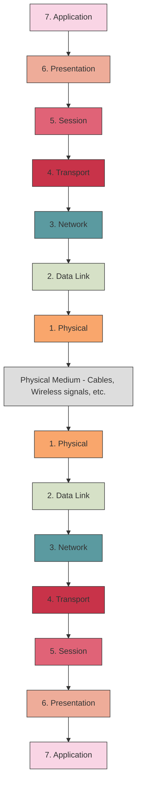
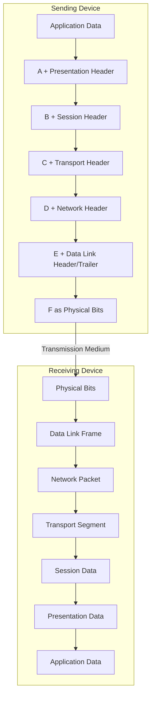

# Networks OSI Model

## Introduction

The Open Systems Interconnection (OSI) model is a conceptual framework that standardizes the functions of a telecommunication or computing system into seven distinct layers. Developed by the International Organization for Standardization (ISO) in 1984, the OSI model helps network professionals understand how data moves through a network and facilitates communication between different systems regardless of their underlying architecture.

Think of the OSI model as a universal language for computer networking. Just as humans use language to communicate regardless of their background, the OSI model provides a common reference for network technologies to interact with each other.

## The Seven Layers of the OSI Model

The OSI model divides network communication into seven layers. Each layer serves a specific function and communicates with the layers directly above and below it. Data travels down the seven layers on the sending device and then up the seven layers on the receiving device.



Let's examine each layer from bottom to top:

### Layer 1: Physical Layer

The Physical layer deals with the physical connection between devices. It defines the hardware medium for the network.

**Key Functions:**
- Transmission and reception of raw bit streams over a physical medium
- Definition of cables, cards, and physical aspects
- Hardware specifications, encoding, and signaling
- Data rates and synchronization

**Real-world Examples:**
- Ethernet cables
- Fiber optic cables
- Wi-Fi radio waves
- USB connections
- Hubs and repeaters

**Code Example (Simplified representation of bit transmission):**

```python
# Simplified representation of how bits might be represented at the physical layer
def convert_to_electrical_signals(digital_data):
    electrical_signals = []
    for bit in digital_data:
        if bit == 1:
            electrical_signals.append("+5V")  # High voltage for bit 1
        else:
            electrical_signals.append("0V")   # Low voltage for bit 0
    return electrical_signals

# Example usage
data = [1, 0, 1, 1, 0, 0, 1]
signals = convert_to_electrical_signals(data)
print(f"Digital data: {data}")
print(f"Electrical signals: {signals}")
```

Output:
```
Digital data: [1, 0, 1, 1, 0, 0, 1]
Electrical signals: ['+5V', '0V', '+5V', '+5V', '0V', '0V', '+5V']
```

### Layer 2: Data Link Layer

The Data Link layer provides node-to-node data transfer between two directly connected nodes. It detects and possibly corrects errors that may occur in the Physical layer.

**Key Functions:**
- Framing (dividing data into frames)
- Physical addressing (MAC addresses)
- Error detection and handling
- Flow control
- Access to media

**Sub-layers:**
1. **Media Access Control (MAC)** - Controls how devices in a network gain access to data and permission to transmit it
2. **Logical Link Control (LLC)** - Identifies network protocols, performs error checking, and synchronizes frames

**Real-world Examples:**
- Ethernet switches
- Wi-Fi access points
- Network Interface Cards (NICs)
- Bridges

**Code Example (MAC address handling):**

```python
# Simple representation of frame creation at the data link layer
def create_ethernet_frame(destination_mac, source_mac, data, ethertype=0x0800):  # 0x0800 is for IPv4
    # Create a frame with header and data
    frame = {
        "destination_mac": destination_mac,
        "source_mac": source_mac,
        "ethertype": ethertype,
        "data": data,
        "checksum": calculate_crc(data)  # CRC for error detection
    }
    return frame

def calculate_crc(data):
    # Simplified CRC calculation for demonstration
    crc = 0
    for byte in data:
        crc ^= byte
    return crc

# Example usage
source = "00:1A:2B:3C:4D:5E"
destination = "5F:6E:7D:8C:9B:0A"
data = [0x68, 0x65, 0x6C, 0x6C, 0x6F]  # "hello" in hex
frame = create_ethernet_frame(destination, source, data)
print(f"Ethernet Frame: {frame}")
```

Output:
```
Ethernet Frame: {'destination_mac': '5F:6E:7D:8C:9B:0A', 'source_mac': '00:1A:2B:3C:4D:5E', 'ethertype': 2048, 'data': [104, 101, 108, 108, 111], 'checksum': 12}
```

### Layer 3: Network Layer

The Network layer provides the functional and procedural means of transferring variable length data sequences from a source to a destination via one or more networks while maintaining the quality of service requested by the Transport layer.

**Key Functions:**
- Logical addressing (IP addresses)
- Routing (determining the best path)
- Path determination
- Packet switching
- Subnet traffic control

**Real-world Examples:**
- IP (Internet Protocol)
- Routers
- Layer 3 switches
- ICMP (Internet Control Message Protocol)

**Code Example (IP addressing and routing):**

```python
# Simplified IP routing example
def route_packet(packet, routing_table):
    destination_ip = packet["destination_ip"]
    # Find the best matching route
    best_route = None
    longest_prefix = 0
    
    for route in routing_table:
        network = route["network"]
        mask = route["mask"]
        # Check if the destination matches this route (simplified)
        if is_matching_route(destination_ip, network, mask) and mask > longest_prefix:
            best_route = route
            longest_prefix = mask
    
    if best_route:
        return best_route["next_hop"]
    else:
        return "0.0.0.0"  # Default route or none found

def is_matching_route(ip, network, mask):
    # Simplified check if an IP is in a network (in a real scenario, we'd use bitwise operations)
    return ip.startswith(network[:mask//8])

# Example
packet = {
    "source_ip": "192.168.1.5",
    "destination_ip": "10.0.0.25",
    "data": "Hello, network layer!"
}

routing_table = [
    {"network": "10.0.0.0", "mask": 8, "next_hop": "192.168.1.254"},
    {"network": "172.16.0.0", "mask": 16, "next_hop": "192.168.1.253"},
    {"network": "0.0.0.0", "mask": 0, "next_hop": "192.168.1.1"}  # Default route
]

next_hop = route_packet(packet, routing_table)
print(f"Packet to {packet['destination_ip']} will be forwarded to {next_hop}")
```

Output:
```
Packet to 10.0.0.25 will be forwarded to 192.168.1.254
```

### Layer 4: Transport Layer

The Transport layer provides transparent transfer of data between end systems, ensuring complete data transfer.

**Key Functions:**
- End-to-end connections
- Reliability (error recovery, retransmissions)
- Flow control
- Multiplexing
- Segmentation and reassembly

**Real-world Examples:**
- TCP (Transmission Control Protocol)
- UDP (User Datagram Protocol)
- Port numbers

**Code Example (TCP vs UDP):**

```python
# Simplified examples of TCP and UDP behavior

# TCP-like connection - reliable, connection-oriented
def tcp_send(data, destination, port):
    print(f"Establishing connection to {destination}:{port}...")
    segments = segment_data(data)
    
    for i, segment in enumerate(segments):
        print(f"Sending segment {i+1}/{len(segments)}")
        while True:
            if simulate_send(segment, destination, port):
                print(f"Received ACK for segment {i+1}")
                break
            else:
                print(f"Timeout - retransmitting segment {i+1}")
    
    print("Closing connection...")
    return True

# UDP-like transmission - unreliable, connectionless
def udp_send(data, destination, port):
    segments = segment_data(data)
    
    for i, segment in enumerate(segments):
        print(f"Sending datagram {i+1}/{len(segments)}")
        simulate_send(segment, destination, port)
        # No waiting for acknowledgment or retransmission
    
    return True

def segment_data(data, segment_size=4):
    return [data[i:i+segment_size] for i in range(0, len(data), segment_size)]

def simulate_send(segment, destination, port, reliability=0.8):
    import random
    # Simulate packet loss with 80% reliability
    successful = random.random() < reliability
    if successful:
        print(f"  → Segment delivered: {segment}")
    else:
        print(f"  → Segment lost: {segment}")
    return successful

# Example
print("TCP TRANSMISSION EXAMPLE:")
tcp_send("Hello, Transport Layer!", "192.168.1.10", 80)

print("
UDP TRANSMISSION EXAMPLE:")
udp_send("Hello, Transport Layer!", "192.168.1.10", 80)
```

Output (will vary due to random simulation):
```
TCP TRANSMISSION EXAMPLE:
Establishing connection to 192.168.1.10:80...
Sending segment 1/6
  → Segment delivered: Hell
Received ACK for segment 1
Sending segment 2/6
  → Segment lost: o, T
Timeout - retransmitting segment 2
  → Segment delivered: o, T
Received ACK for segment 2
...more segments...
Closing connection...

UDP TRANSMISSION EXAMPLE:
Sending datagram 1/6
  → Segment delivered: Hell
Sending datagram 2/6
  → Segment lost: o, T
...more datagrams...
```

### Layer 5: Session Layer

The Session layer establishes, manages, and terminates connections between applications.

**Key Functions:**
- Session establishment, maintenance, and termination
- Session checkpointing and recovery
- Authentication and authorization
- Dialog control (defining whose turn it is to transmit)

**Real-world Examples:**
- NetBIOS
- RPC (Remote Procedure Call)
- SQL sessions
- SSH sessions

**Code Example (Simplified session handling):**

```python
# Simplified session handling example
class SessionManager:
    def __init__(self):
        self.active_sessions = {}
        self.session_counter = 0
    
    def create_session(self, user_id, application):
        # Create a new session
        self.session_counter += 1
        session_id = f"SES{self.session_counter}"
        
        session = {
            "session_id": session_id,
            "user_id": user_id,
            "application": application,
            "status": "active",
            "checkpoints": [],
            "start_time": "2023-01-01 12:00:00"  # In a real app, use actual datetime
        }
        
        self.active_sessions[session_id] = session
        print(f"Session {session_id} created for user {user_id}")
        return session_id
    
    def checkpoint_session(self, session_id, state):
        if session_id in self.active_sessions:
            self.active_sessions[session_id]["checkpoints"].append(state)
            print(f"Session {session_id} checkpointed at state: {state}")
            return True
        return False
    
    def terminate_session(self, session_id):
        if session_id in self.active_sessions:
            self.active_sessions[session_id]["status"] = "terminated"
            print(f"Session {session_id} terminated")
            return True
        return False

# Example usage
session_mgr = SessionManager()
session1 = session_mgr.create_session("user123", "FileTransferApp")
session_mgr.checkpoint_session(session1, "file1_transferred")
session_mgr.checkpoint_session(session1, "file2_transferred")
session_mgr.terminate_session(session1)
```

Output:
```
Session SES1 created for user user123
Session SES1 checkpointed at state: file1_transferred
Session SES1 checkpointed at state: file2_transferred
Session SES1 terminated
```

### Layer 6: Presentation Layer

The Presentation layer translates data between the application format and the network format.

**Key Functions:**
- Data translation and formatting
- Encryption/Decryption
- Compression/Decompression
- Character set conversion (ASCII, Unicode)

**Real-world Examples:**
- JPEG, GIF, PNG for images
- MIDI, MPEG for multimedia
- SSL/TLS for encryption
- EBCDIC to ASCII conversion

**Code Example (Data encryption and encoding):**

```python
# Presentation layer example: Encryption and encoding
import base64

def encrypt(data, key):
    # Simple XOR encryption (for demonstration only - not secure!)
    encrypted = []
    for i, char in enumerate(data):
        key_char = key[i % len(key)]
        encrypted_char = chr(ord(char) ^ ord(key_char))
        encrypted.append(encrypted_char)
    return ''.join(encrypted)

def compress(data):
    # Extremely simplified "compression" for demonstration
    # Just counting repeated characters (run-length encoding)
    if not data:
        return ""
    
    compressed = []
    count = 1
    current = data[0]
    
    for i in range(1, len(data)):
        if data[i] == current:
            count += 1
        else:
            compressed.append(f"{count}{current}")
            count = 1
            current = data[i]
    
    compressed.append(f"{count}{current}")
    return ''.join(compressed)

def presentation_layer_send(data, encryption_key=None):
    # Step 1: Format or translate data (in this case, we'll just use a simple encoding)
    print(f"Original data: {data}")
    
    # Step 2: Optional encryption
    if encryption_key:
        data = encrypt(data, encryption_key)
        print(f"Encrypted data: {data}")
    
    # Step 3: Compression
    compressed = compress(data)
    print(f"Compressed data: {compressed}")
    
    # Step 4: Encode for transmission
    encoded = base64.b64encode(compressed.encode()).decode()
    print(f"Encoded data: {encoded}")
    
    return encoded

# Example usage
message = "AAABBBCCCDDAABBBCCC"
encryption_key = "KEY123"
processed_data = presentation_layer_send(message, encryption_key)
```

Output:
```
Original data: AAABBBCCCDDAABBBCCC
Encrypted data: +-,*)(/^_^]+-,*)(
Compressed data: 1+1-1,1*1)1(1/1^1_1^1]1+1-1,1*1)1(
Encoded data: MSsxLTEsMSoxKTEoMS8xXjFfMV4xXTErMS0xLDEqMSkxKA==
```

### Layer 7: Application Layer

The Application layer is the closest to the end user. It interacts with software applications to provide user services.

**Key Functions:**
- Resource sharing and device redirection
- Remote file access
- Network virtual terminals
- Email and messaging
- Directory services
- Application services

**Real-world Examples:**
- HTTP/HTTPS (web browsing)
- FTP (file transfer)
- SMTP, POP3, IMAP (email)
- DNS (domain name resolution)
- SSH (secure shell)

**Code Example (HTTP request/response):**

```python
# Application layer example: Simple HTTP client
import socket

def http_get_request(host, path="/", port=80):
    # Prepare HTTP request
    request = f"GET {path} HTTP/1.1\r
"
    request += f"Host: {host}\r
"
    request += "User-Agent: SimplePythonClient/1.0\r
"
    request += "Connection: close\r
"
    request += "\r
"
    
    print(f"HTTP Request:
{request}")
    
    # This is a simplified example - in a real application, you would:
    # 1. Create a proper socket connection
    # 2. Send the request
    # 3. Receive and parse the response
    # Instead, we'll simulate the response:
    
    simulated_response = "HTTP/1.1 200 OK\r
"
    simulated_response += "Date: Wed, 01 Jan 2023 12:00:00 GMT\r
"
    simulated_response += "Server: SimpleServer/1.0\r
"
    simulated_response += "Content-Type: text/html\r
"
    simulated_response += "Content-Length: 131\r
"
    simulated_response += "\r
"
    simulated_response += "<html><head><title>Example Page</title></head>"
    simulated_response += "<body><h1>Hello from the Application Layer!</h1></body></html>"
    
    print(f"
HTTP Response:
{simulated_response}")
    
    return simulated_response

# Example usage
response = http_get_request("www.example.com", "/index.html")
```

Output:
```
HTTP Request:
GET /index.html HTTP/1.1
Host: www.example.com
User-Agent: SimplePythonClient/1.0
Connection: close


HTTP Response:
HTTP/1.1 200 OK
Date: Wed, 01 Jan 2023 12:00:00 GMT
Server: SimpleServer/1.0
Content-Type: text/html
Content-Length: 131

<html><head><title>Example Page</title></head><body><h1>Hello from the Application Layer!</h1></body></html>
```

## Data Encapsulation and Decapsulation

As data travels down the OSI layers from the application to the physical layer, each layer adds its own header information (and sometimes a trailer) to the data. This process is called **encapsulation**.

When the data reaches the destination, it travels up through the layers, with each layer removing the header information added by its counterpart on the sender's side. This process is called **decapsulation**.



**Data Unit Names at Each Layer:**
- **Layer 7-5**: Data
- **Layer 4**: Segments (TCP) or Datagrams (UDP)
- **Layer 3**: Packets
- **Layer 2**: Frames
- **Layer 1**: Bits

## Real-world Application Example: Web Browsing

Let's walk through the OSI model layers during a web browsing session:

1. **Application Layer (7)**:
   - Your browser generates an HTTP GET request for a web page

2. **Presentation Layer (6)**:
   - Data might be compressed or encrypted (e.g., HTTPS/TLS)
   - Character encoding (like UTF-8) is handled

3. **Session Layer (5)**:
   - Establishes and maintains a session with the web server
   - Manages the communication

4. **Transport Layer (4)**:
   - TCP establishes a connection using a three-way handshake
   - Divides HTTP messages into segments
   - Assigns port numbers (e.g., port 80 for HTTP, port 443 for HTTPS)

5. **Network Layer (3)**:
   - IP adds source and destination addresses to each packet
   - Determines the route to the destination server
   - Handles any required routing between networks

6. **Data Link Layer (2)**:
   - Formats data into frames
   - Adds MAC addresses for the next hop device
   - Performs error checking

7. **Physical Layer (1)**:
   - Converts data into electrical, radio, or optical signals
   - Transmits the bits across the physical medium (Ethernet cable, fiber, Wi-Fi, etc.)

At the receiving web server, the process happens in reverse order, with each layer performing its corresponding functions until the HTTP request reaches the web server application.

## Advantages of the OSI Model

1. **Standardization**: Provides a common language for different vendors and technologies to interoperate
2. **Modular Design**: Simplifies troubleshooting and development by isolating functions
3. **Interoperability**: Allows different systems to communicate regardless of their internal architecture
4. **Ease of Understanding**: Breaks down complex networks into manageable components
5. **Clear Interfaces**: Defines clear interfaces between network functions

## TCP/IP Model vs. OSI Model

While the OSI model has 7 layers, the TCP/IP model (used in practical implementations of the Internet) has only 4 layers. Here's how they compare:

| TCP/IP Model Layer | Corresponding OSI Model Layers |
|--------------------|--------------------------------|
| Application | Application (7), Presentation (6), Session (5) |
| Transport | Transport (4) |
| Internet | Network (3) |
| Network Interface | Data Link (2), Physical (1) |

The TCP/IP model is more commonly used in practical networking, but the OSI model offers a more detailed conceptual framework that's valuable for understanding and troubleshooting network issues.

## Troubleshooting Using the OSI Model

One of the practical applications of the OSI model is network troubleshooting. Network engineers often start troubleshooting from the bottom layer (Physical) and work their way up. This approach is known as "bottom-up troubleshooting."

**Example Troubleshooting Steps:**

1. **Physical Layer**: Check if cables are connected, power is on, lights are blinking
2. **Data Link Layer**: Verify MAC addressing, check switch port status
3. **Network Layer**: Test IP connectivity (ping), verify routing tables
4. **Transport Layer**: Check port availability, verify TCP connections
5. **Session Layer**: Ensure session establishment works
6. **Presentation Layer**: Verify encryption/decryption and data formatting
7. **Application Layer**: Test the application functionality

## Summary

The OSI model provides a conceptual framework for understanding how networks function by dividing the communication process into seven distinct layers. Each layer has a specific role and interfaces with the layers above and below it. Despite being more of a theoretical model than a practical implementation (compared to TCP/IP), the OSI model offers valuable insights into network architecture and is an essential concept for anyone studying networking.

Understanding the OSI model helps with:
- Troubleshooting network issues
- Designing network systems
- Standardizing network components
- Understanding data flow in a network
- Separating complex tasks into manageable components

## Exercises

1. **Basic Identification**: For each of the following technologies, identify which OSI layer(s) they operate on:
   - Ethernet
   - IP
   - TCP
   - HTTP
   - Fiber optic cable
   - SSL/TLS

2. **Troubleshooting Scenario**: A user can't access a website. Walk through the troubleshooting steps you would take, organizing your approach by OSI layer.

3. **Encapsulation Exercise**: Draw a diagram showing how data is encapsulated as it moves down the OSI model during a simple file transfer.

4. **Protocol Analysis**: Choose a common network protocol and analyze how it maps to the different OSI layers.

5. **Conceptual Question**: Why is the layered model useful in network architecture? What advantages does it provide compared to a non-layered approach?

## Additional Resources

- Books:
  - "Computer Networks" by Andrew S. Tanenbaum
  - "TCP/IP Illustrated" by W. Richard Stevens

- Online Courses:
  - Cisco Networking Academy's CCNA courses
  - CompTIA Network+ certification materials

- Interactive Learning:
  - Packet Tracer simulations
  - Wireshark packet analyzer for practical protocol analysis

- Online Documentation:
  - RFC documents that define Internet protocols
  - IEEE standards for network technologies