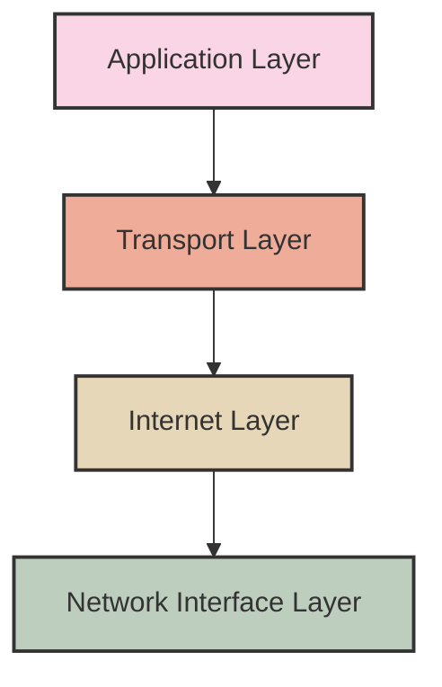
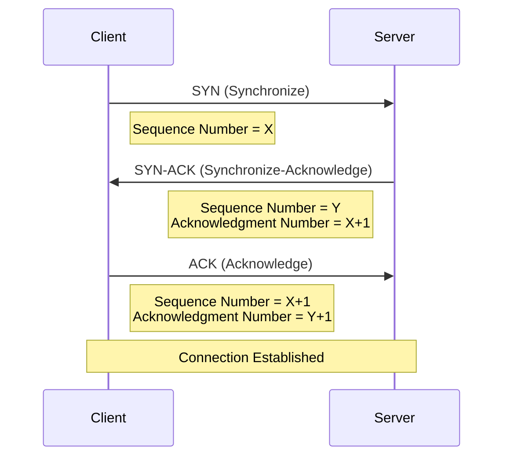
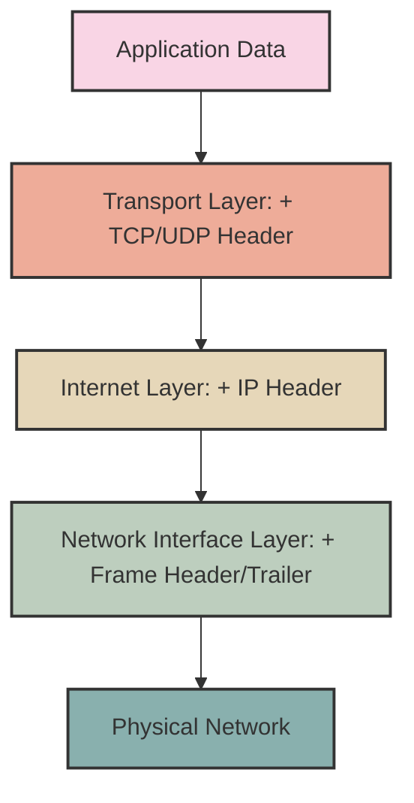

# Networks TCP/IP Model

## Introduction

The TCP/IP Model (Transmission Control Protocol/Internet Protocol) is the fundamental framework that enables devices to communicate over the internet and other networks. Unlike the theoretical OSI model, TCP/IP is a practical, implemented architecture that powers virtually all modern network communication. When you browse a website, send an email, or stream a video, you're using applications built on the TCP/IP model.

This guide will introduce you to the TCP/IP model's architecture, explain each layer's function, and demonstrate how they work together to enable the seamless internet experience we rely on every day.

## Understanding the TCP/IP Model

The TCP/IP model consists of four distinct layers, each with specific responsibilities in the network communication process:



Let's explore each layer in detail, from the bottom up:

## 1. Network Interface Layer (Link Layer)

This is the lowest layer in the TCP/IP model, responsible for the physical transmission of data between devices on the same network.

### Key Functions:

- Defines how data is physically sent through the network
- Handles the hardware addressing (MAC addresses)
- Manages the physical connections and electrical signals
- Packages data into frames for transmission

### Common Protocols:

- Ethernet
- Wi-Fi (IEEE 802.11)
- PPP (Point-to-Point Protocol)

### Example: MAC Address Resolution

When your computer needs to send data to another device on your local network, it uses the Address Resolution Protocol (ARP) to find the physical MAC address that corresponds to an IP address:

```javascript
// Simplified pseudocode representation of ARP process
function resolveMAC(ipAddress) {
  // Check if the MAC address is in the ARP cache
  let macAddress = ARPCache.lookup(ipAddress);
  
  if (macAddress) {
    return macAddress;
  } else {
    // Broadcast ARP request on the network
    sendARPRequest(ipAddress);
    
    // Wait for response
    macAddress = receiveARPResponse();
    
    // Update the ARP cache
    ARPCache.update(ipAddress, macAddress);
    
    return macAddress;
  }
}
```

## 2. Internet Layer (Network Layer)

This layer handles the movement of packets around the network, determining the best path for data to travel from source to destination.

### Key Functions:

- Logical addressing (IP addresses)
- Routing packets across different networks
- Fragmenting and reassembling packets
- Handling traffic control

### Common Protocols:

- IP (Internet Protocol - IPv4 and IPv6)
- ICMP (Internet Control Message Protocol)
- ARP (Address Resolution Protocol)

### Example: IP Addressing

IP addresses uniquely identify devices on a network. IPv4 addresses consist of four 8-bit numbers separated by dots:

```javascript
// IPv4 Address Structure
const ipv4Example = "192.168.1.1";

// Converting IP to binary
function ipToBinary(ip) {
  return ip.split('.')
    .map(octet => parseInt(octet).toString(2).padStart(8, '0'))
    .join('.');
}

console.log(ipToBinary("192.168.1.1"));
// Output: 11000000.10101000.00000001.00000001
```

IPv6 addresses are longer and use hexadecimal notation to accommodate the growing number of internet-connected devices:

```javascript
// IPv6 Address Example
const ipv6Example = "2001:0db8:85a3:0000:0000:8a2e:0370:7334";

// IPv6 addresses can be shortened by removing leading zeros
const shortendIPv6 = "2001:db8:85a3::8a2e:370:7334";
```

## 3. Transport Layer

The transport layer ensures reliable data transfer between end systems, handling error detection, recovery, and flow control.

### Key Functions:

- End-to-end communication
- Reliability and error checking
- Flow control and congestion management
- Segmenting and reassembling data
- Port addressing for application identification

### Common Protocols:

- TCP (Transmission Control Protocol) - connection-oriented, reliable
- UDP (User Datagram Protocol) - connectionless, less overhead

### Example: TCP Three-Way Handshake

Before data transmission can begin, TCP establishes a connection through a three-way handshake:



### TCP vs. UDP: When to Use Each

```javascript
// Choosing between TCP and UDP
function chooseProtocol(requirements) {
  if (requirements.needsReliability && requirements.canTolerateLatency) {
    return "TCP";  
    // Use for: Web browsing, email, file transfers
  } else if (requirements.speedCritical && requirements.canToleratePacketLoss) {
    return "UDP";  
    // Use for: Live streaming, gaming, VoIP
  } else {
    return evaluateTradeoffs(requirements);
  }
}
```

## 4. Application Layer

The top layer of the TCP/IP model interfaces directly with end-user applications. It combines the functions of the top three layers of the OSI model (Application, Presentation, and Session).

### Key Functions:

- Provides network services to applications
- Handles data representation and encryption
- Manages session establishment and maintenance

### Common Protocols:

- HTTP/HTTPS (Hypertext Transfer Protocol)
- FTP (File Transfer Protocol)
- SMTP (Simple Mail Transfer Protocol)
- DNS (Domain Name System)
- SSH (Secure Shell)

### Example: HTTP Request and Response

When you visit a website, your browser sends an HTTP request to the server:

```javascript
// Example HTTP Request
const httpRequest = `
GET /index.html HTTP/1.1
Host: www.example.com
User-Agent: Mozilla/5.0
Accept: text/html
Connection: keep-alive
`;

// Example HTTP Response
const httpResponse = `
HTTP/1.1 200 OK
Date: Mon, 15 Jun 2023 10:12:45 GMT
Server: Apache/2.4.41
Content-Type: text/html
Content-Length: 1234

<!DOCTYPE html>
<html>
<head>
    <title>Example Website</title>
</head>
<body>
    <h1>Hello, World!</h1>
</body>
</html>
`;
```

## The Data Encapsulation Process

As data travels down through the TCP/IP layers, each layer adds its own header information to the data unit—a process called encapsulation:



At the receiving end, the process reverses (decapsulation) as each layer strips off its respective header before passing the data upward.

## Practical Example: Tracing a Web Request

Let's follow the journey of a web request through the TCP/IP layers:

1. **Application Layer**: Your browser creates an HTTP GET request for `www.example.com/index.html`

2. **Transport Layer**: The request gets a TCP header with source and destination port information (e.g., your random port and destination port 80 for HTTP)

3. **Internet Layer**: The TCP segment receives an IP header with your computer's IP address as the source and the server's IP address as the destination

4. **Network Interface Layer**: The IP packet gets wrapped in an Ethernet frame with MAC addresses and is sent over the physical network

5. **...transmission across the internet...**

6. **Decapsulation Process**: The server unwraps each layer in reverse order to access the original HTTP request

7. **Response**: The server sends back the requested webpage, following the same process in reverse

## Tools for Exploring TCP/IP in Action

### Using Wireshark to Analyze Network Traffic

Wireshark is a powerful network protocol analyzer that lets you see the TCP/IP layers in action:

```bash
# Install Wireshark (Linux)
sudo apt-get install wireshark

# Install Wireshark (macOS with Homebrew)
brew install --cask wireshark
```

### Using traceroute to View Network Path

The `traceroute` command can show you the path your packets take to reach a destination:

```bash
# On Linux/macOS
traceroute www.google.com

# On Windows
tracert www.google.com

# Sample output
# 1  router.local  (192.168.1.1)  2.456 ms
# 2  10.0.0.1  (10.0.0.1)  12.559 ms
# 3  isp-gateway.net  (203.0.113.1)  25.478 ms
# ...
```

## TCP/IP and Network Security

The TCP/IP model presents various security challenges at each layer:

1. **Network Interface Layer**: Susceptible to ARP poisoning and MAC spoofing
2. **Internet Layer**: Vulnerable to IP spoofing and DDoS attacks
3. **Transport Layer**: Prone to TCP SYN floods and session hijacking
4. **Application Layer**: Vulnerable to various attacks like XSS, SQL injection, etc.

### Basic Security Implementation Example

```javascript
// Simple IP filtering pseudocode
function filterIncomingPacket(packet) {
  // Check if the source IP is in our blacklist
  if (blacklist.includes(packet.sourceIP)) {
    return dropPacket(packet);
  }
  
  // Check if this is part of a DDoS attack
  if (isFloodingTraffic(packet.sourceIP)) {
    blacklist.add(packet.sourceIP);
    return dropPacket(packet);
  }
  
  return processPacket(packet);
}
```

## Summary

The TCP/IP model is the backbone of modern networking and internet communication. Its four-layer architecture provides:

1. **Network Interface Layer**: Physical connectivity and framing
2. **Internet Layer**: Logical addressing and routing
3. **Transport Layer**: End-to-end delivery and reliability
4. **Application Layer**: User services and application interfaces

Understanding the TCP/IP model is essential for anyone working with networks, as it provides the foundation for troubleshooting network issues, implementing secure communications, and developing networked applications.

## Exercises

1. Use Wireshark to capture and analyze the packets when you visit a website. Identify the different TCP/IP layers in the captured data.
2. Write a simple client-server program using TCP sockets to demonstrate the three-way handshake.
3. Research and compare how VPNs operate across the different TCP/IP layers.
4. Create a diagram showing how a DNS request flows through the TCP/IP layers.

## Additional Resources

- Books:
  - "Computer Networking: A Top-Down Approach" by Kurose and Ross
  - "TCP/IP Illustrated" by Richard Stevens

- Online Courses:
  - Cisco Networking Academy
  - Coursera's "Computer Networking" courses

- Tools for Practice:
  - Wireshark (packet analysis)
  - Cisco Packet Tracer (network simulation)
  - GNS3 (network emulation platform)

Remember that networking concepts take practice to fully grasp. The best way to learn is by experimenting with real network traffic using the tools mentioned above.