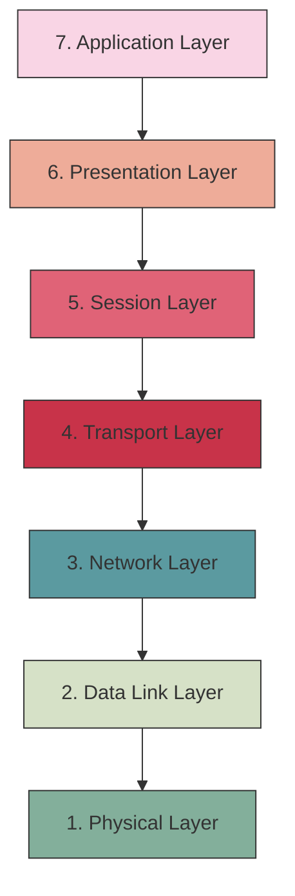
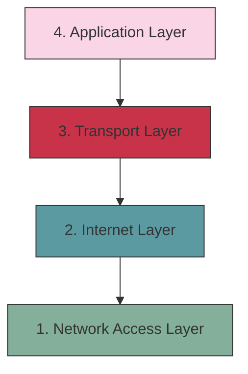
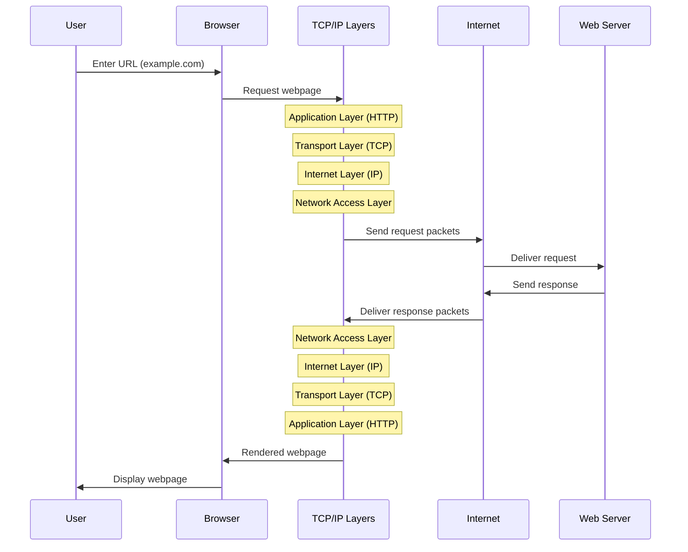
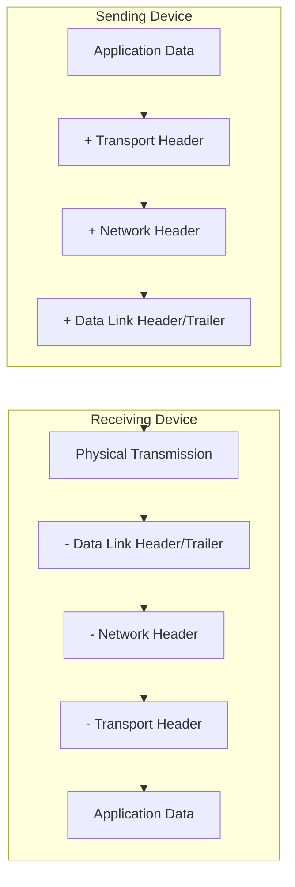

# Networks Layering

## Introduction

Network layering is one of the most fundamental concepts in computer networking. It's the principle that allows our modern internet to function by breaking down complex network communication into manageable, modular layers. Each layer provides specific services to the layers above it while relying on services from the layers below it.

Think of network layering like a postal system: you write a letter (application data), put it in an envelope (transport layer), address it properly (network layer), and hand it to your local mail carrier (link layer) who uses physical infrastructure (physical layer) to deliver it. Each part of this process has its own responsibilities but works seamlessly with the others.

In this guide, we'll explore how network layering works, why it's important, and examine the two most common layering models: the OSI model and the TCP/IP model.

## Why Use a Layered Network Architecture?

Before diving into specific models, let's understand why network engineers use layered architectures:

1. **Modularity**: Changes in one layer don't require changes in other layers
2. **Simplification**: Complex problems are broken down into manageable parts
3. **Standardization**: Clearly defined interfaces between layers
4. **Interoperability**: Different systems can communicate as long as they follow the same protocols
5. **Easier troubleshooting**: Problems can be isolated to specific layers

## The OSI Model: 7 Layers

The Open Systems Interconnection (OSI) model is a conceptual framework that standardizes network communication functions into seven distinct layers.



Let's explore each layer in detail:

### 1. Physical Layer

This layer deals with the physical connection between devices and the transmission of raw bitstreams.

**Responsibilities:**
- Transmission and reception of raw bit streams over physical medium
- Definition of cables, connectors, voltage levels, and bit rates
- Hardware specifications

**Examples:** Ethernet cables, fiber optic cables, wireless signals, hubs, repeaters

### 2. Data Link Layer

This layer provides node-to-node data transfer and handles physical addressing and error detection.

**Responsibilities:**
- Framing data packets
- Physical addressing (MAC addresses)
- Error detection and handling
- Flow control

**Examples:** Ethernet, Wi-Fi (802.11), PPP

**Code Example: MAC Address Format**

```javascript
// A typical MAC address format
const macAddress = "00:1A:2B:3C:4D:5E";

// Function to validate MAC address format
function isValidMacAddress(mac) {
  const regex = /^([0-9A-Fa-f]{2}[:-]){5}([0-9A-Fa-f]{2})$/;
  return regex.test(mac);
}

console.log(isValidMacAddress(macAddress)); // Output: true
console.log(isValidMacAddress("Invalid-MAC")); // Output: false
```

### 3. Network Layer

This layer handles routing and forwarding of data packets between different networks.

**Responsibilities:**
- Logical addressing (IP addresses)
- Route determination
- Packet switching
- Fragmentation and reassembly

**Examples:** IP (IPv4, IPv6), ICMP, routing protocols (OSPF, BGP)

**Code Example: Basic IP Address Operations**

```javascript
// Working with IP addresses
function isPrivateIPv4(ip) {
  // Convert IP to a number for range comparison
  const parts = ip.split('.');
  const num = ((parts[0] << 24) >>> 0) + 
             ((parts[1] << 16) >>> 0) + 
             ((parts[2] << 8) >>> 0) + 
             (parseInt(parts[3]));
  
  // Check private IP ranges
  return (
    (num >= 167772160 && num <= 184549375) || // 10.0.0.0/8
    (num >= 2886729728 && num <= 2887778303) || // 172.16.0.0/12
    (num >= 3232235520 && num <= 3232301055)    // 192.168.0.0/16
  );
}

console.log(isPrivateIPv4("10.0.0.1")); // Output: true
console.log(isPrivateIPv4("8.8.8.8"));  // Output: false (Google's public DNS)
```

### 4. Transport Layer

This layer provides end-to-end communication control and ensures complete data transfer.

**Responsibilities:**
- Segmentation and reassembly of data
- Connection-oriented or connectionless communication
- Reliability through error recovery
- Flow control and congestion control

**Examples:** TCP (reliable, connection-oriented), UDP (unreliable, connectionless)

**Code Example: Simple Socket Connection in Node.js**

```javascript
// TCP Socket Server
const net = require('net');

const server = net.createServer((socket) => {
  console.log('Client connected');
  
  socket.on('data', (data) => {
    console.log(`Received: ${data}`);
    socket.write(`Echo: ${data}`);
  });
  
  socket.on('end', () => {
    console.log('Client disconnected');
  });
});

server.listen(3000, () => {
  console.log('Server listening on port 3000');
});
```

### 5. Session Layer

This layer establishes, manages, and terminates connections between applications.

**Responsibilities:**
- Session establishment, maintenance, and termination
- Authentication and authorization
- Synchronization and checkpointing

**Examples:** NetBIOS, RPC, SQL

### 6. Presentation Layer

This layer translates, encrypts, and compresses data.

**Responsibilities:**
- Data translation and formatting
- Encryption/decryption
- Compression/decompression

**Examples:** SSL/TLS, JPEG, MPEG, ASCII, Unicode

**Code Example: Basic Data Encoding**

```javascript
// Data encoding/decoding example
const text = "Network Layering";

// Convert to Base64 (similar to presentation layer encoding)
const encoded = Buffer.from(text).toString('base64');
console.log(`Encoded: ${encoded}`);

// Decode from Base64
const decoded = Buffer.from(encoded, 'base64').toString('utf-8');
console.log(`Decoded: ${decoded}`);

// Output:
// Encoded: TmV0d29yayBMYXllcmluZw==
// Decoded: Network Layering
```

### 7. Application Layer

This layer provides network services directly to end-users.

**Responsibilities:**
- Network applications and services
- User interface to network
- Data exchange between programs

**Examples:** HTTP, SMTP, FTP, DNS, SSH

## The TCP/IP Model: 4 Layers

While the OSI model is great for conceptualizing network functions, the TCP/IP model (also called the Internet Protocol Suite) is what's actually implemented in most modern networks. It condenses the OSI model into four practical layers:



### 1. Network Access Layer (Link Layer)

Combines the OSI Physical and Data Link layers. Responsible for the physical transmission of data.

**Examples:** Ethernet, Wi-Fi, ARP

### 2. Internet Layer

Equivalent to the OSI Network layer. Handles logical addressing and routing.

**Examples:** IP, ICMP, IGMP

### 3. Transport Layer

Identical to the OSI Transport layer. Manages end-to-end communication.

**Examples:** TCP, UDP

### 4. Application Layer

Combines the OSI Session, Presentation, and Application layers. Provides network services to applications.

**Examples:** HTTP, FTP, SMTP, DNS, SSH

## Practical Example: Web Request Flow Through Network Layers

Let's walk through what happens when you navigate to a website in your browser:



1. **Application Layer**: Your browser creates an HTTP request.
2. **Transport Layer**: The request is broken into TCP segments. Connection establishment occurs.
3. **Internet Layer**: The segments are encapsulated into IP packets with destination IP address.
4. **Network Access Layer**: Packets are framed and transmitted as electrical/optical signals.
5. **[Travel across the internet]**
6. **Network Access Layer** (server): Signals are received and frames reconstructed.
7. **Internet Layer** (server): IP packets are processed and sent up.
8. **Transport Layer** (server): Segments are reassembled and delivered to the web server application.
9. **Application Layer** (server): HTTP request is processed and response generated.
10. The response follows the same path back down and up the layers to your browser.

## Real-World Analogy: The Corporate Hierarchy

An analogy can help understand network layering:

- **Application Layer**: Company CEO (makes high-level decisions, interfaces with customers)
- **Presentation Layer**: Executive assistants (format and translate information)
- **Session Layer**: Department managers (coordinate meetings and projects)
- **Transport Layer**: Project coordinators (ensure complete delivery of projects)
- **Network Layer**: Logistics department (determines optimal routes for deliveries)
- **Data Link Layer**: Delivery truck drivers (reliable transport between locations)
- **Physical Layer**: Roads and infrastructure (physical movement of goods)

Each level has distinct responsibilities but relies on other levels to function effectively.

## Code Example: Exploring Network Layers with a Simple Socket Program

Here's a simple Node.js client-server example that demonstrates different network layers:

**Server (server.js):**

```javascript
const net = require('net');

const server = net.createServer((socket) => {
  console.log('Client connected');
  
  // Transport Layer (TCP) connections established
  console.log(`Transport Layer: Connection from ${socket.remoteAddress}:${socket.remotePort}`);
  
  socket.on('data', (data) => {
    // Application Layer processing
    console.log(`Application Layer: Received data: ${data.toString().trim()}`);
    
    // Echo back with timestamp (Application Layer protocol)
    const response = `Server received your message at ${new Date().toISOString()}`;
    
    // Transport Layer sends data
    socket.write(response);
  });
  
  socket.on('end', () => {
    // Transport Layer connection terminated
    console.log('Transport Layer: Client disconnected');
  });
  
  socket.on('error', (err) => {
    console.error('Socket error:', err);
  });
});

const PORT = 3000;
server.listen(PORT, () => {
  console.log(`Server listening on port ${PORT}`);
});
```

**Client (client.js):**

```javascript
const net = require('net');

// Create client connection
// Internet Layer (IP addressing) and Transport Layer (TCP connection)
const client = net.createConnection({ port: 3000 }, () => {
  console.log('Connected to server');
  
  // Application Layer creates message
  const message = 'Hello from the client!';
  console.log(`Application Layer: Sending message: ${message}`);
  
  // Transport Layer sends data
  client.write(message);
});

// Transport Layer receives data
client.on('data', (data) => {
  // Application Layer processes response
  console.log(`Application Layer: ${data.toString()}`);
  client.end();
});

// Transport Layer connection closed
client.on('end', () => {
  console.log('Transport Layer: Disconnected from server');
});

client.on('error', (err) => {
  console.error('Connection error:', err);
});
```

Running these programs demonstrates:
- Application Layer: Creating and interpreting messages
- Transport Layer: Managing connections and data transfer
- Internet Layer: IP addressing (implicit in the connection)
- Network Access Layer: Handled automatically by the operating system

## Protocol Encapsulation

A key concept in network layering is encapsulation—where each layer adds its own header information to the data:



Each layer encapsulates the data from the layer above by adding its own header information. This process is reversed at the receiving end.

## Advantages of Network Layering in Practice

1. **Independent evolution**: Protocols at each layer can evolve independently
2. **Vendor interoperability**: Different vendors can focus on different layers
3. **Simplified design**: Break complex networks into manageable components
4. **Specialized expertise**: Network engineers can specialize in specific layers
5. **Standardized interfaces**: Clear interfaces between layers

## Challenges and Limitations

While layering provides numerous benefits, it's not without challenges:

1. **Overhead**: Each layer adds headers, increasing total data size
2. **Performance implications**: Processing through multiple layers takes time
3. **Cross-layer optimizations**: Some optimizations require breaking the strict layering model
4. **Complexity**: Understanding the entire stack can be challenging

## Summary

Network layering is a fundamental concept that divides complex network functionality into manageable layers, each with specific responsibilities. The OSI model provides a conceptual framework with seven layers, while the TCP/IP model offers a more practical four-layer implementation that powers the internet.

Key takeaways:
- Each layer provides services to the layer above and uses services from the layer below
- Encapsulation adds header information at each layer
- The TCP/IP model (4 layers) is what's actually implemented in modern networks
- Layering enables modularity, standardization, and interoperability

By understanding network layering, you gain insight into how data travels across networks and how different protocols work together to enable seamless communication.

## Further Learning

### Exercises

1. **Layer Identification**: Identify which network layer (OSI or TCP/IP) the following protocols belong to: HTTP, TCP, IP, Ethernet, SMTP, HTTPS.

2. **Encapsulation Tracing**: Draw a diagram showing what happens to an HTTP request as it passes through each layer of the TCP/IP model.

3. **Packet Analysis**: Use a tool like Wireshark to capture network traffic and identify the headers from different layers.

### Recommended Resources

- "Computer Networks" by Andrew S. Tanenbaum
- The Internet Engineering Task Force (IETF) RFCs
- Networking courses on platforms like Coursera, edX, or Udemy

### Next Steps

Once you understand network layering, you can dive deeper into:
- Specific protocols at each layer
- Network security concepts
- Network programming
- Software-defined networking