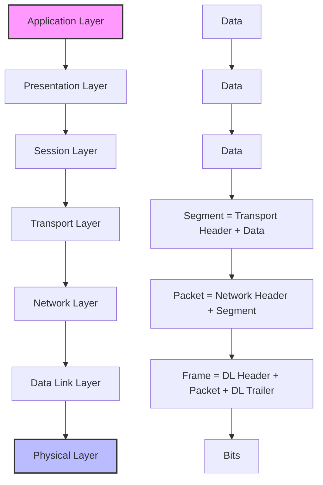

# Networks Encapsulation

## Introduction

When you send a message over the internet, your data doesn't simply travel as-is from your device to its destination. Instead, it undergoes a process called **encapsulation**, where each network layer adds its own information to your data before passing it down to the next layer. Think of it like sending a letter: you write your message (the data), put it in an envelope (add headers), address it (add more information), and then place it in a mailbox for delivery.

This article explains network encapsulation, a fundamental concept in computer networking that helps ensure your data reaches its destination correctly and efficiently.

## What is Encapsulation?

Encapsulation is the process of wrapping data with protocol information before network transmission. As data moves down through the network protocol stack, each layer adds its own header (and sometimes trailer) information to the data it receives from the layer above.

### Key Concepts

- **Protocol Data Unit (PDU)**: The data unit at each layer, which includes the original data plus all headers added by that layer and the layers above it
- **Headers**: Control information added to the beginning of a data packet
- **Trailers**: Control information added to the end of a data packet (less common than headers)

## The Encapsulation Process

Let's break down how encapsulation works as data travels through the network layers. We'll use the OSI model as a reference, though the TCP/IP model follows similar principles with fewer layers.



### Step-by-Step Encapsulation

1. **Application Layer**: Your original data is created (e.g., an email message, a web page request)
2. **Transport Layer**: Adds a header with information such as source and destination ports, sequence numbers, and error-checking codes, creating a **segment** (TCP) or **datagram** (UDP)
3. **Network Layer**: Adds a header with IP addresses and routing information, creating a **packet**
4. **Data Link Layer**: Adds a header with MAC addresses and a trailer with error detection, creating a **frame**
5. **Physical Layer**: Converts the frame into **bits** for transmission over the physical medium

## Practical Example: Sending a Web Request

Let's see encapsulation in action with a concrete example: accessing a website.

### Scenario: A Web Browser Request

Imagine you type `https://www.example.com` in your browser:

1. **Application Layer (HTTP/HTTPS)**: Creates an HTTP GET request
   ```
   GET / HTTP/1.1
   Host: www.example.com
   User-Agent: Mozilla/5.0
   Accept: text/html
   ```

2. **Transport Layer (TCP)**: Adds TCP header with ports (source port might be random, e.g., 53642; destination port is 443 for HTTPS)
   ```
   Source Port: 53642
   Destination Port: 443
   Sequence Number: 3728192
   Acknowledgment Number: 0
   Flags: SYN
   Window Size: 64240
   [+ HTTP Data]
   ```

3. **Network Layer (IP)**: Adds IP header with addresses
   ```
   Version: IPv4
   Source IP: 192.168.1.10 (your computer)
   Destination IP: 93.184.216.34 (example.com)
   Protocol: TCP (6)
   TTL: 64
   [+ TCP Segment]
   ```

4. **Data Link Layer (Ethernet)**: Adds Ethernet header and trailer
   ```
   Destination MAC: 00:11:22:33:44:55 (your router)
   Source MAC: AA:BB:CC:DD:EE:FF (your computer)
   EtherType: 0x0800 (IPv4)
   [+ IP Packet]
   FCS: [32-bit CRC value]
   ```

5. **Physical Layer**: Converts the frame to electrical, radio, or light signals for transmission

### Code Example: Viewing Encapsulation with Wireshark

While not a programming example, you can use Wireshark to visualize encapsulation. Here's a simplified interpretation of what you might see:

```
Frame 1: 74 bytes on wire, 74 bytes captured
Ethernet II, Src: AA:BB:CC:DD:EE:FF, Dst: 00:11:22:33:44:55
Internet Protocol Version 4, Src: 192.168.1.10, Dst: 93.184.216.34
Transmission Control Protocol, Src Port: 53642, Dst Port: 443
    Source Port: 53642
    Destination Port: 443
    [TCP Flags: SYN]
Hypertext Transfer Protocol
    GET / HTTP/1.1\r

    Host: www.example.com\r

    User-Agent: Mozilla/5.0\r

```

## Decapsulation: The Reverse Process

When data reaches its destination, it undergoes **decapsulation** - the reverse of encapsulation:

1. The receiving device processes the bits at the Physical Layer
2. The Data Link Layer removes the frame header and trailer, checks for errors
3. The Network Layer removes the packet header, confirms the IP address
4. The Transport Layer removes the segment/datagram header, delivers to the correct application
5. The Application Layer processes the original data

## Real-World Applications of Encapsulation

### VPNs (Virtual Private Networks)

VPNs use a technique called **tunneling**, which is an application of encapsulation. They encapsulate already-encapsulated data inside additional headers for security and privacy.

```
Original IP Packet → Encrypted → VPN Header Added → Transmitted → VPN Header Removed → Decrypted → Original Packet Delivered
```

### Network Address Translation (NAT)

NAT allows multiple devices on a local network to share a single public IP address. During the encapsulation process, the router modifies the source address and port in the packet headers.

### Quality of Service (QoS)

Network devices can examine the encapsulation headers to prioritize certain types of traffic (like video calls) over others (like file downloads).

## Programming with Network Encapsulation

While you typically don't manually handle encapsulation in everyday programming, here's a simplified Python example using the `socket` library that shows how you might build a custom protocol:

```python
import socket
import struct

# Function to encapsulate data with a simple header
def encapsulate(data, message_type, sequence_num):
    # Our custom header: 1 byte for type, 4 bytes for sequence number
    header = struct.pack('!BI', message_type, sequence_num)
    # Combine header and data
    return header + data.encode()

# Function to decapsulate and extract the original data
def decapsulate(packet):
    # Extract header fields
    message_type = struct.unpack('!B', packet[0:1])[0]
    sequence_num = struct.unpack('!I', packet[1:5])[0]
    # Extract original data
    data = packet[5:].decode()
    return message_type, sequence_num, data

# Example usage
if __name__ == "__main__":
    # Original data
    original_data = "Hello, Network!"
    
    # Encapsulate the data
    packet = encapsulate(original_data, message_type=1, sequence_num=42)
    print(f"Encapsulated packet: {packet}")
    
    # Decapsulate to get the original data
    msg_type, seq_num, data = decapsulate(packet)
    print(f"Decapsulated - Type: {msg_type}, Sequence: {seq_num}, Data: '{data}'")
```

Output:
```
Encapsulated packet: b'\x01\x00\x00\x00*Hello, Network!'
Decapsulated - Type: 1, Sequence: 42, Data: 'Hello, Network!'
```

This example shows a minimal implementation of adding a custom header (encapsulation) and then extracting the original data (decapsulation).

## Common Encapsulation Challenges

### MTU (Maximum Transmission Unit) Issues

If an encapsulated packet becomes too large for a network segment's MTU, it must be fragmented, which can reduce efficiency and increase the chance of errors.

### Overhead

Headers add overhead to data transmission. For small packets (like VoIP), the header can be larger than the actual data!

### Troubleshooting Complexity

Encapsulation makes network troubleshooting more complex because an issue could occur at any layer. Tools like `tcpdump` and Wireshark help by showing the encapsulation layers.

## Summary

Network encapsulation is the process of wrapping data with protocol information as it moves through the network stack. Each layer adds its own header, transforming the data from a raw application message to bits ready for transmission.

Understanding encapsulation helps you:
- Troubleshoot network problems more effectively
- Design efficient network protocols
- Implement secure communication systems
- Make better decisions about network architecture

Encapsulation is the foundation for how all data travels across networks, making it one of the most important concepts in networking.

## Exercises

1. Draw a diagram showing how an HTTPS request gets encapsulated at each layer of the TCP/IP model.
2. Use Wireshark to capture packets when visiting a website, and identify the headers added by each protocol layer.
3. Write a simple client-server program in your preferred language that adds a custom header to messages before sending them.
4. Research how VPN encapsulation works and explain why it provides privacy benefits.
5. Compare the header sizes for TCP and UDP. In what situations might the difference in overhead matter?

## Additional Resources

- RFC 1122: Requirements for Internet Hosts (defines the layered model)
- Computer Networks by Andrew S. Tanenbaum (comprehensive networking text)
- The TCP/IP Guide by Charles M. Kozierok (detailed explanations of protocols)
- Wireshark network analyzer (free software for packet analysis)