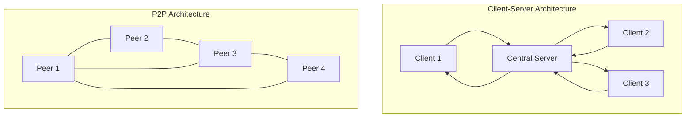

# Peer-to-Peer Networks

## Introduction

Peer-to-peer (P2P) networks represent a fundamental shift from traditional client-server architectures. In a P2P network, computers (peers) communicate directly with each other without requiring a central server to coordinate their interactions. This creates a distributed network where each participant can function both as a client receiving services and as a server providing resources to others.

P2P networks have revolutionized how we think about distributed systems, enabling efficient resource sharing, improved scalability, and enhanced resilience against failures. This guide will walk you through the fundamentals of P2P networking, providing clear explanations and practical examples to help you understand this important architectural paradigm.

## How Peer-to-Peer Networks Work

### Basic Principles

In contrast to the client-server model, P2P networks distribute responsibilities across all participants:



In a P2P network:

1. **Decentralization**: There's no central authority controlling the network.
2. **Equal Participation**: Each peer can both request and provide resources.
3. **Direct Communication**: Peers connect and transfer data directly.
4. **Autonomy**: Each peer operates independently, making its own decisions.
5. **Resource Sharing**: Computing power, storage, and bandwidth are shared.

### Types of Peer-to-Peer Networks

P2P networks come in several varieties, each with distinct characteristics:

#### 1. Pure P2P Networks

In pure P2P networks, all peers are equal with no central coordination:

- All peers act as both clients and servers
- Network functions even if many nodes disconnect
- Examples: Early versions of Gnutella, Freenet

#### 2. Hybrid P2P Networks

Hybrid networks combine P2P elements with some centralized functions:

- Central servers facilitate peer discovery and search
- Actual data transfers occur directly between peers
- Examples: BitTorrent with trackers, early Napster

#### 3. Structured P2P Networks

These networks organize peers according to specific topologies:

- Use Distributed Hash Tables (DHTs) to efficiently locate resources
- Each peer has a specific position in the network structure
- Examples: Chord, Kademlia, Pastry

## Implementing Basic P2P Communication in Python

Let's create a simple example of P2P communication using Python's `socket` library. This example demonstrates how two peers can establish a direct connection and exchange messages.

First, let's look at a basic peer implementation:

```python
import socket
import threading
import time
import sys

class Peer:
    def __init__(self, host, port):
        self.host = host
        self.port = port
        self.sock = socket.socket(socket.AF_INET, socket.SOCK_STREAM)
        self.peers = []  # List of known peers
        
    def start(self):
        # Start listening for connections
        self.sock.bind((self.host, self.port))
        self.sock.listen(5)
        
        # Start thread to accept connections
        accept_thread = threading.Thread(target=self.accept_connections)
        accept_thread.daemon = True
        accept_thread.start()
        
        print(f"Peer started on {self.host}:{self.port}")
        
    def accept_connections(self):
        while True:
            client_sock, client_addr = self.sock.accept()
            print(f"Connection from {client_addr[0]}:{client_addr[1]}")
            
            # Start a thread to handle this client
            client_thread = threading.Thread(target=self.handle_client, args=(client_sock,))
            client_thread.daemon = True
            client_thread.start()
    
    def handle_client(self, client_sock):
        while True:
            try:
                data = client_sock.recv(1024)
                if not data:
                    break
                    
                message = data.decode('utf-8')
                print(f"Received: {message}")
                
                # Echo back the message
                response = f"Echo: {message}"
                client_sock.send(response.encode('utf-8'))
            except:
                break
        
        client_sock.close()
        
    def connect_to_peer(self, host, port):
        try:
            # Connect to another peer
            peer_sock = socket.socket(socket.AF_INET, socket.SOCK_STREAM)
            peer_sock.connect((host, port))
            self.peers.append((peer_sock, (host, port)))
            print(f"Connected to peer at {host}:{port}")
            return peer_sock
        except Exception as e:
            print(f"Failed to connect to peer at {host}:{port}. Error: {e}")
            return None
    
    def send_message(self, peer_sock, message):
        try:
            peer_sock.send(message.encode('utf-8'))
            # Wait for response
            response = peer_sock.recv(1024).decode('utf-8')
            print(f"Response: {response}")
        except Exception as e:
            print(f"Error sending message: {e}")

# Example usage
if __name__ == "__main__":
    if len(sys.argv) > 1:
        # This peer will connect to the first peer
        my_port = 8001
        other_port = 8000
    else:
        # This is the first peer
        my_port = 8000
        other_port = None
        
    peer = Peer("localhost", my_port)
    peer.start()
    
    if other_port:
        time.sleep(1)  # Give the first peer time to start
        peer_sock = peer.connect_to_peer("localhost", other_port)
        
        if peer_sock:
            while True:
                msg = input("Enter message: ")
                if msg.lower() == 'exit':
                    break
                peer.send_message(peer_sock, msg)
    else:
        # Keep the first peer running
        while True:
            time.sleep(1)
```

Let's test our P2P implementation with two instances:

**Terminal 1 (First Peer):**
```
$ python peer.py
Peer started on localhost:8000
Connection from 127.0.0.1:52134
Received: Hello from peer 2!
```

**Terminal 2 (Second Peer):**
```
$ python peer.py connect
Peer started on localhost:8001
Connected to peer at localhost:8000
Enter message: Hello from peer 2!
Response: Echo: Hello from peer 2!
```

This simple example demonstrates the basic principles of P2P networking, where each peer can both listen for connections and connect to other peers.

## Real-World Applications of P2P Networks

Peer-to-peer networks power many systems you likely use every day:

### 1. File Sharing

The most well-known application of P2P technology is file sharing:

- **BitTorrent**: Enables efficient distribution of large files by having peers download pieces from multiple sources simultaneously.
- **IPFS (InterPlanetary File System)**: A P2P hypermedia protocol designed to make the web faster, safer, and more open.

### 2. Blockchain and Cryptocurrencies

Cryptocurrencies like Bitcoin and Ethereum rely on P2P networks to:

- Validate and propagate transactions
- Achieve consensus across the network
- Eliminate the need for central financial authorities

### 3. Content Delivery Networks (CDNs)

P2P principles have been incorporated into some CDNs:

- **Peer5**: Provides P2P video delivery to reduce server load
- **Akamai NetSession**: Uses P2P to assist with content delivery

### 4. Communication Systems

P2P enables direct communication without central servers:

- **Discord**: Uses P2P for direct voice calls between users
- **Retroshare**: Provides encrypted communications and file sharing

### 5. Distributed Computing

P2P networks can harness collective computing power:

- **BOINC (Berkeley Open Infrastructure for Network Computing)**: Enables volunteer computing projects like SETI@home
- **Folding@home**: Uses distributed computing to simulate protein folding

## Implementation Challenges in P2P Networks

Building P2P systems comes with several challenges:

### 1. NAT Traversal

Most peers are behind Network Address Translation (NAT), making direct connections difficult:

```python
# Example of implementing a simple NAT traversal technique: UDP hole punching
def create_udp_socket():
    sock = socket.socket(socket.AF_INET, socket.SOCK_DGRAM)
    sock.bind(('0.0.0.0', 0))  # Bind to any available port
    return sock, sock.getsockname()[1]  # Return the socket and the port

def perform_hole_punching(rendezvous_server, local_port, peer_addr):
    # 1. Create UDP socket
    sock, actual_port = create_udp_socket()
    
    # 2. Register with rendezvous server
    register_with_server(rendezvous_server, actual_port)
    
    # 3. Get peer's external address from server
    peer_external_addr = get_peer_addr_from_server(rendezvous_server)
    
    # 4. Send UDP packets to peer (creates the hole in your NAT)
    for _ in range(5):  # Send multiple packets to increase success chance
        sock.sendto(b"NAT_HOLE_PUNCH", peer_external_addr)
        time.sleep(0.1)
    
    # 5. Now peers should be able to communicate directly
    return sock
```

### 2. Peer Discovery

Finding other peers without a central server requires techniques such as:

- **Gossip protocols**: Peers share information about other peers
- **DHT (Distributed Hash Tables)**: Structured way to find resources
- **Bootstrap nodes**: Well-known entry points to the network

### 3. Security Concerns

P2P networks face unique security challenges:

- **Sybil attacks**: Malicious users create multiple identities
- **Eclipse attacks**: Isolating a peer from the honest network
- **Data validation**: Ensuring received data is legitimate

## Building a Simple P2P File Sharing System

Let's create a basic P2P file sharing application that demonstrates core concepts:

```python
import socket
import threading
import os
import json
import hashlib

class P2PFileSharing:
    def __init__(self, host, port, shared_folder):
        self.host = host
        self.port = port
        self.shared_folder = shared_folder
        self.peers = {}  # {(host, port): connection}
        self.files = {}  # {filename: file_hash}
        
        # Create shared folder if it doesn't exist
        if not os.path.exists(shared_folder):
            os.makedirs(shared_folder)
            
        # Scan shared folder for files
        self.scan_files()
        
        # Create server socket
        self.server_socket = socket.socket(socket.AF_INET, socket.SOCK_STREAM)
        self.server_socket.bind((host, port))
        self.server_socket.listen(5)
        
    def scan_files(self):
        """Scan the shared folder and create a file index"""
        self.files = {}
        for filename in os.listdir(self.shared_folder):
            file_path = os.path.join(self.shared_folder, filename)
            if os.path.isfile(file_path):
                # Calculate file hash
                file_hash = self.calculate_file_hash(file_path)
                self.files[filename] = file_hash
                
    def calculate_file_hash(self, file_path):
        """Calculate SHA-256 hash of a file"""
        hasher = hashlib.sha256()
        with open(file_path, 'rb') as f:
            for chunk in iter(lambda: f.read(4096), b''):
                hasher.update(chunk)
        return hasher.hexdigest()
    
    def start(self):
        """Start the P2P node"""
        # Start server thread
        server_thread = threading.Thread(target=self.listen_for_connections)
        server_thread.daemon = True
        server_thread.start()
        
        print(f"P2P File Sharing node started on {self.host}:{self.port}")
        print(f"Sharing {len(self.files)} files from {self.shared_folder}")
        
    def listen_for_connections(self):
        """Listen for incoming connections"""
        while True:
            client_sock, client_addr = self.server_socket.accept()
            print(f"Connection from {client_addr[0]}:{client_addr[1]}")
            
            # Start a thread to handle this client
            client_thread = threading.Thread(target=self.handle_client, args=(client_sock, client_addr))
            client_thread.daemon = True
            client_thread.start()
    
    def handle_client(self, client_sock, client_addr):
        """Handle client connection and requests"""
        try:
            while True:
                data = client_sock.recv(1024)
                if not data:
                    break
                
                # Parse the request
                request = json.loads(data.decode('utf-8'))
                
                # Handle different request types
                if request['type'] == 'LIST_FILES':
                    # Send list of available files
                    response = {
                        'type': 'FILE_LIST',
                        'files': self.files
                    }
                    client_sock.send(json.dumps(response).encode('utf-8'))
                
                elif request['type'] == 'DOWNLOAD_FILE':
                    filename = request['filename']
                    if filename in self.files:
                        # Send the file
                        self.send_file(client_sock, filename)
                    else:
                        # File not found
                        response = {
                            'type': 'ERROR',
                            'message': f"File {filename} not found"
                        }
                        client_sock.send(json.dumps(response).encode('utf-8'))
        
        except Exception as e:
            print(f"Error handling client: {e}")
        finally:
            client_sock.close()
    
    def send_file(self, client_sock, filename):
        """Send a file to a peer"""
        try:
            file_path = os.path.join(self.shared_folder, filename)
            file_size = os.path.getsize(file_path)
            
            # Send file metadata
            metadata = {
                'type': 'FILE_METADATA',
                'filename': filename,
                'file_size': file_size,
                'file_hash': self.files[filename]
            }
            client_sock.send(json.dumps(metadata).encode('utf-8'))
            
            # Wait for ready confirmation
            response = json.loads(client_sock.recv(1024).decode('utf-8'))
            if response['type'] != 'READY_TO_RECEIVE':
                return
            
            # Send the file in chunks
            with open(file_path, 'rb') as f:
                bytes_sent = 0
                while bytes_sent < file_size:
                    chunk = f.read(4096)
                    if not chunk:
                        break
                    client_sock.send(chunk)
                    bytes_sent += len(chunk)
            
            print(f"File {filename} sent successfully")
            
        except Exception as e:
            print(f"Error sending file: {e}")
    
    def connect_to_peer(self, host, port):
        """Connect to another peer"""
        try:
            # Connect to the peer
            peer_sock = socket.socket(socket.AF_INET, socket.SOCK_STREAM)
            peer_sock.connect((host, port))
            self.peers[(host, port)] = peer_sock
            print(f"Connected to peer at {host}:{port}")
            return peer_sock
        except Exception as e:
            print(f"Failed to connect to peer at {host}:{port}. Error: {e}")
            return None
    
    def list_peer_files(self, peer_sock):
        """Request file list from a peer"""
        try:
            request = {
                'type': 'LIST_FILES'
            }
            peer_sock.send(json.dumps(request).encode('utf-8'))
            
            # Receive response
            response = json.loads(peer_sock.recv(4096).decode('utf-8'))
            if response['type'] == 'FILE_LIST':
                return response['files']
            return {}
        except Exception as e:
            print(f"Error listing peer files: {e}")
            return {}
    
    def download_file(self, peer_sock, filename):
        """Download a file from a peer"""
        try:
            # Request the file
            request = {
                'type': 'DOWNLOAD_FILE',
                'filename': filename
            }
            peer_sock.send(json.dumps(request).encode('utf-8'))
            
            # Receive file metadata
            metadata_raw = peer_sock.recv(4096)
            metadata = json.loads(metadata_raw.decode('utf-8'))
            
            if metadata['type'] == 'ERROR':
                print(f"Error: {metadata['message']}")
                return False
            
            if metadata['type'] != 'FILE_METADATA':
                print("Unexpected response type")
                return False
            
            # Prepare to receive file
            file_size = metadata['file_size']
            file_path = os.path.join(self.shared_folder, metadata['filename'])
            
            # Send ready confirmation
            ready_msg = {
                'type': 'READY_TO_RECEIVE'
            }
            peer_sock.send(json.dumps(ready_msg).encode('utf-8'))
            
            # Receive the file
            with open(file_path, 'wb') as f:
                bytes_received = 0
                while bytes_received < file_size:
                    chunk = peer_sock.recv(min(4096, file_size - bytes_received))
                    if not chunk:
                        break
                    f.write(chunk)
                    bytes_received += len(chunk)
            
            # Verify file hash
            received_hash = self.calculate_file_hash(file_path)
            if received_hash != metadata['file_hash']:
                print("Warning: File hash mismatch, file may be corrupted")
                os.remove(file_path)
                return False
            
            # Update file index
            self.scan_files()
            print(f"Downloaded {filename} successfully")
            return True
            
        except Exception as e:
            print(f"Error downloading file: {e}")
            return False
```

**Example usage of our P2P file sharing system:**

```python
# Peer 1 - Start a node
node1 = P2PFileSharing("localhost", 8000, "shared_folder_1")
node1.start()

# Peer 2 - Start another node and connect to Peer 1
node2 = P2PFileSharing("localhost", 8001, "shared_folder_2")
node2.start()
peer1_connection = node2.connect_to_peer("localhost", 8000)

# List files available on Peer 1
if peer1_connection:
    available_files = node2.list_peer_files(peer1_connection)
    print("Files available on peer 1:")
    for filename, file_hash in available_files.items():
        print(f"- {filename} ({file_hash[:8]}...)")
    
    # Download a file from Peer 1
    if available_files:
        filename = list(available_files.keys())[0]  # Get first file
        print(f"Downloading {filename}...")
        node2.download_file(peer1_connection, filename)
```

This implementation demonstrates key P2P concepts:
- Direct file transfers between peers
- File integrity verification with hashing
- Peer discovery (simplified with direct connections)
- Distributed content (files stored across multiple peers)

## Advanced P2P Concepts

As you advance in P2P development, you'll encounter these important concepts:

### Distributed Hash Tables (DHTs)

DHTs provide a structured way to locate resources in a P2P network:

- Each peer is responsible for a portion of the keyspace
- Resources are mapped to keys using a hash function
- Lookups require O(log n) messages instead of flooding the network

### P2P Network Overlays

Overlay networks create logical connections on top of the physical network:

- **Unstructured overlays**: Peers connect somewhat randomly (Gnutella)
- **Structured overlays**: Connections follow specific rules (Chord, Kademlia)
- **Super-peer overlays**: Some peers have special roles (hybrid P2P)

### Consensus Algorithms

For P2P systems that need agreement, consensus algorithms are crucial:

- **Proof of Work**: Used in Bitcoin and many cryptocurrencies
- **Proof of Stake**: More energy-efficient alternative (Ethereum 2.0)
- **Practical Byzantine Fault Tolerance (PBFT)**: Used in some permissioned blockchains

## Best Practices for P2P Development

When building P2P applications, consider these guidelines:

1. **Plan for churn**: Peers frequently join and leave the network
2. **Implement appropriate security measures**: Validate all data and authenticate peers when needed
3. **Consider NAT traversal early**: Most peers will be behind NATs and firewalls
4. **Balance load distribution**: Prevent any single peer from becoming overwhelmed
5. **Design for eventual consistency**: In distributed systems, consistency takes time
6. **Build in redundancy**: Critical data should exist in multiple locations
7. **Consider bandwidth constraints**: Not all peers have high-speed connections

## Summary

Peer-to-peer networks represent a powerful architectural paradigm that enables direct communication and resource sharing between participants without relying on central servers. They offer advantages in scalability, resilience, and resource utilization, making them suitable for various applications from file sharing to cryptocurrencies.

Key points to remember:
- P2P networks distribute responsibilities across all participants
- They can be structured, unstructured, or hybrid
- Implementation challenges include NAT traversal, peer discovery, and security
- Real-world applications include file sharing, blockchains, and distributed computing
- Advanced P2P systems often use DHTs, overlay networks, and consensus algorithms

P2P networking continues to evolve, with new applications emerging as distributed systems become more prevalent in our increasingly connected world.

## Additional Resources

To deepen your understanding of P2P networks, consider exploring these resources:

1. **Books**:
   - "Peer-to-Peer: Building Secure, Scalable, and Manageable Networks" by Dana Moore and John Hebeler
   - "Peer-to-Peer Computing: Principles and Applications" by Quang Hieu Vu, Mihai Lupu, and Beng Chin Ooi

2. **Online Courses**:
   - Stanford's "Cryptocurrencies, Blockchains, and Smart Contracts"
   - MIT's "Distributed Systems"

3. **Open Source P2P Projects**:
   - IPFS: https://ipfs.io/
   - BitTorrent: https://www.bittorrent.org/
   - Kademlia DHT: https://github.com/bmuller/kademlia

## Exercises

1. **Basic P2P Chat**: Extend the basic P2P example to create a simple chat application where multiple peers can communicate.

2. **File Discovery**: Modify the file sharing example to include a peer discovery mechanism so new peers can find existing peers automatically.

3. **Implement a Simple DHT**: Create a basic distributed hash table implementation with consistent hashing to distribute keys among peers.

4. **P2P Data Replication**: Design a system where files are automatically replicated across multiple peers for redundancy.

5. **NAT Traversal**: Research and implement a technique for traversing NAT, such as STUN, TURN, or ICE to enable P2P connections between peers behind firewalls.