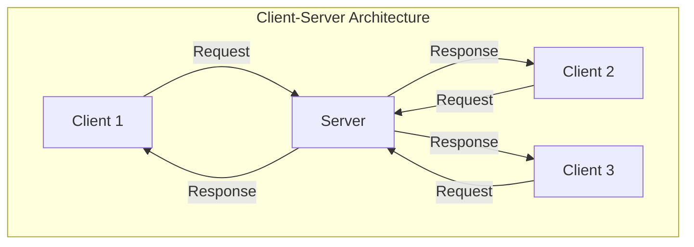
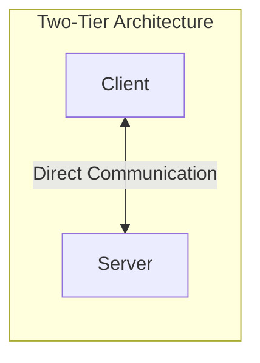
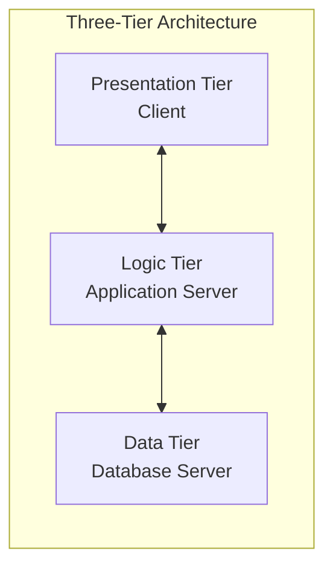
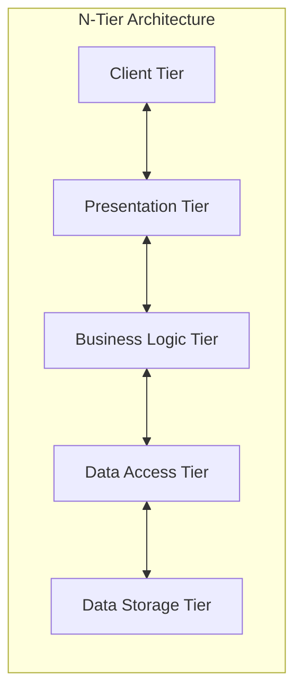

# Understanding Client-Server Networks

## Introduction

Client-server architecture is one of the most fundamental concepts in modern computing and forms the backbone of how most applications, websites, and services operate today. If you've ever used a web browser, sent an email, or played an online game, you've interacted with a client-server system.

In this guide, we'll explore what client-server networks are, how they function, their advantages and limitations, and how they're implemented in real-world applications. By the end, you'll have a solid understanding of this critical network architecture pattern.

## What is a Client-Server Network?

A client-server network is a distributed application structure that partitions tasks between providers of a resource or service (called **servers**) and service requesters (called **clients**).



### Key Components

1. **Client**: A device or application that requests and consumes services or resources. Examples include web browsers, email clients, and mobile apps.

2. **Server**: A system that provides services, resources, or functionality to clients. Examples include web servers, database servers, and file servers.

3. **Network**: The communication infrastructure that enables clients and servers to exchange data.

## How Client-Server Networks Work

The client-server model follows a request-response pattern:

1. **Client Initiation**: The client sends a request to the server for a specific service or resource.
2. **Server Processing**: The server receives the request, processes it, and performs the necessary operations.
3. **Server Response**: The server sends the results back to the client.
4. **Client Consumption**: The client receives and processes the response.

Let's look at a simple example of a client making an HTTP request to a web server:

```javascript
// Client-side JavaScript code making a request to a server
fetch('https://api.example.com/data')
  .then(response => response.json())
  .then(data => {
    console.log('Data received from server:', data);
    // Process the data here
  })
  .catch(error => {
    console.error('Error fetching data from server:', error);
  });
```

The server might respond with something like:

```javascript
// Example server response in JSON format
{
  "status": "success",
  "data": {
    "items": [
      { "id": 1, "name": "Product A" },
      { "id": 2, "name": "Product B" },
      { "id": 3, "name": "Product C" }
    ],
    "count": 3
  }
}
```

## Types of Servers

Servers are typically specialized for specific functions:

1. **Web Servers**: Deliver web content to browsers (Apache, Nginx, IIS).
2. **Application Servers**: Execute business logic and application code.
3. **Database Servers**: Store, manage, and provide access to databases (MySQL, PostgreSQL, MongoDB).
4. **File Servers**: Store and manage files and provide file access to clients.
5. **Mail Servers**: Handle email sending, receiving, and storage.
6. **Game Servers**: Coordinate multiplayer gaming sessions.

## Implementing a Simple Client-Server Application

Let's build a basic client-server application using Node.js to demonstrate the concept.

### Server Implementation

```javascript
// server.js - A simple HTTP server using Node.js
const http = require('http');

const server = http.createServer((request, response) => {
  // Set response headers
  response.setHeader('Content-Type', 'application/json');
  response.setHeader('Access-Control-Allow-Origin', '*');
  
  // Create response data
  const responseData = {
    message: 'Hello from the server!',
    timestamp: new Date().toISOString(),
    path: request.url
  };
  
  // Send the response
  response.writeHead(200);
  response.end(JSON.stringify(responseData));
});

const PORT = 3000;
server.listen(PORT, () => {
  console.log(`Server running at http://localhost:${PORT}/`);
});
```

### Client Implementation

```javascript
// client.js - A simple HTTP client using Node.js
const http = require('http');

const options = {
  hostname: 'localhost',
  port: 3000,
  path: '/hello',
  method: 'GET'
};

console.log('Sending request to server...');

const req = http.request(options, (res) => {
  let data = '';
  
  // Collect data chunks
  res.on('data', (chunk) => {
    data += chunk;
  });
  
  // Process the complete response
  res.on('end', () => {
    console.log('Response status:', res.statusCode);
    console.log('Response headers:', res.headers);
    console.log('Response data:', JSON.parse(data));
  });
});

req.on('error', (error) => {
  console.error('Error:', error);
});

req.end();
```

To run this example:
1. Save the server code as `server.js` and the client code as `client.js`
2. Open two terminal windows
3. In the first terminal, run `node server.js`
4. In the second terminal, run `node client.js`

### Expected Output

Server terminal:
```
Server running at http://localhost:3000/
```

Client terminal:
```
Sending request to server...
Response status: 200
Response headers: { 'content-type': 'application/json', 'access-control-allow-origin': '*', ... }
Response data: { message: 'Hello from the server!', timestamp: '2025-03-15T14:30:45.123Z', path: '/hello' }
```

## Client-Server Communication Protocols

Clients and servers communicate using standardized protocols. Some common ones include:

1. **HTTP/HTTPS**: Used for web browsing and many API communications
2. **FTP**: For file transfers
3. **SMTP/POP/IMAP**: For email transmission
4. **WebSocket**: For bidirectional, real-time communication
5. **TCP/IP**: The underlying foundation for most internet communications

## Client-Server Architecture Models

There are several variations of the client-server model:

### Two-Tier Architecture

The simplest form where clients communicate directly with the server.



### Three-Tier Architecture

Introduces a middle tier (application server) between the client and data server.



### N-Tier Architecture

Extends the model with additional specialized layers.



## Advantages of Client-Server Architecture

1. **Centralized Control**: Resources and data can be centrally managed and secured.
2. **Scalability**: Servers can be scaled up independently to handle more clients.
3. **Role Separation**: Clients and servers can be optimized for their specific roles.
4. **Resource Sharing**: Multiple clients can share resources provided by servers.
5. **Maintenance**: Upgrading server components doesn't necessarily require client updates.

## Challenges and Limitations

1. **Single Point of Failure**: If a server fails, all clients depending on it may be affected.
2. **Network Dependency**: Requires stable network connections to function.
3. **Cost**: Server hardware and maintenance can be expensive, especially for high-traffic systems.
4. **Complex Setup**: Setting up and managing servers requires specialized knowledge.

## Real-World Applications

### Web Applications

The most common example of client-server architecture is web browsing:
- **Client**: Web browser (Chrome, Firefox, Safari)
- **Server**: Web server (Apache, Nginx)
- **Communication**: HTTP/HTTPS protocol

### Database Applications

Business applications often follow this pattern:
- **Client**: Application frontend (web, desktop, or mobile)
- **Server**: Database server (MySQL, Oracle, MongoDB)
- **Communication**: SQL queries, API calls

### Cloud Services

Modern cloud services use advanced client-server models:
- **Client**: Various devices and applications
- **Server**: Distributed cloud infrastructure
- **Communication**: APIs, specialized protocols

## Building a RESTful API Server

One common implementation of client-server architecture is a RESTful API. Here's a simple example using Express.js:

```javascript
// api-server.js - A RESTful API server using Express
const express = require('express');
const app = express();
const PORT = 3000;

// Enable JSON parsing for incoming requests
app.use(express.json());

// In-memory database (for demo purposes)
let users = [
  { id: 1, name: 'Alice', email: 'alice@example.com' },
  { id: 2, name: 'Bob', email: 'bob@example.com' }
];

// GET all users
app.get('/api/users', (req, res) => {
  res.status(200).json({
    status: 'success',
    count: users.length,
    data: users
  });
});

// GET a specific user
app.get('/api/users/:id', (req, res) => {
  const id = parseInt(req.params.id);
  const user = users.find(u => u.id === id);
  
  if (!user) {
    return res.status(404).json({
      status: 'error',
      message: `User with ID ${id} not found`
    });
  }
  
  res.status(200).json({
    status: 'success',
    data: user
  });
});

// POST a new user
app.post('/api/users', (req, res) => {
  const { name, email } = req.body;
  
  if (!name || !email) {
    return res.status(400).json({
      status: 'error',
      message: 'Name and email are required'
    });
  }
  
  const newUser = {
    id: users.length + 1,
    name,
    email
  };
  
  users.push(newUser);
  
  res.status(201).json({
    status: 'success',
    data: newUser
  });
});

// Start the server
app.listen(PORT, () => {
  console.log(`API server running on http://localhost:${PORT}`);
});
```

A client can interact with this server using various methods:

```javascript
// Example client code to interact with the RESTful API
async function fetchAllUsers() {
  const response = await fetch('http://localhost:3000/api/users');
  const data = await response.json();
  console.log('All users:', data);
  return data;
}

async function fetchUserById(id) {
  const response = await fetch(`http://localhost:3000/api/users/${id}`);
  const data = await response.json();
  console.log(`User ${id}:`, data);
  return data;
}

async function createUser(name, email) {
  const response = await fetch('http://localhost:3000/api/users', {
    method: 'POST',
    headers: {
      'Content-Type': 'application/json'
    },
    body: JSON.stringify({ name, email })
  });
  const data = await response.json();
  console.log('Created user:', data);
  return data;
}
```

## Future Trends in Client-Server Architecture

The client-server model continues to evolve:

1. **Microservices**: Breaking servers into smaller, specialized services
2. **Serverless Computing**: Abstracting server management away from developers
3. **Edge Computing**: Moving processing closer to clients for reduced latency
4. **GraphQL**: More efficient client-server data querying
5. **WebAssembly**: Bringing high-performance code to web clients

## Summary

Client-server architecture is a fundamental pattern in computing that separates systems into service providers (servers) and service consumers (clients). This model enables efficient resource sharing, centralized management, and specialized optimization of components.

Key takeaways:
- Clients request services or resources, servers provide them
- The architecture follows a request-response pattern
- Different specialized server types serve different functions
- Client-server models range from simple two-tier to complex n-tier systems
- Modern trends include microservices, serverless, and edge computing

## Exercises

1. Set up a basic HTTP server using Node.js and create a client that sends different types of requests to it.
2. Modify the RESTful API example to include update (PUT) and delete (DELETE) endpoints.
3. Implement a simple chat application where multiple clients can connect to a central server.
4. Create a three-tier application with a web frontend, application server, and database.
5. Research and compare different server technologies for a specific use case (e.g., high-traffic website, data analysis platform).

## Additional Resources

- [MDN Web Docs: HTTP](https://developer.mozilla.org/en-US/docs/Web/HTTP)
- [Node.js Documentation](https://nodejs.org/en/docs/)
- [Express.js Documentation](https://expressjs.com/)
- [RESTful API Design Best Practices](https://restfulapi.net/)
- [Cloud Computing Fundamentals](https://aws.amazon.com/getting-started/fundamentals-core-concepts/)