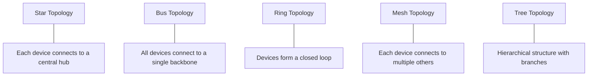
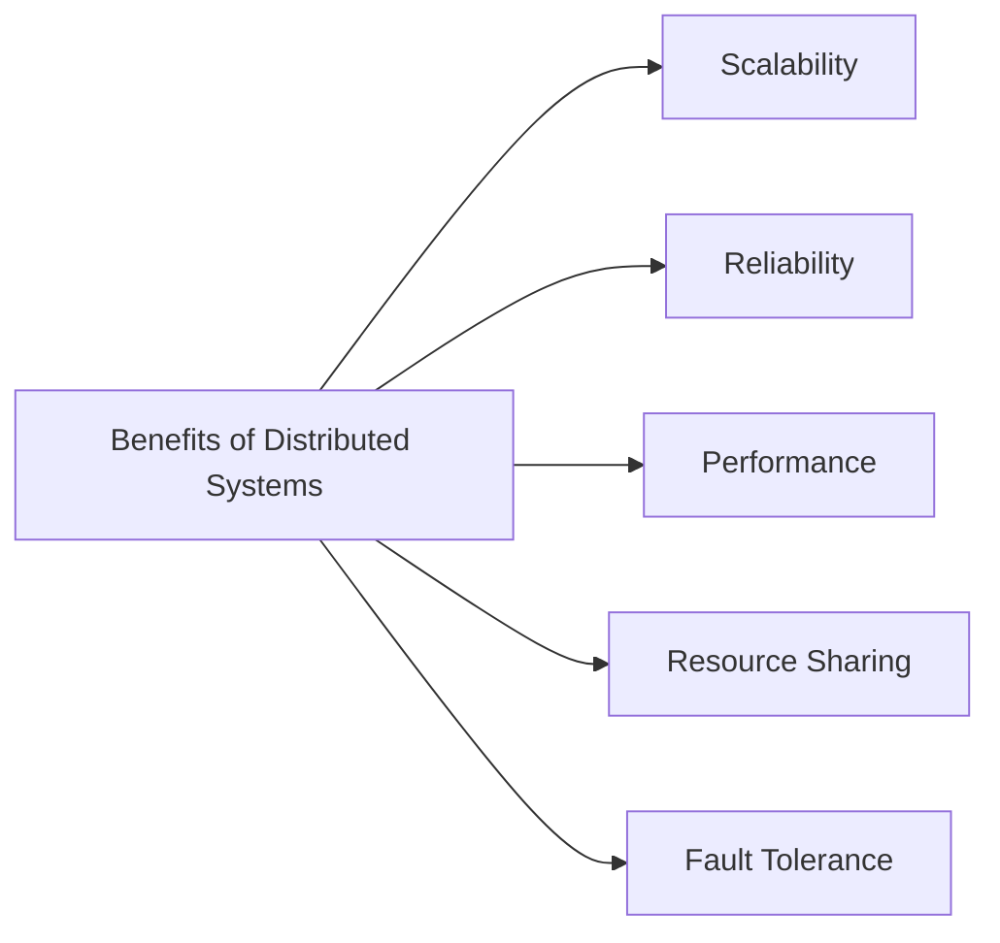
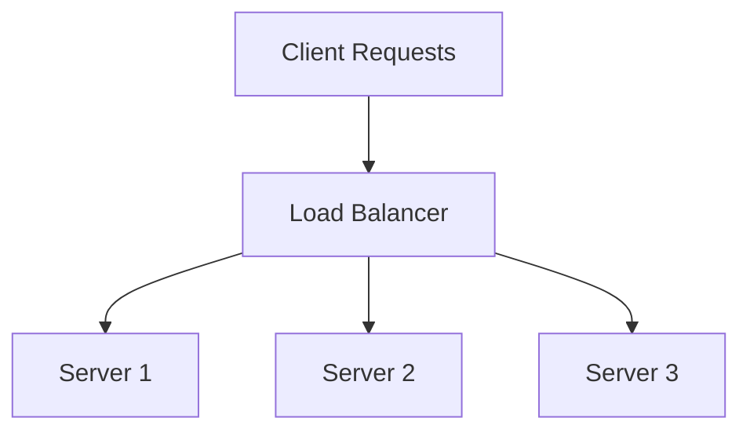
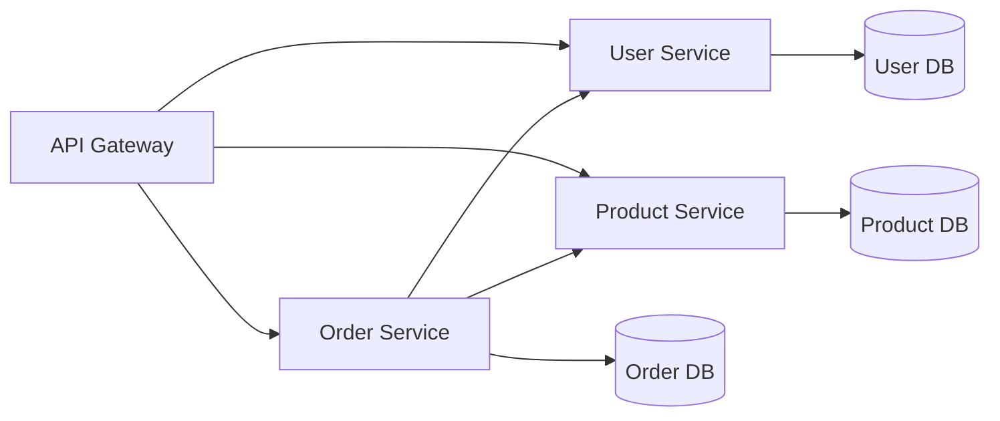

# Networks & Distributed Systems

## Introduction

In our increasingly connected world, understanding how computers communicate and work together is essential for any programmer. Networks and distributed systems form the backbone of modern computing, enabling everything from simple file sharing to complex cloud applications.

A **network** is a collection of computers and devices connected together to share resources and information. A **distributed system** is a collection of independent computers that appears to its users as a single coherent system, working together to achieve common goals.

This guide will introduce you to these fundamental concepts, exploring how they work and why they matter for even the simplest applications you might build.

## Understanding Computer Networks

### What is a Computer Network?

A computer network is simply two or more computers connected together to share resources. These resources can include:

- Files and data
- Hardware (like printers or storage)
- Software and services
- Internet connections

Networks range from small home setups with a few devices to massive global infrastructures like the internet itself.

### Network Types

Networks come in different sizes and scopes:

1. **LAN (Local Area Network)** - A network confined to a small geographic area like a home, office, or building
2. **WAN (Wide Area Network)** - A network that spans a large geographic area, often connecting multiple LANs
3. **MAN (Metropolitan Area Network)** - A network spanning a city or large campus
4. **PAN (Personal Area Network)** - A very small network for personal devices (like Bluetooth connections)

### Network Topologies

The physical or logical arrangement of devices in a network is called its topology:



### The OSI Model

The Open Systems Interconnection (OSI) model provides a conceptual framework for understanding network communications. It divides network communication into seven layers:

1. **Physical Layer** - The hardware (cables, switches)
2. **Data Link Layer** - Basic communication between directly connected nodes
3. **Network Layer** - Routing and forwarding data packets
4. **Transport Layer** - End-to-end communication and data flow control
5. **Session Layer** - Managing connections between applications
6. **Presentation Layer** - Data translation and encryption
7. **Application Layer** - User-facing applications and protocols

## Introduction to Distributed Systems

### What is a Distributed System?

A distributed system is a collection of independent computers that appears to its users as a single coherent system. These computers communicate and coordinate their actions by passing messages to one another.

Key characteristics of distributed systems include:
- **Concurrency** - Components operate simultaneously
- **Lack of a global clock** - Components must coordinate without perfect timing
- **Independent failures** - Parts can fail without affecting the whole system

### Examples of Distributed Systems

Distributed systems are everywhere in modern computing:
- The World Wide Web
- Cloud computing platforms
- Social media platforms
- Online banking systems
- Email systems
- Blockchain networks

### Benefits of Distributed Systems



- **Scalability** - Easily add more resources as demand grows
- **Reliability** - Continue functioning even if some components fail
- **Performance** - Distribute workload across multiple machines
- **Resource Sharing** - Access resources regardless of physical location
- **Fault Tolerance** - Recover from failures without system collapse

## Key Concepts in Networks and Distributed Systems

### Client-Server Architecture

The most common model for network services:

- **Client**: Requests a service or resource
- **Server**: Provides the service or resource

Example of a basic client-server interaction with Python:

```python
# Server code
import socket

server_socket = socket.socket(socket.AF_INET, socket.SOCK_STREAM)
server_socket.bind(('localhost', 8000))
server_socket.listen(1)

print("Server is listening on port 8000...")

while True:
    client_socket, address = server_socket.accept()
    print(f"Connection from {address} established")
    
    data = client_socket.recv(1024).decode('utf-8')
    print(f"Received: {data}")
    
    response = f"Server received: {data}"
    client_socket.send(response.encode('utf-8'))
    
    client_socket.close()
```

```python
# Client code
import socket

client_socket = socket.socket(socket.AF_INET, socket.SOCK_STREAM)
client_socket.connect(('localhost', 8000))

message = "Hello, server!"
client_socket.send(message.encode('utf-8'))

response = client_socket.recv(1024).decode('utf-8')
print(f"Response from server: {response}")

client_socket.close()
```

**Output:**
```
# Server output
Server is listening on port 8000...
Connection from ('127.0.0.1', 52134) established
Received: Hello, server!

# Client output
Response from server: Server received: Hello, server!
```

### Peer-to-Peer (P2P) Architecture

In contrast to client-server, P2P networks distribute workloads among peers that are both suppliers and consumers of resources.

Key benefits:
- No central point of failure
- Scales well with increased users
- Each peer contributes resources

Examples include BitTorrent for file sharing and some blockchain networks.

### IP Addressing and Ports

Every device on a network needs an address to be found:

- **IP Address**: Identifies a device on a network (like `192.168.1.1`)
- **Ports**: Identify specific services on a device (like port 80 for HTTP)

Example of checking your IP address:

```python
import socket

hostname = socket.gethostname()
local_ip = socket.gethostbyname(hostname)

print(f"Hostname: {hostname}")
print(f"IP Address: {local_ip}")
```

**Output:**
```
Hostname: my-computer
IP Address: 192.168.1.105
```

### Protocols

Protocols are standardized rules for how data is formatted and processed. Common network protocols include:

- **HTTP/HTTPS**: For web browsing
- **FTP**: For file transfers
- **SMTP**: For email
- **TCP/IP**: The foundation of internet communication
- **UDP**: For fast, connectionless communication

### Load Balancing

A technique used in distributed systems to distribute workloads across multiple computing resources:



Common load balancing algorithms:
- Round Robin
- Least Connections
- Resource-Based
- IP Hash

### Data Replication and Consistency

Keeping multiple copies of data across distributed systems raises important considerations:

- **Replication**: Creating and maintaining copies of data
- **Consistency**: Ensuring all copies have the same value
- **CAP Theorem**: States that distributed systems can have at most two of three properties: Consistency, Availability, and Partition tolerance

## Building a Simple Distributed System

Let's create a basic distributed counter system using Python and socket programming. This example will demonstrate coordination between multiple nodes.

### Node Implementation

```python
import socket
import threading
import time
import random

class DistributedCounter:
    def __init__(self, node_id, port, peers=None):
        self.node_id = node_id
        self.port = port
        self.counter = 0
        self.peers = peers if peers else []
        self.lock = threading.Lock()
        
        # Start server thread
        self.server_thread = threading.Thread(target=self.start_server)
        self.server_thread.daemon = True
        self.server_thread.start()
        
    def start_server(self):
        server = socket.socket(socket.AF_INET, socket.SOCK_STREAM)
        server.bind(('localhost', self.port))
        server.listen(5)
        print(f"Node {self.node_id} listening on port {self.port}")
        
        while True:
            client, addr = server.accept()
            client_thread = threading.Thread(target=self.handle_client, args=(client,))
            client_thread.daemon = True
            client_thread.start()
    
    def handle_client(self, client):
        data = client.recv(1024).decode()
        if data.startswith("GET_COUNT"):
            client.send(str(self.counter).encode())
        elif data.startswith("INCREMENT"):
            with self.lock:
                self.counter += 1
            client.send(f"Incremented to {self.counter}".encode())
        client.close()
    
    def increment(self):
        with self.lock:
            self.counter += 1
            print(f"Node {self.node_id} incremented counter to {self.counter}")
        
        # Propagate to peers
        for peer_port in self.peers:
            try:
                client = socket.socket(socket.AF_INET, socket.SOCK_STREAM)
                client.connect(('localhost', peer_port))
                client.send("INCREMENT".encode())
                response = client.recv(1024).decode()
                print(f"Peer response: {response}")
                client.close()
            except:
                print(f"Failed to connect to peer at port {peer_port}")
    
    def get_count(self):
        return self.counter
```

### Using the Distributed Counter

```python
# Create a small network of counters
node1 = DistributedCounter("A", 5001, [5002, 5003])
node2 = DistributedCounter("B", 5002, [5001, 5003])
node3 = DistributedCounter("C", 5003, [5001, 5002])

# Let nodes get initialized
time.sleep(1)

# Increment from one node
node1.increment()

# Wait for propagation
time.sleep(2)

# Check all counters
print(f"Node A count: {node1.get_count()}")
print(f"Node B count: {node2.get_count()}")
print(f"Node C count: {node3.get_count()}")
```

**Typical Output:**
```
Node A listening on port 5001
Node B listening on port 5002
Node C listening on port 5003
Node A incremented counter to 1
Peer response: Incremented to 1
Peer response: Incremented to 1
Node A count: 1
Node B count: 1
Node C count: 1
```

This example demonstrates key distributed systems concepts:
- Communication between nodes
- State synchronization
- Handling of peer updates

## Common Challenges in Distributed Systems

Distributed systems face several intrinsic challenges:

### 1. Network Failures

Networks are inherently unreliable, and distributed systems must handle:
- Packet loss
- Network partitions
- Connection timeouts

### 2. Consistency Issues

With data spread across multiple nodes, ensuring consistency becomes complex:
- **Strong Consistency**: All nodes see the same data at the same time
- **Eventual Consistency**: Nodes may temporarily have different values but will converge
- **Causal Consistency**: Related operations are seen in the same order by all nodes

### 3. Clock Synchronization

Without a global clock, coordinating timing across nodes is challenging:
- Time drift between machines
- Ordering of events becomes problematic
- Solutions like Lamport timestamps and vector clocks help establish logical time

### 4. Scalability Limitations

As systems grow, new challenges emerge:
- Communication overhead increases
- Resource contention becomes more common
- Management complexity grows exponentially

## Real-World Applications

### Web Applications

Modern web applications are inherently distributed:
- Web servers handle HTTP requests
- Application servers process business logic
- Database servers manage data
- CDNs distribute static content globally

### Microservices Architecture

Breaking applications into small, independent services:



Benefits include:
- Independent development and deployment
- Scalability of individual components
- Technology diversity

### Distributed Databases

Databases that spread data across multiple machines:
- **Sharding**: Horizontal partitioning of data
- **Replication**: Maintaining copies for reliability
- Examples: Cassandra, MongoDB, CockroachDB

### Big Data Processing

Frameworks for processing massive datasets across clusters:
- Hadoop for batch processing
- Spark for faster in-memory processing
- Kafka for real-time stream processing

## Best Practices for Distributed Systems

### 1. Design for Failure

Assume components will fail and plan accordingly:
- Implement timeouts
- Use circuit breakers to prevent cascading failures
- Have fallback strategies

### 2. Keep It Simple

Complexity is the enemy of reliability:
- Choose simple solutions when possible
- Avoid distributing when not necessary
- Use proven patterns and technologies

### 3. Monitor Everything

You can't fix what you can't see:
- Implement comprehensive logging
- Use distributed tracing
- Set up alerting for anomalies

### 4. Test Chaos

Deliberately introduce failures to test resilience:
- Network partitions
- Service outages
- Resource exhaustion

## Summary

Networks and distributed systems form the foundation of modern computing, enabling scalable, resilient applications that can serve millions of users simultaneously.

Key takeaways:
- Networks connect computers to share resources and information
- Distributed systems coordinate independent computers to appear as one system
- Both face challenges related to reliability, consistency, and scalability
- Modern applications increasingly rely on distributed architectures
- Designing for failure is essential for robust systems

## Exercises for Practice

1. Set up a basic client-server application using Python's socket library
2. Create a distributed chat application where messages propagate across nodes
3. Implement a simple load balancer that distributes requests across multiple servers
4. Experiment with data replication and observe consistency challenges
5. Design a fault-tolerant system that continues to function when some components fail

## Additional Resources

- Books:
  - "Designing Data-Intensive Applications" by Martin Kleppmann
  - "Distributed Systems: Principles and Paradigms" by Andrew S. Tanenbaum
  
- Online Courses:
  - MIT's Distributed Systems course
  - Stanford's Introduction to Computer Networking
  
- Tools to Explore:
  - Docker and Kubernetes for container orchestration
  - Consul for service discovery
  - Prometheus for monitoring distributed systems

Remember that understanding networks and distributed systems takes time and practice. Start with simple concepts and gradually explore more complex architectures as your knowledge grows.