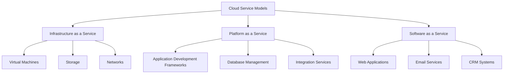
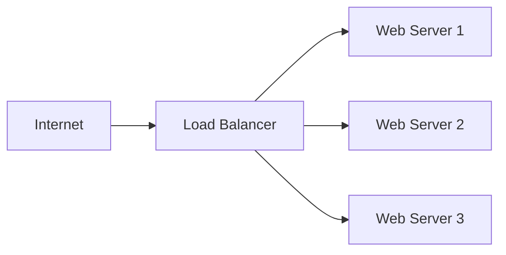
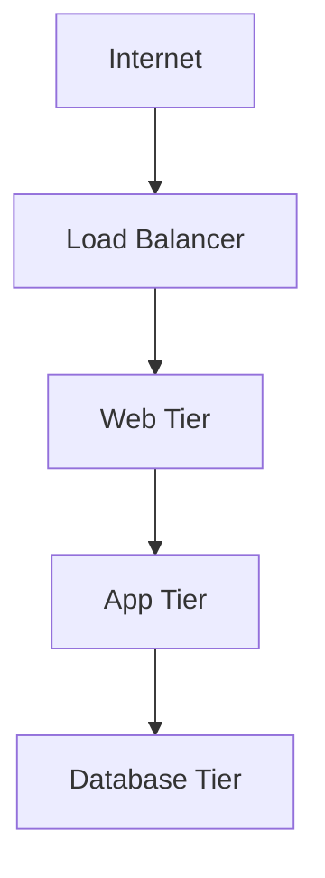
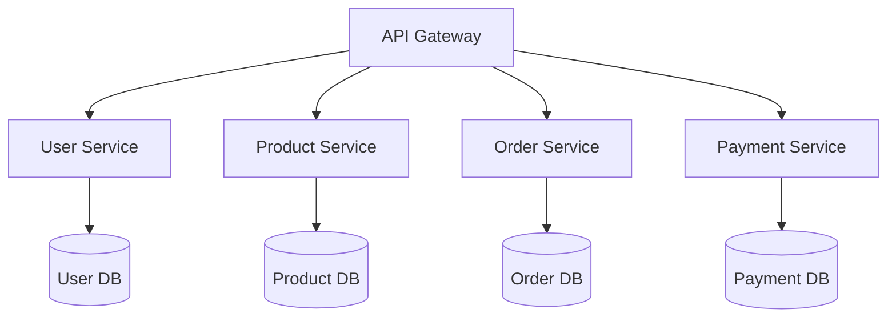
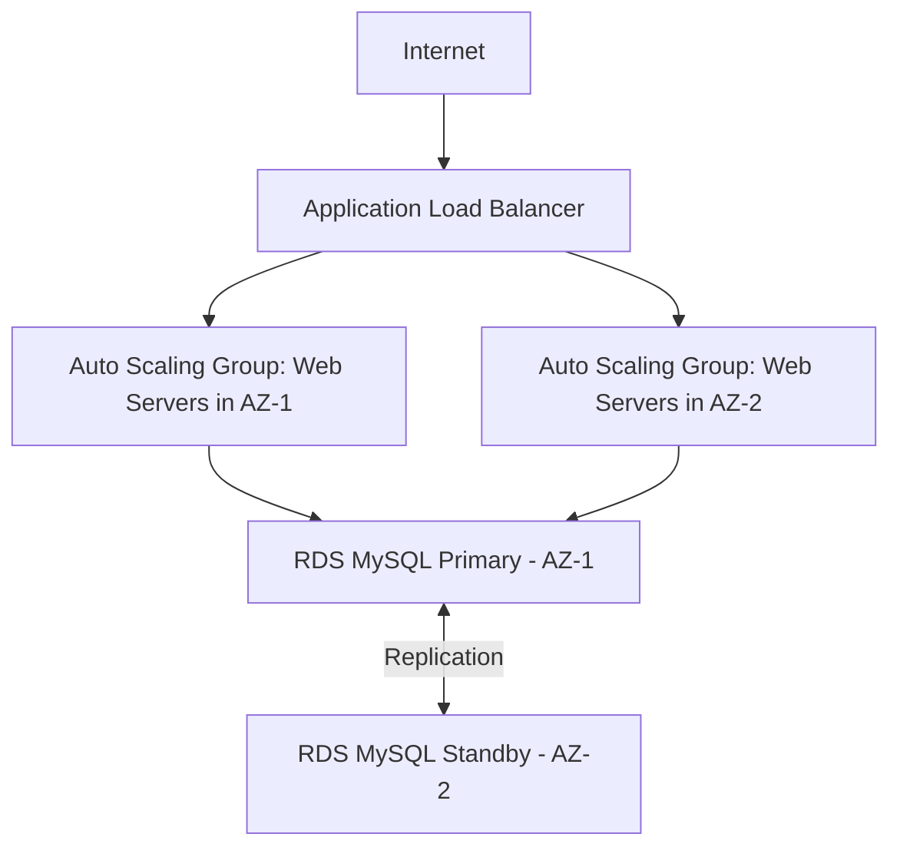

# Networks Cloud Architecture

## Introduction

Cloud architecture forms the backbone of modern internet applications and services. It represents the way computing resources, storage, and networking components are organized in cloud environments to deliver scalable, reliable, and efficient services. For beginners stepping into the world of programming, understanding cloud architecture is becoming increasingly essential as more applications move to cloud-based environments.

This guide will introduce you to the fundamental concepts of cloud architecture with a specific focus on networking aspects. We'll explore how traditional networking principles evolve when applied to cloud environments and how different components interact to create robust, scalable systems.

## Cloud Computing Fundamentals

### What is Cloud Computing?

Cloud computing is the delivery of computing services—including servers, storage, databases, networking, software, and analytics—over the internet ("the cloud"). These services eliminate the need for organizations to own and maintain physical infrastructure, allowing them to pay only for what they use.

### Cloud Service Models

Cloud services are typically categorized into three main models:

1. **Infrastructure as a Service (IaaS)**: Provides virtualized computing resources over the internet
2. **Platform as a Service (PaaS)**: Offers hardware and software tools over the internet
3. **Software as a Service (SaaS)**: Delivers software applications over the internet



### Cloud Deployment Models

The four main cloud deployment models are:

1. **Public Cloud**: Resources owned and operated by third-party providers (AWS, Google Cloud, Azure)
2. **Private Cloud**: Resources used exclusively by a single organization
3. **Hybrid Cloud**: Combination of public and private clouds
4. **Multi-Cloud**: Using services from multiple cloud providers

## Network Architecture in the Cloud

Traditional network architecture requires physical hardware configuration. In contrast, cloud networks are software-defined and can be provisioned, configured, and managed programmatically.

### Virtual Networks

In cloud environments, networks are virtualized. A Virtual Network (VNet) or Virtual Private Cloud (VPC) is a logically isolated section of the cloud provider's network where you can launch resources in a defined virtual network.

Here's a simple example of how to create a Virtual Private Cloud (VPC) using AWS CLI:

```bash
aws ec2 create-vpc --cidr-block 10.0.0.0/16 --tag-specifications 'ResourceType=vpc,Tags=[{Key=Name,Value=MyVPC}]'
```

Output:
```json
{
    "Vpc": {
        "CidrBlock": "10.0.0.0/16",
        "DhcpOptionsId": "dopt-19edf471",
        "State": "pending",
        "VpcId": "vpc-0e12f52b21EXAMPLE",
        "OwnerId": "123456789012",
        "InstanceTenancy": "default",
        "TagSet": [
            {
                "Key": "Name",
                "Value": "MyVPC"
            }
        ]
    }
}
```

### Subnets

Subnets are segments of IP address ranges in your VPC where you can place groups of isolated resources. They can be public (with internet access) or private (internal only).

Creating a subnet in AWS:

```bash
aws ec2 create-subnet --vpc-id vpc-0e12f52b21EXAMPLE --cidr-block 10.0.1.0/24 --availability-zone us-east-1a
```

Output:
```json
{
    "Subnet": {
        "AvailabilityZone": "us-east-1a",
        "AvailabilityZoneId": "use1-az6",
        "AvailableIpAddressCount": 251,
        "CidrBlock": "10.0.1.0/24",
        "DefaultForAz": false,
        "MapPublicIpOnLaunch": false,
        "State": "available",
        "SubnetId": "subnet-0bb1c79de3EXAMPLE",
        "VpcId": "vpc-0e12f52b21EXAMPLE",
        "OwnerId": "123456789012",
        "AssignIpv6AddressOnCreation": false,
        "Ipv6CidrBlockAssociationSet": [],
        "SubnetArn": "arn:aws:ec2:us-east-1:123456789012:subnet/subnet-0bb1c79de3EXAMPLE"
    }
}
```

### Network Security Groups and ACLs

Cloud providers offer security mechanisms to control traffic:

- **Security Groups**: Act as virtual firewalls to control inbound and outbound traffic at the instance level
- **Network Access Control Lists (ACLs)**: Act as firewalls at the subnet level

Example of creating a security group in AWS:

```bash
aws ec2 create-security-group --group-name MySecurityGroup --description "My security group" --vpc-id vpc-0e12f52b21EXAMPLE
```

Output:
```json
{
    "GroupId": "sg-903004f8EXAMPLE"
}
```

Adding a rule to allow SSH access:

```bash
aws ec2 authorize-security-group-ingress --group-id sg-903004f8EXAMPLE --protocol tcp --port 22 --cidr 203.0.113.0/24
```

## Cloud Network Components

### Load Balancers

Load balancers distribute incoming network traffic across multiple servers to ensure no single server bears too much demand. They improve application availability and fault tolerance.



Creating a simple load balancer in AWS:

```bash
aws elbv2 create-load-balancer --name my-load-balancer --subnets subnet-0bb1c79de3EXAMPLE subnet-0bb1c79de4EXAMPLE --security-groups sg-903004f8EXAMPLE
```

### Content Delivery Networks (CDNs)

CDNs are distributed networks of servers that deliver web content to users based on their geographic location, improving performance and reducing latency.

### API Gateways

API Gateways manage, secure, and route API requests, serving as the single entry point for all clients.

Example of creating an API Gateway in AWS:

```bash
aws apigateway create-rest-api --name 'My API Service'
```

Output:
```json
{
    "id": "1234567890",
    "name": "My API Service",
    "createdDate": 1584646798,
    "apiKeySource": "HEADER",
    "endpointConfiguration": {
        "types": [
            "EDGE"
        ]
    }
}
```

## Cloud Network Architectures

### Three-Tier Architecture

The three-tier architecture is a common pattern with web, application, and database tiers:



1. **Web Tier**: Handles HTTP requests and responses
2. **Application Tier**: Processes business logic
3. **Database Tier**: Stores and retrieves data

### Microservices Architecture

Microservices architecture structures an application as a collection of loosely coupled services:



This architecture allows for:
- Independent deployment of services
- Technology diversity
- Granular scaling
- Enhanced fault isolation

## Serverless Architecture

Serverless computing allows developers to build and run applications without managing servers:

```javascript
// Example AWS Lambda function in Node.js
exports.handler = async (event) => {
    // Extract data from the event
    const name = event.name || 'World';
    
    // Business logic
    const message = `Hello, ${name}!`;
    
    // Return response
    const response = {
        statusCode: 200,
        body: JSON.stringify({ message }),
    };
    
    return response;
};
```

Invoking the function:

```bash
aws lambda invoke --function-name MyFunction --payload '{"name":"John"}' response.json
```

Output:
```json
{
    "StatusCode": 200,
    "ExecutedVersion": "$LATEST"
}
```

Content of response.json:
```json
{
    "statusCode": 200,
    "body": "{\"message\":\"Hello, John!\"}"
}
```

## Best Practices for Cloud Network Architecture

### Security

1. **Defense in Depth**: Implement multiple layers of security
   ```bash
   # Example: Creating a network ACL with deny rules
   aws ec2 create-network-acl --vpc-id vpc-0e12f52b21EXAMPLE
   ```

2. **Principle of Least Privilege**: Grant only the permissions needed
   ```json
   // Example IAM policy restricting access
   {
     "Version": "2012-10-17",
     "Statement": [
       {
         "Effect": "Allow",
         "Action": "s3:GetObject",
         "Resource": "arn:aws:s3:::my-bucket/*"
       }
     ]
   }
   ```

3. **Encryption**: Encrypt data in transit and at rest
   ```bash
   # Enabling encryption for an S3 bucket
   aws s3api put-bucket-encryption \
     --bucket my-bucket \
     --server-side-encryption-configuration '{
       "Rules": [
         {
           "ApplyServerSideEncryptionByDefault": {
             "SSEAlgorithm": "AES256"
           }
         }
       ]
     }'
   ```

### Scalability

1. **Auto Scaling**: Automatically adjust capacity based on demand
   ```bash
   # Creating an Auto Scaling group
   aws autoscaling create-auto-scaling-group \
     --auto-scaling-group-name my-asg \
     --launch-configuration-name my-launch-config \
     --min-size 1 \
     --max-size 3 \
     --desired-capacity 2 \
     --vpc-zone-identifier "subnet-0bb1c79de3EXAMPLE,subnet-0bb1c79de4EXAMPLE"
   ```

2. **Load Testing**: Test how your system performs under load before going live

### High Availability

1. **Multi-AZ Deployment**: Deploy across multiple Availability Zones
   ```mermaid
   graph TD
     A[Load Balancer] --> B[AZ 1: Web Servers]
     A --> C[AZ 2: Web Servers]
     B --> D[AZ 1: Database Primary]
     C --> E[AZ 2: Database Replica]
     D <-->|Replication| E
   ```

2. **Disaster Recovery Planning**: Implement backup and recovery strategies

## Practical Example: Building a Highly Available Web Application

Let's walk through the process of setting up a basic but highly available web application architecture in AWS:

1. **Create a VPC with public and private subnets across two Availability Zones**:

```bash
# Create VPC
aws ec2 create-vpc --cidr-block 10.0.0.0/16 --tag-specifications 'ResourceType=vpc,Tags=[{Key=Name,Value=WebAppVPC}]'

# Create public subnets
aws ec2 create-subnet --vpc-id vpc-id --cidr-block 10.0.0.0/24 --availability-zone us-east-1a --tag-specifications 'ResourceType=subnet,Tags=[{Key=Name,Value=PublicSubnet1}]'
aws ec2 create-subnet --vpc-id vpc-id --cidr-block 10.0.1.0/24 --availability-zone us-east-1b --tag-specifications 'ResourceType=subnet,Tags=[{Key=Name,Value=PublicSubnet2}]'

# Create private subnets
aws ec2 create-subnet --vpc-id vpc-id --cidr-block 10.0.2.0/24 --availability-zone us-east-1a --tag-specifications 'ResourceType=subnet,Tags=[{Key=Name,Value=PrivateSubnet1}]'
aws ec2 create-subnet --vpc-id vpc-id --cidr-block 10.0.3.0/24 --availability-zone us-east-1b --tag-specifications 'ResourceType=subnet,Tags=[{Key=Name,Value=PrivateSubnet2}]'
```

2. **Set up a highly available web tier with an Application Load Balancer**:

```bash
# Create target group
aws elbv2 create-target-group --name WebAppTargetGroup --protocol HTTP --port 80 --vpc-id vpc-id --target-type instance

# Create load balancer
aws elbv2 create-load-balancer --name WebAppLB --subnets public-subnet-1 public-subnet-2 --security-groups sg-id

# Create listener
aws elbv2 create-listener --load-balancer-arn lb-arn --protocol HTTP --port 80 --default-actions Type=forward,TargetGroupArn=target-group-arn
```

3. **Create an Auto Scaling Group for the web servers**:

```bash
# Create launch template with user data to install and start web server
aws ec2 create-launch-template --launch-template-name WebServerTemplate --version-description WebServer --image-id ami-id --instance-type t2.micro --key-name key-name --security-group-ids sg-id --user-data $(base64 -w0 user-data.sh)

# Create Auto Scaling group
aws autoscaling create-auto-scaling-group --auto-scaling-group-name WebServerASG --launch-template LaunchTemplateName=WebServerTemplate,Version='$Latest' --min-size 2 --max-size 6 --desired-capacity 2 --vpc-zone-identifier "private-subnet-1,private-subnet-2" --target-group-arns target-group-arn
```

4. **Set up a Multi-AZ RDS database instance**:

```bash
# Create DB subnet group
aws rds create-db-subnet-group --db-subnet-group-name WebAppDBSubnetGroup --db-subnet-group-description "DB subnet group for web app" --subnet-ids "private-subnet-1 private-subnet-2"

# Create Multi-AZ DB instance
aws rds create-db-instance --db-instance-identifier webappdb --allocated-storage 20 --db-instance-class db.t3.micro --engine mysql --master-username admin --master-user-password password --multi-az --db-subnet-group-name WebAppDBSubnetGroup --vpc-security-group-ids sg-id
```

The resulting architecture looks like this:



## Summary

Cloud network architecture involves designing resilient, scalable, and secure infrastructure using virtualized network components. The key principles include:

1. Creating isolated virtual networks with proper subnetting
2. Implementing robust security measures at multiple levels
3. Designing for high availability and fault tolerance
4. Enabling automatic scaling to handle variable workloads
5. Using managed services when appropriate to reduce operational burden

By following these principles, you can build cloud applications that are reliable, secure, and cost-effective.

## Additional Resources

To deepen your understanding of cloud network architecture, consider exploring these topics:

1. **Advanced Networking Concepts**:
   - Software-Defined Networking (SDN)
   - Network Function Virtualization (NFV)
   - Transit Gateway and Network Peering

2. **Security and Compliance**:
   - Security Best Practices for each cloud provider
   - Compliance frameworks (HIPAA, PCI-DSS, GDPR)

3. **Infrastructure as Code**:
   - Terraform
   - AWS CloudFormation
   - Azure Resource Manager templates

## Exercises

1. Design a VPC with public and private subnets to host a simple web application.
2. Create a load balancer configuration to distribute traffic across multiple web servers.
3. Implement a security group strategy for a three-tier application architecture.
4. Design a disaster recovery plan for a cloud-based application.
5. Compare networking features across AWS, Azure, and Google Cloud Platform.