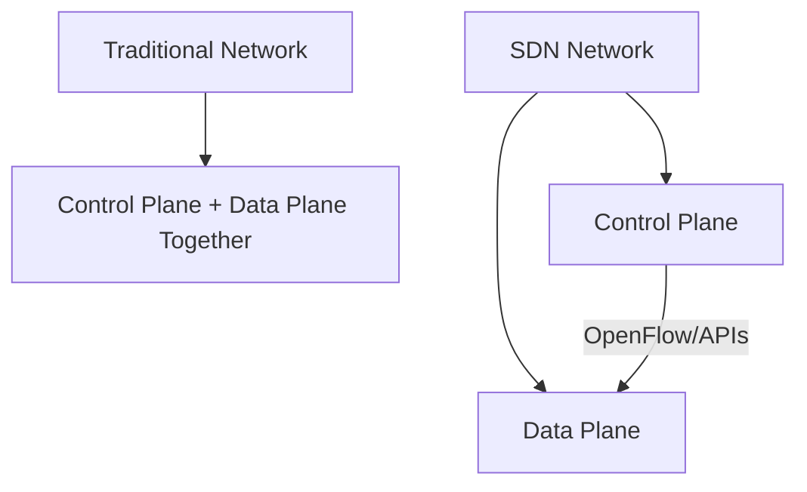

# Software-Defined Networks (SDN) Basics

## Introduction

Software-Defined Networking (SDN) represents a revolutionary approach to network management and architecture that separates the network control logic (the control plane) from the underlying hardware that forwards traffic (the data plane). This separation enables more flexible, programmable, and centrally managed networks that can adapt quickly to changing requirements.

Unlike traditional networks where control and data functions are tightly integrated within individual networking devices, SDN creates an abstraction layer that allows network administrators to configure network services through software applications rather than having to manually configure individual hardware devices.

## Key Concepts in SDN

### 1. Control Plane vs. Data Plane Separation



- **Control Plane**: The "brain" of the network that makes decisions about how traffic should flow
- **Data Plane**: The "muscles" that forward packets according to the control plane's instructions
- **Benefit**: This separation allows each plane to evolve independently

### 2. SDN Controller

The SDN controller serves as the central point of control in an SDN architecture. It:

- Maintains a global view of the network
- Implements network policies
- Communicates with applications above and network devices below

```javascript
// Example of controller API call (pseudocode)
function createFlowRule(source, destination, action) {
  // Initialize connection to the controller
  const controller = new SDNController('https://controller:8181');
  
  // Create flow rule
  const flowRule = {
    match: {
      sourceIP: source,
      destinationIP: destination
    },
    actions: [{
      type: action,
      parameters: {}
    }]
  };
  
  // Send to controller
  const response = controller.pushFlowRule(flowRule);
  console.log(`Flow rule created with ID: ${response.id}`);
}

// Output:
// Flow rule created with ID: fr-1234
```

### 3. OpenFlow Protocol

OpenFlow is the most widely used protocol for communication between the SDN controller and network devices:

```
+-----------------+       +-----------------+
| SDN Controller  |       |  Network Device |
+-----------------+       +-----------------+
         |                         |
         |    OpenFlow Protocol    |
         |<----------------------->|
         |                         |
```

A simplified OpenFlow rule might look like:

```python
# Example OpenFlow rule structure
flow_rule = {
    "cookie": 0,
    "table_id": 0,
    "priority": 100,
    "match": {
        "in_port": 1,
        "eth_type": 0x0800,  # IPv4
        "ipv4_src": "10.0.0.1",
        "ipv4_dst": "10.0.0.2"
    },
    "actions": [
        {
            "type": "OUTPUT",
            "port": 2
        }
    ]
}

# When a packet from 10.0.0.1 to 10.0.0.2 arrives on port 1,
# it will be forwarded out through port 2
```

## Real-World Applications of SDN

### Network Virtualization

SDN enables the creation of virtual networks on top of physical infrastructure:

```python
def create_virtual_network(tenant_id, subnet, vlan_id):
    """
    Creates a virtual network for a specific tenant
    """
    controller_api = SDNControllerAPI()
    
    # Define the virtual network
    virtual_network = {
        "tenant_id": tenant_id,
        "subnet": subnet,
        "vlan_id": vlan_id,
        "isolated": True
    }
    
    # Push configuration to the controller
    network_id = controller_api.create_network(virtual_network)
    
    return {
        "status": "success",
        "network_id": network_id,
        "message": f"Virtual network created for tenant {tenant_id}"
    }

# Example output:
# {
#   "status": "success", 
#   "network_id": "vnet-3456", 
#   "message": "Virtual network created for tenant acme-corp"
# }
```

### Traffic Engineering

SDN makes it possible to implement advanced traffic management:

```python
def setup_qos_policy(application_type, priority, bandwidth_limit):
    """
    Sets up Quality of Service policies for different types of traffic
    """
    # Connect to SDN controller
    controller = SDNController()
    
    # Define application traffic patterns
    if application_type == "video":
        ports = [554, 1935, 8080]  # Common video streaming ports
        protocol = "TCP"
    elif application_type == "voip":
        ports = [5060, 5061]  # SIP ports
        protocol = "UDP"
    else:
        ports = []
        protocol = "ANY"
    
    # Create QoS policy
    policy = {
        "application": application_type,
        "match": {
            "protocol": protocol,
            "ports": ports
        },
        "actions": {
            "priority": priority,
            "bandwidth_limit_mbps": bandwidth_limit,
            "queue": priority
        }
    }
    
    # Apply policy
    result = controller.apply_qos_policy(policy)
    return result

# Example:
# setup_qos_policy("video", 2, 10)
# Result: QoS policy for video traffic applied with 10Mbps limit
```

## Setting Up a Simple SDN Test Environment

You can experiment with SDN concepts using Mininet, a network emulator:

```bash
# Install Mininet (on Ubuntu/Debian)
$ sudo apt-get install mininet

# Create a simple topology with 3 switches and 4 hosts
$ sudo mn --controller=remote,ip=127.0.0.1 --topo tree,depth=2,fanout=2

# This creates:
# - A tree topology with 2 levels
# - Each node connects to 2 child nodes
# - Total: 3 switches, 4 hosts
# - External controller at 127.0.0.1
```

Then install an SDN controller like ONOS, OpenDaylight, or Ryu:

```bash
# Example: Installing Ryu controller
$ pip install ryu

# Start a simple switch application
$ ryu-manager ryu.app.simple_switch_13
```

## Summary

Software-Defined Networking represents a fundamental shift in network architecture by:

1. Separating control and data planes
2. Centralizing network intelligence in software-based controllers
3. Allowing network behavior to be programmatically configured
4. Enabling more dynamic, manageable, and adaptable networks

This approach provides numerous benefits including simplified network management, reduced operational costs, enhanced flexibility, improved security, and support for network automation.

## Additional Resources

For further learning, consider exploring:
- SDN controller platforms (ONOS, OpenDaylight, Ryu)
- Network programmability using Python
- OpenFlow specification
- Network Function Virtualization (NFV) concepts
- Cloud networking implementations using SDN principles

## Exercises

1. Install Mininet and create a custom network topology
2. Write a simple Python script to interact with an SDN controller API
3. Design a network policy that prioritizes voice traffic over other types
4. Implement a basic load balancing function using SDN principles