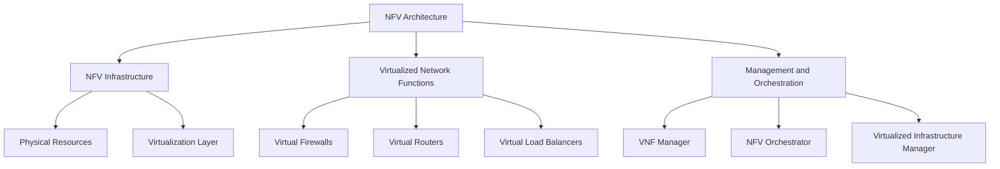
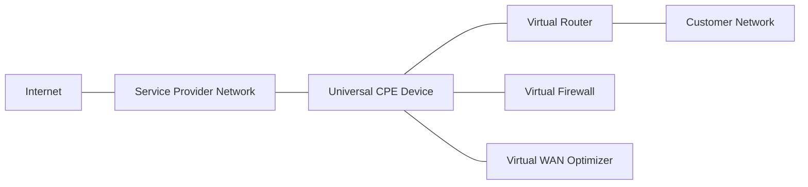

# Network Function Virtualization (NFV)

## Introduction

Network Function Virtualization (NFV) represents a revolutionary approach to network architecture and deployment. Traditional networks rely on proprietary hardware appliances for various network functions such as firewalls, routers, load balancers, and WAN accelerators. NFV transforms these hardware-based network functions into software applications that can run on standard, commercial off-the-shelf (COTS) hardware.

In this guide, we'll explore the fundamentals of NFV, how it works, its benefits, and how it relates to Software Defined Networking (SDN).

## What is Network Function Virtualization?

Network Function Virtualization is the concept of replacing dedicated network hardware with software-based applications that run on standard servers, switches, and storage devices. These virtualized network functions (VNFs) perform the same tasks as their hardware counterparts but offer greater flexibility, scalability, and cost-efficiency.

### Key Components of NFV



1. **NFV Infrastructure (NFVI)**: Represents the physical and virtual resources on which VNFs are deployed
   - Hardware resources (servers, storage, networking)
   - Virtualization layer (hypervisors)
   - Virtualized resources (VMs, containers)

2. **Virtualized Network Functions (VNFs)**: Software implementations of network functions that run on the NFVI
   - Virtual firewalls
   - Virtual routers
   - Virtual load balancers
   - Virtual WAN optimizers

3. **Management and Orchestration (MANO)**: Handles the deployment, management, and orchestration of VNFs
   - NFV Orchestrator: Manages the lifecycle of network services
   - VNF Manager: Manages the lifecycle of individual VNFs
   - Virtualized Infrastructure Manager: Controls and manages NFVI resources

## NFV vs. Traditional Networking

| Aspect | Traditional Networking | Network Function Virtualization |
|--------|------------------------|--------------------------------|
| Hardware | Proprietary hardware appliances | Standard commercial off-the-shelf servers |
| Deployment | Manual installation and configuration | Automated deployment |
| Scaling | Adding physical hardware | Adding virtual instances |
| Upgrading | Hardware replacement | Software updates |
| Vendor Lock-in | High | Low |
| Capital Expenses | High | Lower |
| Operational Expenses | High | Lower |
| Innovation Speed | Slow | Fast |

## NFV and Software Defined Networking (SDN)

NFV and SDN are complementary but distinct technologies:

- **SDN** separates the network control plane from the data plane, centralizing network intelligence
- **NFV** virtualizes network functions, replacing dedicated hardware with software

While they can be implemented independently, combining SDN and NFV creates powerful, flexible network architectures. SDN can provide the network connectivity between VNFs and orchestrate traffic flows.

## Implementing NFV: A Basic Example

Let's explore a simple example of how a network function like a firewall could be virtualized. In a traditional setup, you might have a dedicated hardware firewall appliance. With NFV, this becomes a software application running on a standard server.

Here's a basic example of setting up a virtual firewall using KVM and iptables:

```bash
# Create a virtual machine for the firewall
sudo virt-install --name firewall-vnf \
  --ram 2048 \
  --disk path=/var/lib/libvirt/images/firewall.qcow2,size=10 \
  --vcpus 2 \
  --os-type linux \
  --network bridge=br0 \
  --network bridge=br1 \
  --graphics none \
  --console pty,target_type=serial \
  --location 'http://ftp.debian.org/debian/dists/stable/main/installer-amd64/'
```

Once the VM is set up, you could install and configure iptables rules:

```bash
# Basic iptables configuration for the firewall VM
sudo iptables -A FORWARD -i eth0 -o eth1 -p tcp --dport 80 -m state --state NEW,ESTABLISHED -j ACCEPT
sudo iptables -A FORWARD -i eth0 -o eth1 -p tcp --dport 443 -m state --state NEW,ESTABLISHED -j ACCEPT
sudo iptables -A FORWARD -i eth1 -o eth0 -m state --state ESTABLISHED -j ACCEPT
sudo iptables -A FORWARD -j DROP

# Save the rules
sudo iptables-save > /etc/iptables/rules.v4
```

This is a simplified example, but it illustrates the concept of running network functions as software on standard hardware.

## NFV Orchestration

Orchestrating multiple VNFs and their connections requires additional management software. This is typically handled by NFV Management and Orchestration (MANO) systems.

Here's a simplified example of an NFV service descriptor (in YAML format) that might be used by an orchestrator:

```yaml
nsd:
  id: sample-network-service
  name: Basic Web Service
  description: A basic web service with firewall and load balancer
  version: 1.0

  vnfds:
    - id: firewall-vnf
      instances: 1
      resource_requirements:
        memory: 2GB
        vcpus: 2
        storage: 10GB
        
    - id: loadbalancer-vnf
      instances: 2
      resource_requirements:
        memory: 4GB
        vcpus: 2
        storage: 10GB
        
    - id: webserver-vnf
      instances: 4
      resource_requirements:
        memory: 8GB
        vcpus: 4
        storage: 50GB

  virtual_links:
    - id: external-network
      connects: [firewall-vnf]
      type: external
      
    - id: internal-network-1
      connects: [firewall-vnf, loadbalancer-vnf]
      type: internal
      
    - id: internal-network-2
      connects: [loadbalancer-vnf, webserver-vnf]
      type: internal
```

This descriptor defines a network service consisting of three VNFs (firewall, load balancer, and web server) and how they connect to each other.

## Benefits of NFV

1. **Reduced Capital Expenditure (CapEx)**: By replacing specialized hardware with commodity servers

2. **Lower Operational Expenditure (OpEx)**: Through automated deployment and centralized management

3. **Faster Time-to-Market**: New network services can be deployed in hours instead of months

4. **Scalability**: Easy to scale services up or down based on demand

5. **Flexibility**: Services can be moved to different locations without hardware changes

6. **Service Innovation**: Enables rapid development and testing of new network services

7. **Reduced Energy Consumption**: Better resource utilization through virtualization

## Challenges in NFV Implementation

1. **Performance Concerns**: Software-based functions may not match hardware performance

2. **Security Considerations**: Virtualized environments introduce new security challenges

3. **Integration with Legacy Systems**: Ensuring compatibility with existing network infrastructure

4. **Management Complexity**: Orchestrating multiple VNFs can be complex

5. **Skills Gap**: Organizations need staff with both networking and virtualization expertise

## Real-World NFV Use Cases

### 1. Virtualized Customer Premises Equipment (vCPE)

Traditional customer premises equipment (CPE) like routers and firewalls can be replaced with simple hardware that hosts virtualized functions:



Benefits:
- Remote deployment of new services without truck rolls
- Simplified customer hardware
- Easier upgrades and maintenance

### 2. Mobile Network Virtualization

NFV is transforming mobile networks by virtualizing components like:
- Evolved Packet Core (EPC)
- IP Multimedia Subsystem (IMS)
- Radio Access Network (RAN) functions

This is particularly important for 5G networks, which rely heavily on NFV and SDN.

### 3. Service Chaining

NFV enables dynamic service chaining, where traffic flows through a series of virtual network functions:


This allows for customized service paths based on traffic type, user requirements, or service level agreements.

## Getting Started with NFV

If you're interested in experimenting with NFV concepts, here are some open-source tools to get started:

1. **Open Source MANO (OSM)**: An ETSI-hosted project for NFV Management and Orchestration

2. **OpenStack Tacker**: NFV Orchestrator with a built-in VNF Manager

3. **ONAP (Open Network Automation Platform)**: A comprehensive platform for orchestrating and automating virtual network functions

4. **Kubernetes + Multus**: For container-based network functions using CNFs (Cloud-native Network Functions)

## Summary

Network Function Virtualization represents a fundamental shift in how networks are built and operated. By decoupling network functions from proprietary hardware and implementing them as software on standard servers, NFV offers organizations greater flexibility, scalability, and cost-efficiency.

Key takeaways:
- NFV replaces dedicated network hardware with software running on standard servers
- It works well with SDN but serves a different purpose
- NFV reduces costs, increases flexibility, and enables faster service innovation
- Real-world applications include vCPE, mobile networks, and service chaining
- Several open-source tools are available for experimenting with NFV

As networks continue to evolve, NFV will play an increasingly important role in enabling the agile, dynamic networks needed for modern applications and services.

## Exercises

1. Compare and contrast SDN and NFV. How are they similar? How do they differ?

2. Design a simple NFV architecture for a small business network that includes a firewall, router, and load balancer.

3. Research and write a brief report on how NFV is being used in 5G networks.

4. Using a virtualization platform of your choice (such as VirtualBox), attempt to create a simple virtual network function.

5. Investigate one of the open-source NFV platforms mentioned in this guide and document the steps to set up a basic environment.