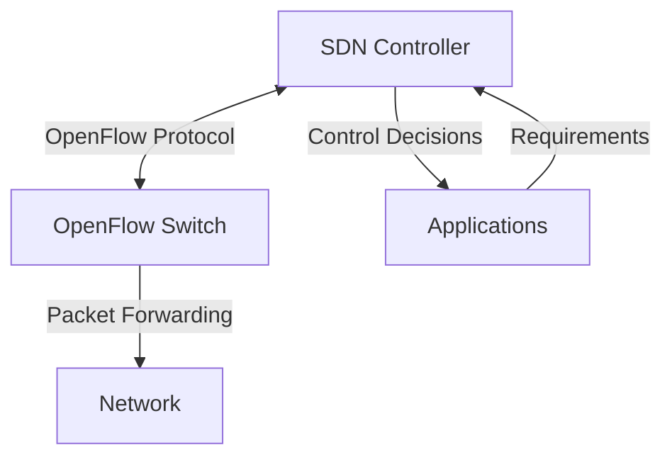

# OpenFlow - The Foundation of Software Defined Networking

## Introduction

OpenFlow is a fundamental protocol that enables Software Defined Networking (SDN) by providing a standardized way for controllers to communicate with network devices. It was one of the first standards that defined how the control plane can be separated from the data plane in networking equipment, which is a core concept in SDN.

In traditional networks, each network device (like a router or switch) makes forwarding decisions independently based on locally stored rules. OpenFlow changes this paradigm by centralizing these decisions in a controller, giving programmers unprecedented control over network traffic flows.

## What is OpenFlow?

OpenFlow is a communications protocol that gives a remote controller the ability to modify the behavior of network devices. It was created at Stanford University around 2008 and has become the de facto standard for SDN implementations.



OpenFlow provides a way to program the "flow table" in switches and routers, allowing administrators to define how traffic should flow through network devices based on parameters such as usage patterns, applications, and cloud resources.

## OpenFlow Architecture

OpenFlow's architecture consists of three main components:

1. **OpenFlow Switch**: Network devices (switches/routers) that use flow tables to perform packet lookups and forwarding.
2. **Controller**: A server that communicates with the switches using the OpenFlow protocol.
3. **Secure Channel**: The interface that connects the controller to multiple switches.

### Flow Tables

At the heart of OpenFlow is the concept of a flow table. Each flow table contains:

- **Flow entries**: Rules that define how to process packets
- **Match fields**: Values to compare against packets (like MAC addresses, IP addresses, ports)
- **Counters**: Statistics for matching packets
- **Instructions**: Actions to take on matching packets

Here's a simplified representation of a flow table:

| Match Fields | Priority | Counters | Instructions | Timeouts | Cookie |
|--------------|----------|----------|--------------|----------|--------|
| Src IP=10.0.0.1, Dst Port=80 | 100 | 25 packets | Forward to port 2 | 60 seconds | 0x1234 |
| Src MAC=00:1a:2b:3c:4d:5e | 90 | 150 packets | Forward to controller | 30 seconds | 0x5678 |
| Any | 1 | 1024 packets | Drop | Permanent | 0x9abc |

## OpenFlow Protocol in Action

The OpenFlow protocol defines several message types that controllers and switches exchange:

1. **Controller-to-Switch Messages**: Used by controllers to manage or inspect the state of the switch
2. **Asynchronous Messages**: Sent by switches to update controllers about network events and changes
3. **Symmetric Messages**: Can be sent by either switches or controllers

### Basic OpenFlow Operations

Let's look at some basic operations in OpenFlow:

#### Connection Setup

When a switch starts, it establishes a connection with the controller:

```
Switch                        Controller
  |                              |
  |------ Hello (version) ------>|
  |<----- Hello (version) -------|
  |                              |
  |---- Features Request ------->|
  |<--- Features Reply ----------|
  |                              |
```

#### Flow Modification

The controller can add, modify, or delete flows:

```python
# Example: Using Ryu controller to add a flow
from ryu.controller import ofp_event
from ryu.controller.handler import MAIN_DISPATCHER, set_ev_cls
from ryu.ofproto import ofproto_v1_3

@set_ev_cls(ofp_event.EventOFPSwitchFeatures, CONFIG_DISPATCHER)
def switch_features_handler(self, ev):
    datapath = ev.msg.datapath
    ofproto = datapath.ofproto
    parser = datapath.ofproto_parser
    
    # Create a match for HTTP traffic (port 80)
    match = parser.OFPMatch(eth_type=0x0800, ip_proto=6, tcp_dst=80)
    
    # Forward matching packets to port 1
    actions = [parser.OFPActionOutput(1)]
    
    # Add flow with priority 100, timeout 30 seconds
    self.add_flow(datapath, 100, match, actions, 30)
```

This Python code example using the Ryu controller framework adds a flow rule that matches HTTP traffic and forwards it to port 1.

## OpenFlow Versions

OpenFlow has evolved over time, with several important versions:

- **OpenFlow 1.0**: The first widely deployed version, with basic match fields
- **OpenFlow 1.3**: Added support for multiple flow tables, group tables, and more match fields
- **OpenFlow 1.5**: Added support for extensible match fields and improved error reporting

Most commercial implementations today support OpenFlow 1.3 or later.

## Practical Example: Traffic Engineering

One common use case for OpenFlow is traffic engineering. Let's look at how we might implement quality of service (QoS) using OpenFlow:

```python
# Example: QoS implementation with Ryu
def add_qos_rules(self, datapath):
    ofproto = datapath.ofproto
    parser = datapath.ofproto_parser
    
    # High priority for VoIP traffic
    match_voip = parser.OFPMatch(eth_type=0x0800, ip_proto=17, udp_dst=5060)
    actions_voip = [parser.OFPActionSetQueue(0), parser.OFPActionOutput(1)]
    self.add_flow(datapath, 200, match_voip, actions_voip)
    
    # Medium priority for HTTP traffic
    match_http = parser.OFPMatch(eth_type=0x0800, ip_proto=6, tcp_dst=80)
    actions_http = [parser.OFPActionSetQueue(1), parser.OFPActionOutput(1)]
    self.add_flow(datapath, 100, match_http, actions_http)
    
    # Low priority for remaining traffic
    match_default = parser.OFPMatch()
    actions_default = [parser.OFPActionSetQueue(2), parser.OFPActionOutput(1)]
    self.add_flow(datapath, 1, match_default, actions_default)
```

This example creates three flow entries with different priorities:
1. VoIP traffic gets highest priority and goes to queue 0
2. HTTP traffic gets medium priority and goes to queue 1
3. All other traffic gets lowest priority and goes to queue 2

## Real-World Applications

OpenFlow has been deployed in various real-world scenarios:

### 1. Google's B4 WAN

Google implemented one of the most famous SDN deployments using OpenFlow to manage its wide area network (B4) connecting data centers. This implementation allowed Google to achieve nearly 100% link utilization, compared to 30-40% in traditional networks.

### 2. Campus Networks

Many universities have deployed OpenFlow-based networks for research and production use. Stanford University's initial deployment covered their computer science department and allowed researchers to run experimental protocols alongside production traffic.

### 3. Data Center Networks

Several large data centers use OpenFlow to manage east-west traffic (traffic between servers) efficiently, enabling more dynamic resource allocation and improved security.

## OpenFlow Security Considerations

When implementing OpenFlow, consider these security aspects:

1. **Controller Security**: The controller is a central point of failure and attack, so it must be properly secured.
2. **Control Channel Protection**: The connection between controllers and switches should be encrypted (typically using TLS).
3. **Authentication**: Both controllers and switches should authenticate each other.

## OpenFlow vs. Other SDN Protocols

While OpenFlow was the first widely adopted SDN protocol, others have emerged:

- **P4**: A more flexible protocol that allows programming of the data plane
- **NETCONF/YANG**: More focused on configuration management
- **OpFlex**: Cisco's approach that delegates some control to devices

OpenFlow remains valuable for its simplicity and wide support among vendors.

## Implementing an OpenFlow Controller

To implement your own OpenFlow controller, you can use several frameworks:

- **Ryu**: A Python-based SDN framework
- **ONOS**: Open Network Operating System
- **OpenDaylight**: A modular open platform for network programmability

Here's a simple Ryu controller that acts as a learning switch:

```python
from ryu.base import app_manager
from ryu.controller import ofp_event
from ryu.controller.handler import CONFIG_DISPATCHER, MAIN_DISPATCHER
from ryu.controller.handler import set_ev_cls
from ryu.ofproto import ofproto_v1_3
from ryu.lib.packet import packet, ethernet

class LearningSwitch(app_manager.RyuApp):
    OFP_VERSIONS = [ofproto_v1_3.OFP_VERSION]

    def __init__(self, *args, **kwargs):
        super(LearningSwitch, self).__init__(*args, **kwargs)
        self.mac_to_port = {}

    @set_ev_cls(ofp_event.EventOFPSwitchFeatures, CONFIG_DISPATCHER)
    def switch_features_handler(self, ev):
        datapath = ev.msg.datapath
        ofproto = datapath.ofproto
        parser = datapath.ofproto_parser

        # Install the table-miss flow entry (default rule)
        match = parser.OFPMatch()
        actions = [parser.OFPActionOutput(ofproto.OFPP_CONTROLLER,
                                          ofproto.OFPCML_NO_BUFFER)]
        self.add_flow(datapath, 0, match, actions)

    def add_flow(self, datapath, priority, match, actions, timeout=0):
        ofproto = datapath.ofproto
        parser = datapath.ofproto_parser

        inst = [parser.OFPInstructionActions(ofproto.OFPIT_APPLY_ACTIONS,
                                             actions)]
        mod = parser.OFPFlowMod(datapath=datapath, priority=priority,
                                match=match, instructions=inst,
                                hard_timeout=timeout)
        datapath.send_msg(mod)

    @set_ev_cls(ofp_event.EventOFPPacketIn, MAIN_DISPATCHER)
    def packet_in_handler(self, ev):
        msg = ev.msg
        datapath = msg.datapath
        ofproto = datapath.ofproto
        parser = datapath.ofproto_parser
        in_port = msg.match['in_port']

        pkt = packet.Packet(msg.data)
        eth = pkt.get_protocols(ethernet.ethernet)[0]

        dst = eth.dst
        src = eth.src

        dpid = datapath.id
        self.mac_to_port.setdefault(dpid, {})

        # Learn a mac address to avoid FLOOD next time.
        self.mac_to_port[dpid][src] = in_port

        if dst in self.mac_to_port[dpid]:
            out_port = self.mac_to_port[dpid][dst]
        else:
            out_port = ofproto.OFPP_FLOOD

        actions = [parser.OFPActionOutput(out_port)]

        # Install a flow to avoid packet_in next time
        if out_port != ofproto.OFPP_FLOOD:
            match = parser.OFPMatch(in_port=in_port, eth_dst=dst)
            self.add_flow(datapath, 1, match, actions, 300)

        # Send packet out
        out = parser.OFPPacketOut(datapath=datapath, buffer_id=msg.buffer_id,
                                  in_port=in_port, actions=actions)
        datapath.send_msg(out)
```

This controller:
1. Maintains a mapping of MAC addresses to ports
2. Installs a default rule to send unmatched packets to the controller
3. Learns MAC addresses from incoming packets
4. Installs flow rules to avoid sending similar packets to the controller in the future

## Common OpenFlow Use Cases

OpenFlow enables many networking scenarios that were difficult to implement with traditional networking:

### Network Virtualization

Multiple isolated virtual networks can share the same physical infrastructure:

```python
# Add flow for tenant 1's traffic using VLAN 100
match_tenant1 = parser.OFPMatch(vlan_vid=100)
actions_tenant1 = [parser.OFPActionSetField(vlan_vid=200), 
                   parser.OFPActionOutput(1)]
self.add_flow(datapath, 100, match_tenant1, actions_tenant1)

# Add flow for tenant 2's traffic using VLAN 300
match_tenant2 = parser.OFPMatch(vlan_vid=300)
actions_tenant2 = [parser.OFPActionSetField(vlan_vid=400), 
                   parser.OFPActionOutput(2)]
self.add_flow(datapath, 100, match_tenant2, actions_tenant2)
```

### Load Balancing

OpenFlow can implement intelligent load balancing across multiple servers:

```python
# Load balance HTTP traffic across servers
match_http = parser.OFPMatch(eth_type=0x0800, ip_proto=6, tcp_dst=80)
# Randomly select between port 1 (server 1) and port 2 (server 2)
actions_http = [parser.OFPActionOutput(random.choice([1, 2]))]
self.add_flow(datapath, 100, match_http, actions_http, 60)
```

### Security Policies

Complex security policies can be implemented using OpenFlow:

```python
# Block SSH access to a specific server
match_ssh = parser.OFPMatch(eth_type=0x0800, ip_proto=6, 
                           ipv4_dst='10.0.0.42', tcp_dst=22)
actions_ssh = [] # Empty actions list means drop
self.add_flow(datapath, 200, match_ssh, actions_ssh)
```

## Debugging and Troubleshooting OpenFlow

When working with OpenFlow, you may need to debug your implementation. Here are some common tools:

1. **Wireshark**: Has OpenFlow protocol dissectors to analyze the communication between controllers and switches
2. **ovs-ofctl**: Command-line tool for monitoring and administering OpenFlow switches
3. **tcpdump**: For capturing OpenFlow protocol messages

Example of using `ovs-ofctl` to dump flows from a switch:

```bash
# Show all flows in OpenFlow switch
$ ovs-ofctl dump-flows br0

# Output example:
NXST_FLOW reply (xid=0x4):
 cookie=0x0, duration=570.0s, table=0, n_packets=10, n_bytes=860, idle_timeout=300, priority=1,in_port=1,dl_dst=00:00:00:00:00:02 actions=output:2
 cookie=0x0, duration=570.0s, table=0, n_packets=8, n_bytes=560, idle_timeout=300, priority=1,in_port=2,dl_dst=00:00:00:00:00:01 actions=output:1
 cookie=0x0, duration=972.38s, table=0, n_packets=12, n_bytes=880, priority=0 actions=CONTROLLER:65535
```

## Summary

OpenFlow is a pivotal protocol in the realm of Software Defined Networking that allows for centralized control of network devices. Its key components include flow tables, controllers, and a secure channel for communication. OpenFlow provides a standardized way to program network devices, enabling advanced features like traffic engineering, load balancing, and network virtualization.

By separating the control plane from the data plane, OpenFlow gives network administrators unprecedented flexibility in managing network traffic. It has been successfully deployed in various environments, from campus networks to massive data centers and WANs.

As you continue your journey in SDN, understanding OpenFlow is essential, even as newer protocols like P4 emerge. OpenFlow laid the groundwork for modern programmable networks and continues to be relevant in many SDN deployments today.

## Exercises and Practice Problems

1. Install Mininet and create a simple topology with three switches and four hosts. Write a basic OpenFlow controller using Ryu to implement a learning switch.

2. Modify the learning switch controller to prioritize certain types of traffic (e.g., give higher priority to HTTP traffic over FTP).

3. Implement a simple load balancer using OpenFlow that distributes incoming web requests across three servers.

4. Create a firewall that blocks SSH access to certain hosts but allows HTTP traffic.

5. Design a network using OpenFlow that segregates traffic from different departments in a company (e.g., Engineering, Finance, HR) even though they share the same physical infrastructure.

## Further Resources

- **Books**:
  - "SDN: Software Defined Networks" by Thomas D. Nadeau and Ken Gray
  - "Network Programmability and Automation" by Jason Edelman, Scott S. Lowe, and Matt Oswalt

- **Online Resources**:
  - The OpenFlow Switch Specification (available from the Open Networking Foundation)
  - Mininet: A network emulator that's perfect for learning OpenFlow
  - Ryu Controller Documentation
  - Open vSwitch Documentation

- **Communities**:
  - Open Networking Foundation (ONF)
  - OpenFlow Meetup Groups
  - SDN Controller project communities (ONOS, OpenDaylight, Ryu)

Remember that OpenFlow is just one piece of the SDN puzzle, but understanding it thoroughly will give you a solid foundation for exploring more advanced SDN concepts and technologies.